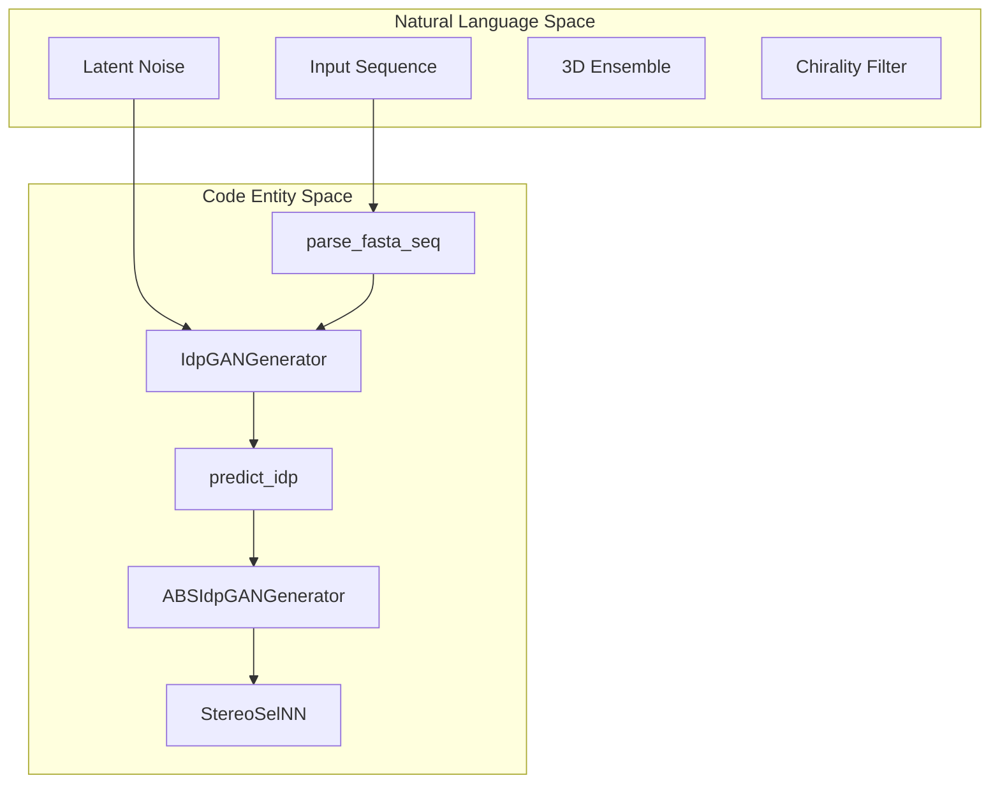
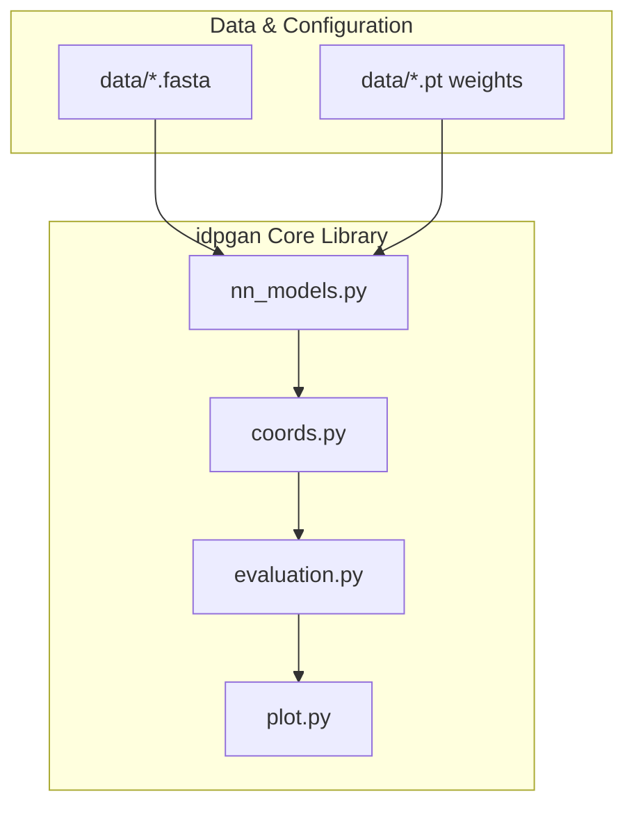

# idpGAN Overview

> **Relevant source files**
> * [LICENSE](https://github.com/feiglab/idpgan/blob/aa26675c/LICENSE)
> * [README.md](https://github.com/feiglab/idpgan/blob/aa26675c/README.md?plain=1)
> * [notebooks/idpgan_experiments.ipynb](https://github.com/feiglab/idpgan/blob/aa26675c/notebooks/idpgan_experiments.ipynb)

idpGAN is a machine-learning based conformational ensemble generator designed for coarse-grained (CG) models of intrinsically disordered proteins (IDPs) [README.md L1-L5](https://github.com/feiglab/idpgan/blob/aa26675c/README.md?plain=1#L1-L5)

 By leveraging Generative Adversarial Networks (GANs), specifically a transformer-based architecture, idpGAN can directly generate 3D Cartesian coordinates for protein ensembles, bypassing the computational cost of traditional Molecular Dynamics (MD) simulations [notebooks/idpgan_experiments.ipynb L8-L14](https://github.com/feiglab/idpgan/blob/aa26675c/notebooks/idpgan_experiments.ipynb#L8-L14)

### Purpose and Capabilities

The primary goal of the idpGAN repository is to provide a fast, reliable method for sampling the structural diversity of IDPs. It supports:

* **Rapid Ensemble Generation**: Produces thousands of 3D snapshots in seconds using GPU acceleration [README.md L20-L24](https://github.com/feiglab/idpgan/blob/aa26675c/README.md?plain=1#L20-L24)
* **Multiple Force-Field Targets**: Includes weights trained on a custom CG protein model (COCOMO) and the ABSINTH implicit solvent model [README.md L35-L52](https://github.com/feiglab/idpgan/blob/aa26675c/README.md?plain=1#L35-L52)
* **Chirality Handling**: Implements a stereo-selection mechanism to ensure generated structures maintain correct biological chirality [README.md L52-L53](https://github.com/feiglab/idpgan/blob/aa26675c/README.md?plain=1#L52-L53)
* **Analysis and Validation**: Built-in tools for comparing generated ensembles against MD reference data using distance maps, contact maps, and Radius of Gyration ($R_g$) distributions [notebooks/idpgan_experiments.ipynb L98-L107](https://github.com/feiglab/idpgan/blob/aa26675c/notebooks/idpgan_experiments.ipynb#L98-L107)

### System Architecture Association

The following diagram illustrates how high-level generative concepts map to specific classes and functions within the `idpgan` package.

**Generative Workflow Mapping**

Sources: [idpgan/data.py L53](https://github.com/feiglab/idpgan/blob/aa26675c/idpgan/data.py#L53-L53)

 [idpgan/nn_models.py L101](https://github.com/feiglab/idpgan/blob/aa26675c/idpgan/nn_models.py#L101-L101)

 [README.md L51-L53](https://github.com/feiglab/idpgan/blob/aa26675c/README.md?plain=1#L51-L53)

### Repository Structure

The codebase is organized into a core library and supporting data assets:

| Directory/File | Description |
| --- | --- |
| `idpgan/` | Core Python package containing neural network models, evaluation metrics, and plotting utilities [README.md L31-L32](https://github.com/feiglab/idpgan/blob/aa26675c/README.md?plain=1#L31-L32) |
| `data/` | Contains pre-trained weights (`.pt`), FASTA sequences, and reference MD trajectories (`.npy`) [README.md L37-L53](https://github.com/feiglab/idpgan/blob/aa26675c/README.md?plain=1#L37-L53) |
| `notebooks/` | Interactive Jupyter notebooks for running experiments and visualizing results [README.md L32-L33](https://github.com/feiglab/idpgan/blob/aa26675c/README.md?plain=1#L32-L33) |

**Component Interaction Diagram**

Sources: [README.md L35-L53](https://github.com/feiglab/idpgan/blob/aa26675c/README.md?plain=1#L35-L53)

 [notebooks/idpgan_experiments.ipynb L98-L107](https://github.com/feiglab/idpgan/blob/aa26675c/notebooks/idpgan_experiments.ipynb#L98-L107)

### Getting Started and Usage

To begin using idpGAN, users can choose between a remote Google Colab environment or a local installation requiring PyTorch, NumPy, and Matplotlib [README.md L15-L31](https://github.com/feiglab/idpgan/blob/aa26675c/README.md?plain=1#L15-L31)

* **Setup**: For detailed environment configuration and dependency management, see [Getting Started](/feiglab/idpgan/1.1-getting-started).
* **Generation**: For a guide on using `load_netg_article` and `predict_idp` to generate ensembles for custom sequences, see [Usage Guide: Generating Conformational Ensembles](/feiglab/idpgan/1.2-usage-guide:-generating-conformational-ensembles).

### Technical Foundation

The model is built on a Transformer architecture that processes amino acid sequences as one-hot encodings combined with latent noise [notebooks/idpgan_experiments.ipynb L10-L18](https://github.com/feiglab/idpgan/blob/aa26675c/notebooks/idpgan_experiments.ipynb#L10-L18)

 The output is a set of Cartesian coordinates for the Cα atoms (or equivalent CG beads) of the protein chain. Because the model operates in 3D space without explicit chiral constraints, the `StereoSelNN` classifier is employed in the ABSINTH-trained version to filter out mirror-image conformations [README.md L51-L53](https://github.com/feiglab/idpgan/blob/aa26675c/README.md?plain=1#L51-L53)

Sources: [README.md L1-L71](https://github.com/feiglab/idpgan/blob/aa26675c/README.md?plain=1#L1-L71)

 [notebooks/idpgan_experiments.ipynb L1-L172](https://github.com/feiglab/idpgan/blob/aa26675c/notebooks/idpgan_experiments.ipynb#L1-L172)