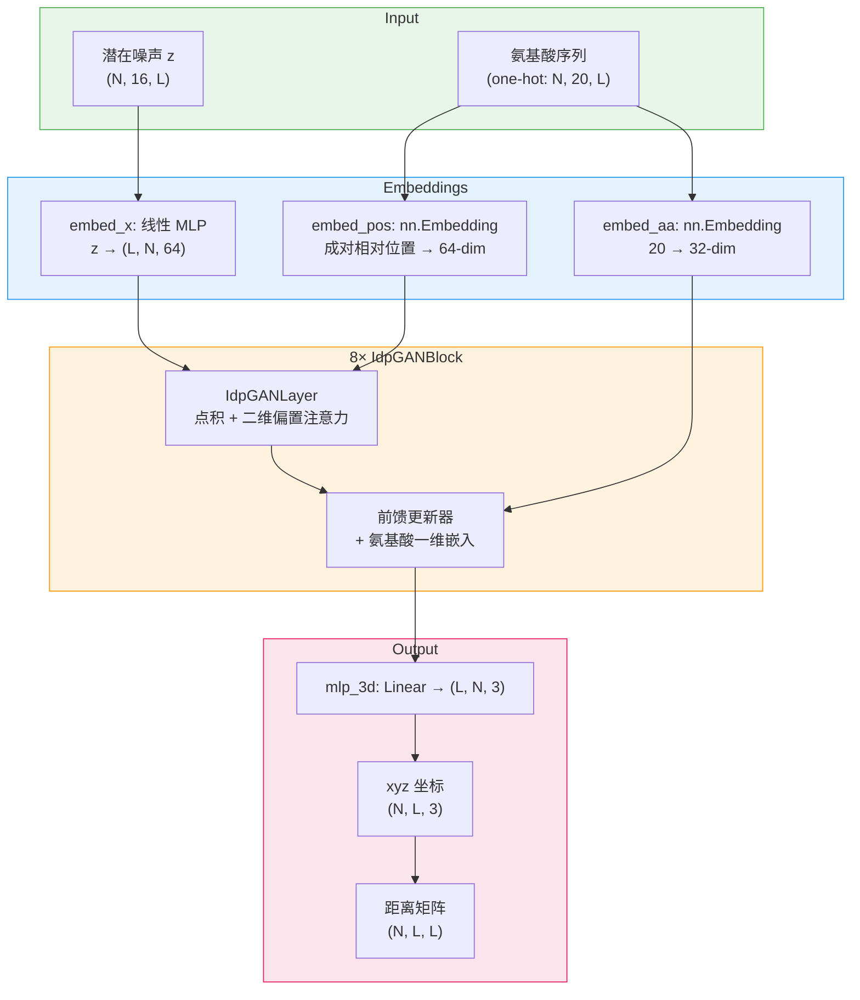

---
slug:1-overview
blog_type:normal
---


**idpGAN** 是一个基于机器学习的构象集合生成器，专为本质无序蛋白（IDP）的粗粒化（CG）模型而设计。idpGAN 基于 Transformer 的生成对抗网络（GAN）架构构建，能够直接从氨基酸序列生成 3D 结构集合——从而避开了传统分子动力学（MD）模拟的高昂计算成本。该方法在以下论文中进行了描述：[通过机器学习直接生成蛋白质构象集合](https://doi.org/10.1038/s41467-023-36443-x)。

来源：[README.md](/README.md#L1-L5)

## idpGAN 的功能

本质无序蛋白缺乏固定的三维结构，而是分布在一个广阔的构象集合中。表征这些集合对于理解 IDP 的功能至关重要，但通过 MD 模拟生成这些集合在计算上非常昂贵。idpGAN 通过在 MD 衍生的构象上训练深度生成模型来解决这一问题，随后**在推理时采样出新结构**——在几秒钟而非数小时内产生数千个构象。生成器将潜在噪声向量和氨基酸序列作为输入，并输出一组 3D 笛卡尔坐标（每个残基一个 CG 珠子），单位为纳米。

来源：[README.md](/README.md#L1-L5), [idpgan/nn_models.py](/idpgan/nn_models.py#L380-L410)

## 两种模型变体

idpGAN 提供了两种预训练模型变体，每种变体基于不同的模拟范式：

| 变体 | 训练数据 | 输出 | 核心特性 |
|---|---|---|---|
| **CG 模型 (COCOMO)** | 基于 CG 的 MD 模拟（FeigLab COCOMO 模型） | 3D xyz 坐标 | 直接坐标生成 |
| **ABSINTH 模型** | 使用 ABSINTH 隐式溶剂的全原子模拟（Cα 轨迹） | 3D xyz 坐标（镜像已解析） | 包含用于手性消歧的 `StereoSelNN` |

**ABSINTH 变体**使用**镜像选择网络**（`StereoSelNN`）包装基础生成器。由于生成器产生的坐标对反射具有不变性，选择器会对每个构象进行分类，并翻转那些被预测为具有错误手性的构象——这是处理来自全原子模拟的 Cα 轨迹时的关键步骤。

来源：[idpgan/nn_models.py](/idpgan/nn_models.py#L432-L450), [idpgan/nn_models.py](/idpgan/nn_models.py#L576-L612), [idpgan/nn_models.py](/idpgan/nn_models.py#L615-L653)

## 架构概览

生成器（`IdpGANGenerator`）是一个自定义的 Transformer 编码器，它将潜在噪声张量 **z** 和氨基酸序列映射到 3D 坐标。其注意力机制结合了**二维位置嵌入**（成对残基-残基相对位置），该嵌入基于序列间距对注意力 logits 进行偏置——这一设计选择捕获了 IDP 构象中固有的距离依赖性结构先验。



<CgxTip>二维位置嵌入由成对残基间距计算得出，并**加到点积注意力 logits 上**——这不是标准的多头注意力。它允许模型学习依赖于序列间距的注意力模式，这在生物学上对于结构由局部和非局部残基相互作用主导的 IDP 具有重要意义。</CgxTip>

来源：[idpgan/nn_models.py](/idpgan/nn_models.py#L231-L307), [idpgan/nn_models.py](/idpgan/nn_models.py#L310-L370), [idpgan/nn_models.py](/idpgan/nn_models.py#L116-L228)

## 项目结构

```
idpgan/
├── idpgan/                     # 核心 Python 包
│   ├── __init__.py             # 包入口点（导出 nn_models）
│   ├── common.py               # 共享工具（激活函数）
│   ├── coords.py               # 二面角计算（基于 torch）
│   ├── data.py                 # FASTA 解析，PDB 输出，轨迹采样
│   ├── evaluation.py           # MSE，接触图和 KL 散度指标
│   ├── nn_models.py            # 神经网络模型（生成器，选择器，加载器）
│   └── plot.py                 # Matplotlib 可视化（距离图，Rg 等）
├── data/                       # 预训练权重和数据集
│   ├── generator.pt            # CG 模型生成器权重
│   ├── abs_generator.pt        # ABSINTH 模型生成器权重
│   ├── abs_selector.pt         # ABSINTH 镜像选择器权重
│   ├── idpgan_training_set.fasta
│   ├── idptest.fasta           # CG 模型测试集序列
│   ├── abstest.fasta           # ABSINTH 测试集序列
│   ├── hbval_split_[0-4].txt   # 五个验证分区
│   ├── protan.fasta / .npy     # 示例 IDP (protan) MD 参考数据
│   ├── protac.fasta / .npy     # 示例 IDP (protac) MD 参考数据
│   └── polyala.fasta / .npy    # 聚丙氨酸基线参考数据
├── notebooks/
│   └── idpgan_experiments.ipynb # 端到端演示笔记本
├── LICENSE                     # GNU GPL v3
└── README.md
```

来源：[idpgan/__init__.py](/idpgan/__init__.py#L1-L1), [idpgan/common.py](/idpgan/common.py#L1-L17), [idpgan/coords.py](/idpgan/coords.py#L1-L19), [idpgan/data.py](/idpgan/data.py#L1-L54), [idpgan/evaluation.py](/idpgan/evaluation.py#L1-L60), [idpgan/plot.py](/idpgan/plot.py#L1-L176), [idpgan/nn_models.py](/idpgan/nn_models.py#L1-L654)

## 核心模块摘要

| 模块 | 用途 | 关键导出 |
|---|---|---|
| `nn_models` | 生成器与选择器网络定义，预训练模型加载器 | `IdpGANGenerator`, `StereoSelNN`, `ABSIdpGANGenerator`, `load_netg_article`, `load_abs_netg_article`, `get_features_from_seq` |
| `data` | 序列 I/O 和坐标文件生成 | `parse_fasta_seq`, `seq_to_cg_pdb`, `random_sample_trajectory` |
| `coords` | 从笛卡尔坐标计算二面角 | `torch_chain_dihedrals` |
| `evaluation` | 集合质量指标 | `score_mse_d`, `score_mse_c`, `score_akld_d`, `score_kl_approximation` |
| `plot` | 距离图，接触图，Rg 分布的可视化 | `plot_average_dmap_comparison`, `plot_cmap_comparison`, `plot_rg_comparison`, `plot_rg_distribution`, `plot_dmap_snapshots`, `plot_distances_comparison` |
| `common` | 共享神经网络工具 | `get_activation` |

来源：[idpgan/nn_models.py](/idpgan/nn_models.py#L10-L12), [idpgan/data.py](/idpgan/data.py#L4-L53), [idpgan/coords.py](/idpgan/coords.py#L5-L19), [idpgan/evaluation.py](/idpgan/evaluation.py#L4-L60), [idpgan/plot.py](/idpgan/plot.py#L6-L176), [idpgan/common.py](/idpgan/common.py#L7-L17)

## 推理流程

典型的推理流程非常简洁——加载预训练的生成器，使用序列字符串和采样计数调用 `predict_idp`，然后接收 3D 坐标张量：

1. **加载模型** — `load_netg_article()`（CG）或 `load_abs_netg_article()`（ABSINTH）使用论文发表的超参数实例化网络，并加载 `.pt` 权重。
2. **生成构象** — `netg.predict_idp(n_samples, aa_seq, device)` 从潜在空间分批采样，运行前向传播，并返回形状为 `(N, L, 3)` 的 xyz 坐标张量。
3. **分析** — 使用 `evaluation` 和 `plot` 模块，对照参考 MD 数据计算距离矩阵、接触图、回转半径或 KL 散度得分。

<CgxTip>`predict_idp` 方法在内部自动处理批处理（默认 `batch_size=2048`），因此你可以请求大型集合（例如 10,000 个样本）而无需手动管理批次。在 GPU 上，为 55 个残基的 IDP 生成 10,000 个构象大约需要 600 毫秒。</CgxTip>

来源：[idpgan/nn_models.py](/idpgan/nn_models.py#L380-L410), [idpgan/nn_models.py](/idpgan/nn_models.py#L432-L450), [idpgan/nn_models.py](/idpgan/nn_models.py#L615-L653)

## 系统要求

| 组件 | 要求 |
|---|---|
| **Python** | ≥ 3.8 |
| **PyTorch** | 必需（对于大型集合建议使用 GPU 支持） |
| **NumPy** | 必需 |
| **Matplotlib** | 必需 |
| **NGLview + MDTraj** | 可选（用于 Jupyter 中的 3D 构象可视化） |
| **License** | GNU GPL v3 |

最简单的入门方式是通过 [Google Colab 笔记本](https://colab.research.google.com/github/feiglab/idpgan/blob/main/notebooks/idpgan_experiments.ipynb)，它会自动处理所有依赖项的安装。若要在本地执行，请确保 `idpgan` 包目录位于你的 `PYTHONPATH` 中。

来源：[README.md](/README.md#L55-L61), [README.md](/README.md#L13-L33), [LICENSE](/LICENSE#L1-L5)

## 接下来去哪

从动手指南开始，然后探索架构和模块细节：

1. **[快速入门](2-quick-start)** — 在几分钟内在本地或 Colab 上运行 idpGAN
2. **[示例笔记本演练](3-example-notebook-walkthrough)** — 演示笔记本的逐步游览
3. **[架构概述](4-architecture-overview)** — 深入探讨 Transformer 生成器设计和数据流
4. **[Transformer 生成器网络](5-transformer-generator-network)** — `IdpGANGenerator` 内部机制、超参数和前向传播
5. **[生成器推理流程](17-generator-inference-pipeline)** — 从序列到评估集合的端到端推理