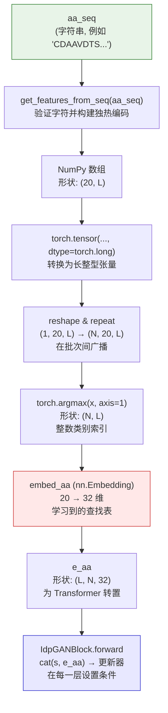

---
slug:10-amino-acid-feature-encoding
blog_type:normal
---


氨基酸特征编码是 idpGAN 将原始蛋白质序列字符串转换为数值表示的机制，这些数值表示可被基于 Transformer 的生成器和选择器网络所消费。此编码流水线弥合了生物序列信息与神经网络所操作的连续向量空间之间的鸿沟，并采用了一种**两阶段设计**：首先是从 20 种标准氨基酸到离散的独热映射，然后是一个学习到的嵌入投影，将其投影到 Transformer 模块在构象生成过程中可作为条件的低维连续空间中。

## 规范氨基酸字母表

idpGAN 通过模块级常量 `aa_list` 定义了 20 种标准氨基酸的固定顺序。此顺序决定了分配给独热编码矩阵中每个残基的行索引，并且必须在训练和推理之间保持一致——任何重新排序都会使预训练模型权重失效。

```python
aa_list = list("QWERTYIPASDFGHKLCVNM")
```

该顺序遵循受**键盘布局启发**的序列，而非生化分组或字母顺序。这是一种任意但固定的约定；重要的是索引映射是确定性的，并且在所有组件之间共享。这 20 个字符到索引 0–19 的映射如下：

| 索引 | 氨基酸 | 索引 | 氨基酸 | 索引 | 氨基酸 | 索引 | 氨基酸 |
|:-----:|:--:|:-----:|:--:|:-----:|:--:|:-----:|:--:|
| 0 | Q | 5 | T | 10 | S | 15 | L |
| 1 | W | 6 | Y | 11 | D | 16 | C |
| 2 | E | 7 | I | 12 | F | 17 | V |
| 3 | R | 8 | P | 13 | G | 18 | N |
| 4 | T | 9 | A | 14 | H | 19 | M |

请注意，**T（苏氨酸）**在字符串 `"QWERTYIPASDFGHKLCVNM"` 中出现了两次——位于位置 4 和 5。然而，由于 `list()` 会保留所有字符，该列表实际上在索引 4 和 5 处有一个重复项。在实践中，独热编码函数使用 `aa_list.index(aa_i)`，它总是返回**第一次**出现的位置，因此索引 5（第二个 T）永远不会被分配。这意味着有效的编码空间为 20 行，但只有 19 种不同的残基类型接收到唯一索引。这是当前实现的一个已知现象——`nn.Embedding(20, embed_dim_1d)` 层为所有 20 个槽位分配了空间，但在实践中第 5 行始终保持未使用状态。

来源: [nn_models.py](/idpgan/nn_models.py#L413-L413)

## 独热编码：`get_features_from_seq`

函数 `get_features_from_seq` 是将序列字符串转换为数值特征矩阵的入口点。给定长度为 *L* 的蛋白质序列，它将生成一个 **(20, L)** 的 NumPy 数组，其中每一列都是指示该位置氨基酸的独热向量。

```python
def get_features_from_seq(seq):
    """
    Given an amino acid sequence string 'seq', returns a numpy
    array of shape (20, L), where L is the sequence length.
    """
    for aa_i in seq:
        if aa_i not in aa_list:
            raise ValueError(
                    "Invalid amino acid character in sequence: %s" % aa_i)
    n_res = len(seq)
    n_features = len(aa_list)
    features = np.zeros((n_features, n_res))
    # Residues one hot encoding.
    for i, aa_i in enumerate(seq):
        features[aa_list.index(aa_i), i] = 1
    return features
```

该函数首先执行**验证**：输入序列中的每个字符都必须存在于 `aa_list` 中，否则将引发 `ValueError`。这可以防止非标准残基（例如 B、Z、X、U）的混入，如果允许其通过，将会悄无声息地破坏编码。

编码逻辑遍历序列中的每个位置 `i`，在 `aa_list` 中查找该氨基酸的索引，并设置 `features[index, i] = 1`。列 `i` 中的所有其他条目保持为零。生成的矩阵是一种稀疏的整数值表示——每列恰好包含一个 `1` 和 19 个零。

对于序列 `"CDAA"`（protan 的前四个残基），编码将产生：

| | 位置 0 | 位置 1 | 位置 2 | 位置 3 |
|:---:|:-----:|:-----:|:-----:|:-----:|
| 0 (Q) | 0 | 0 | 0 | 0 |
| ... | ... | ... | ... | ... |
| 9 (A) | 0 | 0 | **1** | **1** |
| 11 (D) | 0 | **1** | 0 | 0 |
| 16 (C) | **1** | 0 | 0 | 0 |

来源: [nn_models.py](/idpgan/nn_models.py#L414-L429)

## 学习嵌入投影

独热矩阵不会直接输入到 Transformer 中。相反，它会被转换为整数类别索引，并通过一个**可学习的 `nn.Embedding`** 层，将 20 种离散氨基酸类型投影到连续的 `embed_dim_1d` 维空间中。

### 嵌入层定义

生成器（`IdpGANGenerator`）和镜像选择器（`StereoSelNN`）都实例化了相同的嵌入架构：

```python
self.embed_aa = nn.Embedding(20, embed_dim_1d)
```

在所有预训练模型配置中，`embed_dim_1d` 的默认值均为 **32**。这意味着 20 种氨基酸类型中的每一种都映射到一个唯一的 32 维可学习向量。在训练期间，这些向量与网络的其他参数联合优化，以捕获对于预测无序蛋白质构象最具信息量的氨基酸性质。

来源: [nn_models.py](/idpgan/nn_models.py#L274-L274), [nn_models.py](/idpgan/nn_models.py#L498-L498)

### 索引转换与嵌入应用

在生成器的 `forward` 方法中，独热张量 `x`（形状为 **N, 20, L**）首先通过 `torch.argmax` 降维为整数索引，然后进行嵌入：

```python
e_aa = self.embed_aa(torch.argmax(x, axis=1))
e_aa = torch.transpose(e_aa, 1, 0)
```

`argmax` 操作将 20 维的独热维度压缩为每个位置一个整数，生成一个值为 {0, 1, ..., 19}、形状为 **(N, L)** 的张量。随后，`nn.Embedding` 查表生成一个 **(N, L, 32)** 的张量，该张量被转置为 **(L, N, 32)**，以匹配 Transformer 期望的输入布局 **(sequence_length, batch_size, feature_dim)**。

在 `StereoSelNN` 中，氨基酸索引被直接传入（已经通过 `a.argmax(axis=1)` 转换为整数形式），而不是从独热张量中派生：

```python
e_aa = self.embed_aa(a)
```

来源: [nn_models.py](/idpgan/nn_models.py#L340-L341), [nn_models.py](/idpgan/nn_models.py#L552-L553)

## 使用氨基酸特征为 Transformer 设置条件

氨基酸嵌入 `e_aa` 作为 Transformer 堆栈中每个 `IdpGANBlock` 的 **1D 条件输入**。它没有被添加到潜在表示中；相反，它在前馈（更新器）模块之前与隐藏状态进行**拼接**，这使得网络能够基于氨基酸的身份来调制其逐位置的更新。

### 条件机制

在 `IdpGANBlock.forward` 内部，当 `use_embed_1d` 为 `True` 时：

```python
# Use amino acid conditional information.
if self.use_embed_1d:
    um_in = torch.cat([s, x], axis=-1)
else:
    um_in = s
```

这里，`s` 是形状为 **(L, N, embed_dim)** 的隐藏状态，`x` 是形状为 **(L, N, embed_dim_1d)** 的氨基酸嵌入 `e_aa`。拼接产生一个维度为 `embed_dim + embed_dim_1d`（例如，默认设置下为 64 + 32 = 96）的组合向量，随后该向量将被更新器模块的线性层处理。

### 重复注入与仅首层注入

`use_embed_repeat` 参数控制氨基酸条件是注入到**每一** Transformer 层，还是仅注入到**第一**层：

- **`use_embed_repeat=True`**（默认）：氨基酸嵌入通过 `h = t_l(h, x=e_aa, p=p)` 传递给所有层，确保在整个网络深度中保持持久的序列感知能力。
- **`use_embed_repeat=False`**：只有第一个 Transformer 模块接收 `e_aa`；后续层在没有直接氨基酸条件的条件下对变换后的表示进行操作。

仓库中所有预训练模型配置均使用 `use_embed_repeat=True`，使氨基酸身份成为贯穿全部 8 个 Transformer 层的**持久条件信号**。

来源: [nn_models.py](/idpgan/nn_models.py#L97-L100), [nn_models.py](/idpgan/nn_models.py#L347-L356)

## 端到端编码流水线

从原始序列字符串到嵌入条件张量的完整流程由 `predict_idp` 方法协调。下图概述了完整的流水线：



### 逐步追踪

1. **序列字符串** → `get_features_from_seq` 生成一个 **(20, L)** 的独热 NumPy 数组，并针对 `aa_list` 进行验证。
2. **独热数组** → 封装为 `torch.long` 张量，重塑为 **(1, 20, L)**，并在批次维度上重复为 **(N, 20, L)**。
3. **独热张量** → `torch.argmax(x, axis=1)` 压缩为 **(N, L)** 的整数索引。
4. **整数索引** → `nn.Embedding(20, 32)` 查表生成 **(N, L, 32)** 的连续向量，转置为 **(L, N, 32)**。
5. **嵌入氨基酸** → 在每个 `IdpGANBlock` 中与隐藏状态 `s` 拼接，使前馈更新器能够以残基身份为条件。

<CgxTip>独热编码使用 `aa_list.index()`，它返回第一个匹配项——因为 "T" 在 `aa_list` 中的索引 4 和 5 处出现了两次，所以索引 5 是 `nn.Embedding` 表中一个不可达的死槽位。这不会影响已训练模型的正确性（苏氨酸始终映射到索引 4），但这意味着嵌入表中有一行未被使用。</CgxTip>

来源: [nn_models.py](/idpgan/nn_models.py#L380-L410), [nn_models.py](/idpgan/nn_models.py#L310-L341)

## 预训练模型嵌入配置

两种已发布的模型变体共享相同的氨基酸编码超参数。下表总结了相关配置：

| 参数 | CG 模型生成器 | ABSINTH 变体 | 选择器网络 |
|:----------|:-----------------:|:---------------:|:----------------:|
| `embed_dim_1d` | 32 | 32 | 32 |
| `nn.Embedding` 大小 | (20, 32) | (20, 32) | (20, 32) |
| `use_embed_repeat` | `True` | `True` | `True` |
| `embed_dim` (隐藏层) | 64 | 64 | 96 |
| 拼接维度 | 64 + 32 = 96 | 64 + 32 = 96 | 96 + 32 = 128 |

**拼接维度**列显示了在将隐藏状态与氨基酸嵌入拼接之后，更新器模块第一个线性层的总输入宽度。尽管各模型间的隐藏维度不同，但氨基酸嵌入维度始终统一为 32，这反映了一项一致的设计选择，即 32 个连续维度足以捕获与无序蛋白质构象采样相关的理化变异。

来源: [nn_models.py](/idpgan/nn_models.py#L432-L450), [nn_models.py](/idpgan/nn_models.py#L615-L653)

## API 参考

### `get_features_from_seq(seq)`

**参数：**

| 名称 | 类型 | 描述 |
|:-----|:-----|:------------|
| `seq` | `str` | 使用单字母代码的氨基酸序列。必须仅包含 `aa_list` 中的字符。 |

**返回：** 形状为 `(20, L)`、dtype 为 `float64` 的 `np.ndarray`。每一列都是一个独热向量。

**抛出：** 如果 `seq` 中的任何字符不在 `aa_list` 中，则抛出 `ValueError`。

**示例：**

```python
from idpgan.nn_models import get_features_from_seq

# Encode a short sequence
features = get_features_from_seq("QWER")
print(features.shape)   # (20, 4)
print(features[:, 0])   # [1., 0., 0., ...] — Q is at index 0
```

### `aa_list`

模块级常量：`list("QWERTYIPASDFGHKLCVNM")`——定义用于独热索引分配的规范氨基酸顺序的 20 元素列表。

来源: [nn_models.py](/idpgan/nn_models.py#L413-L429)

## 设计原理与局限性

两阶段编码（独热 → 学习嵌入）遵循了序列建模中的标准模式：独热表示提供了从离散残基类型到向量的**无歧义、免训练**的映射，而学习嵌入则允许网络**发现**一种特定于任务的连续表示。这对于 IDP 构象生成尤为重要，因为氨基酸的性质——疏水性、电荷、空间位阻、二级结构倾向——会强烈影响系综，但并未被显式编码。学习嵌入可以在训练期间隐式捕获这些理化规律。

**当前实现的关键局限性：**

- **无显式生化特征**：与某些使用手工制作的理化属性向量（例如 BLOSUM 分数、Kyte-Doolittle 疏水性、侧链体积）来增强独热编码的蛋白质模型不同，idpGAN 完全依赖学习嵌入从数据中发现此类结构。
- **固定的 20 残基字母表**：非标准氨基酸和修饰（磷酸化、乙酰化等）会被验证检查拒绝。包含歧义码（X、B、Z）的序列无法被处理。
- **`aa_list` 中的重复条目**：字符 "T" 同时出现在索引 4 和 5 处，导致索引 5 成为一个死嵌入槽位。这是当前实现中一个无害但在技术上不严谨的方面。

<CgxTip>缺乏手工制作的生化特征是一项有意的设计选择——学习嵌入是在粗粒度 MD 模拟数据上进行端到端训练的，使其能够发现直接为构象生成任务优化的表示，而不是受通用生化先验的偏置影响。</CgxTip>

来源: [nn_models.py](/idpgan/nn_models.py#L413-L429), [nn_models.py](/idpgan/nn_models.py#L274-L274)

---

**继续探索数据与坐标子系统：**[二面角计算](9-dihedral-angle-computation)——或了解氨基酸特征如何流经完整的生成流水线：[生成器推理流水线](17-generator-inference-pipeline)。