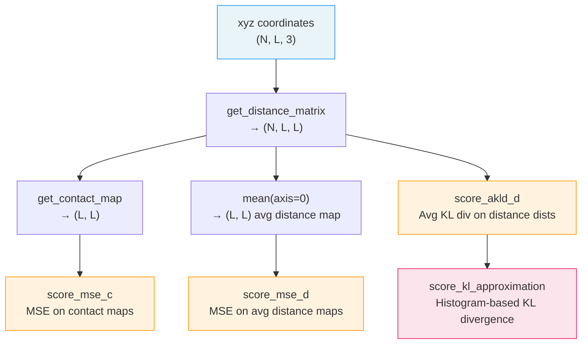

---
slug:11-distance-and-contact-map-metrics
blog_type:normal
---


`idpgan.evaluation` 模块提供了定量评分函数，用于在**平均距离图**和**接触概率图**层面，将生成的构象系综与参考系综（例如分子动力学系综）进行比较。这两种结构表示捕获了分子内几何结构的互补视角：距离图编码了所有残基对的平均欧几里得距离，而接触图编码了任意两个残基在空间阈值内的接触概率。它们共同构成了评估 idpGAN 系综保真度的主要定量基础。

## 从坐标到距离图和接触图

在评分之前，必须将原始笛卡尔坐标转换为距离和接触表示。示例 Notebook 为此定义了两个实用函数。

**距离矩阵计算**将形状为 `(N, L, 3)` 的 3D 构象系综（其中 *N* 是快照数量，*L* 是残基数量）转换为形状为 `(N, L, L)` 的逐帧距离矩阵：

```python
def get_distance_matrix(xyz):
    return np.sqrt(np.sum(np.square(xyz[:,None,:,:] - xyz[:,:,None,:]), axis=3))
```

此操作利用了 NumPy 广播机制：`xyz[:,None,:,:]` 沿新轴扩展，从而同时计算所有两两差异。每个条目 `dmap[k, i, j]` 存储了快照 *k* 中残基 *i* 和 *j* 之间的欧几里得距离，单位为纳米（CG 模型的坐标单位）。

**接触概率图计算**将距离图轨迹 `(N, L, L)` 折叠为单个 `(L, L)` 的接触频率矩阵：

```python
def get_contact_map(dmap, threshold=0.8, pseudo_count=0.01):
    n = dmap.shape[0]
    cmap = ((dmap <= threshold).astype(int).sum(axis=0) + pseudo_count) / n
    return cmap
```

默认的 **0.8 nm 阈值**定义了接触截断值——在给定快照中，任何珠子间距离小于或等于该值的残基对均被视为“处于接触状态”。0.01 的 `pseudo_count` 可防止出现零概率条目，从而避免在下游评分中产生对数奇点。生成的 `cmap[i, j]` 是残基 *i* 和 *j* 在整个系综中处于接触状态的经验概率。

来源: [idpgan_experiments.ipynb](/notebooks/idpgan_experiments.ipynb#L117-L144)

## 平均距离图的 MSE — `score_mse_d`

**MSE_d** 评分量化了两个*平均*距离图之间的差异。它作用于预平均的 `(L, L)` 矩阵——也就是说，你必须先对完整的 `(N, L, L)` 距离图轨迹调用 `.mean(axis=0)`，然后再将其传递给此函数：

$$MSE_d = \frac{1}{N_{pairs}} \sum_{i<j} (m_{ij} - \hat{m}_{ij})^2$$

其中，$N_{pairs}$ 是唯一残基间对的数量（L×L 矩阵的上三角部分），$m_{ij}$ 是参考系综中残基 *i* 和 *j* 之间的平均距离，$\hat{m}_{ij}$ 是预测系综中的对应值。

```python
def score_mse_d(admap_ref, admap_hat):
    triu_ids = np.triu_indices(admap_ref.shape[0])
    vals_ref = admap_ref[triu_ids[0], triu_ids[1]]
    vals_hat = admap_hat[triu_ids[0], triu_ids[1]]
    return np.mean(np.square(vals_ref - vals_hat))
```

该函数通过 `np.triu_indices` 仅提取**上三角**索引，避免了对称对的重复计算，并排除了对角线上的平凡项（距离始终为零）。较低的 MSE_d 表明两个系综的平均结构几何更为一致。

| 方面 | 详情 |
|---|---|
| **输入形状** | 两个 `(L, L)` 数组（预平均距离图） |
| **输出** | 标量 MSE 值（nm²） |
| **对称性处理** | 仅上三角（`i < j`） |
| **典型用法** | 比较 `dmap_md.mean(axis=0)` 与 `dmap_gen.mean(axis=0)` |

来源: [evaluation.py](/idpgan/evaluation.py#L4-L13), [idpgan_experiments.ipynb](/notebooks/idpgan_experiments.ipynb#L463-L506)

## 接触图的 MSE — `score_mse_c`

**MSE_c** 评分在**对数空间**中测量两个接触概率图之间的差异。由于接触概率跨越多个数量级（从远距离残基对的接近零到连续近邻的接近一），原始 MSE 会被高概率接触主导。在对数空间中进行计算可以均衡整个概率范围内的贡献：

$$MSE_c = \frac{1}{N_{pairs}} \sum_{i<j} (\log(p_{ij}) - \log(\hat{p}_{ij}))^2$$

```python
def score_mse_c(cmap_ref, cmap_hat):
    triu_ids = np.triu_indices(cmap_ref.shape[0])
    vals_ref = np.log(cmap_ref[triu_ids[0], triu_ids[1]])
    vals_hat = np.log(cmap_hat[triu_ids[0], triu_ids[1]])
    return np.mean(np.square(vals_ref - vals_hat))
```

与 `score_mse_d` 类似，此函数仅使用上三角元素。对数变换也是 `get_contact_map` 应用 `pseudo_count` 的原因——如果没有它，任何零接触频率都会导致 `log(0) = -∞`。这种设计将接触图构建与评分耦合在一起：必须一致地设置伪计数，以避免产生伪影。

| 方面 | 详情 |
|---|---|
| **输入形状** | 两个 `(L, L)` 接触概率矩阵 |
| **输出** | 对数空间中的标量 MSE |
| **对称性处理** | 仅上三角（`i < j`） |
| **对数底数** | 自然对数（`np.log`） |
| **先决条件** | 非零条目（通过 `get_contact_map` 中的 `pseudo_count` 实现） |

### MSE_d 与 MSE_c — 互补视角

| 属性 | MSE_d | MSE_c |
|---|---|---|
| **操作对象** | 平均距离图 `(L, L)` | 接触概率图 `(L, L)` |
| **域** | 直接距离 | 对数概率 |
| **敏感于** | 平均结构几何 | 罕见接触事件 |
| **捕获的系综信息** | 仅一阶矩 | 阈值跨越统计量 |
| **典型基线** | 聚丙氨酸 MD | 聚丙氨酸 MD |

距离图 MSE 对全局构象特征（链伸展度、紧凑度）最为敏感，而接触图 MSE 则放大了定义 IDP 相互作用拓扑的罕见或特定残基间接触的差异。在两项指标上均表现优异的模型，能够同时捕捉整体的链尺寸和特定残基的接触模式。

来源: [evaluation.py](/idpgan/evaluation.py#L15-L24), [idpgan_experiments.ipynb](/notebooks/idpgan_experiments.ipynb#L557-L598)

## 距离分布的平均 KL 散度 — `score_akld_d`

虽然 MSE_d 和 MSE_c 比较*汇总统计量*（平均距离、接触频率），但 `score_akld_d` 比较两个系综中每个残基间距离的**全分布**。这一点至关重要，因为两个系综可能具有相同的平均距离，但分布形状却截然不同（例如，单峰分布与双峰分布）。

$$aKLD_d = \frac{1}{N_{pairs}} \sum_{i<j} KLD(M_{ij} \parallel \hat{M}_{ij})$$

其中 $M_{ij}$ 和 $\hat{M}_{ij}$ 分别是参考系综和预测系综中残基对 (*i*, *j*) 的经验距离分布。

```python
def score_akld_d(dmap_true, dmap_pred, get_mean=True, *args, **kwargs):
    kl_l = []
    for i in range(dmap_true.shape[2]):
        for j in range(dmap_pred.shape[2]):
            if i >= j:
                continue
            yt = dmap_true[:, i, j]
            yp = dmap_pred[:, i, j]
            kl_i, _ = score_kl_approximation(yt, yp, *args, **kwargs)
            kl_l.append(kl_i)
    if get_mean:
        return np.mean(kl_l)
    else:
        return np.array(kl_l)
```

注意，此函数接受**完整轨迹形状**的数组 `(N, L, L)`，而不是预平均图。它遍历每个唯一对 (*i* < *j*)，从每个系综中提取一维距离分布，并委托给 `score_kl_approximation` 计算逐对 KL 散度。当 `get_mean=True`（默认值）时，它返回所有对的平均值；当为 `False` 时，它返回逐对 KL 散度的完整向量，以供详细检查。

<CgxTip>`get_mean=False` 模式对于诊断极有价值——将逐对 KL 散度绘制为热图，可以揭示哪些特定残基对具有不同的距离分布，从而指导针对性的模型改进。</CgxTip>

来源: [evaluation.py](/idpgan/evaluation.py#L27-L44)

## 离散 KL 散度 — `score_kl_approximation`

`score_akld_d` 的基础（也独立用于回转半径评分）是**基于直方图的 KL 散度近似**。由于真实的潜在分布未知，此函数将参考样本和预测样本离散化到共享的区间中，并在得到的频率表上计算 KL 散度：

```python
def score_kl_approximation(v_true, v_pred, n_bins=50, pseudo_c=0.001):
    _min = min((v_true.min(), v_pred.min()))
    _max = max((v_true.max(), v_pred.max()))
    bins = np.linspace(_min, _max, n_bins+1)
    ht = (np.histogram(v_true, bins=bins)[0] + pseudo_c) / v_true.shape[0]
    hp = (np.histogram(v_pred, bins=bins)[0] + pseudo_c) / v_pred.shape[0]
    kl = -np.sum(ht * np.log(hp / ht))
    return kl, bins
```

区间范围由两个样本范围的**并集**确定，以确保捕获所有数据。`pseudo_c` 参数（默认为 0.001）在归一化之前为每个区间计数添加一个小常数，防止出现零概率区间，从而避免对数比率未定义。返回的元组 `(kl, bins)` 提供了散度值和所使用的区间边界——后者对调试或可视化非常有用。

| 参数 | 默认值 | 作用 |
|---|---|---|
| `n_bins` | 50 | 直方图区间数；更高 → 分辨率更细，但估计噪声更大 |
| `pseudo_c` | 0.001 | 伪计数，用于防止零频率区间 |

<CgxTip>`n_bins=50` 的默认值在典型系综大小（约 10,000 个样本）下平衡了分辨率和统计稳定性。对于较小的系综，应减小 `n_bins` 以避免区间稀疏；对于非常大的系综，可增加此值以获得更细的分布分辨率。</CgxTip>

来源: [evaluation.py](/idpgan/evaluation.py#L46-L60)

## 评估流水线 — 端到端流程

下图展示了从原始坐标到定量评分的完整评估流水线：



在实践中，将生成系综与参考 MD 系综进行比较的工作流程如下：

```python
from idpgan.evaluation import score_mse_d, score_mse_c

# 步骤 1：从 xyz 坐标计算距离图。
dmap_md = get_distance_matrix(xyz_md)    # (N, L, L)
dmap_gen = get_distance_matrix(xyz_gen)  # (N, L, L)

# 步骤 2：计算接触概率图。
cmap_md = get_contact_map(dmap_md)       # (L, L)
cmap_gen = get_contact_map(dmap_gen)     # (L, L)

# 步骤 3：对平均距离图的一致性进行评分。
mse_d = score_mse_d(dmap_md.mean(axis=0), dmap_gen.mean(axis=0))

# 步骤 4：对接触图的一致性进行评分。
mse_c = score_mse_c(cmap_md, cmap_gen)
```

来源: [idpgan_experiments.ipynb](/notebooks/idpgan_experiments.ipynb#L436-L506), [evaluation.py](/idpgan/evaluation.py#L1-L60)

## 模块 API 概览

| 函数 | 签名 | 返回值 | 用途 |
|---|---|---|---|
| `score_mse_d` | `(admap_ref, admap_hat)` | `float` | 平均距离图之间的 MSE |
| `score_mse_c` | `(cmap_ref, cmap_hat)` | `float` | 对数空间中接触图之间的 MSE |
| `score_akld_d` | `(dmap_true, dmap_pred, get_mean, ...)` | `float` 或 `ndarray` | 距离分布的平均（或逐对）KL 散度 |
| `score_kl_approximation` | `(v_true, v_pred, n_bins, pseudo_c)` | `(float, ndarray)` | 基于直方图的 KL 散度及区间边界 |

所有四个函数均为纯 NumPy 操作，无 PyTorch 依赖，这使得在分析脚本中使用它们非常轻量，无需 GPU 要求。

来源: [evaluation.py](/idpgan/evaluation.py#L1-L60)

## 可视化配套

虽然评分函数提供了标量定量评估，但 `idpgan.plot` 模块提供了配对可视化，使指标差异具有可解释性。有两个函数与距离图和接触图评估直接相关：

- **`plot_average_dmap_comparison`** 在单个热图的**下三角**部分渲染 MD 平均距离图，在**上三角**部分渲染生成系综的平均距离图，从而实现全局结构几何的直接视觉比较。对角线被遮罩为 NaN。颜色标度限制在 `[0, max_d]` nm（默认 6.8 nm）。

- **`plot_cmap_comparison`** 对接触概率图使用相同的分割三角布局，但在 $\log_{10}(p_{ij})$ 空间中渲染值，并使用 `"jet"` 颜色图。`cmap_min` 参数（默认 -3.5）设置颜色下限，对应于约 0.03% 的最小接触概率。

来源: [plot.py](/idpgan/plot.py#L6-L75)

## 实践中的评分解读

idpGAN 论文和 Notebook 中的典型评估策略是**三向比较**：(1) 朴素基线（聚丙氨酸 MD 数据，表现为通用随机线圈），(2) idpGAN 生成的系综，以及 (3) 参考 MD 系综。与参考系综比较时，有效的生成模型必须产生比朴素基线**更接近零**的评分。这种基于基线的相对解释至关重要，因为绝对的评分大小取决于蛋白质长度、序列组成和系综大小——不存在通用的“好”阈值。

有关此处涵盖的汇总评分之外更深入的分布分析，请参阅 [KL 散度评分](12-kl-divergence-scoring) 以获取完整的 `score_kl_approximation` API，以及 [系综可视化工具](13-ensemble-visualization-utilities) 以获取包括两两距离直方图和回转半径分布在内的完整绘图工具包。