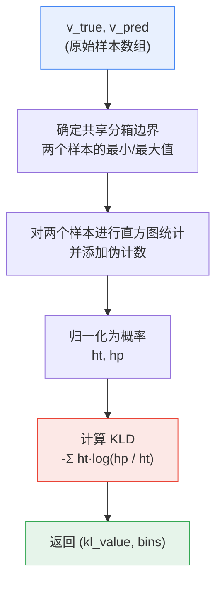
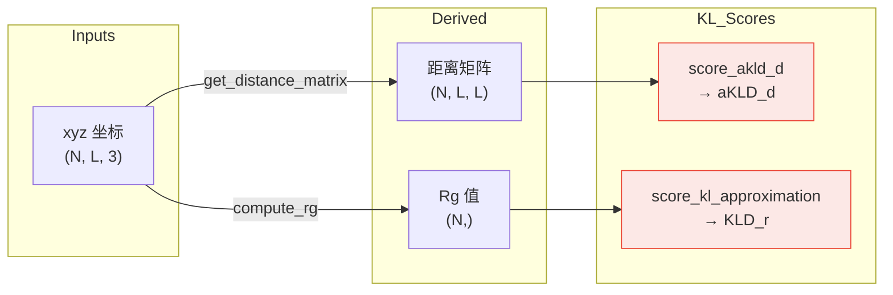

---
slug:12-kl-divergence-scoring
blog_type:normal
---


IdpGAN 评估生成构象系综的质量，不仅通过平均结构指标（距离和接触图的 MSE），还通过**分布保真度**——即生成的系综是否能复现参考分子动力学（MD）数据中结构可观测量的完整统计分布。`evaluation.py` 中的两个 KL 散度评分函数实现了这一原则：`score_kl_approximation` 计算任意两个经验分布之间基于直方图近似的 Kullback-Leibler 散度（KLD），而 `score_akld_d` 则聚合系综中所有原子间距离对的逐对 KLD 值，从而得出 idpGAN 论文中使用的 **aKLD_d** 分数。

来源：[evaluation.py](/idpgan/evaluation.py#L1-L60), [idpgan_experiments.ipynb](/notebooks/idpgan_experiments.ipynb#L105-L107)

## 数学基础

**Kullback-Leibler 散度**衡量了用分布 *Q* 近似分布 *P* 时所损失的信息：

$$D_{KL}(P \parallel Q) = \sum_x P(x) \log \frac{P(x)}{Q(x)}$$

在 idpGAN 中，该散度应用于两种不同的评分场景：

| 分数 | 比较对象 | 范围 | 聚合方式 |
|-------|-----------------|-------|-------------|
| **KLD_r** | 回转半径分布 | 每个系综的单标量分布 | 直接调用 `score_kl_approximation` |
| **aKLD_d** | 原子间距离分布 | 每个残基对 (i, j) 对应一个分布 | 对所有唯一对 i < j 求均值 |

**aKLD_d** 分数定义为：

$$aKLD_d = \frac{1}{N_{pairs}} \sum_{i<j} D_{KL}(M_{ij} \parallel \hat{M}_{ij})$$

其中 $M_{ij}$ 是原子 *i* 和 *j* 之间的参考（MD）距离分布，$\hat{M}_{ij}$ 是相应的预测（生成）分布。**分数越低**，表明生成系综与参考系综之间的分布一致性越好。

来源：[idpgan_experiments.ipynb](/notebooks/idpgan_experiments.ipynb#L635-L641), [idpgan_experiments.ipynb](/notebooks/idpgan_experiments.ipynb#L714-L716)

## 基于直方图的 KLD 近似

由于 idpGAN 处理的是有限的经验样本而非已知的参数化分布，因此无法解析地计算 KL 散度。`score_kl_approximation` 函数通过**将两个样本离散化到共享直方图中**，并在生成的概率质量函数上计算 KLD 来解决这一问题。

该流程分为三个阶段：



**分箱构建**使用 `np.linspace` 在两个样本范围的并集上操作，从 `min(v_true.min(), v_pred.min())` 到 `max(v_true.max(), v_pred.max())` 创建 `n_bins` 个等距分箱。这种共享分箱机制确保了两个分布在相同的支撑集上进行评估。

**伪计数平滑**（`pseudo_c=0.001`）在归一化之前被添加到每个直方图箱的计数中。这至关重要，因为 KL 散度涉及 `log(hp / ht)`——如果任一分布中有任何箱的计数为零，则会产生 `log(0)`，导致结果未定义或无穷大。伪计数充当贝叶斯风格的先验，为每个箱分配很小但非零的概率，从而保证数值稳定性。

来源：[evaluation.py](/idpgan/evaluation.py#L46-L60)

## API 参考

### `score_kl_approximation`

```python
score_kl_approximation(v_true, v_pred, n_bins=50, pseudo_c=0.001)
```

计算表示为样本数组的两个经验分布之间基于直方图近似的 Kullback-Leibler 散度。

| 参数 | 类型 | 默认值 | 描述 |
|-----------|------|---------|-------------|
| `v_true` | `np.ndarray` (1D) | — | 来自参考（真实）分布的样本 |
| `v_pred` | `np.ndarray` (1D) | — | 来自预测（近似）分布的样本 |
| `n_bins` | `int` | `50` | 用于离散化的直方图箱数 |
| `pseudo_c` | `float` | `0.001` | 添加到每个箱以避免零概率箱的伪计数 |

**返回：** `(kl, bins)`——包含标量 KL 散度值和用于离散化的分箱边界数组的元组。

<CgxTip>`n_bins` 参数控制 KLD 估计中的偏差-方差权衡。箱数过少会导致分布过度平滑（高偏差）；箱数过多则会产生具有不可靠频率估计的稀疏直方图（高方差）。默认值 50 是针对 idpGAN 系综比较中典型的约 10,000 样本规模进行校准的。</CgxTip>

### `score_akld_d`

```python
score_akld_d(dmap_true, dmap_pred, get_mean=True, *args, **kwargs)
```

通过对两个距离矩阵系综中的每个唯一残基对应用 `score_kl_approximation`，计算**平均距离 KL 散度**（aKLD_d）。

| 参数 | 类型 | 默认值 | 描述 |
|-----------|------|---------|-------------|
| `dmap_true` | `np.ndarray` (N×L×L) | — | 来自 MD 系综的参考距离矩阵 |
| `dmap_pred` | `np.ndarray` (M×L×L) | — | 来自生成系综的预测距离矩阵 |
| `get_mean` | `bool` | `True` | 若为 `True`，返回标量均值；若为 `False`，返回每个对的 KLD 值的完整数组 |
| `*args, **kwargs` | — | — | 转发至 `score_kl_approximation`（如 `n_bins`、`pseudo_c`） |

**返回：** 当 `get_mean=True` 时返回 `float`（平均 aKLD_d），当 `get_mean=False` 时返回形状为 `(L*(L-1)/2,)` 的 `np.ndarray`。

注意，`dmap_true` 和 `dmap_pred` 可以具有不同的第一维度大小（N ≠ M）——该函数作用于每个固定对 (i, j) 在样本轴上的距离分布，因此样本数无需匹配。

来源：[evaluation.py](/idpgan/evaluation.py#L27-L44), [evaluation.py](/idpgan/evaluation.py#L46-L60)

## 系综评估中的实际用法

这两个评分函数均出现在 idpGAN 的实验笔记中，用于将生成的系综与 MD 参考数据进行基准对比。评估策略遵循**比较基线**模式：分别计算 idpGAN 生成系综和朴素聚丙氨酸基线相对于同一 MD 参考数据的分数。当 idpGAN 的分数显著低于基线时，即认为 idpGAN 是成功的。

对于**原子间距离分布**，`score_akld_d` 作用于完整的 3D 距离矩阵数组：

```python
from idpgan.evaluation import score_akld_d, score_kl_approximation

# aKLD_d: 聚合所有残基对的 KLD
akld_score = score_akld_d(dmap_protan_md, dmap_protan_gen)
```

对于**回转半径分布**，直接在 1D 样本数组上调用 `score_kl_approximation`，并仅访问返回元组的第一个元素：

```python
# KLD_r: 两个 Rg 分布之间的 KLD
kld_rg = score_kl_approximation(rg_protan_md, rg_protan_gen)[0]
```

`[0]` 索引丢弃了 `bins` 数组，仅提取标量散度值。



<CgxTip>在 `score_akld_d` 中使用 `get_mean=False` 可将每个对的 KLD 值作为数组检索。这有助于识别生成系综与参考系综差异最大的特定残基对——对于针对性诊断和模型改进非常有用。</CgxTip>

来源：[idpgan_experiments.ipynb](/notebooks/idpgan_experiments.ipynb#L651-L655), [idpgan_experiments.ipynb](/notebooks/idpgan_experiments.ipynb#L726-L730)

## 与其他评估指标的关系

KL 散度评分补充了同一模块中的**基于 MSE 的指标**。虽然 `score_mse_d` 和 `score_mse_c` 比较的是*平均*结构属性（平均距离图和接触频率），但基于 KL 的评分评估的是*整个分布形状*是否得以保持——包括方差、偏度和尾部行为。一个系综在平均距离上可能获得较低的 MSE，但仍然产生定性错误的距离分布（例如，均值正确但展宽不正确或呈多峰模式）。KL 散度能够捕捉这些高阶的分布不匹配问题。

| 指标 | 比较对象 | 敏感度 | 模块函数 |
|--------|----------|-------------|-----------------|
| MSE_d | 平均原子间距离 | 仅一阶矩 | `score_mse_d` |
| MSE_c | 平均接触频率（对数空间） | 仅一阶矩 | `score_mse_c` |
| aKLD_d | 完整距离分布 | 所有矩 | `score_akld_d` |
| KLD_r | 完整 Rg 分布 | 所有矩 | `score_kl_approximation` |

为了全面了解系综质量，idpGAN 论文建议联合评估**所有四个指标**。有关基于 MSE 的对应指标，请参阅[距离和接触图指标](11-distance-and-contact-map-metrics)。

来源：[evaluation.py](/idpgan/evaluation.py#L1-L60), [idpgan_experiments.ipynb](/notebooks/idpgan_experiments.ipynb#L463-L471)

## 下一步

- **[距离和接触图指标](11-distance-and-contact-map-metrics)** — 了解作为 KL 散度评估补充的基于 MSE 的评分函数。
- **[系综可视化工具](13-ensemble-visualization-utilities)** — 探索与这些分数配合使用的绘图函数，以可视化比较生成分布与参考分布。
- **[生成器推理流程](17-generator-inference-pipeline)** — 了解如何生成供这些评分函数评估的系综。