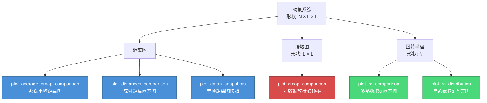
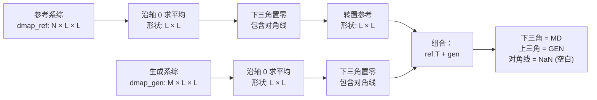

---
slug:13-ensemble-visualization-utilities
blog_type:normal
---


`idpgan.plot` 模块提供了六个可视化函数，旨在对比和检查**构象系综**——即 idpGAN 生成的 3D 蛋白质结构集合与参考分子动力学 (MD) 数据。这些工具基于距离图、接触图、原子间距离分布和回转半径进行操作，为你提供对生成结构质量的**聚合（系综平均）**与**单帧**双重视角。

来源：[plot.py](/idpgan/plot.py#L1-L176)

## 模块架构

本模块中的每个可视化函数均遵循一致的设计理念：**下三角 vs. 上三角**分割绘图以实现并排对比，以及采用 **matplotlib 有状态 API** 以简化 Notebook 环境中的操作。函数间的概念关系如下图所示。



**蓝色**节点操作距离图，**红色**节点操作接触图，**绿色**节点操作回转半径数据。

来源：[plot.py](/idpgan/plot.py#L1-L176)

## API 参考

### `plot_average_dmap_comparison`

绘制组合热力图，其中**下三角**显示系综平均的参考距离图，**上三角**显示系综平均的生成距离图。对角线使用 `NaN` 屏蔽（渲染为空白）。这是直观评估生成器是否复现全局残基间距离结构的主要工具。

| 参数 | 类型 | 默认值 | 描述 |
|-----------|------|---------|-------------|
| `dmap_ref` | `ndarray (N, L, L)` 或 `None` | — | 参考距离图系综。设为 `None` 则仅绘制生成数据（下三角变为空白）。 |
| `dmap_gen` | `ndarray (M, L, L)` | — | 生成距离图系综。内部沿轴 0 求平均。 |
| `title` | `str` | — | 图表标题，例如 `"protan (lower=MD, upper=GEN)"`。 |
| `ticks_fontsize` | `int` | `14` | 坐标轴刻度标签字号。 |
| `cbar_fontsize` | `int` | `14` | 颜色条刻度标签字号。 |
| `title_fontsize` | `int` | `14` | 图表标题字号。 |
| `dpi` | `int` | `96` | 图像分辨率（每英寸点数）。 |
| `max_d` | `float` 或 `None` | `6.8` | 颜色上限（单位 nm）。设为 `None` 则自动缩放。 |
| `use_ylabel` | `bool` | `True` | 是否显示 y 轴刻度标签。当一行排列多个图表时设为 `False`。 |

**关键行为**：该函数沿轴 0 对两个输入求平均（`dmap.mean(axis=0)`），将各自下三角置零，然后通过 `_dmap_ref.T + _dmap_gen` 组合。颜色条标签设为 $d_{ij}$ [nm]。

来源：[plot.py](/idpgan/plot.py#L6-L39)

### `plot_cmap_comparison`

绘制**对数₁₀缩放接触概率图**的组合热力图，采用相同的下/上三角约定。“jet” 颜色映射和 `Normalize(vmin=-3.5, vmax=0)` 缩放使微小的接触频率差异在视觉上显而易见。

| 参数 | 类型 | 默认值 | 描述 |
|-----------|------|---------|-------------|
| `cmap_ref` | `ndarray (L, L)` 或 `None` | — | 参考接触图（频率，非对数缩放）。设为 `None` 为仅生成模式。 |
| `cmap_gen` | `ndarray (L, L)` | — | 生成接触图（频率）。内部应用 Log₁₀。 |
| `title` | `str` | — | 图表标题。 |
| `ticks_fontsize` | `int` | `14` | 坐标轴刻度标签字号。 |
| `cbar_fontsize` | `int` | `14` | 颜色条刻度标签字号。 |
| `title_fontsize` | `int` | `14` | 图表标题字号。 |
| `dpi` | `int` | `96` | 图像分辨率。 |
| `cmap_min` | `float` | `-3.5` | 对数₁₀刻度下的颜色下限（对应 $p_{ij} \approx 0.0003$）。 |
| `use_ylabel` | `bool` | `True` | 是否显示 y 轴刻度标签。 |

**重要提示**：与 `plot_average_dmap_comparison` 不同，此函数期望接收**预计算的接触图**（形状为 `(L, L)`，而非系综形状 `(N, L, L)`）。你必须在调用此函数前外部计算接触频率。颜色条标签为 $\log_{10}(p_{ij})$。

来源：[plot.py](/idpgan/plot.py#L42-L75)

### `plot_distances_comparison`

绘制随机选取残基对的成对原子间距离分布的**阶梯式直方图**，跨多个蛋白质系统对比 MD、生成数据与聚丙氨酸基线。这是信息密度最高的可视化——它揭示生成器是否匹配距离分布的*形状*，而不仅是均值。

| 参数 | 类型 | 默认值 | 描述 |
|-----------|------|---------|-------------|
| `prot_data` | `tuple of tuples` | — | 每个内部元组：`(name, dmap_md, dmap_gen)`，其中 `dmap_md` 和 `dmap_gen` 形状为 `(N, L, L)`。 |
| `polyala_data` | `tuple` | — | `(dmap_polyala_md, dmap_polyala_gen)`——聚丙氨酸基线距离图。 |
| `n_residues` | `int` | — | 蛋白质中的残基数 `L`。 |
| `dpi` | `int` | `96` | 图像分辨率。 |
| `n_hist` | `int` | `5` | 每个蛋白质绘制的随机残基对数量。 |

该函数随机选取 `n_hist` 个满足 `i < j` 的唯一残基对 `(i, j)`，然后针对每个蛋白质系统，为每对残基绘制三个重叠直方图：**MD**（参考）、**GEN**（生成）和 **ALA MD**（聚丙氨酸基线，以 `alpha=0.6` 显示）。各蛋白质间的分箱保持同步，确保直方图在视觉上具有可比性。

<CgxTip>每次调用选取的 `n_hist` 残基对是**随机的**。为了在多次 Notebook 运行间实现可复现的对比，请在调用此函数前设置 `np.random.seed()`。</CgxTip>

来源：[plot.py](/idpgan/plot.py#L78-L127)

### `plot_rg_comparison`

绘制多个蛋白质系统及聚丙氨酸的并排**回转半径 (Rg) 直方图**面板，在单张图中对比 MD、生成数据与聚丙氨酸基线的分布。

| 参数 | 类型 | 默认值 | 描述 |
|-----------|------|---------|-------------|
| `prot_data` | `tuple of tuples` | — | 每个内部元组：`(name, rg_md, rg_gen)`，其中 `rg_md` 和 `rg_gen` 为一维 Rg 值数组。 |
| `polyala_data` | `tuple` | — | `(rg_polyala_md, rg_polyala_gen)`——聚丙氨酸 Rg 数组。 |
| `n_bins` | `int` | `50` | 直方图分箱数。 |
| `bins_range` | `tuple` | `(1, 4.5)` | 直方图分箱的 Rg 值范围（nm）。 |
| `dpi` | `int` | `96` | 图像分辨率。 |

每个面板显示三个标记为 **MD**、**GEN** 和 **ALA MD** 的阶梯式、密度归一化直方图。最后一个面板专为聚丙氨酸保留（MD vs. GEN）。所有面板共享相同的分箱边界以确保对比的公平性。

来源：[plot.py](/idpgan/plot.py#L130-L152)

### `plot_rg_distribution`

更简单的**单一分布** Rg 直方图——适用于仅有生成数据而无参考进行对比的情况（例如，没有 MD 基线的自定义蛋白质序列）。

| 参数 | 类型 | 默认值 | 描述 |
|-----------|------|---------|-------------|
| `rg_vals` | `ndarray (N,)` | — | 一维回转半径值数组。 |
| `title` | `str` | — | 图表标题。 |
| `n_bins` | `int` | `50` | 直方图分箱数。 |
| `dpi` | `int` | `96` | 图像分辨率。 |

来源：[plot.py](/idpgan/plot.py#L155-L161)

### `plot_dmap_snapshots`

展示从系综中随机采样的**单帧距离图快照**。这揭示了单构象层面的结构多样性——这是一项关键检查，因为系综平均可能会掩盖异常结构。

| 参数 | 类型 | 默认值 | 描述 |
|-----------|------|---------|-------------|
| `dmap` | `ndarray (N, L, L)` | — | 完整的距离图系综。 |
| `n_snapshots` | `int` | — | 水平排列显示的快照数量。 |
| `dpi` | `int` | `96` | 图像分辨率。 |

快照通过 `np.random.choice` 选取，仅当系综包含的快照数少于请求数时设置 `replace=True`。每个子图的标题为快照索引，右侧放置共享的颜色条，标签为 $d_{ij}$ [nm]。

<CgxTip>将 `plot_dmap_snapshots` 作为生成后的**合理性检查**：训练良好的生成器应生成对称、对角线接近零，并呈现 IDP 真实块状结构的快照。</CgxTip>

来源：[plot.py](/idpgan/plot.py#L164-L176)

## 可视化决策指南

选择合适的函数取决于你需要检查系综的哪个方面，以及是否有参考数据可用：

| 场景 | 函数 | 所需数据 |
|----------|----------|-------------|
| 生成器是否匹配**平均距离结构**？ | `plot_average_dmap_comparison` | `dmap_ref`, `dmap_gen` (形状均为 N×L×L) |
| 生成器是否匹配**接触概率**？ | `plot_cmap_comparison` | `cmap_ref`, `cmap_gen` (形状均为 L×L) |
| 生成器是否匹配**距离分布形状**？ | `plot_distances_comparison` | 每个系统的 `dmap_md`, `dmap_gen` |
| 生成器是否匹配**Rg 分布**？ | `plot_rg_comparison` | 每个系统的 Rg 数组 |
| 仅有**生成数据**——Rg 分布如何？ | `plot_rg_distribution` | 单个 Rg 数组 |
| 仅有**生成数据**——距离图如何？ | `plot_average_dmap_comparison` | `dmap_ref=None`, `dmap_gen` |
| **单一构象**呈现何种形态？ | `plot_dmap_snapshots` | 完整距离图系综 |
| **单一系统的接触图**呈现何种形态？ | `plot_cmap_comparison` | `cmap_ref=None`, `cmap_gen` |

来源：[plot.py](/idpgan/plot.py#L1-L176)

## 下/上三角约定

`plot_average_dmap_comparison` 和 `plot_cmap_comparison` 均使用一个共享的视觉约定，这是 idpGAN 评估系综质量的核心：



组合技巧（`ref.T + gen`）之所以有效，是因为转置交换了行和列，从而有效将上三角数据移至下三角位置。由于两个矩阵的下三角均已置零，因此不会重叠——结果在单一图像中清晰地分离了参考（下三角）与生成（上三角）数据。

来源：[plot.py](/idpgan/plot.py#L6-L39), [plot.py](/idpgan/plot.py#L42-L75)

## 典型使用模式

### 与 MD 参考的完整对比

这是拥有 MD 参考数据时的标准工作流（如[示例 Notebook 演示](3-example-notebook-walkthrough)所示）：

```python
from idpgan.plot import (plot_average_dmap_comparison, plot_cmap_comparison,
                         plot_rg_comparison, plot_distances_comparison)

# 距离图——系综平均热力图。
plot_average_dmap_comparison(dmap_protan_md, dmap_protan_gen,
                             title="protan (lower=MD, upper=GEN)")

# 接触图——对数缩放热力图。
cmap_md = get_contact_map(dmap_md)    # 形状 (L, L)
cmap_gen = get_contact_map(dmap_gen)  # 形状 (L, L)
plot_cmap_comparison(cmap_md, cmap_gen,
                     title="protan (lower=MD, upper=GEN)")

# 成对距离分布——直方图。
plot_distances_comparison(
    prot_data=(("protan", dmap_protan_md, dmap_protan_gen),),
    polyala_data=(dmap_polyala_md, dmap_polyala_gen),
    n_residues=55, n_hist=5)

# Rg 分布——多面板直方图。
plot_rg_comparison(
    prot_data=(("protan", rg_protan_md, rg_protan_gen),),
    polyala_data=(rg_polyala_md, rg_polyala_gen))
```

### 仅生成数据检查（无 MD 参考）

当为没有可用 MD 基线的自定义序列生成系综时，将参考参数传 `None`：

```python
from idpgan.plot import (plot_average_dmap_comparison, plot_cmap_comparison,
                         plot_rg_distribution, plot_dmap_snapshots)

# 平均距离图——仅生成数据（上三角）。
plot_average_dmap_comparison(dmap_ref=None, dmap_gen=dmap_custom_gen,
                             max_d=None, title="Custom protein GEN")

# 接触图——仅生成数据。
plot_cmap_comparison(cmap_ref=None, cmap_gen=cmap_custom_gen,
                     title="Custom protein GEN")

# Rg 分布——单一直方图。
plot_rg_distribution(rg_vals=rg_custom_gen, title="Custom protein GEN")

# 单帧快照——结构多样性检查。
plot_dmap_snapshots(dmap=dmap_custom_gen, n_snapshots=4)
```

来源：[plot.py](/idpgan/plot.py#L1-L176), [idpgan_experiments.ipynb](/notebooks/idpgan_experiments.ipynb#L102-L107), [idpgan_experiments.ipynb](/notebooks/idpgan_experiments.ipynb#L868-L930)

## 与评估指标的关系

可视化函数与[距离和接触图指标](11-distance-and-contact-map-metrics)及[KL 散度评分](12-kl-divergence-scoring)中的定量评分函数天然互补。绘图函数为你提供关于系综质量的**视觉直觉**，而评分函数则为相同数据提供**单值摘要**：

| 可视化函数 | 对应指标 | 指标量化内容 |
|------------------------|---------------------|---------------------------|
| `plot_average_dmap_comparison` | `score_mse_d` | 上三角平均距离的均方误差 (MSE) |
| `plot_cmap_comparison` | `score_mse_c` | 对数缩放接触频率的均方误差 (MSE) |
| `plot_distances_comparison` | `score_akld_d` | 所有序对的平均 KL 散度 |
| `plot_rg_comparison` / `plot_rg_distribution` | `score_kl_approximation` | Rg 分布的 KL 散度 |

来源：[plot.py](/idpgan/plot.py#L1-L176), [evaluation.py](/idpgan/evaluation.py#L1-L60)

## 扩展阅读

现在你已经了解了用于检查生成系综的可视化工具包，你可以：

- 了解补充这些可视化的**定量指标**：[距离和接触图指标](11-distance-and-contact-map-metrics)与[KL 散度评分](12-kl-divergence-scoring)
- 通过真实数据查看这些函数的实际应用：[示例 Notebook 演示](3-example-notebook-walkthrough)
- 了解系综的生成原理：[生成器推理管线](17-generator-inference-pipeline)