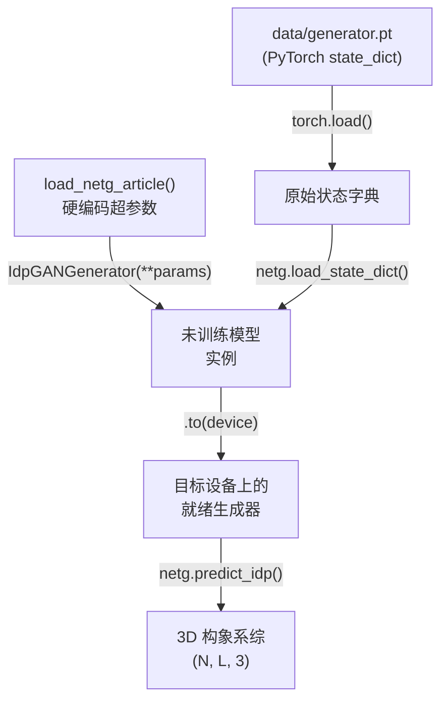

---
slug:14-cg-model-generator-weights
blog_type:normal
---


`generator.pt` 文件是 idpGAN 生成器网络 CG（粗粒度）模型变体的**预训练 PyTorch 状态字典**。这些权重编码了在使用基于 CG 的蛋白质模型对天然无序蛋白进行分子动力学模拟的训练中学习到的所有参数，它们与 idpGAN 文章中报告的 *IDP_test* 结果所使用的权重完全相同。将这些权重加载到 `IdpGANGenerator` 实例中，可以将未训练的架构转变为功能完整的构象系综生成器，能够按需为无序蛋白质序列生成 3D 结构。

来源: [README.md](/README.md#L34-L42), [nn_models.py](/idpgan/nn_models.py#L432-L450)

## 文件位置与格式

该权重文件位于仓库根目录的 `data/generator.pt`。它是通过 `torch.save()` 序列化的标准 PyTorch `state_dict`，包含了 `IdpGANGenerator` 架构中每一层的学习参数——包括潜空间嵌入 MLP、位置嵌入表、氨基酸嵌入表、八个 Transformer 块（每个块均包含自定义注意力层、前馈更新器和层归一化），以及 3D 坐标输出 MLP。该文件使用 `torch.load()` 加载，并通过 `netg.load_state_dict()` 注入到全新构建的模型中。

| 属性 | 值 |
|---|---|
| **文件路径** | `data/generator.pt` |
| **格式** | PyTorch `state_dict` (`.pt`) |
| **加载机制** | `torch.load()` → `model.load_state_dict()` |
| **兼容类** | `IdpGANGenerator` |
| **加载函数** | `load_netg_article()` |
| **训练领域** | 基于 CG 的蛋白质模型 MD 模拟 |
| **训练序列** | DisProt 派生（参见 `data/idpgan_training_set.fasta`） |

来源: [nn_models.py](/idpgan/nn_models.py#L432-L450), [README.md](/README.md#L34-L42)

## 权重加载的架构参数

这些权重是**架构特定**的——它们只能加载到使用训练时完全一致的超参数构建的 `IdpGANGenerator` 实例中。`load_netg_article()` 函数通过在加载状态字典之前使用正确的配置实例化模型，封装了这一要求。这意味着你**绝不能**手动构建 `IdpGANGenerator` 并尝试将 `generator.pt` 加载到其中，除非你完全匹配每一个参数。

定义兼容架构的完整超参数集为：

| 参数 | 值 | 作用 |
|---|---|---|
| `nz` | 16 | 每个残基的潜空间噪声维度 |
| `embed_dim` | 64 | 网络中的主要嵌入维度 |
| `d_model` | 128 | 多头注意力的内部维度 |
| `nhead` | 8 | 注意力头数 |
| `dim_feedforward` | 128 | 更新器模块中的前馈隐藏维度 |
| `dropout` | 0.0 | 不应用 dropout（确定性推理） |
| `num_layers` | 8 | `IdpGANBlock` Transformer 层数 |
| `layer_norm_eps` | 1e-05 | 层归一化 epsilon |
| `norm_pos` | `"post"` | 后归一化 Transformer 架构 |
| `dp_attn_norm` | `"d_model"` | 由 √d_model 缩放的点积注意力 |
| `n_hl_out` | 1 | 3D 输出 MLP 中的隐藏层数 |
| `n_hl_embed` | 1 | 潜空间嵌入 MLP 中的隐藏层数 |
| `activation` | `"lrelu"` | 全部使用 LeakyReLU 激活函数 |
| `use_embed_repeat` | `True` | 将 1D/2D 嵌入输入到每一个 Transformer 层 |
| `embed_dim_1d` | 32 | 氨基酸独热嵌入维度 |
| `pos_embed_dim` | 64 | 成对位置嵌入维度 |
| `use_bias_2d` | `True` | 2D MLP 分支中的偏置项 |
| `pos_embed_max_l` | 24 | 成对嵌入的最大位置位移 |

来源: [nn_models.py](/idpgan/nn_models.py#L432-L450)

## 权重加载流程

下图说明了从文件路径到可用生成器的完整过程：



`load_netg_article()` 函数通过单次调用即可处理整个流程。它接受两个参数：`model_fp`（`generator.pt` 的路径）和 `device`（PyTorch 设备字符串，默认为 `"cpu"`）。如果 `model_fp` 为 `None`，该函数将返回一个具有正确架构的未训练模型——这对于实验或从头开始重新训练非常有用。

来源: [nn_models.py](/idpgan/nn_models.py#L432-L450)

## 权重编码的内容

`IdpGANGenerator` 架构中的每个组件都有存储在权重文件中的学习参数。了解每个组件的功能，可以阐明预训练权重从 CG 模拟训练数据中捕获了哪些信息：

- **`embed_pos`** — 形状为 `(49, 64)` 的嵌入表，将分箱的成对位置位移（从 -24 到 +24 个残基）映射到 64 维空间。这些权重编码了不同序列间隔下残基对之间学习到的**空间关系模式**。
- **`embed_x`** — 一个两层 MLP（`Linear(16→64)` → `LeakyReLU` → `Linear(64→64)`），将每个残基的 16 维潜空间噪声投影到主要的 64 维嵌入空间。这些权重学习了如何**将随机噪声解码为有意义的结构变异**。
- **`embed_aa`** — 形状为 `(20, 32)` 的嵌入表，将 20 种氨基酸类型分别映射为 32 维的条件特征。这些权重编码了从训练系综中学习到的**氨基酸特异性结构倾向**。
- **`transformer`** — 八个 `IdpGANBlock` 层，每层包含一个带有 2D 位置偏置的自定义注意力机制和一个前馈更新器。这是模型的核心——这些权重编码了跨越八个层在多个抽象级别上的**残基间结构耦合**。
- **`mlp_3d`** — 一个两层 MLP（`Linear(64→64)` → `LeakyReLU` → `Linear(64→3)`），将最终的逐残基嵌入投影到 3D 笛卡尔坐标。这些权重学习了**从抽象表示到物理空间的最终映射**。

来源: [nn_models.py](/idpgan/nn_models.py#L231-L376)

## 与训练数据和验证的关系

`generator.pt` 权重是在来自 COCOMO 粗粒度模型的基于 CG 的 MD 模拟数据上训练的。训练集序列存储在 `data/idpgan_training_set.fasta` 中（源自 [DisProt](https://disprot.org)），训练期间使用的五个验证分区记录在 `data/hbval_split_0.txt` 到 `data/hbval_split_4.txt` 中。这些权重在最终确定之前已针对这些分区（*HB_val* 集）进行了验证。

<CgxTip>在将 `generator.pt` 用于研究时，请注意测试集序列（`data/idptest.fasta`）已**被排除在训练之外**。为出现在训练集中的序列生成构象可能会产生与参考数据具有欺骗性高度一致的结果——始终在留出的序列上进行验证以获取有意义的基准测试。</CgxTip>

来源: [README.md](/README.md#L34-L52), [idpgan_training_set.fasta](/data/idpgan_training_set.fasta#L1-L10)

## 与 ABSINTH 变体的区别

该仓库提供了两种不同的预训练生成器变体。CG 模型权重（`generator.pt`）和 ABSINTH 模型权重（`abs_generator.pt`）**不可互换**——它们在架构超参数上存在差异（`norm_pos="post"` 对比 `"pre"`，`dropout=0.0` 对比 `None`，`pos_embed_max_l=24` 对比 `32`），并且是在根本不同的模拟数据上训练的。ABSINTH 变体还需要一个镜像选择器网络（`abs_selector.pt`），并通过 `load_abs_netg_article()` 加载。有关 ABSINTH 变体的完整详细信息，请参见 [ABSINTH 模型变体](15-absinth-model-variant)。

| 方面 | CG 模型 (`generator.pt`) | ABSINTH 模型 (`abs_generator.pt`) |
|---|---|---|
| 加载函数 | `load_netg_article()` | `load_abs_netg_article()` |
| 归一化位置 | `"post"` | `"pre"` |
| Dropout | `0.0` | `None` |
| 位置最大长度 | 24 | 32 |
| 镜像选择器 | 不需要 | 必需 (`abs_selector.pt`) |
| 训练模拟 | 基于 CG (COCOMO) | ABSINTH 隐式溶剂 |

来源: [nn_models.py](/idpgan/nn_models.py#L432-L450), [nn_models.py](/idpgan/nn_models.py#L615-L653), [README.md](/README.md#L34-L56)

## 使用示例

加载 CG 模型生成器权重并生成构象遵循以下模式：

```python
import os
import torch
from idpgan.nn_models import load_netg_article

# 选择计算设备。
device = torch.device("cuda" if torch.cuda.is_available() else "cpu")

# 加载带有 CG 模型权重的预训练生成器。
netg = load_netg_article(
    model_fp=os.path.join("data", "generator.pt"),
    device=device
)

# 为蛋白质序列生成构象系综。
aa_seq = "CDAAVDTSSEITTKDLKEKKEVVEEAENGRDAPANGNANEENGEQEADNEVDEEC"
n_samples = 10000

xyz_ensemble = netg.predict_idp(
    n_samples=n_samples,
    aa_seq=aa_seq,
    device=device
).cpu().numpy()

# xyz_ensemble 的形状为 (n_samples, len(aa_seq), 3)
```

`predict_idp()` 方法在内部构建了形状为 `(N, 16, L)` 的随机潜空间张量和形状为 `(N, 20, L)` 的氨基酸独热张量，并通过加载的模型运行批量推理以生成 `(N, L, 3)` 的坐标输出。

来源: [nn_models.py](/idpgan/nn_models.py#L380-L410), [idpgan_experiments.ipynb](/notebooks/idpgan_experiments.ipynb#L200-L350)

## 下一步

现在你已经了解了 CG 模型生成器权重及其加载方式，可以探索相关主题：

- **[ABSINTH 模型变体](15-absinth-model-variant)** — 在 ABSINTH 隐式溶剂模拟上训练的替代预训练模型变体及其镜像选择器网络。
- **[Transformer 生成器网络](5-transformer-generator-network)** — 深入探讨 `IdpGANGenerator` 架构、其自定义注意力机制以及前向传播计算。
- **[生成器推理管道](17-generator-inference-pipeline)** — 从氨基酸序列到 3D 构象系综的推理过程端到端演练。
- **[训练与测试数据集](16-training-and-test-datasets)** — 有关 DisProt 派生的训练序列和用于验证这些权重的留出测试集的详细信息。