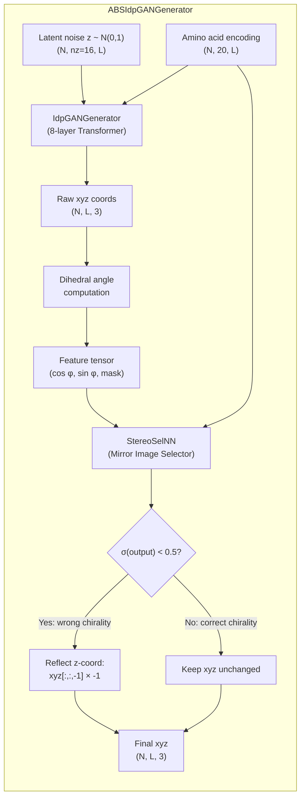

---
slug:15-absinth-model-variant
blog_type:normal
---


**ABSINTH 模型变体**（简称为 **abs-idpGAN**）是一种专门的 idpGAN 生成器，它在使用 [ABSINTH 隐式溶剂模型](https://pubmed.ncbi.nlm.nih.gov/18506808/) 执行的全原子分子动力学模拟中提取的 Cα 轨迹上进行训练。与默认的基于 CG 的 idpGAN（cg-idpGAN）在残基级别的粗粒度表示上运作不同，abs-idpGAN 捕获了源自全原子相互作用势的更高分辨率的构象统计信息——包括不对称的二面角分布和更复杂的接触模式。该模型被实现为 `ABSIdpGANGenerator` 类，它将标准的 `IdpGANGenerator` 与 `StereoSelNN` 镜像选择器网络组合在一起，以解决 Cα 轨迹表示中固有的手性歧义问题。

来源: [nn_models.py](/idpgan/nn_models.py#L557-L654), [README.md](/README.md#L43-L56)

## 架构组合

abs-idpGAN 变体在两个基本方面与 CG 模型的架构不同：**(1)** 生成器网络使用了一组不同的超参数（pre-norm LayerNorm、无 dropout、扩展的位置嵌入范围），以及 **(2)** 一个额外的神经网络后处理步骤校正了每个生成构象的镜像手性。这个两阶段的流水线在 `ABSIdpGANGenerator` 类中表达，它将两个子网络封装到一个单一的推理接口中。



生成器首先生成原始的 Cα 坐标。然后这些坐标被转换为二面角特征（余弦、正弦和有效性掩码），这些特征与氨基酸序列一起被馈送到选择器网络中。选择器输出每个构象的概率；被预测为具有错误镜像的构象（σ < 0.5）将其 z 坐标取反以恢复正确的手性。

来源: [nn_models.py](/idpgan/nn_models.py#L557-L598)

## 超参数比较：CG vs. ABSINTH 生成器

下表对比了每个模型变体使用的两个 `IdpGANGenerator` 实例的架构超参数。两者共享相同的核心拓扑结构（8 个 Transformer 层、8 个注意力头、128 维模型），但在归一化策略、dropout 和位置嵌入范围上有所不同。

| 超参数 | CG 模型 (`load_netg_article`) | ABSINTH 模型 (`load_abs_netg_article`) | 原理 |
|---|---|---|---|
| `norm_pos` | `"post"` | `"pre"` | Pre-norm 稳定了源自全原子分布的训练 |
| `dropout` | `0.0` | `None` | ABSINTH 变体完全禁用 dropout（不创建 `nn.Dropout` 模块） |
| `pos_embed_max_l` | `24` | `32` | 扩展的范围适应了 Cα 轨迹更长的相对位置分箱 |
| 所有其他共享参数 | — | — | `nz=16, embed_dim=64, d_model=128, nhead=8, dim_feedforward=128, num_layers=8, layer_norm_eps=1e-5, dp_attn_norm="d_model", n_hl_out=1, n_hl_embed=1, activation="lrelu", use_embed_repeat=True, embed_dim_1d=32, pos_embed_dim=64, use_bias_2d=True` |

来源: [nn_models.py](/idpgan/nn_models.py#L478-L496), [nn_models.py](/idpgan/nn_models.py#L614-L628)

## 镜像选择器网络

`StereoSelNN` 是一个基于 Transformer 的二分类器，用于确定生成的 Cα 构象是正确还是错误的旋向。由于 Cα 轨迹与其镜像产生相同的距离矩阵，但二面角序列不同，因此仅靠生成器无法区分这两个对映异构体。选择器解决了这一歧义。

选择器的输入是维度为 3 的逐残基特征向量，由生成构象的二面角构建而成：

- **特征 0**：cos(φᵢ) — 残基 *i* 处二面角的余弦值
- **特征 1**：sin(φᵢ) — 残基 *i* 处二面角的正弦值
- **特征 2**：mask — 有效性掩码（对于二面角未定义的第一个残基和最后两个残基为 0，其余为 1）

选择器的架构与生成器的 Transformer 结构相呼应，但最终汇聚为在序列维度上求和的全局池化表示，随后是一个带有 sigmoid 输出的 MLP，为每个构象产生一个单一的概率值。

| 选择器超参数 | 值 |
|---|---|
| `in_dim` | 3 (cos φ, sin φ, mask) |
| `embed_dim` | 96 |
| `d_model` | 128 |
| `nhead` | 8 |
| `dim_feedforward` | 256 |
| `dropout` | 0.0 |
| `num_layers` | 8 |
| `norm_pos` | `"pre"` |
| `n_hl_out` | 1 |
| `pos_embed_max_l` | 32 |
| `embed_dim_1d` | 32 |
| `pos_embed_dim` | 64 |

<CgxTip>选择器更宽的 `embed_dim`（96 vs. 64）和 `dim_feedforward`（256 vs. 128）赋予了它更大的容量，以学习二面角空间中细微的手性区分模式——这些模式在全原子蛋白质表示中通常是不对称的。</CgxTip>

来源: [nn_models.py](/idpgan/nn_models.py#L499-L560), [nn_models.py](/idpgan/nn_models.py#L629-L641)

## 预训练权重文件

abs-idpGAN 变体需要两个单独的权重文件，均位于 `data/` 目录下：

| 文件 | 用途 | 大小 | 加载方 |
|---|---|---|---|
| `abs_generator.pt` | 生成器网络权重 (IdpGANGenerator) | ~2.1 MB | `load_abs_netg_article(model_fp=...)` 的第一个参数 |
| `abs_selector.pt` | 镜像选择器权重 (StereoSelNN) | ~2.8 MB | `load_abs_netg_article(sel_model_fp=...)` 的第二个参数 |

`load_abs_netg_article` 函数自动处理设备映射：当 `device="cpu"` 时，它应用 `map_location=torch.device('cpu')` 以确保权重在仅 CPU 的系统上正确加载。当指定非 CPU 设备时，权重被直接加载并将模型移动到目标设备。

来源: [nn_models.py](/idpgan/nn_models.py#L612-L654)

## 训练数据和序列长度限制

abs-idpGAN 模型是在来自全原子 ABSINTH 模拟的 Cα 轨迹上训练的，序列**长度 ≤ 40 个残基**。ABSINTH 隐式溶剂模型已被证明能够[高精度地重现几种 IDP 的实验行为](https://pubmed.ncbi.nlm.nih.gov/20404210/)。训练序列存储在 `data/idpgan_training_set.fasta` 中，15 序列的测试集位于 `data/abstest.fasta`。

<CgxTip>为显著短于 20 或长于 40 个残基的多肽生成构象可能会产生不可靠的结果，因为模型在该范围之外的训练数据有限。请坚持在 20–40 个残基的窗口内生成有意义的构象系综。</CgxTip>

测试集 (`abstest.fasta`) 包含 15 条最初使用 ABSINTH 势能模拟的序列，包括天然 IDP 序列和合成多精氨酸肽：

| 序列 ID | 长度 | 类型 |
|---|---|---|
| P02338_0 | 29 | 组蛋白片段 |
| Q2KXY0 | 33 | IDP 区域 |
| P02338_1 | 33 | 扩展组蛋白 |
| Q9EP54 | 27 | IDP 区域 |
| P27205 | 31 | RS 重复区域 |
| P35422 | 34 | RS 重复区域 |
| Q91185 | 32 | 富精氨酸 |
| P02321_0 / P02321_1 | 34 | 富精氨酸 |
| Q9PS27 / P08130 | 34 | 富精氨酸变体 |
| P25327 | 34 | 富精氨酸变体 |
| P69006 | 28 | 富精氨酸 |
| P83215 | 26 | 富精氨酸 |
| synthetic | 36 | 多精氨酸 (R₃₆) |

来源: [abstest.fasta](/data/abstest.fasta#L1-L45), [README.md](/README.md#L43-L56)

## 推理流水线：ABSIdpGANGenerator.predict_idp

`ABSIdpGANGenerator` 上的 `predict_idp` 方法编排了两阶段的生成与校正流水线。与 CG 生成器的 `predict_idp` 不同，它**不**接受 `get_a` 参数——氨基酸编码总是在内部为选择器步骤返回。

```python
# 加载 abs-idpGAN 模型
abs_netg = load_abs_netg_article(
    model_fp="data/abs_generator.pt",
    sel_model_fp="data/abs_selector.pt",
    device=device
)

# 生成构象系综
xyz = abs_netg.predict_idp(
    n_samples=5000,
    aa_seq="MACYPVNIRARGLGKNMGMKSRGRGKG",
    device=device,
    batch_size=32
).cpu().numpy()  # 形状: (5000, 27, 3)
```

在内部，流水线按如下步骤进行：(1) 内部 `IdpGANGenerator.predict_idp` 生成原始坐标并返回 xyz 和氨基酸编码；(2) 通过 `torch_chain_dihedrals` 计算二面角并在边界处用零填充；(3) 组装 cos/sin 特征和有效性掩码；(4) `StereoSelNN` 对每个构象进行分类；(5) 选择器输出 < 0.5 的构象将其 z 坐标轴取反。选择器推理本身是分批进行的，以控制内存使用。

来源: [nn_models.py](/idpgan/nn_models.py#L557-L598), [coords.py](/idpgan/coords.py#L1-L19)

## 模型加载与设备兼容性

`load_abs_netg_article` 函数使用论文中指定的超参数实例化两个子网络，从磁盘加载权重，并将组合模型移动到目标设备。一个关键的实现细节是 CPU 与非 CPU 设备的权重加载逻辑存在分歧：

```python
if device != "cpu":
    netg.load_state_dict(torch.load(model_fp))
else:
    netg.load_state_dict(
        torch.load(model_fp, map_location=torch.device('cpu')))
```

此模式应用于生成器和选择器**两者**。它确保了在 GPU 上保存的模型可以在仅 CPU 的机器上无错误地加载。CG 模型的 `load_netg_article` 中不存在相同的 `map_location` 防护，它使用更简单的 `torch.load(model_fp)` 调用——这意味着 ABSINTH 加载器对于跨设备部署更加稳健。

来源: [nn_models.py](/idpgan/nn_models.py#L612-L654)

## 构象特征与 CG 模型的对比

当比较相同多肽序列的 abs-idpGAN 和 cg-idpGAN 构象系综时，会出现三个特征差异：

| 属性 | cg-idpGAN | abs-idpGAN | 物理起源 |
|---|---|---|---|
| **接触图复杂性** | 更简单，更均匀 | 更结构化，残基特异性模式 | 全原子 ABSINTH 捕获了残基级别 CG 中缺失的由侧链介导的接触 |
| **二面角分布** | 大约关于 0 对称 | 不对称（类 Ramachandran 偏置） | 源自全原子模拟的 Cα 轨迹继承了主链扭转偏好 |
| **回转半径** | 更宽，较少约束 | 更窄，更结构化 | 更高分辨率的势能更精确地约束了构象空间 |

不对称的二面角分布是全原子蛋白质表示的标志，并且在[文献中有详尽记载](https://arxiv.org/abs/2105.04771)。它存在于 abs-idpGAN 的输出中但不存在于 cg-idpGAN 的输出中，这直接反映了训练数据来源的保真度。

来源: [idpgan_experiments.ipynb](/notebooks/idpgan_experiments.ipynb#L1099-L1200)

## 后续步骤

- 有关 CG 模型的生成器权重和加载过程，请参阅 [CG 模型生成器权重](14-cg-model-generator-weights)
- 有关驱动生成的完整推理流水线，请参阅 [生成器推理流水线](17-generator-inference-pipeline)
- 有关镜像选择器的架构细节，请参阅 [镜像选择器网络](7-mirror-image-selector-network)
- 有关训练和测试数据集的文档，请参阅 [训练和测试数据集](16-training-and-test-datasets)