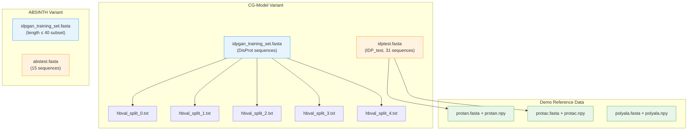

---
slug:16-training-and-test-datasets
blog_type:normal
---


idpGAN 提供了两种不同的模型变体——每种变体均在不同的粗粒化（CG）模拟后端上进行训练——因此为每种变体维护了**独立的训练和测试数据集**。CG 模型变体基于来自 [COCOMO 蛋白质模型](https://www.biorxiv.org/content/10.1101/2022.08.19.504518v1) 的分子动力学（MD）轨迹进行训练，而 ABSINTH 变体则基于使用 [ABSINTH 隐式溶剂模型](https://pubmed.ncbi.nlm.nih.gov/18506808/) 的全原子模拟的 Cα 轨迹进行训练。所有序列数据均以标准 **FASTA 格式** 存储，仓库还包含以 NumPy 数组格式预计算的 MD 参考轨迹，用于基准测试。理解这些数据集的组成与结构，对于解释模型性能以及在你希望重新训练 idpGAN 时准备自定义训练数据至关重要。
来源: [README.md](/README.md#L35-L53), [data.py](/idpgan/data.py#L1-L18)

## 数据集架构概览

下图展示了仓库中训练集、验证划分、测试集与演示参考数据之间的关系：



CG 模型变体与 ABSINTH 变体**共用**同一个 `idpgan_training_set.fasta` 文件，但 ABSINTH 模型仅使用长度 ≤ 40 个残基的序列子集。这一设计反映了底层模拟在计算规模上的差异——ABSINTH 全原子模拟在每个残基上的计算成本更高，因此训练被限制在较短的肽段上。
来源: [README.md](/README.md#L35-L53)

## CG 模型训练集

主训练集存储在 [`idpgan_training_set.fasta`](/data/idpgan_training_set.fasta) 中，这是一个包含源自 [DisProt 数据库](https://disprot.org) 的 **2,471 条内在无序蛋白质序列**的多条目 FASTA 文件。每个条目遵循 `>DPxxxxxrnnn` 的命名约定，其中 `xxxxx` 为 DisProt 标识符，`nnn` 为区域索引。序列的长度和氨基酸组成差异很大，涵盖从短无序肽段（约 20 个残基）到更长无序区域（150 个以上残基）的范围。

```
>DP01603r002
AAAAANELNNNLPGGAPAAP
>DP01654r003
ALRAPRKKIHRRVLKKNPLK
>DP02879r003
DAGFMKQYGECLGDINARDL
```

这些源自 DisProt 的序列捕获了天然 IDP 序列的完全多样性——富含带电和极性残基，缺乏疏水性残基——从而确保生成器能学习到真实的序列-结构关系，而非仅仅记住狭隘的分布。
来源: [idpgan_training_set.fasta](/data/idpgan_training_set.fasta#L1-L80)

## 五折验证划分 (HB_val)

五个文件 `hbval_split_0.txt` 至 `hbval_split_4.txt` 实现了 idpGAN 论文中使用的 **HB_val** 交叉验证方案。每个文件包含 **241–242 个序列标识符**（每行一个），命名了构成 5 折划分中某一折的训练集序列子集。这些划分使得严格评估成为可能：对于每一折，列在 `hbval_split_k.txt` 中的序列会从训练中保留出来，而剩余的四折加上不在任何划分中的所有序列则作为该轮的训练数据。

| 文件 | 条目数 | 作用 |
|---|---|---|
| `hbval_split_0.txt` | 242 | 第 0 折保留标识符 |
| `hbval_split_1.txt` | 241 | 第 1 折保留标识符 |
| `hbval_split_2.txt` | 241 | 第 2 折保留标识符 |
| `hbval_split_3.txt` | 241 | 第 3 折保留标识符 |
| `hbval_split_4.txt` | 241 | 第 4 折保留标识符 |

每行包含一个 DisProt 区域标识符（例如 `DP00806r001`），可与 `idpgan_training_set.fasta` 中的头部信息交叉引用。这五个折是**互不相交的**——没有任何序列出现在多个划分中——从而确保了统计上独立的验证估计。
来源: [hbval_split_0.txt](/data/hbval_split_0.txt#L1-L30), [README.md](/README.md#L39-L39)

## CG 模型测试集 (IDP_test)

文件 [`idptest.fasta`](/data/idptest.fasta) 定义了 **IDP_test**，即 CG 模型变体的主要保留测试集。它包含 **31 条序列**，涵盖了广泛的 IDP 行为——从短的带电肽段（例如 25 个残基的 `his5`，40 个残基的 `n49`）到较大的无序结构域（例如 97 个残基的 `r15`，124 个残基的 `rnasea`）。该测试集包括天然无序蛋白质和经过充分研究的模型系统：

| 蛋白质 | 长度 | 描述 |
|---|---|---|
| `his5` | 25 | 组蛋白 H5 尾肽段 |
| `ak37` | 37 | (AK) 重复肽段 |
| `n49` | 40 | Ash1 N 端无序区域 |
| `drk_sh3` | 59 | drkN SH3 结构域解折叠态 |
| `sic1` | 94 | Sic1 内在无序蛋白质 |
| `p53` | 93 | p53 反式激活结构域 |
| `asynuclein` | 140 | α-突触核蛋白 |
| `htau23k17` | 130 | Tau 蛋白片段 |
| `snase` | 149 | 葡萄球菌核酸酶（解折叠态） |
| `rnasea` | 124 | 核糖核酸酶 A（解折叠态） |
| `ubiquitin` | 76 | 泛素（解折叠态） |

IDP_test 中的所有序列均未出现在训练集中，这确保了对生成器**泛化**至未知 IDP 序列的能力进行无偏评估。
来源: [idptest.fasta](/data/idptest.fasta#L1-L94)

## ABSINTH 模型测试集

ABSINTH 模型变体在 [`abstest.fasta`](/data/abstest.fasta) 上进行评估，该文件包含 **15 条肽段序列**，这些序列最初在 [Mao 等人，2010](https://pubmed.ncbi.nlm.nih.gov/20404210/) 中使用 ABSINTH 势能进行模拟。这些序列明显**更短且富含电荷**，相较于 CG 模型测试集，这反映了 ABSINTH 模型侧重于静电和溶剂化效应主导构象行为的肽段：

```
>P02338_0
MRSFDQGSTRAPARERCRRQRPEGRSAQR

>Q2KXY0
MFDNASTRNNKRERGKRQGKQTRTQRHADRSQT

>synthetic
RRRRRRRRRRRRRRRRRRRRRRRRRRRRRRRRRR
```

该集合包含天然序列（头部信息中带有 UniProt/PDB 标识符）以及一条**合成的多聚精氨酸**对照序列，后者作为边界情况，用于测试模型处理极端电荷密度的能力。
来源: [abstest.fasta](/data/abstest.fasta#L1-L45), [README.md](/README.md#L48-L52)

## 演示参考轨迹

仓库包含三个**预计算的 MD 参考轨迹**，用于将生成的系综与真实模拟数据进行基准对比。它们以 NumPy `.npy` 数组的形式存储，形状为 `(N, L, 3)`，其中 `N` 为 MD 快照数量，`L` 为残基数量，最后一个轴存储以**纳米**为单位的 xyz 坐标。每个数组包含来自 **5 × 1000 ns** CG MD 模拟的快照：

| 文件 | 序列来源 | 残基数 | 内容 |
|---|---|---|---|
| `protan.npy` | `protan.fasta` | 55 | `protan`（测试集蛋白质，净电荷为负）的 MD 系综 |
| `protac.npy` | `protac.fasta` | 55 | `protac`（测试集蛋白质，净电荷为正）的 MD 系综 |
| `polyala.npy` | `polyala.fasta` | 55 | 多聚丙氨酸（随机卷曲参考）的 MD 系综 |

对应的 FASTA 文件包含单条目序列，由 [`parse_fasta_seq()`](/idpgan/data.py#L4-L18) 解析。`protan` 和 `protac` 均为 IDP_test 的成员——它们**未在训练期间见过**——这使得它们成为有效的基准。多聚丙氨酸分子（`polyala_55`，一种由丙氨酸组成的 55 残基同聚物）作为**零模型**：在 CG MD 模拟中，它表现为无特征的随机线性聚合物，提供了一条基线，以验证 idpGAN 能够捕获超越通用链统计特性的 IDP 特异性构象偏好。
来源: [idpgan_experiments.ipynb](/notebooks/idpgan_experiments.ipynb#L226-L266), [data.py](/idpgan/data.py#L4-L18), [README.md](/README.md#L42-L45)

<CgxTip>`.npy` 参考轨迹可直接使用 `np.load()` 加载，并使用 `idpgan.evaluation` 中的评估指标与 idpGAN 生成的坐标进行对比。为了在公平对比时从 MD 参考中采样，请使用 `idpgan.data` 中的 `random_sample_trajectory()` 抽取与生成系综大小相同的随机子集。</CgxTip>

## COCOMO 训练数据示例

文件 [`cocomo_training_data_example.md`](/data/cocomo_training_data_example.md) 指向一个**外部可下载归档**，其中包含 10 个内在无序区域的示例 COCOMO MD 轨迹。该归档（可作为 [GitHub Release 附件](https://github.com/feiglab/idpgan/releases/download/data_example/cocomo_training_example.zip) 获取）代表了完整基于 COCOMO 训练数据的一小部分子集，旨在说明用于训练 idpGAN CG 模型变体的 MD 轨迹文件的格式与结构。
来源: [cocomo_training_data_example.md](/data/cocomo_training_data_example.md#L1-L2)

## FASTA 解析接口

`data/` 目录中的所有序列文件均通过 [`parse_fasta_seq()`](/idpgan/data.py#L4-L18) 函数读取，该函数接受文件路径并返回单个氨基酸序列字符串。该函数会验证文件是否**仅包含一个 FASTA 条目**——对空文件或多条目文件抛出 `ValueError`——这使其适用于读取单序列演示文件（`protan.fasta`、`protac.fasta`、`polyala.fasta`）。多条目的训练和测试 FASTA 文件（`idpgan_training_set.fasta`、`idptest.fasta`、`abstest.fasta`）必须在外部进行迭代，因为 `parse_fasta_seq()` 强制执行单条目约束。

```python
from idpgan.data import parse_fasta_seq

# Read a single-entry FASTA file
seq = parse_fasta_seq("data/protan.fasta")  # "CDAAVDTSSEITTKDLKEKKEVVEEAENGRDAPANGNANEENGEQEADNEVDEEC"
```
来源: [data.py](/idpgan/data.py#L4-L18)

## 完整数据文件清单

下表提供了仓库中每个数据文件的完整清单，按作用分类：

| 文件 | 格式 | 条目数 | 模型变体 | 作用 |
|---|---|---|---|---|
| `idpgan_training_set.fasta` | FASTA | 2,471 | CG + ABSINTH | 训练序列 (DisProt) |
| `hbval_split_0.txt`–`hbval_split_4.txt` | 文本 | 各 241–242 | CG | 5 折 HB_val 划分标识符 |
| `idptest.fasta` | FASTA | 31 | CG | IDP_test 保留测试集 |
| `abstest.fasta` | FASTA | 15 | ABSINTH | ABSINTH 测试集 (Mao 等人) |
| `protan.fasta` / `protan.npy` | FASTA / NumPy | 1 | CG | 演示：带负电 IDP + MD 参考 |
| `protac.fasta` / `protac.npy` | FASTA / NumPy | 1 | CG | 演示：带正电 IDP + MD 参考 |
| `polyala.fasta` / `polyala.npy` | FASTA / NumPy | 1 | CG | 演示：多聚丙氨酸随机卷曲 + MD 参考 |
| `cocomo_training_data_example.md` | Markdown | — | CG | 示例 COCOMO 训练轨迹链接 |
来源: [README.md](/README.md#L35-L53), [idpgan_training_set.fasta](/data/idpgan_training_set.fasta#L4937-L4942)

<CgxTip>训练 FASTA 头部信息使用 `DPxxxxxrnnn` 命名约定，其中 `xxxxx` 映射到 DisProt 条目，`nnn` 索引该条目内的无序区域。hbval 划分文件引用了这些相同的标识符，因此你可以通过读取划分文件并筛选 FASTA 头部信息，以编程方式划分训练集。</CgxTip>

## 接下来前往何处

在理解数据集的基础上，接下来的合理步骤是探索基于这些数据集训练的预训练模型权重，或了解生成器推理管道在运行时如何使用这些序列：

- **[CG 模型生成器权重](14-cg-model-generator-weights)** — CG 模型生成器检查点的架构与加载
- **[ABSINTH 模型变体](15-absinth-model-variant)** — 基于 ABSINTH 训练的生成器与选择器检查点的架构与加载
- **[生成器推理管道](17-generator-inference-pipeline)** — 从 FASTA 序列到 3D 构象系综的端到端流程