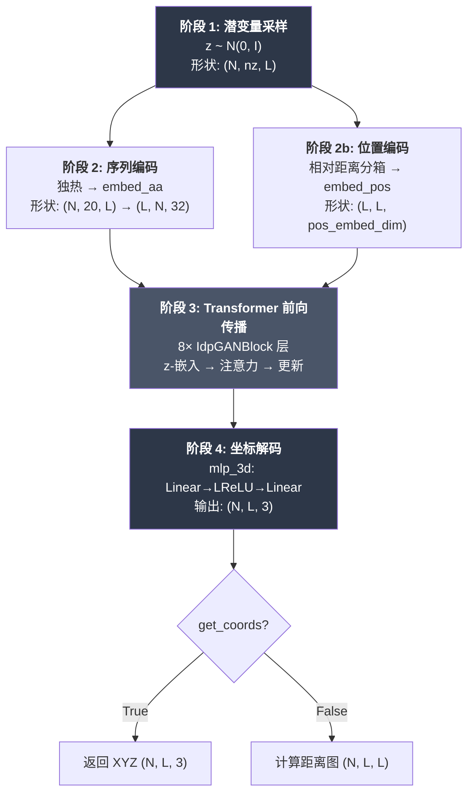
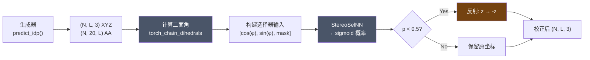

---
slug:17-generator-inference-pipeline
blog_type:normal
---


**生成器推理管线**是一个端到端的执行路径，它将潜噪声向量和氨基酸序列转换为完整的 3D 粗粒化蛋白质结构构象系综。它是 idpGAN 面向用户的主要接口——所有下游分析（距离图、接触图、回转半径、KL 散度评分）都依赖于它生成的坐标。该管线有两个变体：一个 **CG 模型变体**（`IdpGANGenerator.predict_idp`），直接输出 XYZ 坐标；以及一个 **ABSINTH 变体**（`ABSIdpGANGenerator.predict_idp`），通过镜像选择器网络对这些坐标进行后处理，以强制执行正确的手性。

## 管线架构

推理管线是一个四阶段的确定性变换，带有一个随机输入。理解数据在这些阶段中的流向，对于自定义系综生成、调试输出质量以及将模型扩展到新的用例至关重要。



该管线由 `predict_idp` 方法编排，它处理潜变量采样、序列编码、在 `torch.no_grad()` 下的分批前向传播以及坐标聚合——所有这些都在单次调用中完成。

来源: [nn_models.py](/idpgan/nn_models.py#L380-L410), [nn_models.py](/idpgan/nn_models.py#L310-L370)

## 阶段 1 — 潜噪声采样

生成器的随机输入是从标准正态分布中提取的高斯噪声张量 **z**。系综中的每个构象都由一个独特的噪声向量产生，这使得潜空间成为结构多样性的唯一来源。

```python
z = torch.randn(n_samples, self.nz, len(aa_seq), device=device)
```

张量形状为 `(N, nz, L)`，其中 **N** 是要生成的构象数量，**nz** 是潜维度（对于两个预训练变体均固定为 **16**），**L** 是序列长度。潜码是按残基分配的——每个残基位置接收其自身的 `nz` 维噪声向量，这允许模型独立调节局部结构特征，同时 Transformer 层通过注意力机制协调全局构象。这种设计在架构上具有重要意义：与单一的全局潜向量（常见于 VAE/GAN 图像生成）不同，按残基分配的潜变量允许模型编码位置特异性的结构异质性，这对于捕获本质无序区域的局部灵活性至关重要。

<CgxTip>相对于嵌入维度（`embed_dim=64`），`nz=16` 的潜维度被刻意设置得较小。这形成了一个信息瓶颈，迫使 Transformer 层承担空间协调的主要工作，防止潜变量记忆构象并促进对未见序列的泛化。</CgxTip>

来源: [nn_models.py](/idpgan/nn_models.py#L391-L392)

## 阶段 2 — 序列和位置编码

### 氨基酸独热编码

氨基酸序列通过 `get_features_from_seq` 转换为独热表示，该函数将每个残基字符映射到 20 元素字母表 `QWERTYIPASDFGHKLCVNM` 中的一个位置。生成的 `(20, L)` 数组在批次维度上广播为 `(N, 20, L)`。在 `forward` 内部，从独热张量中提取 argmax 索引后，将其传入 `embed_aa`（一个 `nn.Embedding(20, 32)` 层），生成一个 `(L, N, 32)` 嵌入，作为馈入每个 Transformer 块的 1D 条件信号 **x**。

`aa_list` 中的 20 个氨基酸遵循非标准排序（`QWERTYIPASDFGHKLCVNM`），而非传统的字母顺序或生物物理分组。这种排序在训练和推理之间保持一致，因此无需重映射——但使用不同字母表顺序训练的自定义模型则需要重新对齐。

来源: [nn_models.py](/idpgan/nn_models.py#L413-L429), [nn_models.py](/idpgan/nn_models.py#L340-L341)

### 相对位置嵌入 (2D)

位置编码捕获序列中每对残基之间的**相对距离**。计算一个成对距离矩阵 `p[i,j] = i - j`，然后通过 `torch.argmin` 针对等间距的分箱中心，将其离散化为 `2 * pe_max_l + 1` 个跨越 `[-pe_max_l, +pe_max_l]` 的分箱。该分箱索引张量通过 `embed_pos`（一个 `nn.Embedding` 层），生成一个 `(L, L, pos_embed_dim)` 的 2D 嵌入，并在批次中广播为 `(N, L, L, pos_embed_dim)`。

此 2D 位置信号是 `IdpGANLayer` 的 **p** 输入，在其中通过 `mlp_2d` 投影，在点积注意力逻辑上产生一个 `(N*H, L, L)` 的加性偏置。这种机制赋予了 idpGAN 对链连通性和序列距离依赖性注意力模式的敏感性——在序列中相距较远的残基与相近的残基的注意力方式不同，甚至在不考虑其氨基酸身份时也是如此。

| 参数 | CG 模型 | ABSINTH 模型 |
|---|---|---|
| `pos_embed_dim` | 64 | 64 |
| `pos_embed_max_l` | 24 | 32 |
| 分箱数 | 49 | 65 |

ABSINTH 变体使用更宽的分箱范围（`max_l=32`），以适应 ABSINTH 隐式溶剂模型中隐含的潜在长程接触。

来源: [nn_models.py](/idpgan/nn_models.py#L319-L332)

## 阶段 3 — Transformer 前向传播

生成器的核心是一堆 **8 个 `IdpGANBlock` 层**，每层包含一个 `IdpGANLayer`（带有 2D 位置偏置的自定义多头注意力）和一个前馈更新模块。前向传播过程如下：

1. **潜变量嵌入**：噪声张量 **z** `(L, N, nz)` 通过 `embed_x`（一个 2 层 MLP：`Linear(nz→64) → LReLU → Linear(64→64)`）投影，生成初始隐藏状态 **h** `(L, N, 64)`。

2. **迭代块应用**：对于 8 个块中的每一个，隐藏状态更新为 `h = block(h, x=e_aa, p=p)`。由于在两个预训练模型中 `use_embed_repeat=True`，氨基酸嵌入 **x** 和位置嵌入 **p** 会在**每一**层注入——而不仅仅是第一层。

3. **在每个块内部**：`IdpGANLayer` 计算查询/键/值投影，将 2D 位置偏置添加到点积亲和力中，应用 softmax 注意力，并更新值。然后输出通过更新模块（`Linear(96→128) → LReLU → Linear(128→64)`）并带有残差连接和层归一化。

`use_embed_repeat=True` 设置是一个关键的架构决策。当禁用时，氨基酸和位置嵌入仅呈现给第一个 Transformer 层，必须单独通过残差连接传播。启用重复后，每个层都可直接访问序列身份和位置结构，显著提高了模型在整个深度堆栈中维持序列依赖性构象偏好的能力。

来源: [nn_models.py](/idpgan/nn_models.py#L231-L307), [nn_models.py](/idpgan/nn_models.py#L346-L356)

## 阶段 4 — 坐标解码和输出模式

最终隐藏状态 **h** `(L, N, 64)` 通过 `mlp_3d`（`Linear(64→64) → LReLU → Linear(64→3)`）投影为 3D 坐标，生成一个 `(L, N, 3)` 张量，该张量被转置为 `(N, L, 3)`。现在，L 个残基位置中的每一个都有一个以纳米为单位的 坐标。

生成器支持由 `get_coords` 标志控制的两种输出模式：

| 模式 | `get_coords` | 输出形状 | 描述 |
|---|---|---|---|
| **坐标** | `True` | `(N, L, 3)` | 每个残基的原始 XYZ 位置 |
| **距离图** | `False` | `(N, L, L)` | 成对欧几里得距离矩阵 |

距离图模式计算 `d[i,j] = sqrt(Σ(r[i] - r[j])² + ε)`，其中 `ε = 1e-12` 用于数值稳定性，然后压缩通道维度。`predict_idp` 方法始终使用 `get_coords=True`，因为下游消费者（评估、可视化、PDB 导出）需要显式坐标。

来源: [nn_models.py](/idpgan/nn_models.py#L300-L370), [nn_models.py](/idpgan/nn_models.py#L372-L376)

## `predict_idp` 方法 — 批量化系综生成

`predict_idp` 方法是高层推理入口点，它通过适当的批处理和梯度隔离来包装整个管线：

```python
def predict_idp(self, n_samples, aa_seq, device="cpu", batch_size=2048, get_a=False):
    # 1. 采样潜变量: (N, nz, L)
    z = torch.randn(n_samples, self.nz, len(aa_seq), device=device)
    # 2. 编码序列: (N, 20, L)
    a = torch.tensor(get_features_from_seq(aa_seq), dtype=torch.long, device=device)
    a = a.reshape(1, a.shape[0], a.shape[1]).repeat(z.shape[0], 1, 1)
    # 3. 在 no_grad 下分批前向传播
    with torch.no_grad():
        r = []
        for k in range(0, n_samples, batch_size):
            z_k = z[k:k+batch_size]
            a_k = a[k:k+batch_size]
            r_k = self.forward(z_k, a_k, get_coords=True)
            r.append(r_k)
        r = torch.cat(r, axis=0)
    # 4. 可选地返回氨基酸编码
    if not get_a:
        return r
    else:
        return r, a
```

**批处理机制**将全部 `n_samples` 拆分为 `batch_size` 大小的块，以避免大型系综请求时 GPU 内存溢出。默认的 `batch_size=2048` 在典型 GPU 硬件上的吞吐量和内存消耗之间取得了平衡。整个循环在 `torch.no_grad()` 下执行，禁用自动求导跟踪，从而大幅减少推理期间的内存使用。

`get_a=True` 标志主要由 ABSINTH 变体使用，它需要氨基酸编码张量来馈送其后处理步骤中的镜像选择器网络。

| 参数 | 类型 | 默认值 | 用途 |
|---|---|---|---|
| `n_samples` | `int` | — | 输出系综中的构象数量 |
| `aa_seq` | `str` | — | 氨基酸序列（20 个标准残基） |
| `device` | `str` | `"cpu"` | 用于计算的 PyTorch 设备 |
| `batch_size` | `int` | `2048` | 分块前向传播的迷你批次大小 |
| `get_a` | `bool` | `False` | 是否与坐标一起返回氨基酸张量 |

来源: [nn_models.py](/idpgan/nn_models.py#L380-L410)

## ABSINTH 变体 — 镜像校正管线

`ABSIdpGANGenerator` 用一个**立体化学校正**步骤包装标准生成器。由于生成器是基于距离的损失（对反射不变）训练的，它可能产生任意手性的构象。选择器网络（`StereoSelNN`）将每个生成的构象分类为具有正确或反转的手性，反转的构象通过取反 z 坐标进行反射。



该管线分三步进行：

**步骤 1 — 二面角计算**：使用 `torch_chain_dihedrals` 从生成的 XYZ 坐标计算主链二面角 φ，该函数对连续的四个珠子实现叉积法。结果在 N 端（一个位置）和 C 端（两个位置）用零填充，以与完整序列长度对齐。

**步骤 2 — 选择器输入构建**：每个残基由一个 3 元素特征向量 `[cos(φ), sin(φ), mask]` 表示，其中掩码对于有效的二面角位置为 1，对于填充的末端位置为 0。这种三角表示避免了原始角度值在 ±π 处的不连续性。

**步骤 3 — 反射**：选择器网络输出每个构象的 sigmoid 概率。概率 < 0.5 的构象被分类为镜像，并通过 `xyz_gen[reflect_mask, :, -1] *= -1` 进行反射。

<CgxTip>反射仅应用于 z 轴，因为任何单一坐标翻转结合旋转都足以在 3D 中反转手性。选择 z 是任意的——关键在于恰好取反一个轴，这保证了真正的反射而非旋转。</CgxTip>

来源: [nn_models.py](/idpgan/nn_models.py#L576-L612), [coords.py](/idpgan/coords.py#L5-L19)

## 模型加载 — 预训练权重初始化

两个工厂函数使用已发布模型中使用的精确超参数构造生成器，并可选地加载预训练权重：

### `load_netg_article`

构造带有后范数层归一化（`norm_pos="post"`）和 `dropout=0.0` 的 CG 模型生成器：

```python
netg = load_netg_article(model_fp="data/generator.pt", device=device)
```

### `load_abs_netg_article`

构造 ABSINTH 生成器（带有预范数，`norm_pos="pre"`，`dropout=None`）和镜像选择器网络，并将它们包装在 `ABSIdpGANGenerator` 实例中返回：

```python
netg = load_abs_netg_article(model_fp="data/abs_generator.pt",
                              sel_model_fp="data/abs_selector.pt",
                              device=device)
```

| 超参数 | CG 模型 | ABSINTH 生成器 | ABSINTH 选择器 |
|---|---|---|---|
| `nz` | 16 | 16 | — |
| `embed_dim` | 64 | 64 | 96 |
| `d_model` | 128 | 128 | 128 |
| `nhead` | 8 | 8 | 8 |
| `dim_feedforward` | 128 | 128 | 256 |
| `num_layers` | 8 | 8 | 8 |
| `norm_pos` | post | pre | pre |
| `dropout` | 0.0 | None | 0.0 |
| `activation` | lrelu | lrelu | lrelu |
| `pos_embed_max_l` | 24 | 32 | 32 |

ABSINTH 生成器中的 `dropout=None` 设置完全禁用 dropout（不会创建 `nn.Dropout` 模块），而 `dropout=0.0` 会创建在推理时实质上为空操作但在训练期间作为正则化处于活动状态的 dropout 层。

来源: [nn_models.py](/idpgan/nn_models.py#L432-L450), [nn_models.py](/idpgan/nn_models.py#L615-L653)

## 端到端使用模式

从序列到构象系综的经典推理工作流：

```python
import torch
from idpgan.nn_models import load_netg_article
from idpgan.data import parse_fasta_seq

# 1. 加载带有预训练权重的模型
device = torch.device("cuda" if torch.cuda.is_available() else "cpu")
netg = load_netg_article(model_fp="data/generator.pt", device=device)

# 2. 从 FASTA 文件解析序列
aa_seq = parse_fasta_seq("data/protan.fasta")

# 3. 生成系综
n_samples = 10000
xyz_ensemble = netg.predict_idp(
    n_samples=n_samples,
    aa_seq=aa_seq,
    device=device,
    batch_size=2048
).cpu().numpy()  # 形状: (10000, L, 3)
```

在 NVIDIA Quadro RTX 6000 上，为 55 个残基的蛋白质生成 10,000 个构象大约需要 **600 ms**。在 CPU（2 核）上，相同的操作耗时显著更长，因此强烈建议在生产规模的系综生成中使用 GPU 加速。

来源: [nn_models.py](/idpgan/nn_models.py#L432-L450), [data.py](/idpgan/data.py#L4-L18)

## 推理管线比较

| 方面 | CG 模型管线 | ABSINTH 管线 |
|---|---|---|
| **入口点** | `IdpGANGenerator.predict_idp` | `ABSIdpGANGenerator.predict_idp` |
| **生成器** | `load_netg_article` | `load_abs_netg_article` |
| **归一化** | 后范数 | 预范数 |
| **手性处理** | 无（未校正） | 镜像选择器 + z 轴反射 |
| **前向传播** | 1（仅生成器） | 2（生成器 + 选择器） |
| **潜变量采样** | `torch.randn` | `torch.randn`（相同） |
| **输出** | `(N, L, 3)` 浮点张量 | `(N, L, 3)` 浮点张量 |
| **训练溶剂模型** | CG 显式 | ABSINTH 隐式 |
| **权重文件** | `generator.pt` | `abs_generator.pt` + `abs_selector.pt` |

来源: [nn_models.py](/idpgan/nn_models.py#L380-L410), [nn_models.py](/idpgan/nn_models.py#L583-L612)

## 下一步

通过此管线生成系综后，典型的下游工作流包括：

- **[FASTA 解析和 PDB 输出](8-fasta-parsing-and-pdb-output)** — 使用 `seq_to_cg_pdb` 将生成的坐标导出为 CG PDB 格式
- **[距离和接触图度量](11-distance-and-contact-map-metrics)** — 针对参考 MD 数据计算 MSE_d 和 MSE_c 分数
- **[KL 散度评分](12-kl-divergence-scoring)** — 使用近似 KL 散度评估系综质量
- **[系综可视化工具](13-ensemble-visualization-utilities)** — 绘制平均距离图、接触图和 Rg 分布