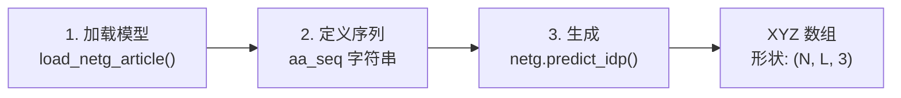

---
slug:2-quick-start
blog_type:normal
---


在五分钟内让 idpGAN 跑起来 — 在零安装的云端方案和本地安装之间做出选择，然后用两行 Python 代码生成你的首个蛋白质构象系综。

## 选择你的环境

idpGAN 提供了两条通向首次结果的路径，每条路径都适用于不同的工作流：

| 路径 | 最适用场景 | 是否需要安装 | GPU 访问 |
|------|----------|------------------|------------|
| **Google Colab** | 快速实验，无需本地设置 | 无（自动安装） | 免费 GPU 运行时 |
| **本地机器** | 重复使用，自定义流水线 | 手动安装依赖 | 你的硬件 |

<CgxTip>对于首次使用的用户，**请从 Colab 开始** — 它消除了所有设置的繁琐步骤，并提供免费的 GPU 加速。一旦你确认该工作流符合你的需求，再切换到本地执行。</CgxTip>

## 路径 A：在 Google Colab 上运行

这是从零开始到生成构象的最快路线。Colab notebook 会自动下载 `idpgan` 库、预训练权重和所有依赖项。

1. 打开 notebook：[idpGAN Colab notebook](https://colab.research.google.com/github/feiglab/idpgan/blob/main/notebooks/idpgan_experiments.ipynb)
2. **启用 GPU 运行时** → `Edit` → `Notebook settings` → `Hardware accelerator` → `GPU`
3. 按顺序运行单元格 — 前几个单元格会处理所有的下载和安装

如果没有 GPU 运行时，在 CPU 上生成 10,000 个构象可能需要几分钟。而在 GPU 上，相同的生成操作在 NVIDIA Quadro RTX 6000 上仅需约 600 毫秒即可完成。

来源：[README.md](/README.md#L15-L24)

## 路径 B：本地运行

### 步骤 1 — 安装依赖

idpGAN 需要三个核心包和两个用于 3D 可视化的可选包：

| 包 | 是否必需 | 用途 |
|---------|----------|---------|
| **PyTorch** | 是 | 神经网络推理引擎 |
| **NumPy** | 是 | 坐标数据的数组操作 |
| **Matplotlib** | 是 | 绘制距离图、接触图和 Rg 分布 |
| **NGLview** | 否 | 在 Jupyter 中交互式查看 3D 构象 |
| **MDTraj** | 否 | 用于 3D 可视化的轨迹 I/O |

```bash
# 核心依赖（以 PyTorch CPU 版本为例）
pip install numpy matplotlib torch

# 可选：3D 可视化支持
pip install nglview mdtraj
```

<CgxTip>如果你计划生成超过约 5,000 个快照的系综，请安装带有 **CUDA 支持** 的 PyTorch，而不是仅支持 CPU 的版本。生成器网络完全兼容 GPU，并且加速效果非常显著。</CgxTip>

来源：[README.md](/README.md#L26-L33)

### 步骤 2 — 克隆并配置

```bash
# 克隆仓库
git clone https://github.com/feiglab/idpgan.git
cd idpgan

# 将 idpgan 包添加到你的 Python 路径中
export PYTHONPATH="${PYTHONPATH}:$(pwd)"
```

仓库的 `data/` 目录包含预训练的模型权重和示例数据集 — **不要移动或重命名它**。如果你必须重新定位它，请更新 notebook 中的 `data_dp` 变量，使其指向新位置。

来源：[README.md](/README.md#L29-L33)

### 步骤 3 — 启动 Notebook

```bash
jupyter notebook notebooks/idpgan_experiments.ipynb
```

在 notebook 中，验证或编辑此行以匹配你的 `data/` 目录位置：

```python
data_dp = "data"  # 如果你的数据目录在其他位置，请更改此项
```

来源：[notebooks/idpgan_experiments.ipynb](/notebooks/idpgan_experiments.ipynb#L196-L201)

## 生成你的首个系综

无论你选择哪条路径，核心生成工作流都遵循相同的三个步骤。以下是生成构象系综的最简 Python 代码：



### 三行代码工作流

```python
import os, torch
from idpgan.nn_models import load_netg_article

# 1. 将预训练的 CG 模型加载到可用设备上
device = torch.device("cuda" if torch.cuda.is_available() else "cpu")
netg = load_netg_article(model_fp="data/generator.pt", device=device)

# 2. 定义你的蛋白质序列
aa_seq = "MSSLPFVFGAAASSRVVTAAAAKGTAETKQEKSFVDWLLGKITKEDQFYETDPILRGGDVKSSGSTSGKKGGTTSGKKGTVSIPSKKKNGNGGVFGGLFAKKD"

# 3. 生成 5,000 个构象 → 形状为 (5000, L, 3) 的 numpy 数组
xyz_gen = netg.predict_idp(n_samples=5000, aa_seq=aa_seq,
                           device=device, batch_size=16).cpu().numpy()
```

输出 `xyz_gen` 是一个形状为 **(N, L, 3)** 的 NumPy 数组：N 个构象，L 个残基，以及 3 个笛卡尔坐标（单位为 nm）。每个残基由单个粗粒化珠子表示。

来源：[idpgan/nn_models.py](/idpgan/nn_models.py#L432-L450), [notebooks/idpgan_experiments.ipynb](/notebooks/idpgan_experiments.ipynb#L293-L338)

### 核心 API 参考

| 函数 | 签名 | 返回值 |
|----------|-----------|---------|
| **`load_netg_article`** | `(model_fp, device)` → `IdpGANGenerator` | 带有论文权重的 CG 模型生成器 |
| **`load_abs_netg_article`** | `(model_fp, sel_model_fp, device)` → `ABSIdpGANGenerator` | 带有镜像选择器的 ABSINTH 模型生成器 |
| **`netg.predict_idp`** | `(n_samples, aa_seq, device, batch_size)` → `Tensor (N, L, 3)` | 生成的构象系综 |

来源：[idpgan/nn_models.py](/idpgan/nn_models.py#L432-L450), [idpgan/nn_models.py](/idpgan/nn_models.py#L615-L653)

## 两种模型变体

idpGAN 附带了两个预训练生成器，每个生成器都在不同的模拟后端上进行过训练：

| 变体 | 加载函数 | 权重文件 | 训练基于 | 序列长度范围 |
|---------|----------------|--------------|------------|----------------------|
| **CG 模型** | `load_netg_article` | `generator.pt` | 残基级 CG MD 模拟 | 灵活（经测试可达约 100 个残基） |
| **ABSINTH 模型** | `load_abs_netg_article` | `abs_generator.pt` + `abs_selector.pt` | 全原子 ABSINTH 隐式溶剂 | 推荐为 20–40 个残基 |

**ABSINTH 变体** 包含一个额外的镜像选择器网络 (`StereoSelNN`)，它对每个生成的构象进行后处理，以选择正确的手性。这使得它的速度较慢，但分辨率更高，因为它是基于全原子模拟数据训练的。

```python
# ABSINTH 变体 — 需要两个权重文件
from idpgan.nn_models import load_abs_netg_article
abs_netg = load_abs_netg_article(
    model_fp="data/abs_generator.pt",
    sel_model_fp="data/abs_selector.pt",
    device=device
)
abs_xyz = abs_netg.predict_idp(n_samples=5000, aa_seq="MACYPVNIRARGLGKNMGMKSRGRGKG",
                                device=device, batch_size=32).cpu().numpy()
```

来源：[idpgan/nn_models.py](/idpgan/nn_models.py#L615-L653), [README.md](/README.md#L47-L53)

## 调整生成参数

`predict_idp` 方法接受两个控制生成行为的参数：

| 参数 | 默认值 | 效果 |
|-----------|---------|--------|
| `n_samples` | — | 要生成的构象数量。样本越多 → 系综统计越平滑 |
| `batch_size` | 2048 | 每次前向传播处理的构象数量。**如果遇到 CUDA 内存不足错误，请减小此值**（例如，对于长序列设置 `batch_size=16`） |

对于超过约 70 个残基的序列，请从 `batch_size=16` 开始，仅在内存允许的情况下才增加。如果遇到 OOM（内存不足）错误，请重启 Python 内核以释放 GPU 内存，然后再使用更小的批量大小重试。

来源：[notebooks/idpgan_experiments.ipynb](/notebooks/idpgan_experiments.ipynb#L812-L828)

## 生成系综的快速分析

一旦你获得了 `xyz_gen` 数组，就可以立即使用 idpGAN 的内置模块计算系综属性：

```python
from idpgan.evaluation import score_mse_d, score_mse_c, score_akld_d, score_kl_approximation
from idpgan.plot import plot_average_dmap_comparison, plot_cmap_comparison, plot_rg_distribution
from idpgan.data import seq_to_cg_pdb
from idpgan.coords import torch_chain_dihedrals
```

| 分析 | 衡量内容 | 核心函数 |
|----------|-----------------|--------------|
| **平均距离图** | 珠子间的平均距离 | `plot_average_dmap_comparison()` |
| **接触图** | 每对残基的接触概率 | `plot_cmap_comparison()` |
| **Rg 分布** | 回转半径直方图 | `plot_rg_distribution()` |
| **MSE_d 分数** | 相对于参考的距离图精度 | `score_mse_d()` |
| **aKLD_d 分数** | 距离分布的 KL 散度 | `score_akld_d()` |

来源：[notebooks/idpgan_experiments.ipynb](/notebooks/idpgan_experiments.ipynb#L92-L108), [idpgan/data.py](/idpgan/data.py#L4-L53)

## 故障排除

| 问题 | 原因 | 解决方案 |
|---------|-------|----------|
| `ModuleNotFoundError: No module named 'idpgan'` | `idpgan/` 不在 `PYTHONPATH` 中 | 将仓库根目录添加到 `PYTHONPATH` 或 `sys.path` |
| `CUDA out of memory` | 对于 GPU 而言 `batch_size` 过大 | 减小 `batch_size`（尝试 16 或 32），重启内核 |
| 生成缓慢（10K 样本耗时 > 1 分钟） | 在 CPU 上运行 | 切换至 GPU 设备；验证 `torch.cuda.is_available()` 返回 `True` |
| 错误的 `data_dp` 路径 | 未找到 `data/` 目录 | 将 `data_dp` 设置为 `data/` 目录的绝对路径 |
| 使用 ABSINTH 时短/长序列结果不佳 | 超出训练范围（20–40 个残基） | 对于超出范围的长度，改用 CG 模型变体 |

来源：[README.md](/README.md#L55-L61), [notebooks/idpgan_experiments.ipynb](/notebooks/idpgan_experiments.ipynb#L1029-L1033)

## 接下来做什么？

现在你已经可以生成系综了，接下来请探索全部功能：

- **带分析的逐步演练**：[示例 Notebook 演练](3-example-notebook-walkthrough) — 查看每个 notebook 单元格的详细解释及输出
- **理解架构**：[架构概览](4-architecture-overview) — 了解 Transformer 生成器、选择器和坐标流水线是如何协同工作的
- **为你的研究进行自定义**：[生成器推理流水线](17-generator-inference-pipeline) — 深入了解完整的预测工作流和批处理过程