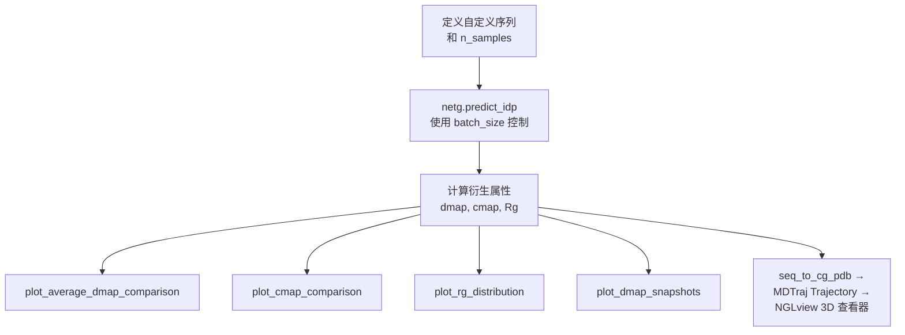

---
slug:3-example-notebook-walkthrough
blog_type:normal
---


本页将带你了解 **`idpgan_experiments.ipynb`** 笔记本——这是使用 idpGAN 生成内禀无序蛋白 (IDP) 粗粒化构象系综的实操入口。该笔记本被组织为一个独立的教程：从环境配置，到带有定量评估的基准示例蛋白，再到使用 idpGAN 的 CG 模型和 ABSINTH 模型变体生成自定义序列。

来源：[idpgan_experiments.ipynb](notebooks/idpgan_experiments.ipynb#L1-L1323)

## 笔记本结构一览

笔记本分为四个主要部分，每个部分均建立在前一部分的基础之上：

| 部分 | 目的 | 关键输出 |
|---|---|---|
| **1 — 配置环境** | 导入库，获取数据，配置设备 | `device`，已导入的 API 函数，辅助工具 |
| **2 — 示例蛋白** | 为 `protan`、`protac`、`polyala` 生成并评估系综 | 距离图，接触图，Rg 分布，MSE/KLD 分数 |
| **3 — 自定义蛋白 (CG 模型)** | 为任意用户定义的氨基酸序列生成系综 | XYZ 构象，可视化诊断，3D NGLview 渲染 |
| **4 — 自定义多肽 (ABSINTH 模型)** | 使用带有镜像选择的 abs-idpGAN 变体生成系综 | ABSINTH 与 CG 对比，二面角分布 |

来源：[idpgan_experiments.ipynb](notebooks/idpgan_experiments.ipynb#L26-L31)

## 第 1 部分 — 配置环境

### 步骤 1.1：导入核心库

第一个代码单元格导入了基础技术栈——`numpy`、`matplotlib` 和 `torch`——并检测笔记本是否在 Google Colab 内运行，以便为 NGLview 启用自定义控件支持：

```python
import os
import numpy as np
import matplotlib.pyplot as plt
import torch

try:
    import google.colab
    from google.colab import output as colab_output
    colab_output.enable_custom_widget_manager()
    running_in_colab = True
except ImportError:
    running_in_colab = False
```

来源：[idpgan_experiments.ipynb](notebooks/idpgan_experiments.ipynb#L52-L65)

### 步骤 1.2：获取依赖项 (仅限 Colab)

在 Colab 上运行时，笔记本会自动从 GitHub 下载 `idpgan` 仓库归档文件，解压 `data/` 和 `idpgan/` 目录，并安装 3D 构象可视化所需的 `nglview` 和 `mdtraj` 包。**如果你在本地运行，请跳过此单元格**——仓库已存在于磁盘上。

来源：[idpgan_experiments.ipynb](notebooks/idpgan_experiments.ipynb#L73-L83)

### 步骤 1.3：导入 idpGAN API 函数

此单元格导入了笔记本使用的完整 API 接口。下表将每个导入项映射至其用途：

| 导入项 | 模块 | 作用 |
|---|---|---|
| `parse_fasta_seq` | `idpgan.data` | 读取单条目 FASTA 文件 → 氨基酸字符串 |
| `seq_to_cg_pdb` | `idpgan.data` | 根据序列写入模板 CG PDB 文件 |
| `random_sample_trajectory` | `idpgan.data` | 随机二次抽样 MD 轨迹数组 |
| `load_netg_article` | `idpgan.nn_models` | 加载预训练的 CG 模型生成器 |
| `load_abs_netg_article` | `idpgan.nn_models` | 加载预训练的 ABSINTH 模型生成器 + 选择器 |
| `plot_average_dmap_comparison`, `plot_cmap_comparison`, `plot_rg_comparison`, `plot_distances_comparison`, `plot_rg_distribution`, `plot_dmap_snapshots` | `idpgan.plot` | 距离图、接触图、Rg、距离的可视化工具 |
| `score_mse_d`, `score_mse_c`, `score_akld_d`, `score_kl_approximation` | `idpgan.evaluation` | 定量系综相似度分数 |
| `torch_chain_dihedrals` | `idpgan.coords` | 从 XYZ 坐标计算主链二面角 |

来源：[idpgan_experiments.ipynb](notebooks/idpgan_experiments.ipynb#L91-L108), [data.py](idpgan/data.py#L1-L54), [evaluation.py](idpgan/evaluation.py#L1-L60)

### 步骤 1.4：定义辅助工具

内联定义了三个小型辅助函数——它们在整个笔记本中用于计算衍生结构属性：

| 函数 | 输入形状 | 输出 | 描述 |
|---|---|---|---|
| `get_distance_matrix(xyz)` | `(N, L, 3)` | `(N, L, L)` | 每个构象的逐对欧几里得距离矩阵 |
| `get_contact_map(dmap, threshold=0.8)` | `(N, L, L)` | `(L, L)` | 接触概率图：距离 ≤ 阈值的帧所占比例 |
| `compute_rg(xyz)` | `(N, L, 3)` | `(N,)` | 每帧的回转半径 (改编自 MDTraj) |

<CgxTip>接触图的 `threshold` 参数默认设置为 **0.8 nm**——这是每个残基为单个珠子的 CG 模型约定。如果你使用全原子表示，请调整此值。</CgxTip>

来源：[idpgan_experiments.ipynb](notebooks/idpgan_experiments.ipynb#L117-L145)

### 步骤 1.5：配置 PyTorch 设备

```python
device = torch.device("cuda" if torch.cuda.is_available() else "cpu")
```

生成器网络在 GPU 上的运行速度显著快于 CPU（在 NVIDIA Quadro RTX 6000 上生成 10,000 个构象约需 600 ms，而在双核 Colab 实例的 CPU 上约需 30 s）。笔记本会自动检测并报告可用的设备。

来源：[idpgan_experiments.ipynb](notebooks/idpgan_experiments.ipynb#L160-L164)

## 第 2 部分 — 示例蛋白

本部分演示了完整的 idpGAN 工作流程：加载参考 MD 数据 → 生成系综 → 定量比较。它使用了三个不在训练集中的测试蛋白。

### 加载参考 CG MD 数据

MD 构象系综存储为形状为 **(N, L, 3)** 的 NumPy 数组，其中 N 是快照数，L 是残基数，3 存储 **nm** 为单位的 xyz 坐标。

| 蛋白 | 文件 | 残基 | 描述 |
|---|---|---|---|
| **protan** | `protan.fasta` + `protan.npy` | 55 | 测试 IDP (不在训练集中) |
| **protac** | `protac.fasta` + `protac.npy` | 55 | 测试 IDP (不在训练集中) |
| **polyala** | `polyala.fasta` + `polyala.npy` | 55 | 聚丙氨酸：表现为简单的随机线性聚合物——用作**朴素基线** |

序列通过 `parse_fasta_seq` 加载，该函数读取单条目 FASTA 文件并返回氨基酸字符串。XYZ 数组通过 `np.load` 加载。

来源：[idpgan_experiments.ipynb](notebooks/idpgan_experiments.ipynb#L207-L238), [idpgan_experiments.ipynb](notebooks/idpgan_experiments.ipynb#L245-L267), [data.py](idpgan/data.py#L4-L18)

### 生成构象系综


生成器通过 `load_netg_article` 加载，随后为每个蛋白生成 10,000 个构象的系综：

```python
netg = load_netg_article(model_fp=os.path.join(data_dp, "generator.pt"),
                         device=device)

xyz_protan_gen = netg.predict_idp(n_samples=10000, aa_seq=seq_protan,
                                  device=device).cpu().numpy()
```

然后使用 `random_sample_trajectory` 将 MD 数据二次抽样至相同帧数，以确保公平比较。

<CgxTip>对于残基较多的蛋白，请减小 `predict_idp()` 中的 `batch_size` 以避免 GPU 显存不足 错误。如果遇到 OOM，请重启笔记本内核以清理显存后再重试。</CgxTip>

来源：[idpgan_experiments.ipynb](notebooks/idpgan_experiments.ipynb#L284-L398)

### 分析系综 — 距离图

平均距离图通过**下三角 = MD** 和**上三角 = 生成**进行视觉比较。`plot_average_dmap_comparison` 函数渲染此分割视图。定量上，**MSE_d** 分数衡量平均原子间距离的均方误差：

$$MSE_d = \frac{1}{N_{pairs}} \sum_{i<j} (m_{ij} - \hat{m}_{ij})^2$$

笔记本为 **polyala 基线** (polyala MD vs protan/protac MD) 和 **idpGAN 系综** (protan/protac GEN vs protan/protac MD) 均计算了 MSE_d。分数越低表示近似效果越好——idpGAN 始终优于 polyala 基线。

来源：[idpgan_experiments.ipynb](notebooks/idpgan_experiments.ipynb#L418-L506), [evaluation.py](idpgan/evaluation.py#L4-L13)

### 分析系综 — 接触图

接触概率图 (阈值 = 0.8 nm) 通过 `plot_cmap_comparison` 以相同的下/上三角格式进行比较。**MSE_c** 分数作用于对数接触频率：

$$MSE_c = \frac{1}{N_{pairs}} \sum_{i<j} (log(p_{ij}) - log(\hat{p}_{ij}))^2$$

每种蛋白均展现出由氨基酸组成驱动的独特接触模式。polyala 的图是均匀的，而 protan 和 protac 呈现出结构化区域。idpGAN 捕捉到了这些依赖于组成的模式。

来源：[idpgan_experiments.ipynb](notebooks/idpgan_experiments.ipynb#L513-L598), [evaluation.py](idpgan/evaluation.py#L15-L24)

### 分析系综 — 原子间距离分布

`plot_distances_comparison` 函数为随机选取的原子对叠加显示 MD 与生成的逐对距离直方图。**aKLD_d** 分数计算所有原子对的 KL 散度平均值：

$$aKLD_d = \frac{1}{N_{pairs}} \sum_{i<j} KLD(M_{ij} \parallel \hat{M}_{ij})$$

每次运行会绘制不同的随机原子对，为分布质量提供随机的合理性检验。

来源：[idpgan_experiments.ipynb](notebooks/idpgan_experiments.ipynb#L606-L676), [evaluation.py](idpgan/evaluation.py#L27-L44)

### 分析系综 — 回转半径分布

Rg 分布使用内联的 `compute_rg` 辅助函数计算，并通过 `plot_rg_comparison` 进行可视化。**KLD_r** 分数使用 `score_kl_approximation` 计算 MD 和生成的 Rg 分布之间的分箱 KL 散度。同样，idpGAN 得出的 KLD_r 低于 polyala 基线。

来源：[idpgan_experiments.ipynb](notebooks/idpgan_experiments.ipynb#L682-L751), [evaluation.py](idpgan/evaluation.py#L46-L60)

### 评估指标总结

| 指标 | 比较内容 | 越低越好 | 用于 |
|---|---|---|---|
| `score_mse_d` | 平均距离图 | ✓ | 全局结构相似性 |
| `score_mse_c` | 对数接触频率 | ✓ | 接触模式保真度 |
| `score_akld_d` | 逐对距离分布 | ✓ | 分布准确度 |
| `score_kl_approximation` | 标量分布 (如 Rg) | ✓ | 全局紧凑度保真度 |

来源：[evaluation.py](idpgan/evaluation.py#L1-L60)

## 第 3 部分 — 自定义蛋白 (CG 模型)

本部分展示如何为你选择的**任意氨基酸序列**生成系综。

### 逐步流程



笔记本设置了一个默认示例序列 (Q8GT36, 96 个残基)，并使用 `batch_size=16` 生成 5,000 个构象：

```python
xyz_custom_gen = netg.predict_idp(n_samples=5000,
                                  aa_seq=custom_seq,
                                  device=device,
                                  batch_size=16).cpu().numpy()
```

### 无参考数据的可视化

当没有 MD 参考数据时 (自定义序列的典型用例)，绘图函数的参考参数接受 `None`，仅渲染生成数据：

```python
plot_average_dmap_comparison(dmap_ref=None, dmap_gen=dmap_custom_gen,
                             max_d=None, title="Q8GT36 GEN")
plot_cmap_comparison(cmap_ref=None, cmap_gen=cmap_custom_gen,
                     title="Q8GT36 GEN")
plot_rg_distribution(rg_vals=rg_custom_gen, title="Q8GT36 GEN", n_bins=50)
plot_dmap_snapshots(dmap=dmap_custom_gen, n_snapshots=4)
```

### 使用 NGLview 进行 3D 可视化

如果已安装 `nglview` 和 `mdtraj`，笔记本会通过 `seq_to_cg_pdb` 构建 PDB 拓扑，将 XYZ 数据包装为 `mdtraj.Trajectory`，并使用 NGLview 进行渲染。提供两种模式：

| 模式 | `load_all_frames` | 行为 |
|---|---|---|
| **系综动画** | `True` | 叠加所有帧；在本地有效，但在 Colab 上无效 |
| **单随机帧** | `False` | 每次执行单元格均显示不同的随机构象 |

来源：[idpgan_experiments.ipynb](notebooks/idpgan_experiments.ipynb#L758-L998), [data.py](idpgan/data.py#L26-L46)

## 第 4 部分 — 自定义多肽 (ABSINTH 模型)

本部分使用 **abs-idpGAN** 变体——一个在 ABSINTH 隐式溶剂模拟上以更高分辨率 (带有全原子相互作用势的 Cα 轨迹) 训练的生成器。它还加载了**镜像选择器网络**，该网络对每个生成的构象进行后处理，以选择正确的手性。

### 加载两种模型变体

```python
abs_netg = load_abs_netg_article(model_fp=os.path.join(data_dp, "abs_generator.pt"),
                                 sel_model_fp=os.path.join(data_dp, "abs_selector.pt"),
                                 device=device)

cg_netg = load_netg_article(model_fp=os.path.join(data_dp, "generator.pt"),
                            device=device)
```

ABSINTH 模型需要两个权重文件：生成器 (`abs_generator.pt`) 和选择器 (`abs_selector.pt`)，而 CG 模型仅需生成器。

### 序列长度限制

<CgxTip>**abs-idpGAN 在 20–40 个氨基酸的多肽上进行了训练。** 为显著超出此范围的序列生成构象可能会产生较差的结果，因为模型未针对此类长度进行验证。</CgxTip>

来源：[idpgan_experiments.ipynb](notebooks/idpgan_experiments.ipynb#L992-L1049)

### 比较 ABSINTH 与 CG 系综

笔记本使用两种模型为同一多肽序列生成系综，然后跨四个属性进行比较：

| 属性 | ABSINTH 预期 | CG 预期 |
|---|---|---|
| **距离图** | 相似的全局结构 | 相似的全局结构 |
| **接触图** | 更复杂、结构化的模式 | 更简单、更均匀 |
| **Rg 分布** | 偏移 (更高分辨率势) | 更宽，约束更少 |
| **二面角** | 不对称模式 (类蛋白手性) | 近似对称 |

二面角比较尤为具有诊断意义：ABSINTH 模型应表现出全原子蛋白表示所特有的**不对称扭转分布**，而 CG 模型产生大致对称的分布。此计算使用 `idpgan.coords` 模块中的 `torch_chain_dihedrals` 完成。

来源：[idpgan_experiments.ipynb](notebooks/idpgan_experiments.ipynb#L1056-L1298)

### 镜像选择开销

abs-idpGAN 生成器比 CG 生成器**更慢**，因为它运行了一个额外的基于神经网络的后处理步骤 (选择器网络)，以解决每个生成构象的手性歧义。笔记本使用 `%%time` 对两个生成器进行基准比较。

来源：[idpgan_experiments.ipynb](notebooks/idpgan_experiments.ipynb#L1080-L1099)

## 接下来去哪里

既然你已经从头到尾阅读了这本笔记本，根据你的目标，以下是合乎逻辑的后续步骤：

- **了解** `load_netg_article` 和 `predict_idp` **背后的架构** → [架构概览](4-architecture-overview)
- **深入探索** Transformer 生成器**网络设计** → [Transformer 生成器网络](5-transformer-generator-network)
- **了解** abs-idpGAN **中使用的镜像选择器** → [镜像选择器网络](7-mirror-image-selector-network)
- **探索第 4 部分中使用的**二面角计算 → [二面角计算](9-dihedral-angle-computation)
- **详细了解**评估指标 → [距离和接触图指标](11-distance-and-contact-map-metrics) 和 [KL 散度评分](12-kl-divergence-scoring)
- **将 idpGAN 集成到你自己的流程中** → [生成器推理流水线](17-generator-inference-pipeline)