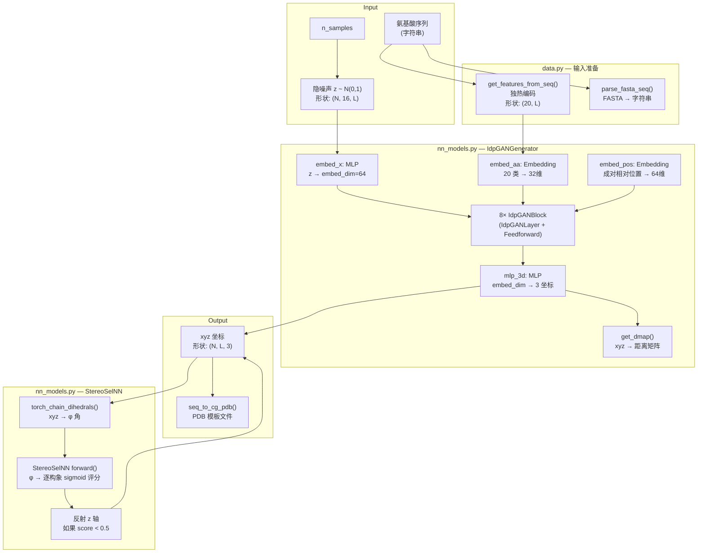

---
slug:4-architecture-overview
blog_type:normal
---


idpGAN 是一个**基于 Transformer 的生成模型**，可直接为粗粒度（CG）本质无序蛋白（IDP）生成三维构象系综。传统分子动力学（MD）模拟需要大量计算时间，而 idpGAN 则不同，它通过将经氨基酸序列条件化的隐噪声空间，经由一堆自定义 Transformer 块映射为逐残基的三维坐标，从而在数秒内生成结构多样的蛋白质构象。该系统使用 PyTorch 实现，并提供了两个训练好的模型变体：一个 **CG 模型生成器** 和一个 **ABSINTH 模型生成器**，后者包含一个镜像选择器网络，用于解决仅含 Cα 轨迹的手性歧义问题。本页提供了代码库的结构图、推理管线的数据流以及各模块背后的设计原理。

来源: [README.md](/README.md#L1-L72), [nn_models.py](/idpgan/nn_models.py#L1-L10)

## 模块结构

`idpgan` 包被组织为六个模块，每个模块承担单一的架构职责：

```
idpgan/
├── __init__.py          # 从 nn_models 重新导出所有公共符号
├── common.py            # 激活函数工厂
├── coords.py            # 根据 xyz 坐标计算二面角
├── data.py              # FASTA 解析、CG PDB 模板化、轨迹采样
├── evaluation.py        # 距离/接触图 MSE、KL 散度评分
├── nn_models.py         # 核心神经网络架构
└── plot.py              # 可视化：距离图、接触图、Rg 分布
```

`__init__.py` 对 `nn_models` 执行星号导入，使得生成器和选择器类可在包的根目录下访问——这是主要的公共 API 接口。

来源: [__init__.py](/idpgan/__init__.py#L1-L1), [common.py](/idpgan/common.py#L1-L17)

## 高层推理管线

下图描绘了从用户输入到最终构象系综的完整推理路径，展示了模块间的端到端交互方式：



**CG 模型路径**（通过 `load_netg_article` 加载）仅遵循上方分支：隐噪声和序列通过生成器直接生成 xyz 坐标。**ABSINTH 模型路径**（通过 `load_abs_netg_article` 加载）则增加了一个后处理阶段，在此阶段中，`StereoSelNN` 会评估每个构象的二面角，并反射那些被预测为具有错误手性的构象。

来源: [nn_models.py](/idpgan/nn_models.py#L399-L460), [nn_models.py](/idpgan/nn_models.py#L598-L654), [data.py](/idpgan/data.py#L1-L54)

## 神经网络架构层级

核心神经架构建立在四层层级结构之上，每一层都增加了表达能力：

| 层级 | 类 | 作用 | 关键参数（CG 变体） |
|-------|-------|------|------------------------------|
| 1 | **`IdpGANLayer`** | 带有二维位置偏置的自定义多头注意力 | `d_model=128`, `nhead=8`, `head_dim=16` |
| 2 | **`IdpGANBlock`** | Transformer 块：注意力 + 前馈网络及残差连接 | `embed_dim=64`, `dim_feedforward=128` |
| 3 | **`IdpGANGenerator`** | 完整生成器：嵌入堆叠 → 8 个块 → 3D 输出 MLP | `nz=16`, `num_layers=8` |
| 4 | **`ABSIdpGANGenerator`** | 复合体：生成器 + 镜像选择器 + 手性校正 | 封装 `IdpGANGenerator` + `StereoSelNN` |

### IdpGANLayer — 带二维位置偏置的注意力

对标准 Transformer 注意力的根本性改进在于 `IdpGANLayer`。该层并非仅从 Q、K、V 投影的点积计算注意力权重，而是在 softmax 之前向注意力 logits 中**添加一个学习到的二维位置偏置**：

```
attention_logits = (Q · Kᵀ) / √d  +  MLP₂D(positional_encoding)
```

二维分支（`mlp_2d`）接收成对的相对位置嵌入（形状为 `L×L×pos_embed_dim`），并将其投影到 `nhead` 个通道，生成一个逐头偏置矩阵。这种设计使模型能够学习**距离依赖的注意力模式**——这对于蛋白质结构至关重要，因为在特定的序列间隔下，残基对会表现出特征性的相互作用强度。Q、K、V 投影从 `embed_dim=64` 映射到 `d_model=128`，输出投影则映射回去。

来源: [nn_models.py](/idpgan/nn_models.py#L105-L200)

### IdpGANBlock — Transformer 残差块

每个 `IdpGANBlock` 将一个 `IdpGANLayer` 与前馈“更新器”模块及残差连接封装在一起。该块支持两种归一化放置方式：

- **后归一化**（`norm_pos="post"`）：在残差相加后应用 LayerNorm（CG 变体默认）
- **预归一化**（`norm_pos="pre"`）：在注意力和前馈操作之前应用 LayerNorm（ABSINTH 变体）

当启用一维氨基酸嵌入（`embed_dim_1d=32`）时，它们会在前馈模块之前与隐藏状态拼接，使得更新器能够在每一层以序列身份为条件。前馈路径为：`Linear(embed_dim + embed_dim_1d → dim_feedforward) → activation → Linear(dim_feedforward → embed_dim)`。

来源: [nn_models.py](/idpgan/nn_models.py#L16-L104)

### IdpGANGenerator — 完整生成器网络

生成器实现了完整的序列条件生成管线：

1. **隐嵌入**：MLP 将随机噪声 `z`（形状为 `N×16×L`）映射为 `embed_dim=64` 的逐残基特征
2. **氨基酸嵌入**：可学习的 `nn.Embedding(20, 32)` 将 20 个氨基酸类别转换为 32 维向量
3. **二维位置编码**：成对的残基间隔被分入 `2×pos_embed_max_l+1` 个离散位置，并嵌入到 `pos_embed_dim=64` 维空间中
4. **Transformer 堆叠**：8 个 `IdpGANBlock` 实例处理组合表示；当 `use_embed_repeat=True` 时，一维和二维嵌入都会被注入到每一个块中
5. **3D 坐标输出**：最终的 MLP 将 `embed_dim → 3` 映射，为每个残基生成 xyz 坐标

`predict_idp()` 方法处理完整的推理工作流：采样 `z`、编码序列、批量执行前向传播，并在推理模式（`torch.no_grad()`）下返回坐标。

来源: [nn_models.py](/idpgan/nn_models.py#L203-L400)

### StereoSelNN — 镜像选择器

因为仅含 Cα 的轨迹存在手性歧义（一组 Cα 坐标与其镜像均为有效结构），ABSINTH 变体包含了 `StereoSelNN`，以对哪些构象需要反射进行分类。它以**主链二面角的正弦/余弦值**（通过 `torch_chain_dihedrals` 计算）以及残基掩码作为输入，通过其自身的 Transformer 堆叠进行处理，并输出一个**逐构象的 sigmoid 评分**。评分低于 0.5 的构象的 z 坐标会被取反，从而解决镜像歧义。

来源: [nn_models.py](/idpgan/nn_models.py#L462-L570), [nn_models.py](/idpgan/nn_models.py#L598-L654), [coords.py](/idpgan/coords.py#L1-L19)

## 模型变体与加载

提供了两种预训练配置，每种均由专用的工厂函数加载：

| 工厂函数 | 生成器配置 | 选择器 | 权重文件 | 训练数据 |
|------------------|-----------------|----------|---------------|---------------|
| `load_netg_article()` | 8 层，后归一化，dropout=0.0 | 无 | `generator.pt` | 基于_cg_的 MD 模拟 |
| `load_abs_netg_article()` | 8 层，预归一化，dropout=None | `StereoSelNN` (8 层，预归一化) | `abs_generator.pt` + `abs_selector.pt` | ABSINTH 隐式溶剂 |

ABSINTH 变体的 `pos_embed_max_l=32`（CG 变体为 24）适应了全原子模拟数据中更长距离的位置模式。`ABSIdpGANGenerator` 类组合了这两个网络：它首先通过内部的 `IdpGANGenerator` 生成构象，然后在单次 `predict_idp()` 调用中应用选择器的手性校正。

<CgxTip>ABSINTH 变体使用 `dropout=None`（而非 0.0），这会从架构中完全移除 `nn.Dropout` 模块。E。这与 CG 变体中 `dropout=0.0` 保留模块但将其概率设置为零不同——这是一个微妙但有意为之的设计选择，影响了模块组合。</CgxTip>

来源: [nn_models.py](/idpgan/nn_models.py#L462-L480), [nn_models.py](/idpgan/nn_models.py#L614-L654)

## 辅助模块

### 数据管线 (`data.py`)

三个函数处理输入/输出边界：

- **`parse_fasta_seq()`**：读取单条目 FASTA 文件并返回氨基酸字符串，同时验证恰好存在一个 `>` 头部
- **`seq_to_cg_pdb()`**：将序列字符串转换为模板 PDB 文件，每个残基包含一条 `ATOM` 记录（CG 或 CA 原子类型），将所有坐标放置在原点以供后续替换
- **`random_sample_trajectory()`**：从 MD 轨迹数组中均匀采样 `n_samples` 帧（若轨迹短于请求数则进行有放回采样）

### 坐标计算 (`coords.py`)

单一函数 `torch_chain_dihedrals()` 使用叉积公式从一批 xyz 坐标张量中计算主链二面角。给定四个连续原子位置，它通过 `atan2(y, x)` 推导二面角，其中 `y` 涉及三重叉积，`x` 涉及双重叉积。可选的 `norm` 标志通过除以 π 将角度缩放至 `[-1, 1]`。

### 评估指标 (`evaluation.py`)

四个评分函数用于量化系综质量：

| 函数 | 指标 | 输入 |
|----------|--------|-------|
| `score_mse_d()` | 平均距离矩阵的 MSE | `admap_ref (L×L)`, `admap_hat (L×L)` |
| `score_mse_c()` | 对数接触概率图的 MSE | `cmap_ref (L×L)`, `cmap_hat (L×L)` |
| `score_akld_d()` | 所有残基对的平均 KL 散度 | `dmap_true (N×L×L)`, `dmap_pred (M×L×L)` |
| `score_kl_approximation()` | 通过直方图分箱的离散 KL 散度 | `v_true (N,)`, `v_pred (M,)` |

KL 散度函数使用带有伪计数的直方图分箱（默认为 0.001）来避免零频率分箱，使得该指标对于小样本规模具有鲁棒性。

### 可视化 (`plot.py`)

五个绘图函数生成出版级质量的图表：平均距离图比较（参考图与生成图沿对角线分割）、对数尺度（log₁₀）下的接触图比较、成对距离分布直方图、回转半径分布以及距离图快照网格。

来源: [data.py](/idpgan/data.py#L1-L54), [coords.py](/idpgan/coords.py#L1-L19), [evaluation.py](/idpgan/evaluation.py#L1-L60), [plot.py](/idpgan/plot.py#L1-L176)

## 数据流总结

下表追踪了长度为 `L` 且批量大小为 `N` 的蛋白质在 CG 模型生成器前向传播中的张量形状：

| 阶段 | 张量 | 形状 | 备注 |
|-------|--------|-------|-------|
| 隐噪声 | `z` | `(N, 16, L)` | 从标准正态分布采样 |
| AA 独热 | `a` | `(N, 20, L)` | 来自 `get_features_from_seq()` |
| 隐嵌入 | `embed_x(z)` | `(L, N, 64)` | MLP: 16 → 64; 转置为 |
| AA 嵌入 | `embed_aa(argmax(a))` | `(L, N, 32)` | 可学习查找表 |
| 二维位置 | `embed_pos(bins)` | `(N, L, L, 64)` | 成对相对位置 |
| 逐块输出 | `h` | `(L, N, 64)` | 通过 8 个 Transformer 块更新 |
| 3D 坐标 | `mlp_3d(h)` | `(L, N, 3)` | MLP: 64 → 3 |
| 最终输出 | `r` | `(N, L, 3)` | 转置回批量优先 |
| 距离矩阵 | `get_dmap(r)` | `(N, 1, L, L)` | 可选；成对欧几里得距离 |

<CgxTip>在整个 Transformer 堆叠中采用 (L, N, E) 的约定，遵循了 PyTorch 的 `nn.MultiheadAttention` 默认设置，即序列长度为第一维度。仅在输出阶段发生到 的最终转置，以匹配轨迹数据的 NumPy/MDTraj 约定。</CgxTip>

来源: [nn_models.py](/idpgan/nn_models.py#L335-L398), [nn_models.py](/idpgan/nn_models.py#L440-L460)

## 建议阅读路径

为了加深对架构的理解，请按照以下顺序阅读详细文档：

1. **[Transformer 生成器网络](5-transformer-generator-network)** — `IdpGANGenerator` 的完整参数分解与前向传播机制
2. **[带二维嵌入的自定义注意力](6-custom-attention-with-2d-embeddings)** — `IdpGANLayer` 如何利用位置偏置扩展标准注意力
3. **[镜像选择器网络](7-mirror-image-selector-network)** — 通过 `StereoSelNN` 和 `ABSIdpGANGenerator` 解决手性问题
4. **[二面角计算](9-dihedral-angle-computation)** — `torch_chain_dihedrals()` 中的叉积公式
5. **[生成器推理管线](17-generator-inference-pipeline)** — 将所有模块串联的端到端使用演练