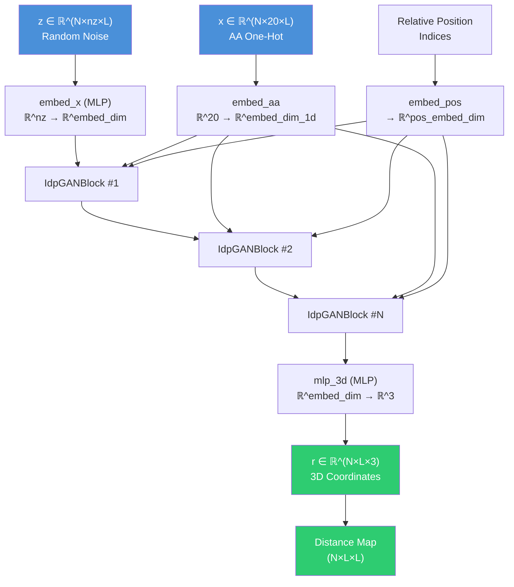
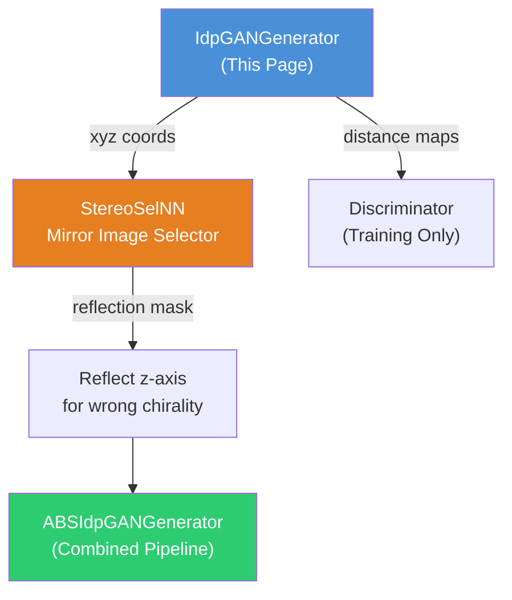

---
slug:5-transformer-generator-network
blog_type:normal
---


**Transformer 生成网络**（`IdpGANGenerator`）是 idpGAN 的核心神经架构——一个基于 GAN 的深度生成模型，它直接从随机噪声和氨基酸序列条件中生成 3D 粗粒化蛋白质构象。该网络建立在自定义的 Transformer 堆栈之上，结合了 **2D 位置注意力偏置** 和 **1D 氨基酸条件化**，将隐向量 **z** 和序列编码 **x** 映射为笛卡尔坐标 **r** ∈ ℝ^(L×3)，并由此推导出距离图，以便与判别器信号进行训练对比。本页将解释生成器的内部架构、其三个组成模块（`IdpGANGenerator`、`IdpGANBlock`、`IdpGANLayer`）、数据流语义以及配置面。

来源：[nn_models.py](/idpgan/nn_models.py#L231-L411), [common.py](/idpgan/common.py#L1-L17)

## 架构概述

生成器遵循 **隐变量到结构** 的流程：随机噪声张量经过嵌入并通过堆叠的 Transformer 块进行精炼，这些块融合了位置结构和氨基酸身份信息，然后投影到每个残基的 3D 坐标。该架构在两个关键方面偏离了标准的 Transformer 解码器堆栈——(1) 注意力分数通过学习到的 2D 位置偏置进行增强，而不是纯粹由内容驱动的点积；(2) 氨基酸嵌入作为侧条件注入到每个块的前馈更新器中，而不是通过交叉注意力。



上图描绘了完整的前向路径。每个 `IdpGANBlock` 在内部由一个 `IdpGANLayer`（带有 2D 偏置的自定义注意力）和随后一个带有氨基酸条件化的前馈更新器组合而成。输出 MLP（`mlp_3d`）将每个残基的嵌入投影到 3D，之后生成器要么返回原始坐标，要么计算成对的欧几里得距离图。

来源：[nn_models.py](/idpgan/nn_models.py#L231-L377)

## IdpGANGenerator — 顶层模块

`IdpGANGenerator` 是面向用户的 `nn.Module`，负责编排整个生成流程。其 `__init__` 构造了五个子模块，其 `forward` 和 `predict_idp` 方法则驱动推理过程。

### 子模块分解

| 子模块 | 用途 | 输入 → 输出形状 |
|---|---|---|
| `embed_pos` | 可学习的 2D 位置偏置嵌入 | `(L, L)` int 索引 → `(L, L, pos_embed_dim)` |
| `embed_x` | 噪声到嵌入的 MLP | `(L, N, nz)` → `(L, N, embed_dim)` |
| `embed_aa` | 氨基酸词元嵌入 | `(N, L)` int 索引 → `(L, N, embed_dim_1d)` |
| `transformer` | `IdpGANBlock` 层堆栈 | `(L, N, embed_dim)` → `(L, N, embed_dim)` |
| `mlp_3d` | 坐标投影 MLP | `(L, N, embed_dim)` → `(L, N, 3)` |

**噪声嵌入 MLP**（`embed_x`）是动态构建的：一个初始的 `Linear(nz, embed_dim)`，后跟 `n_hl_embed - 1` 个具有选定激活函数的隐藏层 `Linear(embed_dim, embed_dim)`，最后以一个线性投影结束。**坐标 MLP**（`mlp_3d`）反映了此模式，具有 `n_hl_out` 个向下投影到 3 维的隐藏层。两者均使用通过 `get_activation` 选定的相同激活函数（支持 `"relu"`、`"elu"`、`"lrelu"`、`"swish"`）。

来源：[nn_models.py](/idpgan/nn_models.py#L236-L306), [common.py](/idpgan/common.py#L7-L16)

### 前向传播 — 数据流

`forward(self, z, x, get_coords=False)` 方法通过以下阶段实现完整的生成流程：

**1. 位置特征计算。** 计算相对位置矩阵 `p[i,j] = j - i`，然后使用 `torch.argmin` 针对均匀分布的箱中心，在 `[-pos_embed_max_l, +pos_embed_max_l]` 范围内将其离散化为箱。箱索引通过 `embed_pos` 传递，以生成形状为 `(N, L, L, pos_embed_dim)` 的 2D 位置特征张量。这种分箱策略将较大的间距截断至最大箱，引入了一种归纳偏置：相距超过 `pos_embed_max_l` 个位置的残基共享相同的位置编码。

**2. 输入嵌入。** 形状为 `(N, nz, L)` 的噪声张量 `z` 被转置为 `(L, N, nz)`（Transformer 块期望的序列优先格式），并通过 `embed_x` 传递。同时，形状为 `(N, 20, L)` 的氨基酸独热张量 `x` 通过 `argmax` 转换为整数索引，经过 `embed_aa` 嵌入，并转置为 `(L, N, embed_dim_1d)`。

**3. Transformer 堆栈。** 嵌入表示 `h` 通过 `num_layers` 个顺序排列的 `IdpGANBlock` 实例进行精炼。当 `use_embed_repeat=True`（默认值）时，2D 位置特征 `p` 和 1D 氨基酸嵌入 `e_aa` 都会提供给**每个**块。当为 `False` 时，它们仅提供给第一个块——后续层两者接收 `None`，依赖第一个块来传播结构信息。

**4. 坐标投影与输出。** 最终的隐藏状态通过 `mlp_3d` 投影生成 `(L, N, 3)`，随后转置为 `(N, L, 3)`。如果 `get_coords=True`，则直接返回原始坐标。否则，`get_dmap` 计算成对的欧几里得距离矩阵，并加上一个小 epsilon (1e-12) 以保证数值稳定性，返回形状为 `(N, L, L)` 的张量。

来源：[nn_models.py](/idpgan/nn_models.py#L309-L376)

### predict_idp — 批量推理

`predict_idp(self, n_samples, aa_seq, device, batch_size, get_a)` 方法提供了生成构象系综的主要推理接口：

1. 采样形状为 `(n_samples, nz, L)` 的隐变量张量 `z ~ N(0, I)`。
2. 氨基酸字符串通过 `get_features_from_seq` 转换为独热张量，并在所有样本中进行广播。
3. 生成器在 `torch.no_grad()` 上下文中进行评估，以 `batch_size` 为单位分块处理样本以管理 GPU 内存。
4. 各批次的坐标张量被拼接，并作为单个 `(n_samples, L, 3)` 系综返回。

<CgxTip>`predict_idp` 中的 `batch_size` 参数纯粹是一个内存管理旋钮——它将总 `n_samples` 划分为小批量进行前向传播，但不会影响生成的构象。在你的 GPU 内存允许的范围内将其设置得尽可能高以提高速度；仅当遇到 OOM 错误时才减小它。</CgxTip>

来源：[nn_models.py](/idpgan/nn_models.py#L380-L410), [nn_models.py](/idpgan/nn_models.py#L413-L429)

## IdpGANBlock — 具有双重条件化的 Transformer 块

每个 `IdpGANBlock` 封装了一个由两个子操作组成的 Transformer 层：**自定义多头注意力**（`IdpGANLayer`）和**条件化前馈更新器**。该块支持 **post-norm** 和 **pre-norm** 配置，由 `norm_pos` 参数控制。

### 块内部架构

```mermaid
graph LR
    S["s (input)"] --> N1_PRE{"pre-norm?"}
    N1_PRE -->|Yes| LN1["LayerNorm"]
    LN1 --> ATTN
    N1_PRE -->|No| ATTN["IdpGANLayer<br/>(Attention + 2D Bias)"]
    ATTN --> DR1["Dropout + Residual"]
    DR1 --> N1_POST{"post-norm?"}
    N1_POST -->|Yes| LN1_P["LayerNorm"]
    LN1_P --> CAT
    N1_POST -->|No| CAT

    subgraph "Feedforward Updater"
        CAT["Concat [s, e_aa]"] --> N2_PRE{"pre-norm?"}
        N2_PRE -->|Yes| PRE_L["pre_linear + LayerNorm"]
        PRE_L --> UM
        N2_PRE -->|No| UM["update_module<br/>(MLP)"]
    end

    UM --> DR2["Dropout + Residual"]
    DR2 --> N2_POST{"post-norm?"}
    N2_POST -->|Yes| LN2["LayerNorm"]
    N2_POST -->|No| OUT["s (output)"]
    LN2 --> OUT

    style S fill:#4a90d9,color:#fff
    style OUT fill:#2ecc71,color:#fff
```



### 注意力子操作

注意力阶段计算 `s2 = IdpGANLayer(s, s, s, p=p)`，随后是带有可选 Dropout 的残差连接：`s = s + dropout(s2)`。层归一化可以应用在注意力**之前**（pre-norm：`s = norm1(s)` → 注意力 → 残差），或者应用在残差相加**之后**（post-norm：注意力 → 残差 → `s = norm1(s)`）。

### 带有氨基酸条件化的前馈更新器

更新器模块是氨基酸信息进入计算的地方。当指定了 `embed_dim_1d` 时，当前的隐藏状态 `s` 会沿着特征维度与氨基酸嵌入 `e_aa` 拼接，然后再进行处理：`um_in = cat([s, e_aa], dim=-1)`。这个拼接后的输入随后流经 `update_module`——一个两层 MLP（`Linear(updater_in_dim, dim_feedforward)` → 激活 → dropout → `Linear(dim_feedforward, embed_dim)`）——其输出被残差相加到 `s` 中。

在 **pre-norm** 变体中，拼接的输入首先经过一个专用的 `pre_linear` 投影和 `norm2`，然后再进入 MLP。在 **post-norm** 中，`norm2` 在残差相加之后应用。这种双路径归一化策略赋予了模型在其 8 层深度中平衡信号传播和正则化的灵活性。

来源：[nn_models.py](/idpgan/nn_models.py#L10-L113)

## IdpGANLayer — 带有 2D 位置偏置的自定义注意力

`IdpGANLayer` 实现了核心注意力机制，这是 idpGAN 生成器区别于标准 Transformer 架构的关键。它计算**点积多头注意力**，并通过从相对残基-残基距离导出的**学习到的 2D 位置偏置**进行增强。

### 注意力计算

该层通过专用的线性投影计算查询、键和值：

```
q = W_q(s) · w_t    (按 1/√d_model 或 1/√head_dim 缩放)
k = W_k(s)
v = W_v(s)
```

缩放因子 `w_t` 由 `dp_attn_norm` 决定：`"d_model"` 使用 `1/√d_model`（标准 Transformer 缩放），而 `"head_dim"` 使用 `1/√head_dim`（Performer 风格的按头缩放）。所有三个投影均从 `in_dim` 映射到 `d_model`，输出则通过 `out_linear` 从 `d_model` 投影回 `in_dim`。

### 2D 位置偏置分支

关键的架构创新是加性 2D 偏置。预计算的位置嵌入张量 `p`（形状为 `(N, L, L, pos_embed_dim)`）通过单层 MLP（`mlp_2d`：`Linear(pos_embed_dim, nhead)`），将每对位置特征投影为每个注意力头的一个标量。这产生了一个形状为 `(N, nhead, L, L)` 的偏置矩阵，被重塑为 `(N*nhead, L, L)` 并在 softmax 之前**相加**到点积亲和力矩阵上：

```
tot_aff = (q · k^T) + mlp_2d(p)
attn   = softmax(tot_aff, dim=-1)
```

这种设计确保了残基对上的注意力分布不仅受其学习到的内容相似性影响，还受其在序列中相对位置的影响——这是蛋白质结构的关键归纳偏置，因为局部接触模式强烈依赖于位置。

<CgxTip>`use_bias_2d` 参数控制偏置 MLP 的线性层是否包含可学习的截距。将其设置为 `False` 会迫使偏置纯粹由位置驱动而没有常数偏移，这在低数据情况下可以充当正则化器。</CgxTip>

来源：[nn_models.py](/idpgan/nn_models.py#L116-L228)

## 配置面

生成器通过其构造函数参数暴露了丰富的配置面。下表将每个参数映射到其架构角色以及已发表文章模型（`load_netg_article`）中使用的默认值。

| 参数 | 角色 | 文章默认值 |
|---|---|---|
| `nz` | 每个残基的隐噪声维度 | 16 |
| `embed_dim` | 整个 Transformer 中的残基嵌入维度 | 64 |
| `d_model` | 内部注意力投影维度 | 128 |
| `nhead` | 注意力头数量 | 8 |
| `dim_feedforward` | 前馈更新器隐藏维度 | 128 |
| `dropout` | Dropout 率（None = 无 dropout） | 0.0 |
| `num_layers` | 堆叠的 `IdpGANBlock` 层数 | 8 |
| `layer_norm_eps` | 层归一化 epsilon | 1e-5 |
| `norm_pos` | 归一化位置：`"post"` 或 `"pre"` | `"post"` |
| `dp_attn_norm` | 注意力缩放：`"d_model"` 或 `"head_dim"` | `"d_model"` |
| `n_hl_out` | 坐标 MLP 中的隐藏层数量 | 1 |
| `n_hl_embed` | 噪声嵌入 MLP 中的隐藏层数量 | 1 |
| `activation` | 非线性：`"relu"`、`"elu"`、`"lrelu"`、`"swish"` | `"lrelu"` |
| `use_embed_repeat` | 向所有块提供 1D/2D 嵌入（对比仅第一个块） | True |
| `embed_dim_1d` | 氨基酸条件化嵌入维度 | 32 |
| `pos_embed_dim` | 2D 位置嵌入维度 | 64 |
| `use_bias_2d` | 2D 位置 MLP 中的可学习偏置 | True |
| `pos_embed_max_l` | 最大相对位置箱 | 24 |

### 文章模型实例化

`load_netg_article` 工厂函数使用已发表 CG 模型变体中使用的确切超参数实例化生成器，并可选地加载预训练权重：

```python
from idpgan.nn_models import load_netg_article

netg = load_netg_article(model_fp="data/generator.pt", device="cuda")
```

当 `model_fp` 为 `None` 时，返回的生成器具有随机初始化——这有助于理解架构或用于自定义训练循环。ABSINTH 变体（`load_abs_netg_article`）使用了略微不同的默认值（`norm_pos="pre"`、`dropout=None`、`pos_embed_max_l=32`），此外还将生成器包装在 `ABSIdpGANGenerator` 中，通过镜像图像选择器对输出进行后处理。

来源：[nn_models.py](/idpgan/nn_models.py#L432-L450), [nn_models.py](/idpgan/nn_models.py#L615-L653)

## 维度与张量形状参考

理解张量形状约定对于扩展或调试生成器至关重要。该架构在内部使用**序列优先**排序 `(L, N, E)`，但接受并返回**批次优先**的张量 `(N, *, L)`。

| 阶段 | 张量 | 形状 | 约定 |
|---|---|---|---|
| 输入噪声 | `z` | `(N, nz, L)` | 批次优先 |
| 输入氨基酸 | `x` | `(N, 20, L)` | 批次优先 (独热) |
| 转置后 | `h` | `(L, N, nz)` | 序列优先 |
| embed_x 后 | `h` | `(L, N, embed_dim)` | 序列优先 |
| 氨基酸嵌入 | `e_aa` | `(L, N, embed_dim_1d)` | 序列优先 |
| 2D 位置 | `p` | `(N, L, L, pos_embed_dim)` | 批次优先 |
| Q, K, V (重塑后) | `q, k, v` | `(N×nhead, L, head_dim)` | 批次×头优先 |
| 点积亲和力 | `dp_aff` | `(N×nhead, L, L)` | 批次×头优先 |
| 2D 偏置 (MLP 后) | `p` | `(N×nhead, L, L)` | 批次×头优先 |
| 注意力权重 | `attn` | `(N×nhead, L, L)` | 批次×头优先 |
| out_linear 后 | `output` | `(L, N, embed_dim)` | 序列优先 |
| 坐标输出 | `r` | `(N, L, 3)` | 批次优先 |
| 距离图 | `d` | `(N, L, L)` | 批次优先 |

来源：[nn_models.py](/idpgan/nn_models.py#L155-L228), [nn_models.py](/idpgan/nn_models.py#L309-L376)

## 设计原理与关键模式

**为什么使用 2D 位置偏置而不是标准的 1D 位置编码？** 蛋白质 3D 结构从根本上讲是残基之间的成对空间关系。标准的 1D 位置编码（正弦或可学习）将序列顺序信息注入到单个词元表示中，但注意力机制必须随后通过内容*间接地*学习位置关联。2D 偏置方法将依赖于位置的注意力偏好直接参数化为残基-残基间距的函数，提供了更强大且样本效率更高的结构归纳偏置——这对于计算生物物理学中典型的小型训练集尤为重要。

**为什么通过前馈拼接而不是交叉注意力进行氨基酸条件化？** 氨基酸序列是固定的、逐残基的属性——而不是需要基于注意力对齐的可变长度上下文。将氨基酸嵌入拼接进前馈更新器在计算上更便宜（无需额外的 Q/K/V 投影），并且在架构上更合适：序列身份调制了每个残基隐藏表示的转换方式，而不是决定哪些残基应该关注哪些残基。

**为什么将距离图作为主要训练输出？** 生成器的默认输出（`get_coords=False`）是成对距离矩阵，而不是原始坐标。距离图具有平移和旋转不变性——它们编码了所有的结构信息，而不依赖于任意全局坐标系。这使得判别器的任务定义明确，并避免了生成器需要学习规范朝向，这将是多余且病态的负担。坐标仅在推理时通过 `get_coords=True` 恢复，任何残留的坐标系歧义都由[镜像图像选择器网络](7-mirror-image-selector-network)解决。

来源：[nn_models.py](/idpgan/nn_models.py#L116-L228), [nn_models.py](/idpgan/nn_models.py#L96-L113), [nn_models.py](/idpgan/nn_models.py#L363-L376)

## 与其他网络组件的关系

生成器并非孤立运行——它是更大 GAN 框架中的一个组件，并与镜像图像选择器有着密切关系：



在训练期间，生成器生成由判别器评估的距离图（未随推理包发布）。在推理时，[镜像图像选择器网络](7-mirror-image-selector-network)（`StereoSelNN`）通过预测每个生成的构象是否具有正确的立体异构体，并对不具有正确立体异构体的构象反射其 z 坐标来纠正手性。`ABSIdpGANGenerator` 类将这两个网络组合到一个 `predict_idp` 调用中。

来源：[nn_models.py](/idpgan/nn_models.py#L576-L612)

## 建议阅读路径

要全面了解生成器如何融入完整的 idpGAN 系统，请按顺序阅读以下页面：

1. **[带有 2D 嵌入的自定义注意力](6-custom-attention-with-2d-embeddings)** — 深入探讨 `IdpGANLayer` 注意力机制和 2D 位置偏置设计
2. **[镜像图像选择器网络](7-mirror-image-selector-network)** — `StereoSelNN` 如何解决生成器输出中的手性歧义
3. **[氨基酸特征编码](10-amino-acid-feature-encoding)** — 关于 `get_features_from_seq` 和独热编码方案的详细信息
4. **[生成器推理流程](17-generator-inference-pipeline)** — 加载权重和生成系综的端到端演练