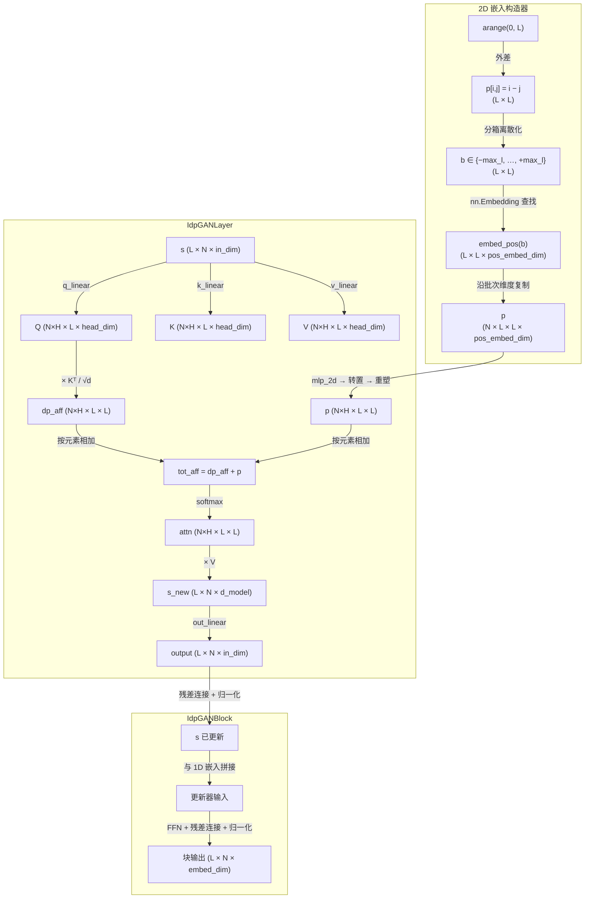

---
slug:6-custom-attention-with-2d-embeddings
blog_type:normal
---

idpGAN 生成器偏离了标准的多头自注意力机制，它引入了一个 **2D 嵌入分支**，将成对位置信息直接注入到注意力对数中。该机制不再仅仅通过 Q/K 投影来编码序列顺序，而是根据分箱的相对序列距离构建一个完整的 (L × L) 成对表示，在每个注意力头上进行投影，并在 softmax 之前**按元素将其加到点积亲和矩阵上**。其结果是一个自定义注意力层，它原生捕获残基-残基空间上下文——这是蛋白质结构生成中一种关键的归纳偏置，因为在蛋白质结构生成中，位置 i 和 j 之间的关系与每个位置独立特征同等重要。

## 架构概述

自定义注意力系统跨越三个紧密耦合的模块：**2D 位置嵌入构造器**（位于 `IdpGANGenerator.forward` 内部）、**核心注意力层**（`IdpGANLayer`）和 **Transformer 块包装器**（`IdpGANBlock`）。下图说明了它们之间的交互以及从原始序列位置到更新后的隐藏表示的数据流：

来源: [nn_models.py](/idpgan/nn_models.py#L10-L113), [nn_models.py](/idpgan/nn_models.py#L116-L228), [nn_models.py](/idpgan/nn_models.py#L309-L356)

## 2D 位置嵌入构建

2D 嵌入是在任何 Transformer 层执行之前，由**相对序列位置**构建而成的。`IdpGANGenerator.forward` 中的构建流程如下：

1. **相对位置矩阵**：将整数范围 `arange(0, L)` 通过广播相减，生成一个 (L × L) 矩阵，其中元素 (i, j) = i − j。这捕获了每对残基之间的有符号距离。

2. **分箱离散化**：通过最近邻查找（绝对差值的 `torch.argmin`），将连续的相对位置映射到从 `−pe_max_l` 到 `+pe_max_l` 的 `2 × pe_max_l + 1` 个等距分箱中。超出 `±pe_max_l` 的残基对会折叠到边界分箱中，这引入了**一个截断，使得超出该截断的所有相对位置接收相同的嵌入**——这是有意为之的，因为非常远的残基对之间不存在有意义的序列上下文。

3. **可学习嵌入查找**：分箱后的索引通过 `nn.Embedding(pe_max_l × 2 + 1, pos_embed_dim)` 进行处理，生成一个 (L × L × pos_embed_dim) 的已学习成对特征张量。

4. **批次复制**：位置嵌入仅包含序列结构，因此需沿批次维度进行 `repeat`（复制）操作，以生成 (N × L × L × pos_embed_dim) 的张量。

<CgxTip>使用 `pos_embed_max_l=24`（CG 模型的默认值）进行分箱离散化，意味着相隔超过 24 个位置的残基对将共享相同的已学习嵌入——这充当了一种隐式的局部性先验，减少了参数数量，并鼓励模型关注短到中等范围的序列关系。</CgxTip>

默认配置使用 `pos_embed_max_l=24` 和 `pos_embed_dim=64`，生成一个形状为 (49, 64) 的已学习嵌入表——总共 3,136 个位置参数。

来源: [nn_models.py](/idpgan/nn_models.py#L319-L332), [nn_models.py](/idpgan/nn_models.py#L257-L260), [nn_models.py](/idpgan/nn_models.py#L438-L446)

## IdpGANLayer — 核心注意力机制

`IdpGANLayer` 是核心创新点：一个多头自注意力层，其中标准的缩放点积亲和度被**2D 嵌入分支增强**。完整的前向计算如下：

$$\text{dp\_aff}^{(h)} = \frac{Q^{(h)} \cdot K^{(h)\top}}{\sqrt{d_{\text{norm}}}} \quad \text{其中 } d_{\text{norm}} \in \{d_{\text{model}},\, d_{\text{head}}\}$$

$$\text{tot\_aff}^{(h)} = \text{dp\_aff}^{(h)} + \text{MLP}_{2d}^{(h)}(p)$$

$$\text{attn}^{(h)} = \text{softmax}(\text{tot\_aff}^{(h)})$$

$$\text{output}^{(h)} = \text{attn}^{(h)} \cdot V^{(h)}$$

与标准注意力的关键区别在于**将 2D 分支加到点积对数上**，而不是例如在点积之前修改 Q 和 K。这种设计意味着每个注意力头都会从已学习的成对表示中获取其自身的**每对位置标量偏置**，使模型能够直接控制哪些残基对应具有强注意力——这独立于基于内容的 Q·K 相似度。

### 2D 分支：MLP 投影与重塑

形状为 (N, L, L, pos_embed_dim) 的 2D 嵌入张量 `p` 通过 `mlp_2d`——一个将 `pos_embed_dim → nhead` 进行映射的**单层线性层**。生成的 (N, L, L, nhead) 张量随后被转置为 (N, nhead, L, L) 并重塑为 (N × nhead, L, L)，使其可以直接与经过多头重塑后具有相同形状的点积亲和矩阵 `dp_aff` 相加。

`mlp_2d` 中被注释掉的代码表明，曾尝试过更深的 MLP（两个带有 ReLU 的隐藏层），但最终被单层线性投影取代——这可能是因为 `nn.Embedding` 查找已经提供了从分箱位置到特征向量的丰富非线性映射，额外的非线性并未带来实证收益。

### Q/K/V 投影与缩放

Q、K、V 线性投影从 `in_dim` 映射到 `d_model`，**不带偏置**（`bias=False`），这是 Transformer 的常见设计选择，将无内容的位置信息（由 2D 分支处理）与基于内容的注意力分离开来。缩放因子 `w_t` 由 `dp_attn_norm` 参数决定：

| `dp_attn_norm` | 缩放 | 原理 |
|---|---|---|
| `"d_model"`（默认） | 1 / √d_model | 标准 Transformer 缩放；按总嵌入维度进行归一化 |
| `"head_dim"` | 1 / √head_dim | 按头归一化；产生更大的对数，从而可以放大 2D 偏置的贡献 |

### 输出投影

经过注意力加权的值聚合生成形状为 (L, N, d_model) 的 `s_new` 后，最终的 `out_linear: d_model → in_dim` 将其投影回输入维度，完成与残差兼容的接口。

来源: [nn_models.py](/idpgan/nn_models.py#L116-L228)

## IdpGANBlock — 具有双重嵌入的 Transformer 块

`IdpGANBlock` 将 `IdpGANLayer` 封装成一个完整的 Transformer 块，集成了 **2D 成对嵌入**和 **1D 氨基酸嵌入**。该块遵循标准的 Transformer 宏观架构——注意力 → 残差 → 归一化 → 前馈 → 残差 → 归一化——并带有两个关键扩展：

### 1D 氨基酸嵌入（更新器输入）

当设置了 `embed_dim_1d`（默认为 32）时，形状为 (L, N, embed_dim_1d) 的氨基酸特征向量 `x` 在送入前馈更新器模块之前被**拼接**到隐藏状态 `s` 上，将更新器的输入维度从 `embed_dim` 扩展到 `embed_dim + embed_dim_1d`。这允许逐位置前馈网络根据每个位置的氨基酸身份来条件化其更新——这是一种与注意力机制本身不同的、由序列信息驱动的特征变换形式。

### 层归一化位置

`norm_pos` 参数控制层归一化是应用于每个子层**之前**（`"pre"`）还是**之后**（`"post"`，默认）：

| `norm_pos` | 注意力路径 | 前馈路径 | 备注 |
|---|---|---|---|
| `"post"` | s + Attn(s) → Norm → ... | s + FFN(s) → Norm | 原始 Transformer 公式 |
| `"pre"` | Norm(s) → Attn → s + ... | Norm(Linear(s)) → FFN → s + ... | 前馈路径中带有额外线性的 Pre-norm |

`"pre"` 变体引入了一个额外的 `pre_linear` 层，在前馈路径的归一化之前对拼接的 [s, x] 输入进行变换，为隐藏状态和氨基酸特征提供了额外的已学习混合。

### Dropout 与嵌入重复策略

`dropout` 参数（`None` 完全禁用，`0.0` 应用模块但不进行 dropout，`>0` 应用随机 dropout）控制残差连接的随机性。`use_embed_repeat` 标志（在生成器级别设置，而非每个块设置）决定了 2D 和 1D 嵌入是提供给**所有** Transformer 层（`True`，默认）还是仅提供给**第一层**（`False`）。当重复提供时，每个块都会接收到全新的成对和氨基酸上下文；当不重复时，后续层必须仅通过隐藏状态传播此信息。

<CgxTip>设置 `use_embed_repeat=True`（默认值）有效地使每一层都“感知”到序列组成和成对几何结构，而 `use_embed_repeat=False` 则迫使网络学习通过深度来保留这些信息——前者收敛更快，后者可能在训练期间未见过的更长序列上泛化得更好。</CgxTip>

来源: [nn_models.py](/idpgan/nn_models.py#L10-L113), [nn_models.py](/idpgan/nn_models.py#L276-L298), [nn_models.py](/idpgan/nn_models.py#L347-L356)

## 张量形状参考

下表追踪了 `IdpGANLayer` 一次前向传播中完整的张量形状演变过程，使用默认的文章配置（`d_model=128`、`nhead=8`、`head_dim=16`、`pos_embed_dim=64`）：

| 阶段 | 张量 | 形状 | 备注 |
|---|---|---|---|
| 输入 | `s` | (L, N, 64) | embed_dim = 64 |
| Q/K/V 线性变换后 | `q, k, v` | (L, N, 128) | d_model = 128 |
| 多头重塑后 | `q, k, v` | (N×8, L, 16) | 批次×头数已合并 |
| 点积亲和度 | `dp_aff` | (N×8, L, L) | 按 1/√128 缩放 |
| 2D 输入 | `p` | (N, L, L, 64) | pos_embed_dim = 64 |
| mlp_2d 后 | `p` | (N, L, L, 8) | 投影至 nhead |
| 转置 + 重塑后 | `p` | (N×8, L, L) | 每头成对偏置 |
| 总亲和度 | `tot_aff` | (N×8, L, L) | dp_aff + p |
| 注意力权重 | `attn` | (N×8, L, L) | 逐行 softmax |
| 注意力输出 | `s_new` | (L, N, 128) | 从头数重塑回原状 |
| 最终输出 | `output` | (L, N, 64) | out_linear 投影 |

来源: [nn_models.py](/idpgan/nn_models.py#L155-L228)

## 默认配置参数

下表总结了控制自定义注意力行为的所有参数，其值来自已发表的 CG 模型配置（`load_netg_article`）：

| 参数 | 默认值 | 作用域 | 描述 |
|---|---|---|---|
| `d_model` | 128 | `IdpGANLayer` | Q/K/V 投影的总维度 |
| `nhead` | 8 | `IdpGANLayer` | 注意力头数量 |
| `head_dim` | 16 | 派生 | = d_model / nhead |
| `dp_attn_norm` | `"d_model"` | `IdpGANLayer` | 点积的缩放分母 |
| `in_dim_2d` | 64 | `IdpGANLayer` | 2D MLP 的输入维度（ = pos_embed_dim） |
| `use_bias_2d` | `True` | `IdpGANLayer` | 2D 线性投影是否包含偏置 |
| `pos_embed_dim` | 64 | `IdpGANGenerator` | 已学习位置嵌入的维度 |
| `pos_embed_max_l` | 24 | `IdpGANGenerator` | 相对位置分箱的截断值 |
| `embed_dim_1d` | 32 | `IdpGANBlock` | 氨基酸 1D 嵌入维度 |
| `use_embed_repeat` | `True` | `IdpGANGenerator` | 向所有层提供嵌入 |
| `norm_pos` | `"post"` | `IdpGANBlock` | 层归一化位置 |

来源: [nn_models.py](/idpgan/nn_models.py#L432-L450)

## 对比：标准注意力 vs. idpGAN 注意力

| 方面 | 标准多头注意力 | idpGAN 自定义注意力 |
|---|---|---|
| 位置编码 | 加到输入嵌入或 Q/K 中 | 加到注意力对数的独立 2D 分支 |
| 成对信息 | 通过 Q·K 交互隐式获取 | 通过已学习的 (L × L) 表示显式获取 |
| 每头位置偏置 | 无（在头间共享） | 有（mlp_2d 输出 nhead 个通道） |
| 长程位置处理 | 正弦或已学习的绝对位置 | 带有截断的分箱相对位置 |
| 氨基酸条件化 | 通常为输入拼接 | 独立的 1D 嵌入至更新器 + 2D 嵌入至注意力 |
| Q/K/V 偏置 | 通常为 `True` | `False`（无内容偏置委托给 2D 分支） |
| 生物学动机 | 通用序列建模 | IDP 构象的残基对距离几何 |

来源: [nn_models.py](/idpgan/nn_models.py#L116-L228)

## 继续探索

自定义注意力层是完整 [Transformer 生成器网络](5-transformer-generator-network)的组件，该网络编排了潜在噪声嵌入、氨基酸编码、多层 Transformer 块和 3D 坐标输出。关于使用相同注意力架构来选择正确镜像的伴随网络，请参阅 [镜像选择器网络](7-mirror-image-selector-network)。