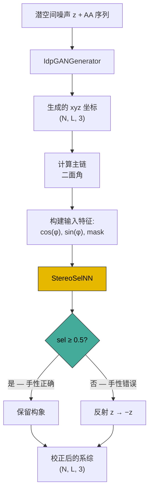
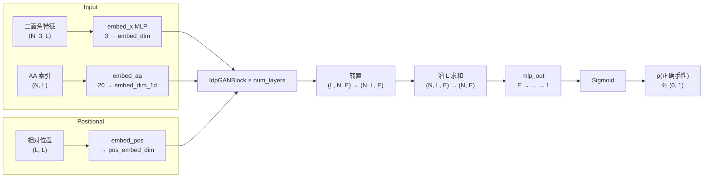

---
slug:7-mirror-image-selector-network
blog_type:normal
---


**镜像图像选择器网络**（`StereoSelNN`）是一个基于 Transformer 的二分类器，用于解决基于坐标的生成模型中固有的**手性模糊**问题。当生成器从潜空间噪声生成 3D 构象时，它没有内在机制来强制保持一致的手性——每个生成的结构都可能等价于其镜像。选择器网络通过预测每个构象是否表现出正确的立体化学来弥补这一缺陷，从而能够自动对不符合条件的构象进行镜像反射。该网络是 **ABSINTH 模型变体**（`ABSIdpGANGenerator`）的关键后处理组件，该变体用于生成手性具有物理意义的全原子 Cα 轨迹。

来源: [nn_models.py](idpgan/nn_models.py#L453-L573)

## 坐标生成中的手性问题

将潜向量映射到 3D 位置的基于坐标的生成模型，其本身无法区分构象与其镜像。在训练期间常用的基于距离和基于坐标的损失函数下，两者都是同等有效的解。这是因为反射所有 z 坐标（z → −z）会保留所有成对距离和大多数训练目标。对于粗粒度残基级模型，这种模糊性通常是可以容忍的——CG 模型是非手性的。然而，当生成旨在表示全原子主链几何形状的 **Cα 轨迹** 时（如 ABSINTH 变体中），主链的手性就具有了物理意义。主链二面角 (φ, ψ) 定义了局部立体化学，镜像构象对应于反转所有二面角的符号——这是一种完全不同的 Ramachandran 分布。

下图说明了选择器网络如何融入 ABSINTH 推理流程：



来源: [nn_models.py](idpgan/nn_models.py#L576-L612), [coords.py](idpgan/coords.py#L5-L19)

## 架构：StereoSelNN

`StereoSelNN` 与 `IdpGANGenerator` 共享相同的结构骨架——位置编码模块、输入投影 MLP、氨基酸嵌入、一堆 `IdpGANBlock` Transformer 层以及一个最终的 MLP 头。关键的架构差异在于**输入模态**、**输出头**和**序列级池化**策略。

### 输入表示

与生成器（消耗潜空间噪声向量）不同，选择器在从已生成的坐标派生出的**二面角特征**上进行操作。每个残基由一个 3 维特征向量表示：

| 特征索引 | 内容 | 描述 |
|---|---|---|
| 0 | cos(φᵢ) | 主链二面角的余弦 |
| 1 | sin(φᵢ) | 主链二面角的正弦 |
| 2 | maskᵢ | 二值有效性掩码（0 代表末端/填充残基，否则为 1） |

使用 sin/cos 编码避免了 ±π 处的不连续性，并为角度数据提供了自然的循环表示。掩码通道指示哪些残基具有有效的二面角——第一个残基和最后两个残基没有定义的二面角，并被掩码置零。这使得 `in_dim=3`，这是 `StereoSelNN` 的第一个参数。

输入张量 `x` 的形状为 `(N, 3, L)`，在内部被转置为 `(L, N, 3)`，以匹配 Transformer 的 `(seq_len, batch, features)` 约定。

来源: [nn_models.py](idpgan/nn_models.py#L458-L465), [nn_models.py](idpgan/nn_models.py#L534-L545), [nn_models.py](idpgan/nn_models.py#L594-L599)

### 输出头和序列池化

这是选择器与生成器差异最大的地方。生成器的 MLP 头生成每个残基的 3D 坐标（`embed_dim → 3`）。选择器必须对每个构象产生**单一的二分类决策**。这通过两步实现：

1. **全局求和池化** —— 在 Transformer 堆叠层之后，隐藏状态的形状为 `(L, N, embed_dim)`。它们被转置为 `(N, L, embed_dim)` 并在序列维度 L 上求和，无论蛋白质长度如何，都会产生一个形状为 `(N, embed_dim)` 的固定大小向量。这种池化对重新索引是置换不变的，并将所有残基的信息聚合到一个表示中。

2. **Sigmoid 激活的 MLP** —— 池化后的向量通过 `mlp_out`，它由 `n_hl_out` 个隐藏层（`embed_dim → embed_dim` 带激活）组成，随后是一个终端线性投影（`embed_dim → 1`）和一个 **Sigmoid** 激活。输出是 (0, 1) 中的标量，表示构象具有正确手性的概率。

来源: [nn_models.py](idpgan/nn_models.py#L524-L531), [nn_models.py](idpgan/nn_models.py#L569-L573)

### 完整架构摘要



来源: [nn_models.py](idpgan/nn_models.py#L453-L573)

## 构造函数参数

`StereoSelNN.__init__` 的完整参数集如下所示，按功能角色组织：

| 参数 | 默认值 | 角色 |
|---|---|---|
| `in_dim` | *(必填)* | 输入特征维度（3 用于 cos/sin/mask 二面角编码） |
| `embed_dim` | *(必填)* | Transformer 隐藏嵌入维度 |
| `d_model` | *(必填)* | 注意力 Q/K/V 投影维度 |
| `nhead` | *(必填)* | 注意力头数 |
| `dim_feedforward` | *(必填)* | 每个 Transformer 块中的前馈内层维度 |
| `dropout` | *(必填)* | Dropout 率（None 表示禁用 dropout） |
| `num_layers` | *(必填)* | `IdpGANBlock` 层数 |
| `layer_norm_eps` | *(必填)* | LayerNorm epsilon |
| `norm_pos` | `"post"` | LayerNorm 位置：`"post"` 或 `"pre"` |
| `dp_attn_norm` | `"d_model"` | 注意力缩放：`"d_model"` (÷√d_model) 或 `"head_dim"` (÷√head_dim) |
| `n_hl_out` | `1` | 输出 MLP 中的隐藏层数 |
| `n_hl_embed` | `1` | 输入嵌入 MLP 中的隐藏层数 |
| `activation` | `"relu"` | 激活函数：`"relu"`, `"elu"`, `"lrelu"`, `"swish"` |
| `use_embed_repeat` | `True` | 将 AA + 位置嵌入馈送到所有 Transformer 层 |
| `embed_dim_1d` | `32` | 氨基酸嵌入维度 |
| `pos_embed_dim` | `64` | 位置嵌入维度 |
| `use_bias_2d` | `True` | 2D 位置 → 注意力头投影中的偏置 |
| `pos_embed_max_l` | `32` | 用于分箱的最大相对位置偏移量 |
| `init_params` | `False` | *(在当前实现中未使用)* |

来源: [nn_models.py](idpgan/nn_models.py#L458-L477)

## 前向传播

`forward` 方法签名如下：

```python
def forward(self, x, a, out_feature=None):
```

| 参数 | 形状 | 描述 |
|---|---|---|
| `x` | `(N, 3, L)` | 二面角特征 (cos, sin, mask) |
| `a` | `(N, L)` | 氨基酸索引张量（整数，0–19） |
| `out_feature` | `None` | *(保留参数，在当前实现中未使用)* |
| **返回值** | `(N, 1)` | 每个构象的正确手性概率 |

前向传播经历以下阶段：从相对残基偏移量计算位置嵌入 → 通过 `embed_x` 进行输入投影 → 通过 `embed_aa` 进行氨基酸嵌入 → 堆叠的 `IdpGANBlock` Transformer 层（带 2D 位置和 1D 氨基酸条件） → 在序列维度上进行全局求和池化 → 带终端 Sigmoid 的 `mlp_out` → 标量输出。

来源: [nn_models.py](idpgan/nn_models.py#L534-L573)

## 在 ABSIdpGANGenerator 中的集成

`ABSIdpGANGenerator` 类将生成器和选择器组合成一个单一的推理流程。其 `predict_idp` 方法执行以下序列：

1. **生成构象** —— `self.idpgan.predict_idp(...)` 生成原始 xyz 坐标和氨基酸编码。
2. **计算二面角** —— `torch_chain_dihedrals(xyz_gen)` 从 Cα 轨迹计算主链二面角。边界填充在第一个位置和最后两个位置添加零，以维持序列长度对齐。
3. **构建选择器输入** —— 二面角沿特征维度分解为 `[cos(φ), sin(φ), mask]`，其中掩码将第一个残基和最后两个残基（未定义二面角）置零。
4. **运行选择器** —— `self.msel(x, a.argmax(axis=1))` 为每个构象生成一个概率。argmax 将独热 AA 编码转换为选择器嵌入层所需的整数索引。
5. **必要时反射** —— 对于 `sel < 0.5`（预测为错误手性）的构象，其 z 坐标取反：`xyz_gen[reflect_mask, :, -1] *= -1`。此反射将构象转换为其镜像，从而校正手性。

<CgxTip>反射操作 `z → −z` 是一种手性反转，它将左手主链映射为右手主链（反之亦然）。反射后，所有二面角改变符号，这就是为什么选择器只需做出二分类决策——对于任何给定的距离几何，都恰好存在两种可能的手性。</CgxTip>

来源: [nn_models.py](idpgan/nn_models.py#L576-L612)

## 预训练配置

本项目的预训练选择器通过 `load_abs_netg_article` 实例化，其超参数如下：

| 参数 | 值 |
|---|---|
| `in_dim` | 3 |
| `embed_dim` | 96 |
| `d_model` | 128 |
| `nhead` | 8 |
| `dim_feedforward` | 256 |
| `dropout` | 0.0 |
| `num_layers` | 8 |
| `layer_norm_eps` | 1e-5 |
| `norm_pos` | `"pre"` |
| `dp_attn_norm` | `"d_model"` |
| `n_hl_out` | 1 |
| `n_hl_embed` | 1 |
| `activation` | `"lrelu"` |
| `use_embed_repeat` | True |
| `embed_dim_1d` | 32 |
| `pos_embed_dim` | 64 |
| `use_bias_2d` | True |
| `pos_embed_max_l` | 32 |

与 CG 生成器配置相比，选择器使用了更大的 `embed_dim`（96 对 64）、更大的 `dim_feedforward`（256 对 128）、pre-norm（`norm_pos="pre"`）以及更宽的位置分箱范围（`pos_embed_max_l=32`）。`embed_dim` 为 96 不等于 `d_model`（128），这意味着输入投影 MLP 必须在内部通过 `IdpGANBlock` 路由从 96 桥接到注意力的 128 维空间。

来源: [nn_models.py](idpgan/nn_models.py#L638-L645)

## 对比：生成器 vs. 选择器

| 方面 | `IdpGANGenerator` | `StereoSelNN` |
|---|---|---|
| **输入** | 潜空间噪声 z `(N, nz, L)` + AA 独热编码 | 二面角特征 `(N, 3, L)` + AA 索引 |
| **输入投影** | `nz → embed_dim` | `in_dim(3) → embed_dim` |
| **输出头** | `embed_dim → 3`（逐残基 xyz） | `embed_dim → 1`（标量概率） |
| **输出激活** | 无（无界坐标） | Sigmoid（有界至 (0,1)） |
| **序列池化** | 无（逐残基输出） | 沿 L 全局求和 |
| **目的** | 生成 3D 坐标 | 分类手性 |
| **用于** | CG 模型，ABSINTH 模型 | 仅 ABSINTH 模型 |

来源: [nn_models.py](idpgan/nn_models.py#L231-L411), [nn_models.py](idpgan/nn_models.py#L453-L573)

## 加载与使用

选择器在公共 API 中从不孤立使用——它始终作为复合 `ABSIdpGANGenerator` 的一部分通过 `load_abs_netg_article` 加载：

```python
from idpgan.nn_models import load_abs_netg_article

abs_netg = load_abs_netg_article(
    model_fp="data/abs_generator.pt",       # 生成器权重
    sel_model_fp="data/abs_selector.pt",     # 选择器权重
    device=device
)

# 选择器在 predict_idp 内部自动运行
xyz = abs_netg.predict_idp(
    n_samples=5000,
    aa_seq="MACYPVNIRARGLGKNMGMKSRGRGKG",
    device=device,
    batch_size=32
)
```

`predict_idp` 调用在内部生成构象、运行选择器并反射错误手性结构——返回的坐标已经过手性校正。请注意，这种双通道推理（生成器 + 选择器）比纯 CG 生成器慢，正如 notebook 中所述：*"abs-idpGAN 生成器模型需要运行基于神经网络的后处理步骤，以选择每个生成构象的正确镜像。"*

<CgxTip>`ABSIdpGANGenerator.predict_idp` 中的 `batch_size` 参数独立控制生成器和选择器的批处理。选择器在其自身的推理循环中（第 603 行）使用相同的 `batch_size` 值，因此减小批大小可以节省峰值 GPU 显存，但代价是更多迭代次数。</CgxTip>

来源: [nn_models.py](idpgan/nn_models.py#L615-L653), [idpgan_experiments.ipynb](notebooks/idpgan_experiments.ipynb#L1017-L1072)

## 后续步骤

- 了解生成器网络如何生成随后由选择器分类的构象：[Transformer 生成器网络](5-transformer-generator-network)
- 理解两个网络共享的带 2D 位置嵌入的自定义注意力机制：[带 2D 嵌入的自定义注意力](6-custom-attention-with-2d-embeddings)
- 查看组合了生成器 + 选择器的 ABSINTH 模型变体：[ABSINTH 模型变体](15-absinth-model-variant)
- 探索用于构建选择器输入的二面角计算：[二面角计算](9-dihedral-angle-computation)