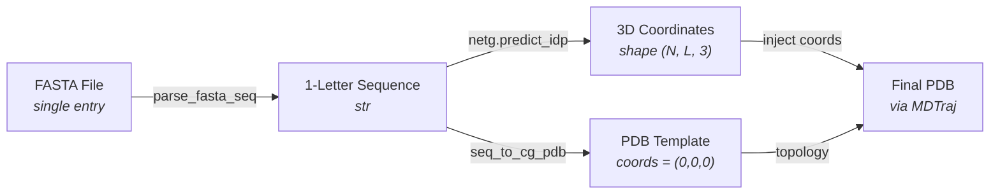

---
slug:8-fasta-parsing-and-pdb-output
blog_type:normal
---


`idpgan.data` 模块为 idpgan 提供了**数据输入与输出层** —— 它从 FASTA 文件中读取氨基酸序列，并将粗粒化（CG）结构模板写入 PDB 格式的文件。这两项操作构成了整个推理流水线的 I/O 边界：序列从 FASTA 输入，生成的三维构象通过 PDB 输出。本页将介绍构成该桥梁的三个公共符号 —— `parse_fasta_seq`、`one_to_three` 和 `seq_to_cg_pdb`。

来源: [data.py](idpgan/data.py#L1-L54)

## FASTA 解析：`parse_fasta_seq`

`parse_fasta_seq(fasta_fp)` 读取一个**单条目** FASTA 文件，并将其氨基酸序列作为单字母代码的普通字符串返回。该函数打开位于 `fasta_fp` 的文件，将全部内容读入内存，统计 `>` 头部标记的数量，然后将所有非头部行（右侧剥离空白字符）拼接为输出序列。这种“先读全文件再校验”的策略在保持实现简洁的同时，通过两个 `ValueError` 守卫强制执行了严格的**单条目约束**：一个用于零条目情况（`"No entry found in the input file."`），另一个用于多条目情况（`"Can only read FASTA files with one entry."`）。单条目约束是出于架构考虑，而非随意设定 —— idpgan 在每次推理调用中生成**一个蛋白质构象系综**，因此每个 FASTA 文件严格对应一个序列。

| 参数 | 类型 | 描述 |
|-----------|------|-------------|
| `fasta_fp` | `str` | 单条目 FASTA 文件的路径 |
| **返回值** | `str` | 拼接为单字母代码的氨基酸序列 |

该函数**不**验证序列字符是否为有效的氨基酸代码 —— 无效的残基将在后续 `seq_to_cg_pdb` 查找 `one_to_three` 字典时，以 `KeyError` 的形式暴露出来。这种延迟失败的设计将解析器的职责严格限定在格式验证上。

```python
from idpgan.data import parse_fasta_seq

seq = parse_fasta_seq("data/polyala.fasta")
# → "AAAAAAAAAAAAAAAAAAAAAAAAAAAAAAAAAAAAAAAAAAAAAAAAAAAAAAA"
```

来源: [data.py](idpgan/data.py#L4-L18)

### 仓库中的 FASTA 文件约定

该仓库在 `data/` 目录下提供了多个 FASTA 文件，根据其与 `parse_fasta_seq` 的兼容性，它们分为两类。**单条目文件**（如 `polyala.fasta`、`protan.fasta` 和 `protac.fasta`）可被解析器直接使用 —— 每个文件包含一个 `>` 头部，其后跟随一行或多行序列。**多条目文件**（如包含 19 个条目的 `idptest.fasta` 和包含 14 个条目的 `abstest.fasta`）若直接传入将引发 `ValueError`；这些文件用作训练/测试集集合，在单独推理前必须进行拆分。`polyala.fasta` 文件是最简单的示例：单个头部 `>polyala_55`，其后在同一行跟随 55 个丙氨酸残基。

来源: [polyala.fasta](data/polyala.fasta#L1-L3), [idptest.fasta](data/idptest.fasta#L1-L94), [abstest.fasta](data/abstest.fasta#L1-L45)

## 氨基酸代码映射：`one_to_three`

模块级字典 `one_to_three` 提供了一个**静态翻译表**，将 20 种标准单字母氨基酸代码（字典键）映射为其 IUPAC 三字母残基名称（字典值）。该表是 FASTA 导出的单字母序列与 PDB ATOM 记录格式所需的三字母残基代码之间的**唯一桥梁**。该字典涵盖了全部 20 种标准残基 —— 非标准或修饰氨基酸（如硒代半胱氨酸 `U`、吡咯赖氨酸 `O`）未包含在内，将在生成 PDB 时引发 `KeyError`。

| 单字母 | 三字母 | 单字母 | 三字母 | 单字母 | 三字母 | 单字母 | 三字母 |
|:--------:|:--------:|:--------:|:--------:|:--------:|:--------:|:--------:|:--------:|
| A | ALA | C | CYS | D | ASP | E | GLU |
| F | PHE | G | GLY | H | HIS | I | ILE |
| K | LYS | L | LEU | M | MET | N | ASN |
| P | PRO | Q | GLN | R | ARG | S | SER |
| T | THR | V | VAL | W | TRP | Y | TYR |

来源: [data.py](idpgan/data.py#L21-L24)

## PDB 模板生成：`seq_to_cg_pdb`

`seq_to_cg_pdb(seq, out_fp=None, rename_to_ca=False)` 将单字母氨基酸序列转换为**粗粒化 PDB 模板** —— 在此文件中，每个残基由一条 ATOM 记录表示，其坐标初始化为原点 (0.000, 0.000, 0.000)。这些零值坐标是刻意为之的：该模板定义了**拓扑结构**（残基名称、链分配、原子类型），而非几何结构。实际的三维坐标将在推理阶段由生成器网络后续注入。该函数将完整的 PDB 内容作为字符串返回，并在提供 `out_fp` 时可选地将其写入磁盘。

| 参数 | 类型 | 默认值 | 描述 |
|-----------|------|---------|-------------|
| `seq` | `str` | *必填* | 单字母氨基酸序列（通常来自 `parse_fasta_seq`） |
| `out_fp` | `str` 或 `None` | `None` | 输出文件路径。若为 `None`，则不写入文件。 |
| `rename_to_ca` | `bool` | `False` | 若为 `True`，原子名称为 `CA`；否则为 `CG` |
| **返回值** | `str` | — | 作为单一字符串的完整 PDB 文件内容 |

### PDB ATOM 记录结构

每个残基生成一条 ATOM 行，按照 **PDB 固定宽度列规范** 格式化。格式字符串 `"ATOM{:>7} {}   {} A{:>4}       0.000   0.000   0.000  1.00  0.00\n"` 生成的记录如下：

```
ATOM      1 CG   ALA A   1       0.000   0.000   0.000  1.00  0.00
ATOM      2 CG   CYS A   2       0.000   0.000   0.000  1.00  0.00
ATOM      3 CG   ASP A   3       0.000   0.000   0.000  1.00  0.00
```

关键列为：**序列号**（从 1 起始的残基索引，右对齐）、**原子名称**（`CG` 或 `CA`）、**残基名称**（来自 `one_to_three` 的三字母代码）、**链标识符**（始终为 `A`）、**残基序列号**（与序列号相同）、**xyz 坐标**（全为零）、**占有率**（1.00）和 **B 因子**（0.00）。链被硬编码为 `A` —— 生成器仅生成单链构象。

来源: [data.py](idpgan/data.py#L26-L46)

### CG 与 CA 原子命名

`rename_to_ca` 标志控制着一个**语义区别**，该区别会影响下游工具的兼容性：

| 模式 | `rename_to_ca` | 原子名称 | 典型用例 |
|------|:--------------:|:---------:|------------------|
| **CG**（默认） | `False` | `CG` | 每个残基对应一个粗粒化珠 —— idpgan 的原生表示 |
| **CA** | `True` | `CA` | Cα 轨迹 —— 兼容全原子查看器与 MDTraj |

<CgxTip>`rename_to_ca` 标志对于互操作性至关重要。当 `seq_to_cg_pdb` 用于为 MDTraj 创建拓扑文件时（如实验笔记本中所做的那样），CG 原子类型可能会被某些分子查看器误分类为 HETATM。设置 `rename_to_ca=True` 可确保文件被 PyMOL、VMD 和 MDTraj 识别为有效的 Cα 轨迹。ABSINTH 模型变体天然输出 Cα 轨迹，因此 `rename_to_ca=True` 是该流水线的合适选择。</CgxTip>

来源: [data.py](idpgan/data.py#L31-L34)

## 端到端流水线：FASTA → PDB

这两个函数组合成一个自然的数据摄取流水线，代表了完整[生成器推理流水线](17-generator-inference-pipeline)的**入口点**。在实践中，笔记本展示了两种不同的组合模式。

**模式 1 —— 用于生成的序列：** 解析后的序列直接送入神经网络的 `predict_idp` 方法，生成三维坐标。PDB 模板则单独创建以供可视化。

**模式 2 —— 用于 MDTraj 拓扑的 PDB：** 生成的 PDB 文件充当**拓扑参考**，MDTraj 利用它来解释生成器产生的原始 numpy 坐标数组。这就是笔记本第 949–950 行和第 1263–1264 行所见的作用，其中 `seq_to_cg_pdb(custom_seq, out_fp=top_fp)` 创建了一个文件，随后由 `mdtraj.load(top_fp).topology` 读取。



结合这两个函数的极简工作示例：

```python
from idpgan.data import parse_fasta_seq, seq_to_cg_pdb

# Parse sequence from FASTA
seq = parse_fasta_seq("data/protan.fasta")
# → "CDAAVDTSSEITTKDLKEKKEVVEEAENGRDAPANGNANEENGEQEADNEVDEEC"

# Generate a CG PDB template (coordinates at origin)
pdb_content = seq_to_cg_pdb(seq, out_fp="protan_template.pdb")

# Generate a CA-trace PDB template for MDTraj compatibility
pdb_ca = seq_to_cg_pdb(seq, out_fp="protan_ca.pdb", rename_to_ca=True)
```

来源: [data.py](idpgan/data.py#L4-L46), [idpgan_experiments.ipynb](notebooks/idpgan_experiments.ipynb#L226-L238), [idpgan_experiments.ipynb](notebooks/idpgan_experiments.ipynb#L948-L951)

## 错误处理参考

FASTA 解析器实现了**快速失败验证**，在格式错误传播到神经网络之前将其捕获。下表汇总了 FASTA→PDB 流水线中的所有失败模式：

| 失败模式 | 引发者 | 异常 | 触发条件 |
|:-------------|:----------|:----------|:--------|
| 空文件或无头部文件 | `parse_fasta_seq` | `ValueError` | 文件包含零个 `>` 标记 |
| 多条目 FASTA | `parse_fasta_seq` | `ValueError` | 文件包含超过一个 `>` 标记 |
| 非标准氨基酸 | `seq_to_cg_pdb` | `KeyError` | 序列字符不在 `one_to_three` 中 |

关注点分离是刻意为之的：`parse_fasta_seq` 负责**格式**验证（这是否是有效的单条目 FASTA？），而 `seq_to_cg_pdb` 负责**语义**验证（这些是否是有效的氨基酸代码？）。这意味着格式有效但包含无效残基的 FASTA 文件（例如 `>test\nXZP`）将成功解析，但在生成 PDB 时失败 —— 错误消息将是针对第一个无效字符的 Python 默认 `KeyError`。

来源: [data.py](idpgan/data.py#L9-L13), [data.py](idpgan/data.py#L38)

## 后续指引

本文档所述的 FASTA 和 PDB 实用程序是 idpgan 流水线的 I/O 层。序列向下游流入[氨基酸特征编码](10-amino-acid-encoding)，进行数值化表示以供神经网络消费，而零初始化的 PDB 模板则接收通过[二面角计算](9-dihedral-angle-computation)得出的真实坐标。有关从 FASTA 文件到最终三维结构系综的完整工作流，请参阅[生成器推理流水线](17-generator-inference-pipeline)。