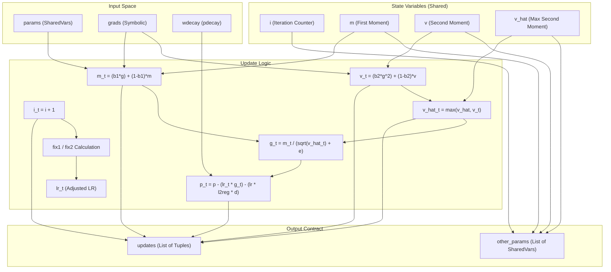
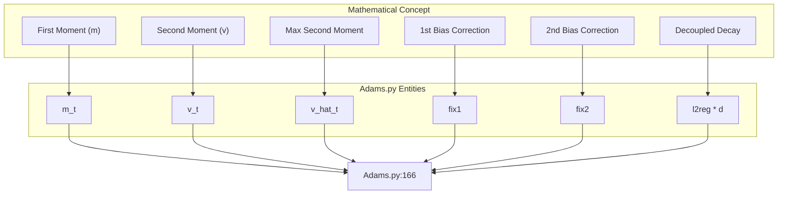

# Adam-Family Optimizers

> **Relevant source files**
> * [Adams.py](https://github.com/nd-hung/DL4DistancePrediction2/blob/11ce7818/Adams.py)

The `Adams.py` module provides implementations of the Adam optimization algorithm and its variants, including AMSGrad and decoupled weight decay versions (AdamW). These optimizers are implemented using Theano's symbolic graph framework, utilizing shared variables to maintain internal states across training iterations.

## Overview of Optimizers

The module implements four primary variants of the Adam optimizer. All functions follow a consistent return contract, providing a list of Theano update pairs and a list of internal state parameters (shared variables) for tracking.

| Function | Algorithm | Key Feature |
| --- | --- | --- |
| `Adam` | Adaptive Moment Estimation | Standard implementation with bias correction. |
| `AMSGrad` | AMSGrad | Uses the maximum of past squared gradients to prevent non-convergence. |
| `AdamW` | Adam with Decoupled Weight Decay | Separates L2 regularization from the gradient update step. |
| `AdamWAMS` | Hybrid AdamW + AMSGrad | Combines decoupled weight decay with the `v_hat` stability of AMSGrad. |

**Sources:** [Adams.py L30-L174](https://github.com/nd-hung/DL4DistancePrediction2/blob/11ce7818/Adams.py#L30-L174)

---

## State Variables and Hyperparameters

Each optimizer manages several state variables for every model parameter `p`. These are stored as `theano.shared` variables to persist between calls to the compiled Theano function.

### Internal State Variables

* `i`: Iteration counter (scalar), used for bias correction [Adams.py L35-L37](https://github.com/nd-hung/DL4DistancePrediction2/blob/11ce7818/Adams.py#L35-L37)
* `m`: First moment vector (moving average of gradients) [Adams.py L43-L45](https://github.com/nd-hung/DL4DistancePrediction2/blob/11ce7818/Adams.py#L43-L45)
* `v`: Second moment vector (moving average of squared gradients) [Adams.py L44-L46](https://github.com/nd-hung/DL4DistancePrediction2/blob/11ce7818/Adams.py#L44-L46)
* `v_hat`: (AMSGrad only) The element-wise maximum of all previous `v` values [Adams.py L75-L78](https://github.com/nd-hung/DL4DistancePrediction2/blob/11ce7818/Adams.py#L75-L78)

### Hyperparameters

The functions accept standard Adam hyperparameters:

* `lr`: Learning rate (default `0.0002`).
* `b1` ($\beta_1$): Exponential decay rate for the first moment (default `0.1`).
* `b2` ($\beta_2$): Exponential decay rate for the second moment (default `0.001`).
* `e` ($\epsilon$): Numerical stability constant (default `1e-8`).
* `l2reg`: Weight decay coefficient (used in `AdamW` and `AdamWAMS`).

**Sources:** [Adams.py L30-L31](https://github.com/nd-hung/DL4DistancePrediction2/blob/11ce7818/Adams.py#L30-L31)

 [Adams.py L60-L61](https://github.com/nd-hung/DL4DistancePrediction2/blob/11ce7818/Adams.py#L60-L61)

 [Adams.py L96-L97](https://github.com/nd-hung/DL4DistancePrediction2/blob/11ce7818/Adams.py#L96-L97)

 [Adams.py L134-L135](https://github.com/nd-hung/DL4DistancePrediction2/blob/11ce7818/Adams.py#L134-L135)

---

## Logic and Data Flow

The optimization process follows a symbolic update pattern. For every parameter, the first and second moments are calculated, bias-corrected, and applied to update the parameter weights.

### Bias Correction

To counteract the initialization of moments at zero, the optimizers calculate `fix1` and `fix2` based on the current iteration `i_t`:

* `fix1 = 1. - (1. - b1)**i_t` [Adams.py L39](https://github.com/nd-hung/DL4DistancePrediction2/blob/11ce7818/Adams.py#L39-L39)
* `fix2 = 1. - (1. - b2)**i_t` [Adams.py L40](https://github.com/nd-hung/DL4DistancePrediction2/blob/11ce7818/Adams.py#L40-L40)
* The effective learning rate is adjusted: `lr_t = lr * (T.sqrt(fix2) / fix1)` [Adams.py L41](https://github.com/nd-hung/DL4DistancePrediction2/blob/11ce7818/Adams.py#L41-L41)

### Weight Decay (AdamW)

In `AdamW` and `AdamWAMS`, weight decay is decoupled from the gradient-based update. Instead of adding the L2 penalty to the cost function (which would influence the moments `m` and `v`), it is applied directly to the parameter update:
`p_t = p - lr_t * g_t - lr * l2reg * d` [Adams.py L124](https://github.com/nd-hung/DL4DistancePrediction2/blob/11ce7818/Adams.py#L124-L124)

 [Adams.py L166](https://github.com/nd-hung/DL4DistancePrediction2/blob/11ce7818/Adams.py#L166-L166)

### Optimizer Data Flow Diagram

The following diagram illustrates how the `AdamWAMS` variant processes gradients and state variables to produce updates.

**Sources:** [Adams.py L134-L174](https://github.com/nd-hung/DL4DistancePrediction2/blob/11ce7818/Adams.py#L134-L174)

---

## Implementation Details

### Return Contract

All functions in `Adams.py` return a tuple: `(updates, other_params)`.

1. `updates`: A list of `(shared_variable, new_symbolic_value)` tuples. This is passed directly to `theano.function` [Adams.py L58](https://github.com/nd-hung/DL4DistancePrediction2/blob/11ce7818/Adams.py#L58-L58)  [Adams.py L93](https://github.com/nd-hung/DL4DistancePrediction2/blob/11ce7818/Adams.py#L93-L93)  [Adams.py L131](https://github.com/nd-hung/DL4DistancePrediction2/blob/11ce7818/Adams.py#L131-L131)  [Adams.py L174](https://github.com/nd-hung/DL4DistancePrediction2/blob/11ce7818/Adams.py#L174-L174)
2. `other_params`: A list of all `theano.shared` variables created (the counter and the moments). This allows the calling code to manage, save, or initialize the optimizer's internal state [Adams.py L32](https://github.com/nd-hung/DL4DistancePrediction2/blob/11ce7818/Adams.py#L32-L32)  [Adams.py L62](https://github.com/nd-hung/DL4DistancePrediction2/blob/11ce7818/Adams.py#L62-L62)  [Adams.py L103](https://github.com/nd-hung/DL4DistancePrediction2/blob/11ce7818/Adams.py#L103-L103)  [Adams.py L141](https://github.com/nd-hung/DL4DistancePrediction2/blob/11ce7818/Adams.py#L141-L141)

### AMSGrad Stability

The `AMSGrad` and `AdamWAMS` implementations include the `v_hat` logic to ensure the effective learning rate is non-increasing, which addresses convergence issues in the original Adam algorithm:
`v_hat_t = T.maximum(v_hat, v_t)` [Adams.py L82](https://github.com/nd-hung/DL4DistancePrediction2/blob/11ce7818/Adams.py#L82-L82)

 [Adams.py L163](https://github.com/nd-hung/DL4DistancePrediction2/blob/11ce7818/Adams.py#L163-L163)

### Code Entity Mapping

This diagram maps the mathematical components of the Adam algorithm to the specific variables used in the `Adams.py` implementation.

**Sources:** [Adams.py L148-L166](https://github.com/nd-hung/DL4DistancePrediction2/blob/11ce7818/Adams.py#L148-L166)

**Sources:**

* `Adam` implementation: [Adams.py L30-L58](https://github.com/nd-hung/DL4DistancePrediction2/blob/11ce7818/Adams.py#L30-L58)
* `AMSGrad` implementation: [Adams.py L60-L93](https://github.com/nd-hung/DL4DistancePrediction2/blob/11ce7818/Adams.py#L60-L93)
* `AdamW` implementation: [Adams.py L96-L131](https://github.com/nd-hung/DL4DistancePrediction2/blob/11ce7818/Adams.py#L96-L131)
* `AdamWAMS` implementation: [Adams.py L134-L174](https://github.com/nd-hung/DL4DistancePrediction2/blob/11ce7818/Adams.py#L134-L174)