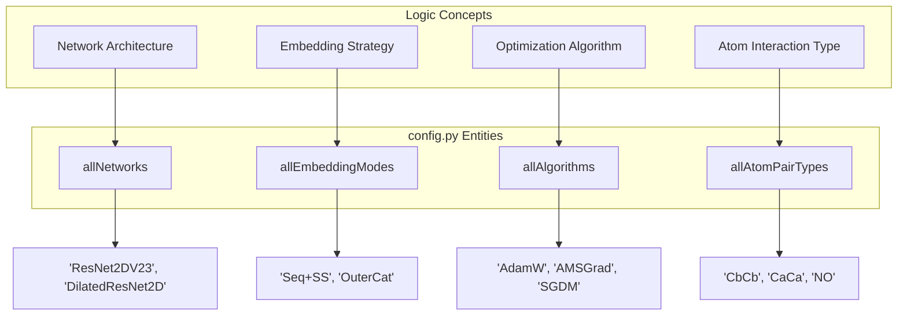
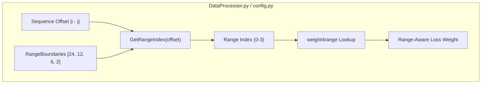

# Configuration System

> **Relevant source files**
> * [config.py](https://github.com/nd-hung/DL4DistancePrediction2/blob/11ce7818/config.py)

The configuration system in `DL4DistancePrediction2` is centralized in `config.py`. It acts as the global registry and schema definition for the entire modeling pipeline, defining how distances are discretized, how atom pairs are categorized, and how the neural network variants are structured.

## Core Model Specifications

The `InitializeModelSpecs()` function serves as the primary factory for model hyperparameters. It defines the structural dimensions of the ResNet architecture, including filter sizes, window sizes, and block counts.

### Network Variants

The system supports several architectural variants defined in the `allNetworks` list [config.py L16](https://github.com/nd-hung/DL4DistancePrediction2/blob/11ce7818/config.py#L16-L16)

 These variants differ primarily in their implementation of Batch Normalization and residual connectivity:

* **ResNet2DV23**: The recommended variant, which optimizes the standard `ResNet2D` by removing unused batch normalization layers [config.py L12-L13](https://github.com/nd-hung/DL4DistancePrediction2/blob/11ce7818/config.py#L12-L13)
* **ResNet2DV22**: Implements two batch normalization layers per residual block, contrasted with the single layer in V21 [config.py L14-L15](https://github.com/nd-hung/DL4DistancePrediction2/blob/11ce7818/config.py#L14-L15)
* **DilatedResNet2D**: Incorporates dilated convolutions to expand the receptive field without increasing parameter count.

### Input Embeddings

The pipeline supports multiple sequence-to-2D embedding modes via `allEmbeddingModes` [config.py L45](https://github.com/nd-hung/DL4DistancePrediction2/blob/11ce7818/config.py#L45-L45)

:

* `SeqOnly`: Uses only the raw primary sequence.
* `Seq+SS`: Incorporates Secondary Structure predictions.
* `OuterCat`: Utilizes the `OuterConcatenate` operation to transform 1D sequence features into 2D pairwise maps.

### Configuration Entity Mapping

The following diagram maps high-level configuration concepts to their specific identifiers in `config.py`.

**Registry Mapping: Configuration to Code Entities**

Sources: [config.py L16](https://github.com/nd-hung/DL4DistancePrediction2/blob/11ce7818/config.py#L16-L16)

 [config.py L22](https://github.com/nd-hung/DL4DistancePrediction2/blob/11ce7818/config.py#L22-L22)

 [config.py L43](https://github.com/nd-hung/DL4DistancePrediction2/blob/11ce7818/config.py#L43-L43)

 [config.py L45](https://github.com/nd-hung/DL4DistancePrediction2/blob/11ce7818/config.py#L45-L45)

## Distance Discretization & Cutoffs

Distance prediction is treated as a multi-class classification problem where continuous distances are mapped to discrete bins (responses).

### Distance Bins (distCutoffs)

The `distCutoffs` dictionary defines the thresholds for various discretization schemes [config.py L62-L87](https://github.com/nd-hung/DL4DistancePrediction2/blob/11ce7818/config.py#L62-L87)

* **Plus variants**: Schemes ending in "Plus" (e.g., `13CPlus`) treat the "non-existing" distance (represented as -1 in raw data) as a separate category. Non-plus variants merge invalid distances into the maximum distance bin [config.py L58-L60](https://github.com/nd-hung/DL4DistancePrediction2/blob/11ce7818/config.py#L58-L60)
* **Common Schemes**: * `13C`: 13 bins, ranging from 5Å to 16Å [config.py L76-L77](https://github.com/nd-hung/DL4DistancePrediction2/blob/11ce7818/config.py#L76-L77) * `52C`: High-resolution scheme with 52 bins from 4Å to 16.5Å [config.py L64](https://github.com/nd-hung/DL4DistancePrediction2/blob/11ce7818/config.py#L64-L64) * `2C`: Binary contact prediction (cutoff at 8Å) [config.py L85](https://github.com/nd-hung/DL4DistancePrediction2/blob/11ce7818/config.py#L85-L85)

### ProbScaleFactor

The `ProbScaleFactor` is a constant used to calibrate predicted contact probabilities. It is specifically designed to maximize MCC and F1 scores when a fixed threshold of 0.5 is used for binary classification [config.py L4-L9](https://github.com/nd-hung/DL4DistancePrediction2/blob/11ce7818/config.py#L4-L9)

* **Implementation**: `ProbScaleFactor = np.log(0.5)/np.log(0.4)` [config.py L9](https://github.com/nd-hung/DL4DistancePrediction2/blob/11ce7818/config.py#L9-L9)
* **Usage**: It scales a probability $p$ to $p^{ProbScaleFactor}$, effectively shifting the distribution so that a raw value of 0.4 maps to 0.5.

Sources: [config.py L4-L9](https://github.com/nd-hung/DL4DistancePrediction2/blob/11ce7818/config.py#L4-L9)

 [config.py L58-L87](https://github.com/nd-hung/DL4DistancePrediction2/blob/11ce7818/config.py#L58-L87)

## Spatial and Sequence Weighting

The system applies non-uniform weights to the loss function based on the spatial separation of residue pairs.

### Range-Based Weighting

Residue pairs are categorized by their sequence separation (offset $|i - j|$) into four ranges defined by `RangeBoundaries` [config.py L141](https://github.com/nd-hung/DL4DistancePrediction2/blob/11ce7818/config.py#L141-L141)

:

1. **Long-range**: $\ge 24$
2. **Medium-range**: $12 \le \text{offset} < 24$
3. **Short-range**: $6 \le \text{offset} < 12$
4. **Near-range**: $2 \le \text{offset} < 6$

The `weight4range` array assigns higher importance to long-range interactions: `[3.0, 2.5, 1.0, 0.5]` [config.py L156](https://github.com/nd-hung/DL4DistancePrediction2/blob/11ce7818/config.py#L156-L156)

### Data Flow for Weighting

Sources: [config.py L141-L156](https://github.com/nd-hung/DL4DistancePrediction2/blob/11ce7818/config.py#L141-L156)

## Atom Pair Types

The system supports multiple atom-atom distance predictions beyond the standard $C_\beta - C_\beta$.

* **Types**: `CbCb`, `CaCa`, `CgCg`, `CaCg`, and `NO` (Nitrogen-Oxygen) [config.py L22](https://github.com/nd-hung/DL4DistancePrediction2/blob/11ce7818/config.py#L22-L22)
* **Symmetry**: `IsSymmetricAPT()` identifies types where the distance matrix is symmetric (e.g., `CbCb`, `CaCa`), which allows the model to enforce symmetry constraints during prediction [config.py L34-L35](https://github.com/nd-hung/DL4DistancePrediction2/blob/11ce7818/config.py#L34-L35)
* **Special Matrices**: * **HB (Hydrogen Bond)**: Uses a max distance of 9.5Å [config.py L56](https://github.com/nd-hung/DL4DistancePrediction2/blob/11ce7818/config.py#L56-L56) * **Beta (Beta-pairing)**: Uses a max distance of 8.0Å [config.py L55](https://github.com/nd-hung/DL4DistancePrediction2/blob/11ce7818/config.py#L55-L55)

Sources: [config.py L22-L24](https://github.com/nd-hung/DL4DistancePrediction2/blob/11ce7818/config.py#L22-L24)

 [config.py L34-L35](https://github.com/nd-hung/DL4DistancePrediction2/blob/11ce7818/config.py#L34-L35)

 [config.py L55-L56](https://github.com/nd-hung/DL4DistancePrediction2/blob/11ce7818/config.py#L55-L56)

## Sequence Encoding

The system handles sequence information through `SeqOneHotEncoding`. This translates the 20 standard amino acids into a one-hot vector representation.

* **Invalid Residues**: The system handles non-standard or missing residues by assigning them a zero-vector or a specific "unknown" category to ensure numerical stability in the embedding layers.
* **Response Mapping**: The functions `Response2LabelType` and `Response2LabelName` are used to parse complex response strings (e.g., `CbCb_13CPlus`) into their constituent atom pair and discretization components [config.py L93-L100](https://github.com/nd-hung/DL4DistancePrediction2/blob/11ce7818/config.py#L93-L100)

Sources: [config.py L93-L100](https://github.com/nd-hung/DL4DistancePrediction2/blob/11ce7818/config.py#L93-L100)