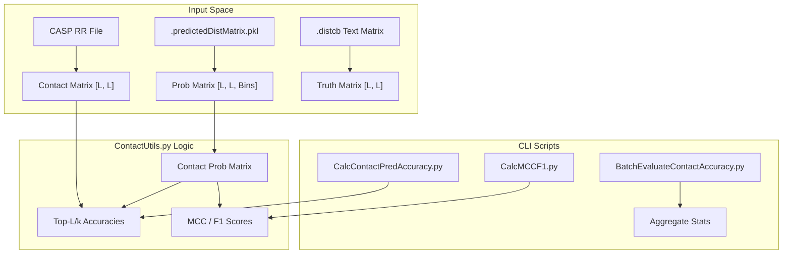
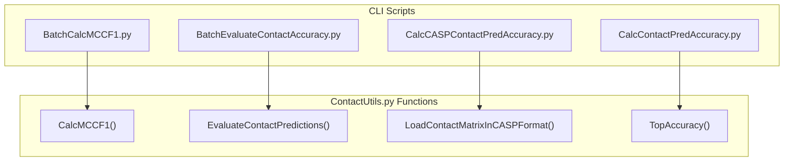

# Contact Prediction Evaluation

> **Relevant source files**
> * [BatchCalcMCCF1.py](https://github.com/nd-hung/DL4DistancePrediction2/blob/11ce7818/BatchCalcMCCF1.py)
> * [BatchEvaluateContactAccuracy.py](https://github.com/nd-hung/DL4DistancePrediction2/blob/11ce7818/BatchEvaluateContactAccuracy.py)
> * [CalcCASPContactPredAccuracy.py](https://github.com/nd-hung/DL4DistancePrediction2/blob/11ce7818/CalcCASPContactPredAccuracy.py)
> * [CalcContactPredAccuracy.py](https://github.com/nd-hung/DL4DistancePrediction2/blob/11ce7818/CalcContactPredAccuracy.py)
> * [CalcMCCF1.py](https://github.com/nd-hung/DL4DistancePrediction2/blob/11ce7818/CalcMCCF1.py)
> * [ContactUtils.py](https://github.com/nd-hung/DL4DistancePrediction2/blob/11ce7818/ContactUtils.py)

This page describes the evaluation framework for assessing protein contact predictions. The system supports various metrics including Top-L accuracy, Matthew's Correlation Coefficient (MCC), and F1-score across different sequence separation ranges (Short, Medium, and Long). It also provides utilities for handling CASP-format residue-residue (RR) files and batch processing multiple targets.

## Overview of Evaluation Logic

The evaluation process typically involves comparing a predicted contact probability matrix against a ground truth distance matrix (usually $C\beta-C\beta$ distances). The core logic is implemented in `ContactUtils.py`, which leverages `Metrics.py` for statistical calculations.

### Key Evaluation Workflow

1. **Loading**: Load predicted matrices (text, PKL, or CASP format) and ground truth matrices.
2. **Transformation**: Convert distance probability distributions into binary contact maps or probability matrices using `Distance2Contact`.
3. **Filtering**: Apply sequence separation masks (Short: $6 \le |i-j| < 12$, Medium: $12 \le |i-j| < 24$, Long: $|i-j| \ge 24$).
4. **Metric Calculation**: Compute Top-L/k accuracy or threshold-based metrics (MCC/F1).

## Implementation Detail: ContactUtils.py

`ContactUtils.py` serves as the primary utility library for contact assessment.

### Core Functions

| Function | Description | Source |
| --- | --- | --- |
| `LoadContactMatrix` | Loads an $L \times L$ text matrix using `np.genfromtxt`. | [ContactUtils.py L12-L23](https://github.com/nd-hung/DL4DistancePrediction2/blob/11ce7818/ContactUtils.py#L12-L23) |
| `LoadContactMatrixInCASPFormat` | Parses CASP RR format files, extracting target names and probability triplets. | [ContactUtils.py L27-L102](https://github.com/nd-hung/DL4DistancePrediction2/blob/11ce7818/ContactUtils.py#L27-L102) |
| `SaveContactMatrixInCASPFormat` | Serializes a probability matrix to CASP RR format, applying `ProbScaleFactor` and sequence separation filters. | [ContactUtils.py L106-L184](https://github.com/nd-hung/DL4DistancePrediction2/blob/11ce7818/ContactUtils.py#L106-L184) |
| `Distance2Contact` | Sums discrete distance bin probabilities up to a specific threshold (default 8Å) to derive contact probability. | [ContactUtils.py L190-L200](https://github.com/nd-hung/DL4DistancePrediction2/blob/11ce7818/ContactUtils.py#L190-L200) |
| `TopAccuracy` | Calculates Top-L/k accuracy for Short, Medium, and Long ranges. | [ContactUtils.py L237-L302](https://github.com/nd-hung/DL4DistancePrediction2/blob/11ce7818/ContactUtils.py#L237-L302) |
| `CalcMCCF1` | Computes MCC, F1, Precision, and Recall based on a specific probability cutoff (e.g., 0.5). | [ContactUtils.py L204-L234](https://github.com/nd-hung/DL4DistancePrediction2/blob/11ce7818/ContactUtils.py#L204-L234) |

### Sequence Separation Definitions

The evaluation scripts strictly follow standard definitions for residue pair separation $|i - j|$:

* **Short-range**: $6 \le |i - j| < 12$ [ContactUtils.py L246](https://github.com/nd-hung/DL4DistancePrediction2/blob/11ce7818/ContactUtils.py#L246-L246)
* **Medium-range**: $12 \le |i - j| < 24$ [ContactUtils.py L247](https://github.com/nd-hung/DL4DistancePrediction2/blob/11ce7818/ContactUtils.py#L247-L247)
* **Long-range**: $|i - j| \ge 24$ [ContactUtils.py L248](https://github.com/nd-hung/DL4DistancePrediction2/blob/11ce7818/ContactUtils.py#L248-L248)

## Metric Definitions (Metrics.py)

The `Metrics.py` file provides low-level implementations of classification metrics, ensuring numerical stability with a small epsilon ($10^{-10}$).

* **F1 Score**: Calculated as $\frac{2 \cdot TP}{2 \cdot TP + FP + FN}$.
* **MCC**: Calculated using the standard confusion matrix formula: $\frac{TP \cdot TN - FP \cdot FN}{\sqrt{(TP+FP)(TP+FN)(TN+FP)(TN+FN)}}$.

**Sources:** [Metrics.py L1-L16](https://github.com/nd-hung/DL4DistancePrediction2/blob/11ce7818/Metrics.py#L1-L16)

## System Entity Mapping

The following diagrams map the conceptual evaluation flow to the specific code entities and CLI scripts.

### Contact Evaluation Data Flow

This diagram shows how prediction files are transformed and evaluated against ground truth.

**Sources:** [ContactUtils.py L190-L200](https://github.com/nd-hung/DL4DistancePrediction2/blob/11ce7818/ContactUtils.py#L190-L200)

 [ContactUtils.py L237-L250](https://github.com/nd-hung/DL4DistancePrediction2/blob/11ce7818/ContactUtils.py#L237-L250)

 [BatchEvaluateContactAccuracy.py L72-L88](https://github.com/nd-hung/DL4DistancePrediction2/blob/11ce7818/BatchEvaluateContactAccuracy.py#L72-L88)

 [CalcContactPredAccuracy.py L19-L22](https://github.com/nd-hung/DL4DistancePrediction2/blob/11ce7818/CalcContactPredAccuracy.py#L19-L22)

### Evaluation CLI Interface association

Mapping of CLI tools to their specific implementation functions in `ContactUtils.py`.

**Sources:** [BatchCalcMCCF1.py L5-L6](https://github.com/nd-hung/DL4DistancePrediction2/blob/11ce7818/BatchCalcMCCF1.py#L5-L6)

 [BatchEvaluateContactAccuracy.py L9-L10](https://github.com/nd-hung/DL4DistancePrediction2/blob/11ce7818/BatchEvaluateContactAccuracy.py#L9-L10)

 [CalcCASPContactPredAccuracy.py L5](https://github.com/nd-hung/DL4DistancePrediction2/blob/11ce7818/CalcCASPContactPredAccuracy.py#L5-L5)

 [CalcContactPredAccuracy.py L5-L6](https://github.com/nd-hung/DL4DistancePrediction2/blob/11ce7818/CalcContactPredAccuracy.py#L5-L6)

## Command Line Tools

### Single Target Evaluation

* **CalcContactPredAccuracy.py**: Evaluates Top-L accuracy for a single target given a prediction and ground truth text file. [CalcContactPredAccuracy.py L11-L26](https://github.com/nd-hung/DL4DistancePrediction2/blob/11ce7818/CalcContactPredAccuracy.py#L11-L26)
* **CalcMCCF1.py**: Iterates through a range of probability cutoffs (default 0.2 to 0.6) to find the best MCC/F1 for a single target. [CalcMCCF1.py L32-L37](https://github.com/nd-hung/DL4DistancePrediction2/blob/11ce7818/CalcMCCF1.py#L32-L37)
* **CalcCASPContactPredAccuracy.py**: Specifically handles CASP-formatted residue-residue files. [CalcCASPContactPredAccuracy.py L16-L23](https://github.com/nd-hung/DL4DistancePrediction2/blob/11ce7818/CalcCASPContactPredAccuracy.py#L16-L23)

### Batch Evaluation

* **BatchEvaluateContactAccuracy.py**: Processes a list of proteins. It loads `.predictedDistMatrix.pkl` files, extracts the contact matrix (index 3 in the PKL tuple), and calls `ContactUtils.EvaluateContactPredictions` to generate aggregate statistics. [BatchEvaluateContactAccuracy.py L65-L95](https://github.com/nd-hung/DL4DistancePrediction2/blob/11ce7818/BatchEvaluateContactAccuracy.py#L65-L95)
* **BatchCalcMCCF1.py**: Calculates average MCC and F1 across a dataset. It reports results for Long-range (LR) and Medium-range (MR) contacts separately. [BatchCalcMCCF1.py L45-L61](https://github.com/nd-hung/DL4DistancePrediction2/blob/11ce7818/BatchCalcMCCF1.py#L45-L61)

## CASP Export Details

When saving to CASP format via `SaveContactMatrixInCASPFormat`, the system:

1. Applies `ProbScaleFactor` (from `config.py`) to the probabilities: $P_{new} = P^{factor}$. [ContactUtils.py L111](https://github.com/nd-hung/DL4DistancePrediction2/blob/11ce7818/ContactUtils.py#L111-L111)
2. Filters for $|i-j| \ge 6$. [ContactUtils.py L164](https://github.com/nd-hung/DL4DistancePrediction2/blob/11ce7818/ContactUtils.py#L164-L164)
3. Sorts pairs by probability and limits output to a maximum of 300,000 pairs. [ContactUtils.py L130-L140](https://github.com/nd-hung/DL4DistancePrediction2/blob/11ce7818/ContactUtils.py#L130-L140)
4. Ensures a minimum number of long-range pairs ($3 \times L$) are considered. [ContactUtils.py L146](https://github.com/nd-hung/DL4DistancePrediction2/blob/11ce7818/ContactUtils.py#L146-L146)

**Sources:**

* [ContactUtils.py L1-L302](https://github.com/nd-hung/DL4DistancePrediction2/blob/11ce7818/ContactUtils.py#L1-L302)
* [Metrics.py L1-L16](https://github.com/nd-hung/DL4DistancePrediction2/blob/11ce7818/Metrics.py#L1-L16)
* [BatchCalcMCCF1.py L1-L62](https://github.com/nd-hung/DL4DistancePrediction2/blob/11ce7818/BatchCalcMCCF1.py#L1-L62)
* [BatchEvaluateContactAccuracy.py L1-L99](https://github.com/nd-hung/DL4DistancePrediction2/blob/11ce7818/BatchEvaluateContactAccuracy.py#L1-L99)
* [CalcContactPredAccuracy.py L1-L43](https://github.com/nd-hung/DL4DistancePrediction2/blob/11ce7818/CalcContactPredAccuracy.py#L1-L43)
* [CalcMCCF1.py L1-L37](https://github.com/nd-hung/DL4DistancePrediction2/blob/11ce7818/CalcMCCF1.py#L1-L37)
* [CalcCASPContactPredAccuracy.py L1-L25](https://github.com/nd-hung/DL4DistancePrediction2/blob/11ce7818/CalcCASPContactPredAccuracy.py#L1-L25)