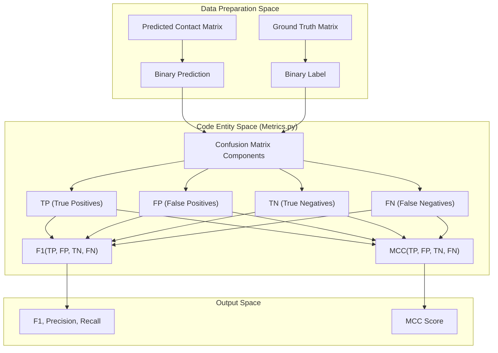
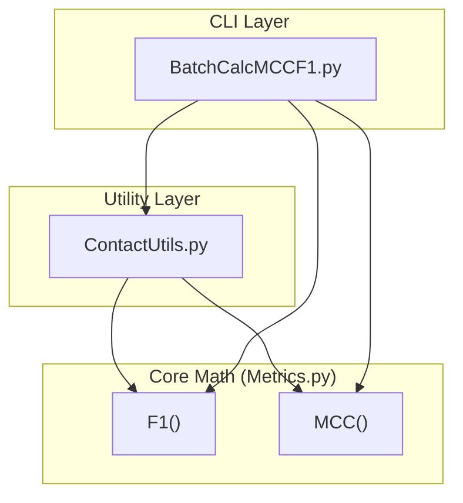

# Core Metric Implementations

> **Relevant source files**
> * [Metrics.py](https://github.com/nd-hung/DL4DistancePrediction2/blob/11ce7818/Metrics.py)

This page details the implementation of fundamental evaluation metrics used to assess the quality of protein contact predictions. These metrics are primarily housed in `Metrics.py` and serve as the mathematical foundation for higher-level evaluation utilities.

## Overview of Metrics.py

The `Metrics.py` module provides standardized implementations for binary classification performance measures. These functions operate on the four components of a confusion matrix: **True Positives (TP)**, **False Positives (FP)**, **True Negatives (TN)**, and **False Negatives (FN)**.

To prevent division-by-zero errors when calculating ratios with empty sets (e.g., when no positive contacts are predicted), the implementation utilizes a small constant `epsilon = 0.000001` for numerical stability [Metrics.py L4](https://github.com/nd-hung/DL4DistancePrediction2/blob/11ce7818/Metrics.py#L4-L4)

 [Metrics.py L14](https://github.com/nd-hung/DL4DistancePrediction2/blob/11ce7818/Metrics.py#L14-L14)

### Precision, Recall, and F1 Score

The `F1()` function calculates the harmonic mean of precision and recall, providing a balanced measure of a model's accuracy in predicting contacts [Metrics.py L3-L9](https://github.com/nd-hung/DL4DistancePrediction2/blob/11ce7818/Metrics.py#L3-L9)

| Metric | Formula in Code | Description |
| --- | --- | --- |
| **Precision** | `TP / (TP + FP + epsilon)` | The fraction of predicted contacts that are true contacts. |
| **Recall** | `TP / (TP + FN + epsilon)` | The fraction of true contacts that were correctly predicted. |
| **F1 Score** | `2 * precision * recall / (precision + recall + epsilon)` | Harmonic mean that penalizes extreme values of either precision or recall. |

**Sources:**

* `Metrics.py`: [Metrics.py L3-L9](https://github.com/nd-hung/DL4DistancePrediction2/blob/11ce7818/Metrics.py#L3-L9)

### Matthews Correlation Coefficient (MCC)

The `MCC()` function implements the Matthews Correlation Coefficient, which is widely considered one of the best measures for binary classification, especially when classes are of very different sizes (as is common in protein contact maps where non-contacts far outnumber contacts) [Metrics.py L12-L16](https://github.com/nd-hung/DL4DistancePrediction2/blob/11ce7818/Metrics.py#L12-L16)

The implementation uses `np.sqrt` on the product of the sums of the confusion matrix rows and columns, adding `epsilon` to the denominator to ensure stability [Metrics.py L15](https://github.com/nd-hung/DL4DistancePrediction2/blob/11ce7818/Metrics.py#L15-L15)

**Sources:**

* `Metrics.py`: [Metrics.py L12-L16](https://github.com/nd-hung/DL4DistancePrediction2/blob/11ce7818/Metrics.py#L12-L16)

---

## Metric Calculation Data Flow

The following diagram illustrates how raw prediction data from the model is transformed into the confusion matrix components required by `Metrics.py`, and how these metrics are consumed by batch evaluation scripts.

### Logic Flow: From Contacts to Metrics

**Sources:**

* `Metrics.py`: [Metrics.py L3-L16](https://github.com/nd-hung/DL4DistancePrediction2/blob/11ce7818/Metrics.py#L3-L16)

---

## Integration with Evaluation Utilities

While `Metrics.py` contains the core logic, these functions are orchestrated by higher-level modules to evaluate entire datasets or specific sequence-separation ranges (Short, Medium, Long range).

### Consumers of Metrics.py

1. **`ContactUtils.py`**: This utility module typically calculates the TP, FP, TN, and FN counts by comparing predicted contact maps against experimental structures (PDB). It then passes these counts to `Metrics.py` to obtain final scores.
2. **`BatchCalcMCCF1.py`**: A CLI tool used to process large sets of protein predictions. It aggregates confusion matrix components across multiple proteins and uses `Metrics.py` to report global performance statistics.

### Relationship Diagram

**Sources:**

* `Metrics.py`: [Metrics.py L1-L16](https://github.com/nd-hung/DL4DistancePrediction2/blob/11ce7818/Metrics.py#L1-L16)
* `ContactUtils.py` (Referenced usage)
* `BatchCalcMCCF1.py` (Referenced usage)