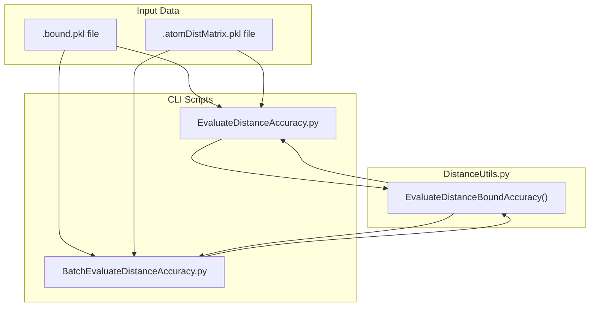
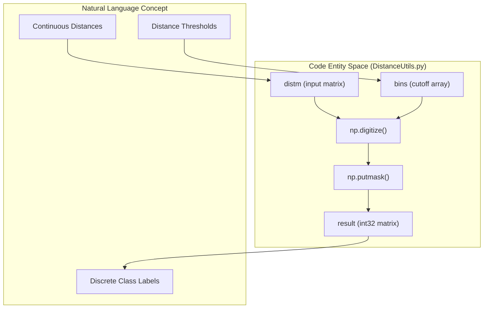

# Distance Bound Evaluation

> **Relevant source files**
> * [BatchEvaluateDistanceAccuracy.py](https://github.com/nd-hung/DL4DistancePrediction2/blob/11ce7818/BatchEvaluateDistanceAccuracy.py)
> * [DistanceUtils.py](https://github.com/nd-hung/DL4DistancePrediction2/blob/11ce7818/DistanceUtils.py)
> * [EvaluateDistanceAccuracy.py](https://github.com/nd-hung/DL4DistancePrediction2/blob/11ce7818/EvaluateDistanceAccuracy.py)

This page describes the evaluation framework for distance bound predictions, focusing on scripts and utility functions that compare predicted inter-atom distance matrices against ground truth (native) structures. It covers the calculation of error metrics, GDT-like similarity scores, and data preparation utilities for distance-based labels.

## Core Evaluation Logic

The primary logic for assessing distance prediction quality resides in `DistanceUtils.py`. The evaluation process involves aligning predicted sequences with native sequences and calculating metrics based on the difference between predicted and actual inter-atom distances.

### EvaluateDistanceBoundAccuracy Implementation

The function `EvaluateDistanceBoundAccuracy` [DistanceUtils.py L28-L100](https://github.com/nd-hung/DL4DistancePrediction2/blob/11ce7818/DistanceUtils.py#L28-L100)

 performs the quantitative comparison. It calculates six key metrics for each atom pair type (e.g., Cb-Cb, Ca-Ca):

1. **Absolute Error**: The mean absolute difference between predicted and native distances [DistanceUtils.py L73](https://github.com/nd-hung/DL4DistancePrediction2/blob/11ce7818/DistanceUtils.py#L73-L73)
2. **Relative Error**: The absolute difference normalized by the average of predicted and native distances [DistanceUtils.py L77-L78](https://github.com/nd-hung/DL4DistancePrediction2/blob/11ce7818/DistanceUtils.py#L77-L78)
3. **Precision**: The percentage of valid predictions where the corresponding native distance is within the 15Å threshold [DistanceUtils.py L85](https://github.com/nd-hung/DL4DistancePrediction2/blob/11ce7818/DistanceUtils.py#L85-L85)
4. **Recall**: The percentage of native distances $\le$ 15Å that were correctly predicted within the valid range [DistanceUtils.py L86](https://github.com/nd-hung/DL4DistancePrediction2/blob/11ce7818/DistanceUtils.py#L86-L86)
5. **F1 Score**: The harmonic mean of Precision and Recall [DistanceUtils.py L87](https://github.com/nd-hung/DL4DistancePrediction2/blob/11ce7818/DistanceUtils.py#L87-L87)
6. **GDT (Global Distance Test) Score**: A similarity metric calculated using thresholds at 1Å, 2Å, 4Å, and 8Å [DistanceUtils.py L90-L95](https://github.com/nd-hung/DL4DistancePrediction2/blob/11ce7818/DistanceUtils.py#L90-L95)

### Sequence Separation Filtering

Evaluation typically filters out short-range residue pairs to focus on more challenging spatial interactions. By default, a `minSeqSep` of 12 is used [BatchEvaluateDistanceAccuracy.py L47](https://github.com/nd-hung/DL4DistancePrediction2/blob/11ce7818/BatchEvaluateDistanceAccuracy.py#L47-L47)

 The implementation uses `np.fill_diagonal` to mask out offsets smaller than the threshold [DistanceUtils.py L60-L66](https://github.com/nd-hung/DL4DistancePrediction2/blob/11ce7818/DistanceUtils.py#L60-L66)

### Code Entity Space: Evaluation Data Flow

The following diagram illustrates how prediction files and ground truth files are processed by the evaluation scripts.

**Sources:** [DistanceUtils.py L28-L100](https://github.com/nd-hung/DL4DistancePrediction2/blob/11ce7818/DistanceUtils.py#L28-L100)

 [EvaluateDistanceAccuracy.py L26-L64](https://github.com/nd-hung/DL4DistancePrediction2/blob/11ce7818/EvaluateDistanceAccuracy.py#L26-L64)

 [BatchEvaluateDistanceAccuracy.py L35-L111](https://github.com/nd-hung/DL4DistancePrediction2/blob/11ce7818/BatchEvaluateDistanceAccuracy.py#L35-L111)

---

## CLI Evaluation Tools

### EvaluateDistanceAccuracy.py

This script evaluates a single protein. It loads a `.bound.pkl` file (containing the predicted matrix, name, and sequence) and a `.atomDistMatrix.pkl` file (the ground truth) [EvaluateDistanceAccuracy.py L16-L22](https://github.com/nd-hung/DL4DistancePrediction2/blob/11ce7818/EvaluateDistanceAccuracy.py#L16-L22)

 It passes the extracted data to `DistanceUtils.EvaluateDistanceBoundAccuracy` [EvaluateDistanceAccuracy.py L55](https://github.com/nd-hung/DL4DistancePrediction2/blob/11ce7818/EvaluateDistanceAccuracy.py#L55-L55)

### BatchEvaluateDistanceAccuracy.py

Used for large-scale evaluation across a protein list. It iterates through a provided folder of predictions and a folder of native matrices [BatchEvaluateDistanceAccuracy.py L72-L89](https://github.com/nd-hung/DL4DistancePrediction2/blob/11ce7818/BatchEvaluateDistanceAccuracy.py#L72-L89)

 It computes the average accuracy across all proteins for every atom pair type [BatchEvaluateDistanceAccuracy.py L100-L102](https://github.com/nd-hung/DL4DistancePrediction2/blob/11ce7818/BatchEvaluateDistanceAccuracy.py#L100-L102)

**Sources:** [EvaluateDistanceAccuracy.py L1-L64](https://github.com/nd-hung/DL4DistancePrediction2/blob/11ce7818/EvaluateDistanceAccuracy.py#L1-L64)

 [BatchEvaluateDistanceAccuracy.py L1-L111](https://github.com/nd-hung/DL4DistancePrediction2/blob/11ce7818/BatchEvaluateDistanceAccuracy.py#L1-L111)

---

## Label Manipulation and Utilities

The framework includes utilities for preparing and refining distance probability distributions, which are essential for training and post-processing.

### Discretization and Merging

* **DiscretizeDistMatrix**: Converts continuous distance matrices into discrete labels based on provided bin cutoffs [DistanceUtils.py L154-L168](https://github.com/nd-hung/DL4DistancePrediction2/blob/11ce7818/DistanceUtils.py#L154-L168)
* **MergeDistanceBins**: Reduces the granularity of a probability matrix by summing adjacent bins to match a new set of cutoffs [DistanceUtils.py L131-L150](https://github.com/nd-hung/DL4DistancePrediction2/blob/11ce7818/DistanceUtils.py#L131-L150)

### Probability Refinement

* **FixDistProb**: Adjusts predicted distance probabilities using label weights and background reference probabilities derived from training data [DistanceUtils.py L109-L127](https://github.com/nd-hung/DL4DistancePrediction2/blob/11ce7818/DistanceUtils.py#L109-L127)  This function accounts for sequence separation ranges (Near, Short, Medium, Long) by retrieving the appropriate range index via `config.GetRangeIndex(offset)` [DistanceUtils.py L120](https://github.com/nd-hung/DL4DistancePrediction2/blob/11ce7818/DistanceUtils.py#L120-L120)

### Label Statistics

* **CalcLabelProb**: Calculates the frequency distribution of labels across different sequence separation ranges [DistanceUtils.py L187-L196](https://github.com/nd-hung/DL4DistancePrediction2/blob/11ce7818/DistanceUtils.py#L187-L196)  It uses `config.RangeBoundaries` to segment the data [DistanceUtils.py L190](https://github.com/nd-hung/DL4DistancePrediction2/blob/11ce7818/DistanceUtils.py#L190-L190)

### Logic Mapping: Discretization Process

This diagram maps the natural language concept of "Discretization" to the specific implementation details in the code.

**Sources:** [DistanceUtils.py L154-L168](https://github.com/nd-hung/DL4DistancePrediction2/blob/11ce7818/DistanceUtils.py#L154-L168)

 [DistanceUtils.py L109-L127](https://github.com/nd-hung/DL4DistancePrediction2/blob/11ce7818/DistanceUtils.py#L109-L127)

---

## Summary of Metrics and Thresholds

| Metric | Implementation Detail | Threshold / Scope |
| --- | --- | --- |
| **Absolute Error** | `np.sum(diff * diff_valid) / sum(diff_valid)` | Evaluated on pairs $\le$ 15Å [DistanceUtils.py L73](https://github.com/nd-hung/DL4DistancePrediction2/blob/11ce7818/DistanceUtils.py#L73-L73) |
| **GDT Score** | Weighted sum of `diff < [1, 2, 4, 8]` | Similar to CASP GDT_TS [DistanceUtils.py L90-L95](https://github.com/nd-hung/DL4DistancePrediction2/blob/11ce7818/DistanceUtils.py#L90-L95) |
| **Valid Prediction** | Distance range (0, 15] | [DistanceUtils.py L57](https://github.com/nd-hung/DL4DistancePrediction2/blob/11ce7818/DistanceUtils.py#L57-L57) |
| **Seq Separation** | `minSeqSep` parameter | Default 12 (Long-range focus) [BatchEvaluateDistanceAccuracy.py L47](https://github.com/nd-hung/DL4DistancePrediction2/blob/11ce7818/BatchEvaluateDistanceAccuracy.py#L47-L47) |

**Sources:** [DistanceUtils.py L28-L100](https://github.com/nd-hung/DL4DistancePrediction2/blob/11ce7818/DistanceUtils.py#L28-L100)

 [BatchEvaluateDistanceAccuracy.py L47](https://github.com/nd-hung/DL4DistancePrediction2/blob/11ce7818/BatchEvaluateDistanceAccuracy.py#L47-L47)