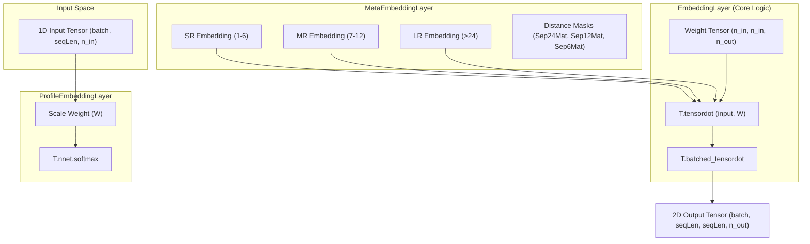

# Embedding Layers

> **Relevant source files**
> * [EmbeddingLayer.py](https://github.com/nd-hung/DL4DistancePrediction2/blob/11ce7818/EmbeddingLayer.py)

The embedding layers in `DL4DistancePrediction2` are responsible for transforming 1D sequence information into 2D spatial interaction maps. Unlike standard word embeddings that map tokens to vectors, these layers implement a tensor-product mechanism to capture pairwise relationships between residues, providing a foundational representation for distance matrix prediction.

### Embedding Architecture Overview

The embedding logic is encapsulated in `EmbeddingLayer.py`, which provides three primary classes for different stages of the embedding pipeline:

1. **`EmbeddingLayer`**: The core implementation of tensor-product pairwise embeddings.
2. **`MetaEmbeddingLayer`**: A spatial partitioning wrapper that applies different embedding weights based on sequence separation (short, medium, and long-range).
3. **`ProfileEmbeddingLayer`**: A normalization layer that applies a softmax activation to continuous profiles before embedding.

### Class Relationship and Data Flow

The following diagram illustrates how 1D sequence features (such as One-Hot encoded amino acids or PSSM profiles) are transformed into 2D pairwise features.

**Embedding Data Flow**

**Sources:** [EmbeddingLayer.py L8-L41](https://github.com/nd-hung/DL4DistancePrediction2/blob/11ce7818/EmbeddingLayer.py#L8-L41)

 [EmbeddingLayer.py L43-L88](https://github.com/nd-hung/DL4DistancePrediction2/blob/11ce7818/EmbeddingLayer.py#L43-L88)

 [EmbeddingLayer.py L90-L111](https://github.com/nd-hung/DL4DistancePrediction2/blob/11ce7818/EmbeddingLayer.py#L90-L111)

---

### 1. EmbeddingLayer

The `EmbeddingLayer` class transforms a 1D sequence tensor into a 2D interaction tensor using a learnable weight matrix $W$ of shape `(n_in, n_in, n_out)` [EmbeddingLayer.py L18-L19](https://github.com/nd-hung/DL4DistancePrediction2/blob/11ce7818/EmbeddingLayer.py#L18-L19)

#### Implementation Details

* **Weight Initialization**: Weights are initialized using a uniform distribution bounded by $\sqrt{6 / (n_{in}^2 + n_{out})}$ [EmbeddingLayer.py L17-L18](https://github.com/nd-hung/DL4DistancePrediction2/blob/11ce7818/EmbeddingLayer.py#L17-L18)
* **Tensor Product Logic**: 1. Perform `T.tensordot` between the input and $W$ to project input features into the embedding space [EmbeddingLayer.py L22](https://github.com/nd-hung/DL4DistancePrediction2/blob/11ce7818/EmbeddingLayer.py#L22-L22) 2. Shuffle dimensions to prepare for spatial interaction calculation [EmbeddingLayer.py L25-L28](https://github.com/nd-hung/DL4DistancePrediction2/blob/11ce7818/EmbeddingLayer.py#L25-L28) 3. Perform `T.batched_tensordot` to generate the $L \times L$ pairwise map [EmbeddingLayer.py L31](https://github.com/nd-hung/DL4DistancePrediction2/blob/11ce7818/EmbeddingLayer.py#L31-L31)
* **Output Shape**: `(batchSize, seqLen, seqLen, n_out)` [EmbeddingLayer.py L33-L34](https://github.com/nd-hung/DL4DistancePrediction2/blob/11ce7818/EmbeddingLayer.py#L33-L34)

**Sources:** [EmbeddingLayer.py L9-L41](https://github.com/nd-hung/DL4DistancePrediction2/blob/11ce7818/EmbeddingLayer.py#L9-L41)

---

### 2. MetaEmbeddingLayer

The `MetaEmbeddingLayer` partitions the 2D interaction map based on the sequence separation $|i - j|$ between residues at positions $i$ and $j$. It utilizes three separate `EmbeddingLayer` instances to capture range-specific features [EmbeddingLayer.py L50-L52](https://github.com/nd-hung/DL4DistancePrediction2/blob/11ce7818/EmbeddingLayer.py#L50-L52)

#### Spatial Partitioning Logic

The layer uses triangular masks to select interactions based on sequence distance:

* **Long-Range (LR)**: $|i - j| \ge 24$ [EmbeddingLayer.py L63-L66](https://github.com/nd-hung/DL4DistancePrediction2/blob/11ce7818/EmbeddingLayer.py#L63-L66)
* **Mid-Range (MR)**: $12 \le |i - j| < 24$ [EmbeddingLayer.py L64-L67](https://github.com/nd-hung/DL4DistancePrediction2/blob/11ce7818/EmbeddingLayer.py#L64-L67)
* **Short-Range (SR)**: $6 \le |i - j| < 12$ [EmbeddingLayer.py L65-L68](https://github.com/nd-hung/DL4DistancePrediction2/blob/11ce7818/EmbeddingLayer.py#L65-L68)

These ranges are combined into a single output tensor using `T.inc_subtensor`, allowing the model to learn distinct interaction patterns for different spatial scales [EmbeddingLayer.py L72-L75](https://github.com/nd-hung/DL4DistancePrediction2/blob/11ce7818/EmbeddingLayer.py#L72-L75)

**Sources:** [EmbeddingLayer.py L43-L88](https://github.com/nd-hung/DL4DistancePrediction2/blob/11ce7818/EmbeddingLayer.py#L43-L88)

---

### 3. ProfileEmbeddingLayer

The `ProfileEmbeddingLayer` is designed for continuous 1D features, such as those derived from a 1D convolutional layer or PSSM profiles [EmbeddingLayer.py L92-L93](https://github.com/nd-hung/DL4DistancePrediction2/blob/11ce7818/EmbeddingLayer.py#L92-L93)

#### Key Components

* **Learnable Scale**: It includes a shared variable `W` used to scale the input before the softmax operation [EmbeddingLayer.py L96-L98](https://github.com/nd-hung/DL4DistancePrediction2/blob/11ce7818/EmbeddingLayer.py#L96-L98)
* **Softmax Normalization**: Applies `T.nnet.softmax` to the input features to ensure the values represent a probability-like distribution across the `n_in` dimension [EmbeddingLayer.py L99](https://github.com/nd-hung/DL4DistancePrediction2/blob/11ce7818/EmbeddingLayer.py#L99-L99)
* **Delegation**: The normalized input is then passed to a `MetaEmbeddingLayer` for the actual 2D transformation [EmbeddingLayer.py L100](https://github.com/nd-hung/DL4DistancePrediction2/blob/11ce7818/EmbeddingLayer.py#L100-L100)

**Sources:** [EmbeddingLayer.py L90-L111](https://github.com/nd-hung/DL4DistancePrediction2/blob/11ce7818/EmbeddingLayer.py#L90-L111)

---

### Technical Summary Table

| Feature | `EmbeddingLayer` | `MetaEmbeddingLayer` | `ProfileEmbeddingLayer` |
| --- | --- | --- | --- |
| **Input Type** | Binary/One-hot | Binary/One-hot | Continuous/Profile |
| **Output Dim** | `(B, L, L, n_out)` | `(B, L, L, max(n_out))` | `(B, L, L, n_out)` |
| **Parameters** | `W` (3D Tensor) | 3x `EmbeddingLayer.W` | `Scale W` + `Meta.W` |
| **Regularization** | L1, L2, pcenters | Sum of sub-layers | Sum of sub-layers |
| **Range Aware** | No | Yes (SR, MR, LR) | Yes (via Meta) |

**Sources:** [EmbeddingLayer.py L36-L40](https://github.com/nd-hung/DL4DistancePrediction2/blob/11ce7818/EmbeddingLayer.py#L36-L40)

 [EmbeddingLayer.py L77-L85](https://github.com/nd-hung/DL4DistancePrediction2/blob/11ce7818/EmbeddingLayer.py#L77-L85)

 [EmbeddingLayer.py L104-L107](https://github.com/nd-hung/DL4DistancePrediction2/blob/11ce7818/EmbeddingLayer.py#L104-L107)