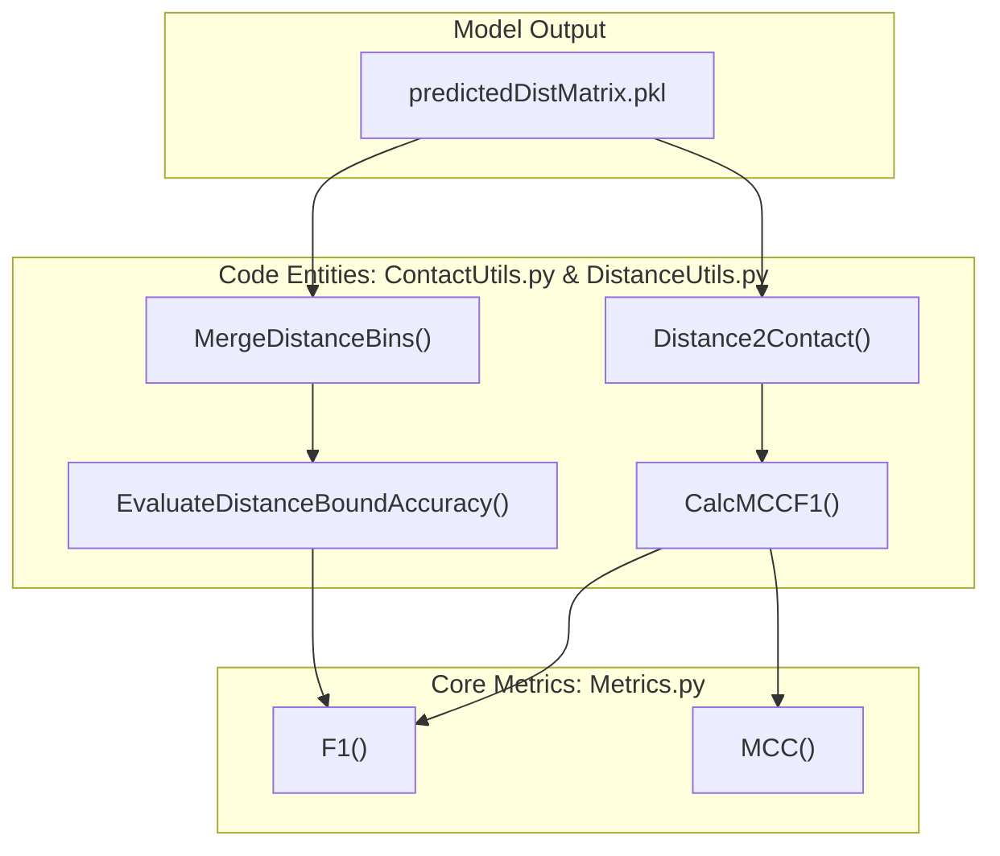
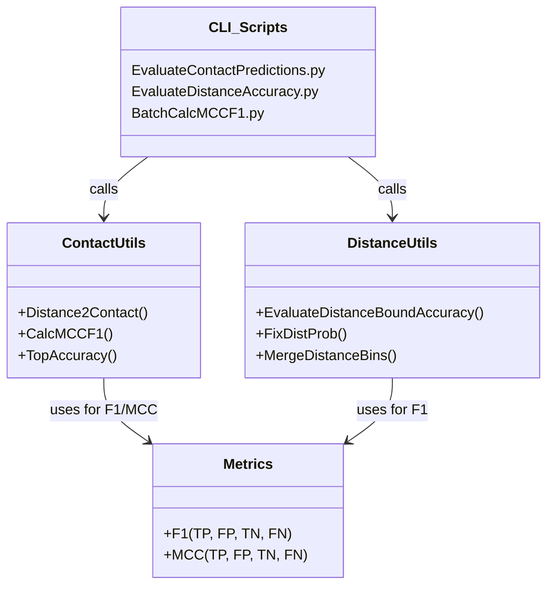

# Evaluation & Metrics

> **Relevant source files**
> * [ContactUtils.py](https://github.com/nd-hung/DL4DistancePrediction2/blob/11ce7818/ContactUtils.py)
> * [DistanceUtils.py](https://github.com/nd-hung/DL4DistancePrediction2/blob/11ce7818/DistanceUtils.py)
> * [Metrics.py](https://github.com/nd-hung/DL4DistancePrediction2/blob/11ce7818/Metrics.py)

The evaluation framework in this codebase provides tools for assessing the quality of predicted protein residue-residue interactions. It supports two primary modes of evaluation: **Contact Prediction**, which treats the problem as a binary classification (residues are either in contact or not), and **Distance Prediction**, which evaluates the accuracy of predicted distance bins or continuous distance bounds.

The framework is built to handle standard bioinformatics formats (like CASP RR) and includes rigorous sequence-separation filtering to distinguish between short, medium, and long-range interaction accuracy.

### Evaluation Workflow Overview

The following diagram illustrates how raw model outputs (probability matrices) are processed through the evaluation utilities to produce standardized metrics.

**Evaluation Data Flow**

**Sources:** [ContactUtils.py L187-L200](https://github.com/nd-hung/DL4DistancePrediction2/blob/11ce7818/ContactUtils.py#L187-L200)

 [DistanceUtils.py L28-L100](https://github.com/nd-hung/DL4DistancePrediction2/blob/11ce7818/DistanceUtils.py#L28-L100)

 [Metrics.py L3-L16](https://github.com/nd-hung/DL4DistancePrediction2/blob/11ce7818/Metrics.py#L3-L16)

---

## 5.1 Contact Prediction Evaluation

Contact prediction evaluation focuses on the binary classification of residue pairs based on a specific distance threshold (typically 8Å). The system provides utilities to convert multi-bin distance probabilities into a single contact probability and calculate top-L accuracies, which are standard in CASP competitions.

Key components include:

* **Format Conversion**: Loading and saving contact matrices in CASP-compliant `.rr` formats via `LoadContactMatrixInCASPFormat` and `SaveContactMatrixInCASPFormat`.
* **Probability Transformation**: `Distance2Contact` sums probabilities across discrete distance bins up to a defined cutoff to derive contact confidence.
* **Performance Metrics**: Implementation of `CalcMCCF1` and `TopAccuracy` for evaluating precision at different sequence separations (Long, Medium, Short).

For details, see [Contact Prediction Evaluation](/nd-hung/DL4DistancePrediction2/5.1-contact-prediction-evaluation).

**Sources:** [ContactUtils.py L27-L102](https://github.com/nd-hung/DL4DistancePrediction2/blob/11ce7818/ContactUtils.py#L27-L102)

 [ContactUtils.py L106-L185](https://github.com/nd-hung/DL4DistancePrediction2/blob/11ce7818/ContactUtils.py#L106-L185)

 [ContactUtils.py L190-L200](https://github.com/nd-hung/DL4DistancePrediction2/blob/11ce7818/ContactUtils.py#L190-L200)

 [ContactUtils.py L204-L225](https://github.com/nd-hung/DL4DistancePrediction2/blob/11ce7818/ContactUtils.py#L204-L225)

---

## 5.2 Distance Bound Evaluation

Distance evaluation assesses how closely the predicted distance distributions match the true physical distances between residues. This involves analyzing multi-class probability distributions and continuous distance estimates.

Key components include:

* **Error Analysis**: `EvaluateDistanceBoundAccuracy` calculates Absolute Error, Relative Error, and a GDT-like similarity score based on the difference between predicted and native distances.
* **Distribution Refinement**: `FixDistProb` adjusts predicted probabilities using background label weights and reference probabilities to account for training data biases.
* **Discretization**: `DiscretizeDistMatrix` and `MergeDistanceBins` allow for re-binning distance data to match different evaluation requirements or experimental setups.

For details, see [Distance Bound Evaluation](/nd-hung/DL4DistancePrediction2/5.2-distance-bound-evaluation).

**Sources:** [DistanceUtils.py L28-L100](https://github.com/nd-hung/DL4DistancePrediction2/blob/11ce7818/DistanceUtils.py#L28-L100)

 [DistanceUtils.py L109-L127](https://github.com/nd-hung/DL4DistancePrediction2/blob/11ce7818/DistanceUtils.py#L109-L127)

 [DistanceUtils.py L131-L150](https://github.com/nd-hung/DL4DistancePrediction2/blob/11ce7818/DistanceUtils.py#L131-L150)

 [DistanceUtils.py L154-L168](https://github.com/nd-hung/DL4DistancePrediction2/blob/11ce7818/DistanceUtils.py#L154-L168)

---

## 5.3 Core Metric Implementations

The core mathematical definitions for statistical metrics are centralized to ensure consistency across different evaluation scripts. These functions are designed for numerical stability, using epsilon offsets to prevent division-by-zero errors.

Key components include:

* **F1 Score**: Calculated from True Positives (TP), False Positives (FP), and False Negatives (FN).
* **Matthews Correlation Coefficient (MCC)**: A robust measure for binary classification that accounts for all four quadrants of the confusion matrix.

For details, see [Core Metric Implementations](/nd-hung/DL4DistancePrediction2/5.3-core-metric-implementations).

**Sources:** [Metrics.py L3-L9](https://github.com/nd-hung/DL4DistancePrediction2/blob/11ce7818/Metrics.py#L3-L9)

 [Metrics.py L12-L16](https://github.com/nd-hung/DL4DistancePrediction2/blob/11ce7818/Metrics.py#L12-L16)

---

## System Integration Diagram

The diagram below shows the relationship between the CLI evaluation scripts and the underlying library functions.

**Evaluation Architecture**

**Sources:** [ContactUtils.py L9](https://github.com/nd-hung/DL4DistancePrediction2/blob/11ce7818/ContactUtils.py#L9-L9)

 [ContactUtils.py L204-L230](https://github.com/nd-hung/DL4DistancePrediction2/blob/11ce7818/ContactUtils.py#L204-L230)

 [DistanceUtils.py L28-L100](https://github.com/nd-hung/DL4DistancePrediction2/blob/11ce7818/DistanceUtils.py#L28-L100)

 [Metrics.py L1-L16](https://github.com/nd-hung/DL4DistancePrediction2/blob/11ce7818/Metrics.py#L1-L16)