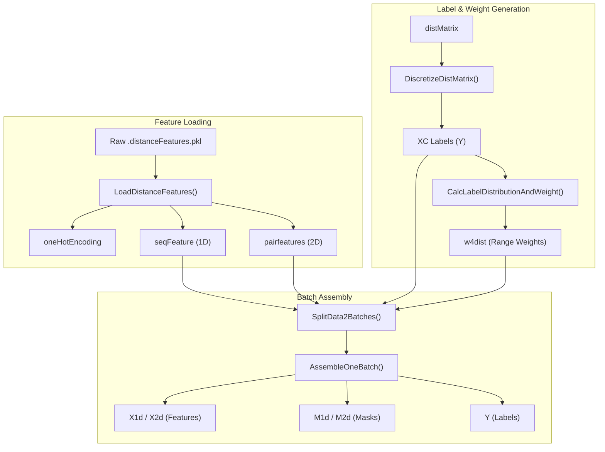
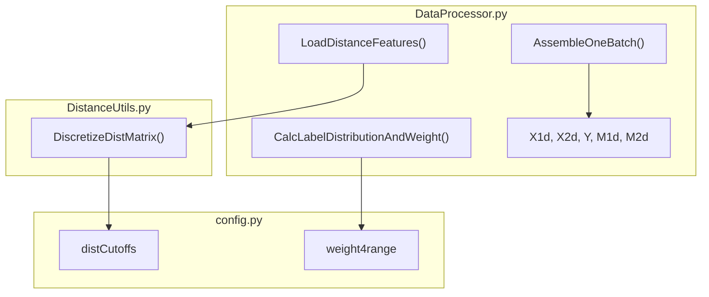

# Feature Processing & Batch Assembly

> **Relevant source files**
> * [DataProcessor.py](https://github.com/nd-hung/DL4DistancePrediction2/blob/11ce7818/DataProcessor.py)
> * [config.py](https://github.com/nd-hung/DL4DistancePrediction2/blob/11ce7818/config.py)

The **Feature Processing & Batch Assembly** module is responsible for transforming raw protein features (1D sequences and 2D matrices) into structured tensors suitable for training and inference. This process involves feature concatenation, distance discretization, sequence-separation weighting, and a right-alignment padding strategy to handle variable-length proteins in batches.

## Data Flow & Processing Pipeline

The pipeline starts with `LoadDistanceFeatures()`, which aggregates features from serialized files, and culminates in `AssembleOneBatch()`, which produces the final `X1d`, `X2d`, `M1d`, `M2d`, and `Y` tensors.

### Entity Mapping: Data to Code

The following diagram maps high-level data processing concepts to the specific functions and variables implemented in `DataProcessor.py`.

**Diagram: Feature Transformation Pipeline**

**Sources:** [DataProcessor.py L109-L210](https://github.com/nd-hung/DL4DistancePrediction2/blob/11ce7818/DataProcessor.py#L109-L210)

 [DataProcessor.py L461-L550](https://github.com/nd-hung/DL4DistancePrediction2/blob/11ce7818/DataProcessor.py#L461-L550)

 [DataProcessor.py L578](https://github.com/nd-hung/DL4DistancePrediction2/blob/11ce7818/DataProcessor.py#L578-L578)

## Key Implementation Details

### 1. Feature Concatenation

`LoadDistanceFeatures()` builds two primary input sets:

* **1D Sequence Features (`seqFeature`)**: Concatenates One-Hot encoding, Secondary Structure (SS3), Solvent Accessibility (ACC), PSSM, and Disorder (DISO) [DataProcessor.py L138-L178](https://github.com/nd-hung/DL4DistancePrediction2/blob/11ce7818/DataProcessor.py#L138-L178)
* **2D Pairwise Features (`pairfeatures`)**: Concatenates geometric priors like `LocationFeature` (relative sequence separation) [DataProcessor.py L58-L74](https://github.com/nd-hung/DL4DistancePrediction2/blob/11ce7818/DataProcessor.py#L58-L74)  `CubeRootFeature` [DataProcessor.py L76-L84](https://github.com/nd-hung/DL4DistancePrediction2/blob/11ce7818/DataProcessor.py#L76-L84)  and evolutionary couplings (CCMpred/PSICOV) [DataProcessor.py L189-L197](https://github.com/nd-hung/DL4DistancePrediction2/blob/11ce7818/DataProcessor.py#L189-L197)

### 2. Distance Discretization

Distances are converted from continuous Angstrom values to discrete labels using `DistanceUtils.DiscretizeDistMatrix()`. The discretization logic depends on the `modelSpecs['responses']` configuration (e.g., `12C`, `25C`, `52C`) [DataProcessor.py L230-L244](https://github.com/nd-hung/DL4DistancePrediction2/blob/11ce7818/DataProcessor.py#L230-L244)

* **Plus variants**: In labels like `14CPlus`, invalid distances (represented as -1) are assigned to a unique bin separate from the maximum distance bin [config.py L58-L60](https://github.com/nd-hung/DL4DistancePrediction2/blob/11ce7818/config.py#L58-L60)

### 3. Range-Aware Weighting

To handle the imbalance between long-range and short-range contacts, `CalcLabelDistributionAndWeight()` applies sequence-separation weights [DataProcessor.py L461-L480](https://github.com/nd-hung/DL4DistancePrediction2/blob/11ce7818/DataProcessor.py#L461-L480)

* **Boundaries**: Defined in `config.py` as 24 (Long), 12 (Medium), 6 (Short), and 2 (Near) [config.py L141-L142](https://github.com/nd-hung/DL4DistancePrediction2/blob/11ce7818/config.py#L141-L142)
* **Weights**: The default weights are `[3.0, 2.5, 1.0, 0.5]` for LR, MR, SR, and NR respectively [config.py L156](https://github.com/nd-hung/DL4DistancePrediction2/blob/11ce7818/config.py#L156-L156)

### 4. Batch Assembly & Padding

`AssembleOneBatch()` constructs the final tensors for the Theano/TensorFlow graph.

| Tensor | Description | Implementation |
| --- | --- | --- |
| **X1d** | 1D Features | Shape: `(batchSize, maxSeqLen, num1dFeatures)` [DataProcessor.py L578](https://github.com/nd-hung/DL4DistancePrediction2/blob/11ce7818/DataProcessor.py#L578-L578) |
| **X2d** | 2D Features | Shape: `(batchSize, maxSeqLen, maxSeqLen, num2dFeatures)` [DataProcessor.py L578](https://github.com/nd-hung/DL4DistancePrediction2/blob/11ce7818/DataProcessor.py#L578-L578) |
| **M1d** | 1D Mask | Binary mask (1.0 for real data, 0.0 for padding) [DataProcessor.py L578](https://github.com/nd-hung/DL4DistancePrediction2/blob/11ce7818/DataProcessor.py#L578-L578) |
| **M2d** | 2D Mask | Product of M1d masks: `M1d_i * M1d_j` [DataProcessor.py L578](https://github.com/nd-hung/DL4DistancePrediction2/blob/11ce7818/DataProcessor.py#L578-L578) |
| **Y** | Labels | Target distance bins [DataProcessor.py L578](https://github.com/nd-hung/DL4DistancePrediction2/blob/11ce7818/DataProcessor.py#L578-L578) |

**Right-Alignment Padding:** Proteins shorter than the `maxSeqLen` of the batch are right-aligned. Padding is applied to the beginning (left) of the sequence [DataProcessor.py L578](https://github.com/nd-hung/DL4DistancePrediction2/blob/11ce7818/DataProcessor.py#L578-L578)

**Sources:** [DataProcessor.py L578](https://github.com/nd-hung/DL4DistancePrediction2/blob/11ce7818/DataProcessor.py#L578-L578)

 [config.py L141-L156](https://github.com/nd-hung/DL4DistancePrediction2/blob/11ce7818/config.py#L141-L156)

## Code Entity Relationships

The following diagram illustrates how the `DataProcessor` functions interact with the global `config` and `DistanceUtils` to prepare tensors.

**Diagram: Entity Interaction Map**

**Sources:** [DataProcessor.py L230-L238](https://github.com/nd-hung/DL4DistancePrediction2/blob/11ce7818/DataProcessor.py#L230-L238)

 [DataProcessor.py L461-L465](https://github.com/nd-hung/DL4DistancePrediction2/blob/11ce7818/DataProcessor.py#L461-L465)

 [config.py L62-L87](https://github.com/nd-hung/DL4DistancePrediction2/blob/11ce7818/config.py#L62-L87)

## Summary of Feature Shapes

| Feature Type | Source Function | Typical Dimension |
| --- | --- | --- |
| **One-Hot** | `SeqOneHotEncoding` | 20 (AA) + 1 (Gap) |
| **SS3** | `LoadDistanceFeatures` | 3 |
| **PSSM** | `LoadDistanceFeatures` | 20 |
| **ccmpredZ** | `LoadDistanceFeatures` | 1 |
| **posFeature** | `LocationFeature` | 1 |

**Sources:** [DataProcessor.py L58-L74](https://github.com/nd-hung/DL4DistancePrediction2/blob/11ce7818/DataProcessor.py#L58-L74)

 [DataProcessor.py L127-L148](https://github.com/nd-hung/DL4DistancePrediction2/blob/11ce7818/DataProcessor.py#L127-L148)

 [DataProcessor.py L193](https://github.com/nd-hung/DL4DistancePrediction2/blob/11ce7818/DataProcessor.py#L193-L193)