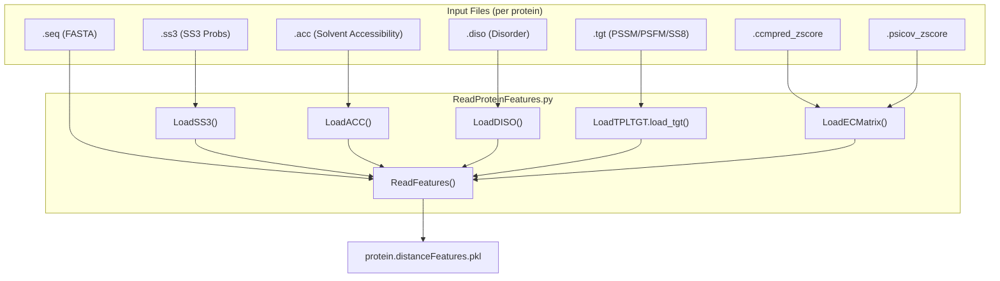

# Feature Reading & Aggregation

> **Relevant source files**
> * [ReadOneProteinFeatures.py](https://github.com/nd-hung/DL4DistancePrediction2/blob/11ce7818/ReadOneProteinFeatures.py)
> * [ReadProteinFeatures.py](https://github.com/nd-hung/DL4DistancePrediction2/blob/11ce7818/ReadProteinFeatures.py)

The **Feature Reading & Aggregation** stage is responsible for parsing raw bioinformatic tool outputs (sequence profiles, secondary structure predictions, and evolutionary couplings) and consolidating them into a structured format suitable for deep learning. This process involves loading diverse 1D (sequence-level) and 2D (residue-pair level) features, validating data integrity (e.g., checking for NaNs and sequence consistency), and serializing the results into `.distanceFeatures.pkl` files.

## Data Flow Overview

The aggregation pipeline starts with individual feature files generated by external tools (e.g., CCMpred, PSICOV, and secondary structure predictors). The `ReadFeatures` function acts as the central coordinator, calling specialized loaders for each file type and aggregating the results into a dictionary representing a single protein.

### Feature Aggregation Logic

"Feature Aggregation Pipeline"



**Sources:** `ReadProteinFeatures.py` [196-246](https://github.com/nd-hung/DL4DistancePrediction2/blob/11ce7818/196-246)

 `ReadOneProteinFeatures.py` [32-38](https://github.com/nd-hung/DL4DistancePrediction2/blob/11ce7818/32-38)

## Implementation Details

### Core Feature Loaders

`ReadProteinFeatures.py` provides specific functions to parse different file formats. Every loader performs a sanity check to ensure the sequence length in the feature file matches the primary sequence and validates that no `NaN` values exist in the numerical data.

* **1D Features (Sequence Level):** * `LoadSS3(file, ...)`: Reads 3-state secondary structure probabilities [ReadProteinFeatures.py L15-L36](https://github.com/nd-hung/DL4DistancePrediction2/blob/11ce7818/ReadProteinFeatures.py#L15-L36) * `LoadACC(file, ...)`: Reads solvent accessibility probabilities [ReadProteinFeatures.py L38-L60](https://github.com/nd-hung/DL4DistancePrediction2/blob/11ce7818/ReadProteinFeatures.py#L38-L60) * `LoadDISO(file, ...)`: Reads protein disorder probabilities [ReadProteinFeatures.py L63-L84](https://github.com/nd-hung/DL4DistancePrediction2/blob/11ce7818/ReadProteinFeatures.py#L63-L84) * `LoadTPLTGT.load_tgt(file)`: An external interface used to load Position Specific Scoring Matrices (PSSM), Position Specific Frequency Matrices (PSFM), and 8-state secondary structure (SS8) [ReadProteinFeatures.py L229-L232](https://github.com/nd-hung/DL4DistancePrediction2/blob/11ce7818/ReadProteinFeatures.py#L229-L232)
* **2D Features (Residue-Pair Level):** * `LoadECMatrix(file, ...)`: Loads evolutionary coupling matrices, such as those from CCMpred or PSICOV. It returns a $L \times L$ matrix of `float16` values [ReadProteinFeatures.py L139-L158](https://github.com/nd-hung/DL4DistancePrediction2/blob/11ce7818/ReadProteinFeatures.py#L139-L158) * `LoadOtherPairFeatures(file, ...)`: Loads sparse potential files (`.pot`), converts them into dense $L \times L \times N$ tensors, and ensures the matrix is symmetric [ReadProteinFeatures.py L161-L193](https://github.com/nd-hung/DL4DistancePrediction2/blob/11ce7818/ReadProteinFeatures.py#L161-L193)

**Sources:** `ReadProteinFeatures.py` [15-193](https://github.com/nd-hung/DL4DistancePrediction2/blob/11ce7818/15-193)

 `ReadProteinFeatures.py` [229-232](https://github.com/nd-hung/DL4DistancePrediction2/blob/11ce7818/229-232)

### The ReadFeatures Interface

The `ReadFeatures` function is the primary entry point for processing a single protein. It initializes a dictionary `OneProtein` and populates it with keys that the downstream `DataProcessor` expects.

| Key | Source File Extension | Description |
| --- | --- | --- |
| `name` | N/A | Protein identifier [ReadProteinFeatures.py L208](https://github.com/nd-hung/DL4DistancePrediction2/blob/11ce7818/ReadProteinFeatures.py#L208-L208) |
| `sequence` | `.seq` | Primary amino acid sequence [ReadProteinFeatures.py L213-L215](https://github.com/nd-hung/DL4DistancePrediction2/blob/11ce7818/ReadProteinFeatures.py#L213-L215) |
| `SS3` | `.ss3` | 3-state secondary structure [ReadProteinFeatures.py L219](https://github.com/nd-hung/DL4DistancePrediction2/blob/11ce7818/ReadProteinFeatures.py#L219-L219) |
| `ACC` | `.acc` | Solvent accessibility [ReadProteinFeatures.py L222](https://github.com/nd-hung/DL4DistancePrediction2/blob/11ce7818/ReadProteinFeatures.py#L222-L222) |
| `DISO` | `.diso` | Protein disorder [ReadProteinFeatures.py L225](https://github.com/nd-hung/DL4DistancePrediction2/blob/11ce7818/ReadProteinFeatures.py#L225-L225) |
| `PSFM` | `.tgt` | Position Specific Frequency Matrix [ReadProteinFeatures.py L230](https://github.com/nd-hung/DL4DistancePrediction2/blob/11ce7818/ReadProteinFeatures.py#L230-L230) |
| `PSSM` | `.tgt` | Position Specific Scoring Matrix [ReadProteinFeatures.py L231](https://github.com/nd-hung/DL4DistancePrediction2/blob/11ce7818/ReadProteinFeatures.py#L231-L231) |
| `SS8` | `.tgt` | 8-state secondary structure [ReadProteinFeatures.py L232](https://github.com/nd-hung/DL4DistancePrediction2/blob/11ce7818/ReadProteinFeatures.py#L232-L232) |
| `ccmpredZ` | `.ccmpred_zscore` | CCMpred evolutionary coupling [ReadProteinFeatures.py L239](https://github.com/nd-hung/DL4DistancePrediction2/blob/11ce7818/ReadProteinFeatures.py#L239-L239) |

**Sources:** `ReadProteinFeatures.py` [207-246](https://github.com/nd-hung/DL4DistancePrediction2/blob/11ce7818/207-246)

## Serialization and Batch Processing

The script `ReadOneProteinFeatures.py` serves as a CLI wrapper for processing a single protein across multiple feature directories. This is useful when comparing different feature generation methods (e.g., different MSA depths).

### Serialization Flow

"Feature Serialization to PKL"

```mermaid
sequenceDiagram
  participant ReadOneProteinFeatures.py
  participant ReadProteinFeatures.ReadFeatures()
  participant protein.distanceFeatures.pkl

  ReadOneProteinFeatures.py->>ReadOneProteinFeatures.py: "Parse argv (proteinName, featureDirs)"
  loop ["For each featureDir"]
    ReadOneProteinFeatures.py->>ReadProteinFeatures.ReadFeatures(): "ReadFeatures(proteinName, d)"
    ReadProteinFeatures.ReadFeatures()-->>ReadOneProteinFeatures.py: "Return pFeature (dict)"
    ReadOneProteinFeatures.py->>ReadOneProteinFeatures.py: "Append pFeature to pFeatures list"
  end
  ReadOneProteinFeatures.py->>protein.distanceFeatures.pkl: "cPickle.dump(pFeatures, protocol=HIGHEST)"
```

**Sources:** `ReadOneProteinFeatures.py` [18-39](https://github.com/nd-hung/DL4DistancePrediction2/blob/11ce7818/18-39)

### Key Execution Logic

1. **Directory Validation**: The script checks if the provided feature directories exist before attempting to read [ReadOneProteinFeatures.py L28-L30](https://github.com/nd-hung/DL4DistancePrediction2/blob/11ce7818/ReadOneProteinFeatures.py#L28-L30)
2. **Aggregation**: Multiple feature sets for the same protein are stored as a list of dictionaries [ReadOneProteinFeatures.py L33](https://github.com/nd-hung/DL4DistancePrediction2/blob/11ce7818/ReadOneProteinFeatures.py#L33-L33)
3. **Output**: The resulting file is named `{proteinName}.distanceFeatures.pkl` and uses `cPickle` with the highest protocol for efficient storage [ReadOneProteinFeatures.py L35-L38](https://github.com/nd-hung/DL4DistancePrediction2/blob/11ce7818/ReadOneProteinFeatures.py#L35-L38)

**Sources:** `ReadOneProteinFeatures.py` [18-44](https://github.com/nd-hung/DL4DistancePrediction2/blob/11ce7818/18-44)