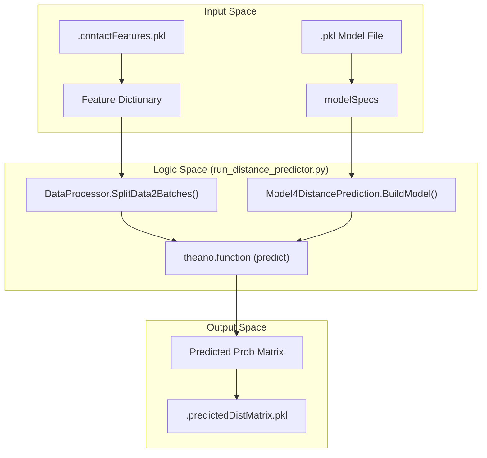
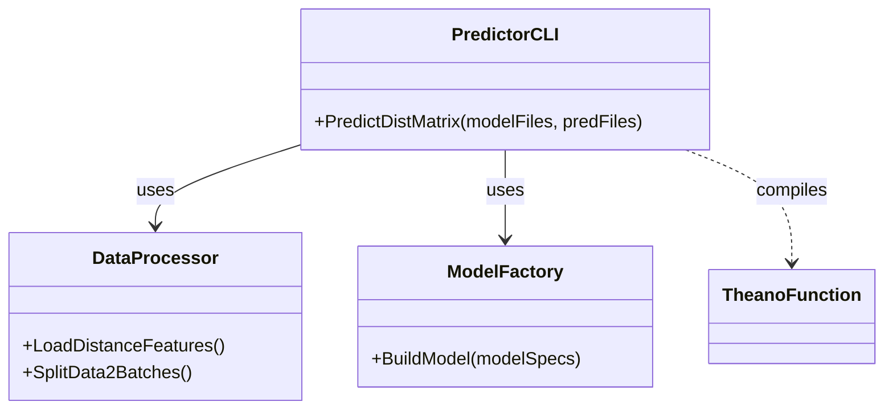

# Getting Started & Running Inference

> **Relevant source files**
> * [Readme.md](https://github.com/nd-hung/DL4DistancePrediction2/blob/11ce7818/Readme.md?plain=1)
> * [result/76CAMEO.2015/2myhA.predictedDistMatrix.pkl](https://github.com/nd-hung/DL4DistancePrediction2/blob/11ce7818/result/76CAMEO.2015/2myhA.predictedDistMatrix.pkl)
> * [result/76CAMEO.2015/2mz0A.predictedDistMatrix.pkl](https://github.com/nd-hung/DL4DistancePrediction2/blob/11ce7818/result/76CAMEO.2015/2mz0A.predictedDistMatrix.pkl)
> * [run_distance_predictor.py](https://github.com/nd-hung/DL4DistancePrediction2/blob/11ce7818/run_distance_predictor.py)

This page provides a technical guide for setting up the environment and executing the distance prediction pipeline. The system uses deep residual networks to predict inter-residue distance distributions from protein sequence features.

## Overview

The inference pipeline is centered around `run_distance_predictor.py`, which orchestrates model loading, feature processing, and tensor computation via Theano. The process transforms 1D and 2D protein features into discretized distance probability matrices.

### Inference Data Flow

The following diagram illustrates how raw features are transformed into predicted distance matrices.

**System Data Flow: Features to Predictions**



**Sources:** [run_distance_predictor.py L24-L112](https://github.com/nd-hung/DL4DistancePrediction2/blob/11ce7818/run_distance_predictor.py#L24-L112)

 [Readme.md L20-L31](https://github.com/nd-hung/DL4DistancePrediction2/blob/11ce7818/Readme.md?plain=1#L20-L31)

---

## Environment & Prerequisites

The codebase is implemented in **Python 3** and requires the **Theano** deep learning library [Readme.md L1-L5](https://github.com/nd-hung/DL4DistancePrediction2/blob/11ce7818/Readme.md?plain=1#L1-L5)

### Required Input Files

1. **Model Files (`.pkl`)**: Pre-trained model weights and architecture specifications (e.g., `RXContact-DeepMode11410.pkl`). These files contain the `paramValues` and `network` flags required to reconstruct the `ResNet4DistMatrix` [run_distance_predictor.py L27-L31](https://github.com/nd-hung/DL4DistancePrediction2/blob/11ce7818/run_distance_predictor.py#L27-L31)  [run_distance_predictor.py L73-L79](https://github.com/nd-hung/DL4DistancePrediction2/blob/11ce7818/run_distance_predictor.py#L73-L79)
2. **Feature Files (`.contactFeatures.pkl`)**: Serialized dictionaries containing protein sequence data, PSSMs, and evolutionary coupling matrices (CCMpred/PSICOV) [Readme.md L20-L25](https://github.com/nd-hung/DL4DistancePrediction2/blob/11ce7818/Readme.md?plain=1#L20-L25)

---

## CLI Usage

The main entry point for inference is `run_distance_predictor.py`. It supports multi-model ensemble inference by averaging predictions from multiple input models [run_distance_predictor.py L149-L155](https://github.com/nd-hung/DL4DistancePrediction2/blob/11ce7818/run_distance_predictor.py#L149-L155)

### Command Syntax

```html
python run_distance_predictor.py -m <modelfiles> -p <predfiles> [-d <save_folder>] [-g <ground_truth_folder>]
```

| Argument | Description |
| --- | --- |
| `-m` | Semicolon-separated list of model `.pkl` files [run_distance_predictor.py L41](https://github.com/nd-hung/DL4DistancePrediction2/blob/11ce7818/run_distance_predictor.py#L41-L41) |
| `-p` | Semicolon-separated list of input feature `.pkl` files [run_distance_predictor.py L43](https://github.com/nd-hung/DL4DistancePrediction2/blob/11ce7818/run_distance_predictor.py#L43-L43) |
| `-d` | (Optional) Output directory for results [run_distance_predictor.py L45](https://github.com/nd-hung/DL4DistancePrediction2/blob/11ce7818/run_distance_predictor.py#L45-L45) |
| `-g` | (Optional) Ground truth folder for calculating contact accuracy [run_distance_predictor.py L47](https://github.com/nd-hung/DL4DistancePrediction2/blob/11ce7818/run_distance_predictor.py#L47-L47) |

**Example:**

```
python run_distance_predictor.py -p data/76CAMEO.pkl -m models/Model1.pkl -d result/76CAMEO
```

**Sources:** [Readme.md L33-L52](https://github.com/nd-hung/DL4DistancePrediction2/blob/11ce7818/Readme.md?plain=1#L33-L52)

 [run_distance_predictor.py L24-L31](https://github.com/nd-hung/DL4DistancePrediction2/blob/11ce7818/run_distance_predictor.py#L24-L31)

---

## Implementation Details

### Model Building and Consistency

The script iterates through provided models and ensures they share the same `labelType` for identical atom pairs (e.g., Cb-Cb) to prevent ensemble conflicts [run_distance_predictor.py L33-L47](https://github.com/nd-hung/DL4DistancePrediction2/blob/11ce7818/run_distance_predictor.py#L33-L47)

 It uses `Model4DistancePrediction.BuildModel` to construct the computational graph based on the `model['network']` architecture flag [run_distance_predictor.py L63-L64](https://github.com/nd-hung/DL4DistancePrediction2/blob/11ce7818/run_distance_predictor.py#L63-L64)

### Data Processing

Input features are loaded via `DataProcessor.LoadDistanceFeatures` [run_distance_predictor.py L81](https://github.com/nd-hung/DL4DistancePrediction2/blob/11ce7818/run_distance_predictor.py#L81-L81)

 The script performs validation checks to ensure feature dimensions match the model's expected input (`n_in_seq`, `n_in_matrix`) [run_distance_predictor.py L84-L93](https://github.com/nd-hung/DL4DistancePrediction2/blob/11ce7818/run_distance_predictor.py#L84-L93)

**Batch Execution Mapping**



**Sources:** [run_distance_predictor.py L63-L81](https://github.com/nd-hung/DL4DistancePrediction2/blob/11ce7818/run_distance_predictor.py#L63-L81)

 [run_distance_predictor.py L103-L108](https://github.com/nd-hung/DL4DistancePrediction2/blob/11ce7818/run_distance_predictor.py#L103-L108)

### Masking and Alignment

The predictor handles variable-length sequences by using right-alignment padding. During inference, the masked regions (padding) are removed from the result tensor using `seqLens` and `maxSeqLen` to recover the original protein dimensions [run_distance_predictor.py L109-L133](https://github.com/nd-hung/DL4DistancePrediction2/blob/11ce7818/run_distance_predictor.py#L109-L133)

---

## Interpreting Outputs

The inference script generates `.predictedDistMatrix.pkl` files. These are serialized Python dictionaries containing the following keys:

* **name**: The protein identifier (e.g., `2myhA`) [result/76CAMEO.2015/2myhA.predictedDistMatrix.pkl L1](https://github.com/nd-hung/DL4DistancePrediction2/blob/11ce7818/result/76CAMEO.2015/2myhA.predictedDistMatrix.pkl#L1-L1)
* **sequence**: The primary amino acid sequence.
* **CbCb_Discrete25C** (or similar): A 3D NumPy array of shape `(L, L, N)`, where `L` is sequence length and `N` is the number of distance bins (typically 25). Each entry `(i, j, k)` represents the probability that the distance between residues `i` and `j` falls into bin `k` [result/76CAMEO.2015/2myhA.predictedDistMatrix.pkl L1](https://github.com/nd-hung/DL4DistancePrediction2/blob/11ce7818/result/76CAMEO.2015/2myhA.predictedDistMatrix.pkl#L1-L1)  [run_distance_predictor.py L113-L130](https://github.com/nd-hung/DL4DistancePrediction2/blob/11ce7818/run_distance_predictor.py#L113-L130)

### Accuracy Calculation

If a ground truth folder is provided via `-g`, the system invokes `DistanceUtils` and `ContactUtils` to calculate metrics such as **Top-L Accuracy** for contact prediction [Readme.md L47](https://github.com/nd-hung/DL4DistancePrediction2/blob/11ce7818/Readme.md?plain=1#L47-L47)

 [run_distance_predictor.py L15-L18](https://github.com/nd-hung/DL4DistancePrediction2/blob/11ce7818/run_distance_predictor.py#L15-L18)

**Sources:** [result/76CAMEO.2015/2myhA.predictedDistMatrix.pkl L1](https://github.com/nd-hung/DL4DistancePrediction2/blob/11ce7818/result/76CAMEO.2015/2myhA.predictedDistMatrix.pkl#L1-L1)

 [run_distance_predictor.py L128-L142](https://github.com/nd-hung/DL4DistancePrediction2/blob/11ce7818/run_distance_predictor.py#L128-L142)

 [run_distance_predictor.py L156-L160](https://github.com/nd-hung/DL4DistancePrediction2/blob/11ce7818/run_distance_predictor.py#L156-L160)