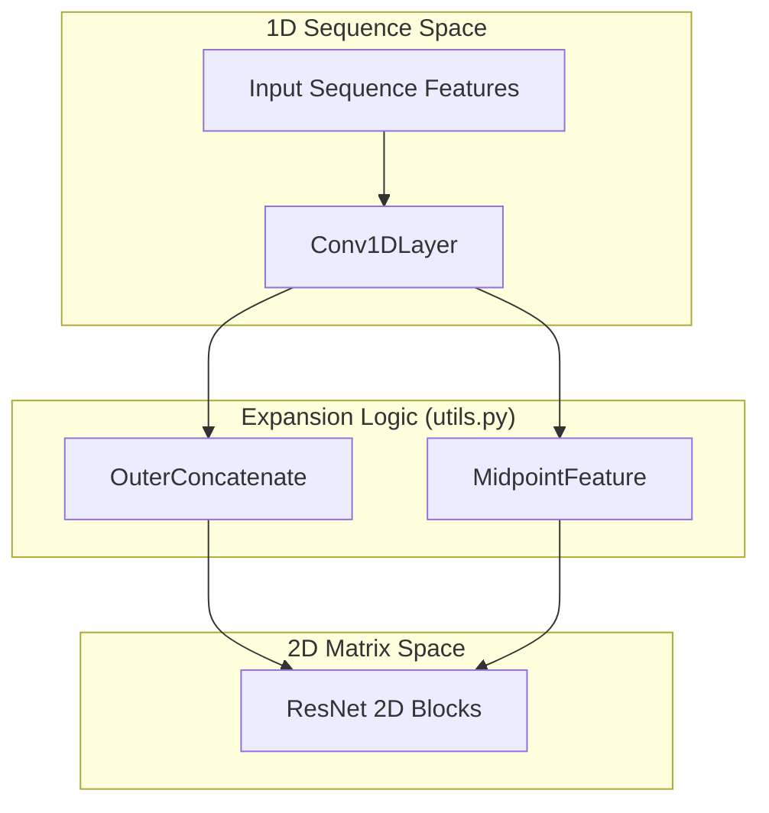
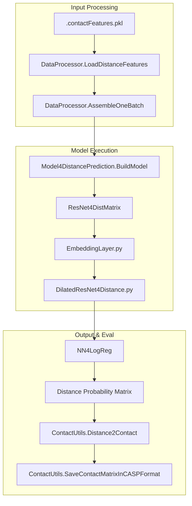

# Glossary

> **Relevant source files**
> * [Adams.py](https://github.com/nd-hung/DL4DistancePrediction2/blob/11ce7818/Adams.py)
> * [ContactUtils.py](https://github.com/nd-hung/DL4DistancePrediction2/blob/11ce7818/ContactUtils.py)
> * [DataProcessor.py](https://github.com/nd-hung/DL4DistancePrediction2/blob/11ce7818/DataProcessor.py)
> * [DilatedResNet4Distance.py](https://github.com/nd-hung/DL4DistancePrediction2/blob/11ce7818/DilatedResNet4Distance.py)
> * [DistanceUtils.py](https://github.com/nd-hung/DL4DistancePrediction2/blob/11ce7818/DistanceUtils.py)
> * [EmbeddingLayer.py](https://github.com/nd-hung/DL4DistancePrediction2/blob/11ce7818/EmbeddingLayer.py)
> * [Metrics.py](https://github.com/nd-hung/DL4DistancePrediction2/blob/11ce7818/Metrics.py)
> * [Model4DistancePrediction.py](https://github.com/nd-hung/DL4DistancePrediction2/blob/11ce7818/Model4DistancePrediction.py)
> * [Readme.md](https://github.com/nd-hung/DL4DistancePrediction2/blob/11ce7818/Readme.md?plain=1)
> * [config.py](https://github.com/nd-hung/DL4DistancePrediction2/blob/11ce7818/config.py)
> * [utils.py](https://github.com/nd-hung/DL4DistancePrediction2/blob/11ce7818/utils.py)

This page provides definitions and technical implementation details for codebase-specific terms, domain concepts, and architectural components within the `DL4DistancePrediction2` project.

## 1. Core Architectural Components

The following terms define the primary building blocks of the neural network architecture used for distance prediction.

### ResNet4DistMatrix

The top-level model class that orchestrates the flow of data from 1D sequence features to 2D distance probability maps. It utilizes a series of 1D convolutions, followed by a dimensionality expansion, and finally a deep 2D residual network.

* **Implementation:** Defined in `ResNet4DistMatrix` [Model4DistancePrediction.py L221](https://github.com/nd-hung/DL4DistancePrediction2/blob/11ce7818/Model4DistancePrediction.py#L221-L221)
* **Key Function:** `BuildModel()` [Model4DistancePrediction.py L534](https://github.com/nd-hung/DL4DistancePrediction2/blob/11ce7818/Model4DistancePrediction.py#L534-L534)  serves as the factory for initializing the network based on `modelSpecs`.

### ResBlock (Residual Block)

The fundamental unit of the 2D network. The codebase supports multiple versions (V1, V2, V22, V23), primarily differing in the placement and number of Batch Normalization layers.

* **V23 Block:** The recommended variant that removes unused batch normalization layers for efficiency [config.py L13](https://github.com/nd-hung/DL4DistancePrediction2/blob/11ce7818/config.py#L13-L13)
* **Implementation:** Defined in `ResBlockV2` [ResNet4Distance.py L97](https://github.com/nd-hung/DL4DistancePrediction2/blob/11ce7818/ResNet4Distance.py#L97-L97)  and related classes.

### Dilated Convolution

A convolution where the kernel is spread out by a `dilation` factor, allowing the model to have a larger receptive field without increasing the number of parameters.

* **Implementation:** `ResConv2DLayer` supports a `dilation` parameter [DilatedResNet4Distance.py L80-L81](https://github.com/nd-hung/DL4DistancePrediction2/blob/11ce7818/DilatedResNet4Distance.py#L80-L81)
* **Usage:** Used extensively in the `DilatedResNet` architecture [DilatedResNet4Distance.py L465](https://github.com/nd-hung/DL4DistancePrediction2/blob/11ce7818/DilatedResNet4Distance.py#L465-L465)

### Sources:

Sources: [Model4DistancePrediction.py L221-L534](https://github.com/nd-hung/DL4DistancePrediction2/blob/11ce7818/Model4DistancePrediction.py#L221-L534)

 [config.py L11-L16](https://github.com/nd-hung/DL4DistancePrediction2/blob/11ce7818/config.py#L11-L16)

 [ResNet4Distance.py L97-L150](https://github.com/nd-hung/DL4DistancePrediction2/blob/11ce7818/ResNet4Distance.py#L97-L150)

 [DilatedResNet4Distance.py L80-L465](https://github.com/nd-hung/DL4DistancePrediction2/blob/11ce7818/DilatedResNet4Distance.py#L80-L465)

---

## 2. Dimensionality Expansion (1D to 2D)

Because protein sequences are 1D strings but distance maps are 2D interaction grids, the codebase uses specific operations to transform feature tensors.

### OuterConcatenate

An operation that transforms a 1D sequence tensor of shape `(batch, seqLen, n_in)` into a 2D tensor of shape `(batch, seqLen, seqLen, 2*n_in)`. For every pair $(i, j)$, it concatenates the features of residue $i$ and residue $j$.

* **Implementation:** `OuterConcatenate()` [utils.py L62-L72](https://github.com/nd-hung/DL4DistancePrediction2/blob/11ce7818/utils.py#L62-L72)
* **Logic:** Uses `theano.tensor.mgrid` to create indices for the expansion [utils.py L68-L69](https://github.com/nd-hung/DL4DistancePrediction2/blob/11ce7818/utils.py#L68-L69)

### MidpointFeature

An alternative expansion method that concatenates features from residue $i$, residue $j$, and the midpoint residue $(i+j)/2$.

* **Implementation:** `MidpointFeature()` [utils.py L22-L40](https://github.com/nd-hung/DL4DistancePrediction2/blob/11ce7818/utils.py#L22-L40)

### Dimensionality Transformation Diagram

The following diagram illustrates how sequence-level features are projected into a 2D interaction space.

"Natural Language Space to Code Entity Space: Dimensionality Expansion"

### Sources:

Sources: [utils.py L22-L72](https://github.com/nd-hung/DL4DistancePrediction2/blob/11ce7818/utils.py#L22-L72)

 [Model4DistancePrediction.py L60-L62](https://github.com/nd-hung/DL4DistancePrediction2/blob/11ce7818/Model4DistancePrediction.py#L60-L62)

---

## 3. Data & Feature Engineering Terms

### Contact Features

Pre-processed protein data stored in `.pkl` files (e.g., `76CAMEO.2015.contactFeatures.pkl`). These contain both 1D (sequence, secondary structure) and 2D (evolutionary coupling) features.

* **Loading:** Handled by `LoadDistanceFeatures()` [DataProcessor.py L109](https://github.com/nd-hung/DL4DistancePrediction2/blob/11ce7818/DataProcessor.py#L109-L109)

### Atom Pair Types (APT)

The specific atoms between which distances are predicted.

* **CbCb:** Carbon-beta to Carbon-beta (standard for contact prediction).
* **CaCa:** Carbon-alpha to Carbon-alpha.
* **NO:** Nitrogen to Oxygen.
* **Definitions:** Found in `allAtomPairTypes` [config.py L22](https://github.com/nd-hung/DL4DistancePrediction2/blob/11ce7818/config.py#L22-L22)

### Distance Cutoffs & Bins

Distances are discretized into bins for multi-class classification.

* **12C/25C/52C:** Represents the number of discrete distance bins (e.g., 52 bins).
* **Plus Variants:** (e.g., `12CPlus`) Indicates that invalid distances (-1) are kept in a separate bin rather than merged with the maximum distance bin [config.py L58-L60](https://github.com/nd-hung/DL4DistancePrediction2/blob/11ce7818/config.py#L58-L60)
* **Implementation:** `distCutoffs` dictionary [config.py L62-L87](https://github.com/nd-hung/DL4DistancePrediction2/blob/11ce7818/config.py#L62-L87)

### Range-Based Weighting

The loss function weights residue pairs differently based on their sequence separation (Long, Medium, Short, Near).

* **RangeBoundaries:** `[24, 12, 6, 2]` [config.py L141](https://github.com/nd-hung/DL4DistancePrediction2/blob/11ce7818/config.py#L141-L141)
* **Logic:** `GetRangeIndex()` calculates which bin a pair falls into [config.py L144-L154](https://github.com/nd-hung/DL4DistancePrediction2/blob/11ce7818/config.py#L144-L154)

### Sources:

Sources: [DataProcessor.py L109-L122](https://github.com/nd-hung/DL4DistancePrediction2/blob/11ce7818/DataProcessor.py#L109-L122)

 [config.py L19-L87](https://github.com/nd-hung/DL4DistancePrediction2/blob/11ce7818/config.py#L19-L87)

 [config.py L141-L154](https://github.com/nd-hung/DL4DistancePrediction2/blob/11ce7818/config.py#L141-L154)

---

## 4. Evaluation Metrics

### MCC (Matthews Correlation Coefficient)

A measure of the quality of binary classifications, used here for contact prediction.

* **Implementation:** `MCC()` [Metrics.py L12-L16](https://github.com/nd-hung/DL4DistancePrediction2/blob/11ce7818/Metrics.py#L12-L16)

### GDT (Global Distance Test)

A metric adapted from protein structure comparison to evaluate the accuracy of predicted distance bounds.

* **Implementation:** Calculated within `EvaluateDistanceBoundAccuracy()` [DistanceUtils.py L89-L95](https://github.com/nd-hung/DL4DistancePrediction2/blob/11ce7818/DistanceUtils.py#L89-L95)

### CASP Format

The standard file format for protein structure prediction competitions. The predictor can output `.rr` files following this specification.

* **Logic:** `SaveContactMatrixInCASPFormat()` [ContactUtils.py L106-L184](https://github.com/nd-hung/DL4DistancePrediction2/blob/11ce7818/ContactUtils.py#L106-L184)

### Sources:

Sources: [Metrics.py L12-L16](https://github.com/nd-hung/DL4DistancePrediction2/blob/11ce7818/Metrics.py#L12-L16)

 [DistanceUtils.py L28-L95](https://github.com/nd-hung/DL4DistancePrediction2/blob/11ce7818/DistanceUtils.py#L28-L95)

 [ContactUtils.py L106-L184](https://github.com/nd-hung/DL4DistancePrediction2/blob/11ce7818/ContactUtils.py#L106-L184)

---

## 5. Training & Optimization

### AdamW / AMSGrad

Advanced variants of the Adam optimizer that handle weight decay and convergence stability.

* **Implementation:** `AdamW` [Adams.py L96](https://github.com/nd-hung/DL4DistancePrediction2/blob/11ce7818/Adams.py#L96-L96)  and `AMSGrad` [Adams.py L60](https://github.com/nd-hung/DL4DistancePrediction2/blob/11ce7818/Adams.py#L60-L60)

### Batch Normalization (Mask-Aware)

A custom implementation of Batch Norm that ignores padded positions (noise) when calculating mean and variance.

* **Implementation:** `batch_norm()` [DilatedResNet4Distance.py L158](https://github.com/nd-hung/DL4DistancePrediction2/blob/11ce7818/DilatedResNet4Distance.py#L158-L158)
* **Logic:** Uses a `mask` to calculate the number of effective elements `x_num` [DilatedResNet4Distance.py L170-L175](https://github.com/nd-hung/DL4DistancePrediction2/blob/11ce7818/DilatedResNet4Distance.py#L170-L175)

### Data Flow Diagram

The following diagram maps the logical flow of a training/inference batch through the code entities.

"Natural Language Space to Code Entity Space: Data Pipeline"

### Sources:

Sources: [Adams.py L60-L131](https://github.com/nd-hung/DL4DistancePrediction2/blob/11ce7818/Adams.py#L60-L131)

 [DilatedResNet4Distance.py L158-L180](https://github.com/nd-hung/DL4DistancePrediction2/blob/11ce7818/DilatedResNet4Distance.py#L158-L180)

 [DataProcessor.py L109-L200](https://github.com/nd-hung/DL4DistancePrediction2/blob/11ce7818/DataProcessor.py#L109-L200)

 [ContactUtils.py L106-L200](https://github.com/nd-hung/DL4DistancePrediction2/blob/11ce7818/ContactUtils.py#L106-L200)