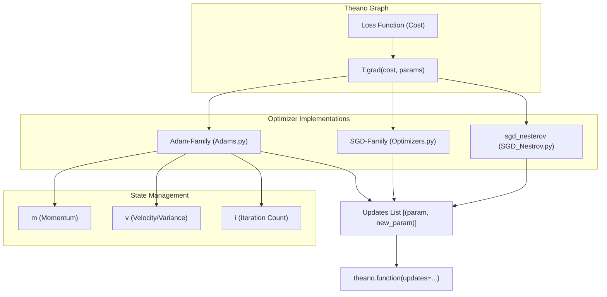

# Optimization & Training

> **Relevant source files**
> * [Adams.py](https://github.com/nd-hung/DL4DistancePrediction2/blob/11ce7818/Adams.py)
> * [Optimizers.py](https://github.com/nd-hung/DL4DistancePrediction2/blob/11ce7818/Optimizers.py)
> * [SGD_Nestrov.py](https://github.com/nd-hung/DL4DistancePrediction2/blob/11ce7818/SGD_Nestrov.py)

This section provides an overview of the optimization algorithms and training infrastructure used to minimize loss functions during the training of protein distance prediction models. The codebase implements a variety of first-order gradient-based optimization methods using **Theano**, ranging from standard Stochastic Gradient Descent (SGD) to advanced adaptive methods like AdamW and AMSGrad.

The optimization logic is decoupled from the neural network architecture, allowing for flexible experimentation with different convergence strategies. All optimizers follow a common contract: they accept model parameters and their symbolic gradients, and return a list of Theano update tuples.

### Optimization Strategy Overview

The training process utilizes two primary families of optimizers: the **Adam family** for adaptive learning rates with momentum, and the **SGD family** for traditional and accelerated gradient methods. These optimizers manage internal state variables (e.g., first and second moments of gradients) as Theano shared variables to maintain persistence across training iterations.

The following diagram illustrates the relationship between the optimization components and the Theano update mechanism:

**Optimization System Architecture**



**Sources:** [Adams.py L30-L58](https://github.com/nd-hung/DL4DistancePrediction2/blob/11ce7818/Adams.py#L30-L58)

 [Optimizers.py L40-L81](https://github.com/nd-hung/DL4DistancePrediction2/blob/11ce7818/Optimizers.py#L40-L81)

 [SGD_Nestrov.py L6-L15](https://github.com/nd-hung/DL4DistancePrediction2/blob/11ce7818/SGD_Nestrov.py#L6-L15)

---

### Adam-Family Optimizers

The Adam family implementations in this codebase focus on adaptive moment estimation with enhancements for stability and regularization. These are primarily defined in `Adams.py`. Key features include:

* **Bias Correction:** Standard Adam and AMSGrad use `fix1` and `fix2` to account for the initialization of moments at zero [Adams.py L39-L41](https://github.com/nd-hung/DL4DistancePrediction2/blob/11ce7818/Adams.py#L39-L41)
* **Decoupled Weight Decay:** The `AdamW` and `AdamWAMS` functions implement weight decay independently of the gradient updates, which has been shown to improve generalization in deep ResNets [Adams.py L124-L166](https://github.com/nd-hung/DL4DistancePrediction2/blob/11ce7818/Adams.py#L124-L166)
* **Convergence Stability:** `AMSGrad` and `AdamWAMS` track the maximum of second moments (`v_hat`) to prevent the learning rate from increasing monotonically in certain dimensions [Adams.py L82-L163](https://github.com/nd-hung/DL4DistancePrediction2/blob/11ce7818/Adams.py#L82-L163)

For detailed implementation of state variables and bias correction, see [Adam-Family Optimizers](/nd-hung/DL4DistancePrediction2/4.1-adam-family-optimizers).

**Sources:** [Adams.py L30-L174](https://github.com/nd-hung/DL4DistancePrediction2/blob/11ce7818/Adams.py#L30-L174)

---

### SGD & Adaptive Optimizers

The `Optimizers.py` and `SGD_Nestrov.py` files contain traditional gradient descent variants and early adaptive methods. These are often used for fine-tuning or when the memory overhead of Adam is prohibitive.

| Optimizer | Key Characteristics | Code Entity |
| --- | --- | --- |
| **AdaDelta** | Adapts learning rate based on a moving window of gradient updates; requires no manual learning rate. | `AdaDelta` [Optimizers.py L40](https://github.com/nd-hung/DL4DistancePrediction2/blob/11ce7818/Optimizers.py#L40-L40) |
| **AdaGrad** | Scales learning rate by the inverse square root of the sum of all historical squared gradients. | `AdaGrad` [Optimizers.py L88](https://github.com/nd-hung/DL4DistancePrediction2/blob/11ce7818/Optimizers.py#L88-L88) |
| **SGDM** | Standard momentum implementation using a velocity shared variable. | `SGDM` [Optimizers.py L130](https://github.com/nd-hung/DL4DistancePrediction2/blob/11ce7818/Optimizers.py#L130-L130) |
| **Nesterov** | Accelerated gradient descent that looks ahead at the momentum step before calculating gradients. | `Nesterov` [Optimizers.py L198](https://github.com/nd-hung/DL4DistancePrediction2/blob/11ce7818/Optimizers.py#L198-L198) |

The `sgd_nesterov` class in `SGD_Nestrov.py` provides a structured way to manage the `memory_` (velocity) of parameters during Nesterov acceleration [SGD_Nestrov.py L3-L15](https://github.com/nd-hung/DL4DistancePrediction2/blob/11ce7818/SGD_Nestrov.py#L3-L15)

For details on the saddle-point test harness and hyperparameter configurations (rho, gamma, epsilon), see [SGD & Adaptive Optimizers](/nd-hung/DL4DistancePrediction2/4.2-sgd-and-adaptive-optimizers).

**Sources:** [Optimizers.py L40-L213](https://github.com/nd-hung/DL4DistancePrediction2/blob/11ce7818/Optimizers.py#L40-L213)

 [SGD_Nestrov.py L1-L15](https://github.com/nd-hung/DL4DistancePrediction2/blob/11ce7818/SGD_Nestrov.py#L1-L15)

---

### Optimizer Return Contract

Every optimizer in the system follows a consistent interface to integrate with the training loop. They return a tuple containing:

1. **`updates`**: A list of `(shared_variable, new_expression)` pairs passed to the Theano function [Adams.py L58](https://github.com/nd-hung/DL4DistancePrediction2/blob/11ce7818/Adams.py#L58-L58)  [Optimizers.py L80](https://github.com/nd-hung/DL4DistancePrediction2/blob/11ce7818/Optimizers.py#L80-L80)
2. **`other_params`** (or state variables): A list of shared variables created by the optimizer (like momentum buffers) that need to be persisted or saved with the model [Adams.py L32-L58](https://github.com/nd-hung/DL4DistancePrediction2/blob/11ce7818/Adams.py#L32-L58)  [Optimizers.py L116](https://github.com/nd-hung/DL4DistancePrediction2/blob/11ce7818/Optimizers.py#L116-L116)

**Data Flow: Gradient to Update**

```mermaid
sequenceDiagram
  participant Theano Graph
  participant Optimizer (e.g., AdamW)
  participant Shared Variables (m, v)
  participant Model Parameters

  Theano Graph->>Optimizer (e.g., AdamW): grads (symbolic)
  Optimizer (e.g., AdamW)->>Shared Variables (m, v): get_value() (init if first run)
  note over Optimizer (e.g., AdamW): Calculate m_t, v_t
  note over Optimizer (e.g., AdamW): Apply decoupled weight decay (l2reg)
  Optimizer (e.g., AdamW)->>Theano Graph: Return update tuples
  Theano Graph->>Shared Variables (m, v): Apply updates (m_t, v_t)
  Theano Graph->>Model Parameters: Apply updates (p_t)
```

**Sources:** [Adams.py L113-L131](https://github.com/nd-hung/DL4DistancePrediction2/blob/11ce7818/Adams.py#L113-L131)

 [Optimizers.py L151-L161](https://github.com/nd-hung/DL4DistancePrediction2/blob/11ce7818/Optimizers.py#L151-L161)