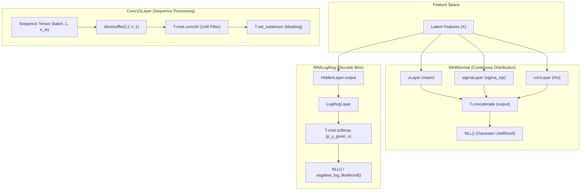
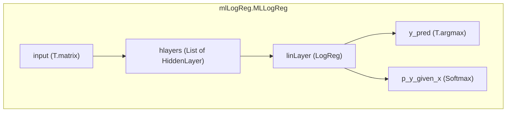

# Prediction Output Layers

> **Relevant source files**
> * [Conv1d.py](https://github.com/nd-hung/DL4DistancePrediction2/blob/11ce7818/Conv1d.py)
> * [LogReg.py](https://github.com/nd-hung/DL4DistancePrediction2/blob/11ce7818/LogReg.py)
> * [NN4LogReg.py](https://github.com/nd-hung/DL4DistancePrediction2/blob/11ce7818/NN4LogReg.py)
> * [NN4Normal.py](https://github.com/nd-hung/DL4DistancePrediction2/blob/11ce7818/NN4Normal.py)
> * [mlLogReg.py](https://github.com/nd-hung/DL4DistancePrediction2/blob/11ce7818/mlLogReg.py)

The terminal prediction heads in the distance prediction architecture transform high-level feature representations into scientific predictions. These layers handle the final mapping from latent feature spaces to either discrete distance bins (via Negative Log-Likelihood) or continuous probability distributions (Gaussian/Bivariate).

## Overview of Prediction Heads

The codebase utilizes several specialized output layers depending on the prediction target:

* **NN4LogReg**: A multi-layer perceptron terminating in a Softmax layer for multi-class classification, typically used for discretized distance bins [NN4LogReg.py L115-L169](https://github.com/nd-hung/DL4DistancePrediction2/blob/11ce7818/NN4LogReg.py#L115-L169) .
* **NN4Normal**: A network designed to predict parameters of a normal distribution (mean, variance, and optionally correlation for bivariate cases) [NN4Normal.py L77-L187](https://github.com/nd-hung/DL4DistancePrediction2/blob/11ce7818/NN4Normal.py#L77-L187) .
* **LogReg / MLLogReg**: Standard Logistic Regression and Multi-Layer Logistic Regression implementations used as building blocks for classification tasks [LogReg.py L50-L111](https://github.com/nd-hung/DL4DistancePrediction2/blob/11ce7818/LogReg.py#L50-L111)  [mlLogReg.py L89-L160](https://github.com/nd-hung/DL4DistancePrediction2/blob/11ce7818/mlLogReg.py#L89-L160) .
* **Conv1DLayer**: A specialized 1D convolutional layer used for sequence-level feature extraction before the 1D-to-2D expansion phase [Conv1d.py L22-L80](https://github.com/nd-hung/DL4DistancePrediction2/blob/11ce7818/Conv1d.py#L22-L80) .

## Code Entity Mapping: Prediction Logic

The following diagram bridges the mathematical concepts of distance prediction to the specific classes and methods implemented in the codebase.

### Terminal Prediction Architecture

**Sources:** [NN4LogReg.py L115-L181](https://github.com/nd-hung/DL4DistancePrediction2/blob/11ce7818/NN4LogReg.py#L115-L181)

, [NN4Normal.py L144-L190](https://github.com/nd-hung/DL4DistancePrediction2/blob/11ce7818/NN4Normal.py#L144-L190)

, [Conv1d.py L22-L77](https://github.com/nd-hung/DL4DistancePrediction2/blob/11ce7818/Conv1d.py#L22-L77)

.

## Discrete Distance Prediction (NN4LogReg)

`NN4LogReg` is the primary head for predicting discretized distance intervals. It constructs a stack of `HiddenLayer` objects followed by a `LogRegLayer`.

### Implementation Details

* **Softmax Output**: The final layer uses `T.nnet.softmax` to produce a probability distribution across $N$ distance bins [NN4LogReg.py L76-L78](https://github.com/nd-hung/DL4DistancePrediction2/blob/11ce7818/NN4LogReg.py#L76-L78) .
* **Loss Function**: It implements Negative Log-Likelihood (NLL). If `sampleWeight` is provided, the loss is calculated as a weighted sum: $- \sum (w \cdot \log(P(Y|X))) / \sum w$ [NN4LogReg.py L89-L92](https://github.com/nd-hung/DL4DistancePrediction2/blob/11ce7818/NN4LogReg.py#L89-L92) .
* **Hidden Layers**: Each `HiddenLayer` uses a weight matrix $W$ initialized with a uniform distribution scaled by $\sqrt{6 / (n_{in} + n_{out})}$ (Xavier initialization) [NN4LogReg.py L33-L37](https://github.com/nd-hung/DL4DistancePrediction2/blob/11ce7818/NN4LogReg.py#L33-L37) .

**Sources:** [NN4LogReg.py L17-L53](https://github.com/nd-hung/DL4DistancePrediction2/blob/11ce7818/NN4LogReg.py#L17-L53)

, [NN4LogReg.py L55-L112](https://github.com/nd-hung/DL4DistancePrediction2/blob/11ce7818/NN4LogReg.py#L55-L112)

.

## Continuous Distribution Prediction (NN4Normal)

`NN4Normal` is used when the distance is treated as a continuous variable, supporting both univariate (distance) and bivariate (e.g., distance and orientation) distributions.

### Output Parameters

The class calculates different parameters based on `n_variables` and `n_out`:

| n_variables | n_out | Parameters Predicted | Implementation |
| --- | --- | --- | --- |
| 1 | 1 | Mean ($\mu$) | [NN4Normal.py L148-L149](https://github.com/nd-hung/DL4DistancePrediction2/blob/11ce7818/NN4Normal.py#L148-L149) |
| 1 | 2 | Mean ($\mu$), Variance ($\sigma^2$) | [NN4Normal.py L154-L155](https://github.com/nd-hung/DL4DistancePrediction2/blob/11ce7818/NN4Normal.py#L154-L155) |
| 2 | 5 | $\mu_1, \mu_2, \sigma_1^2, \sigma_2^2, \rho$ | [NN4Normal.py L162-L165](https://github.com/nd-hung/DL4DistancePrediction2/blob/11ce7818/NN4Normal.py#L162-L165) |

### Constraints and Activations

* **Positivity**: $\sigma^2$ is enforced to be positive using `T.nnet.relu` plus a small `sigma_sqr_min` (default 0.0001) [NN4Normal.py L154-L155](https://github.com/nd-hung/DL4DistancePrediction2/blob/11ce7818/NN4Normal.py#L154-L155) .
* **Correlation**: The correlation coefficient $\rho$ is constrained to $[-0.99, 0.99]$ using `T.tanh` multiplied by `rho_abs_max` [NN4Normal.py L164-L165](https://github.com/nd-hung/DL4DistancePrediction2/blob/11ce7818/NN4Normal.py#L164-L165) .

**Sources:** [NN4Normal.py L84-L110](https://github.com/nd-hung/DL4DistancePrediction2/blob/11ce7818/NN4Normal.py#L84-L110)

 [NN4Normal.py L144-L187](https://github.com/nd-hung/DL4DistancePrediction2/blob/11ce7818/NN4Normal.py#L144-L187)

.

## Sequence Feature Extraction (Conv1DLayer)

Before 1D features are expanded to 2D distance matrices, they are often processed by `Conv1DLayer`.

### Data Flow

1. **Reshaping**: The input tensor `(batchSize, seqLen, n_in)` is shuffled to `(batchSize, n_in, 1, seqLen)` to utilize Theano's `conv2d` engine for 1D convolution [Conv1d.py L33-L34](https://github.com/nd-hung/DL4DistancePrediction2/blob/11ce7818/Conv1d.py#L33-L34) .
2. **Convolution**: A filter of shape `(n_out, n_in, 1, windowSize)` is applied with `border_mode='half'` to maintain sequence length [Conv1d.py L38-L58](https://github.com/nd-hung/DL4DistancePrediction2/blob/11ce7818/Conv1d.py#L38-L58) .
3. **Masking**: To handle variable-length sequences in a batch, a `mask` is applied to the output to zero-out padded positions, preventing noise from propagating through the network [Conv1d.py L67-L77](https://github.com/nd-hung/DL4DistancePrediction2/blob/11ce7818/Conv1d.py#L67-L77) .

**Sources:** [Conv1d.py L22-L80](https://github.com/nd-hung/DL4DistancePrediction2/blob/11ce7818/Conv1d.py#L22-L80)

.

## Logistic Regression Base Layers

The `LogReg` and `mlLogReg` files provide the fundamental building blocks for the more complex prediction heads.

### Logic Flow: Multi-Layer Logistic Regression

**Sources:** [mlLogReg.py L100-L160](https://github.com/nd-hung/DL4DistancePrediction2/blob/11ce7818/mlLogReg.py#L100-L160)

.

### Key Methods

* **negative_log_likelihood**: Computes the mean NLL across the minibatch, supporting optional `sampleWeight` for imbalanced distance bin distributions [LogReg.py L114-L147](https://github.com/nd-hung/DL4DistancePrediction2/blob/11ce7818/LogReg.py#L114-L147) .
* **errors**: Calculates the 0-1 classification error rate [LogReg.py L152-L177](https://github.com/nd-hung/DL4DistancePrediction2/blob/11ce7818/LogReg.py#L152-L177) .
* **errorsBreakdown**: Specifically for 3-class problems (e.g., Secondary Structure), provides per-class error rates using `T.bincount` [LogReg.py L181-L192](https://github.com/nd-hung/DL4DistancePrediction2/blob/11ce7818/LogReg.py#L181-L192) .

**Sources:** [LogReg.py L50-L111](https://github.com/nd-hung/DL4DistancePrediction2/blob/11ce7818/LogReg.py#L50-L111)

 [mlLogReg.py L19-L87](https://github.com/nd-hung/DL4DistancePrediction2/blob/11ce7818/mlLogReg.py#L19-L87)

.