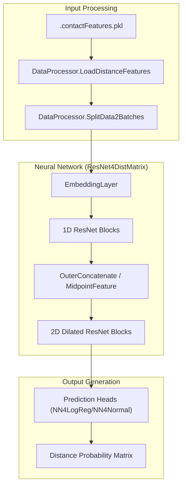
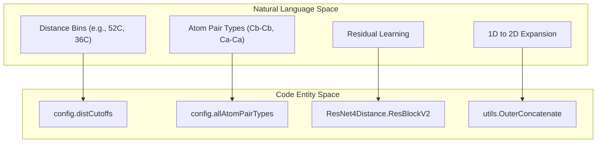

# Project Overview

> **Relevant source files**
> * [Readme.md](https://github.com/nd-hung/DL4DistancePrediction2/blob/11ce7818/Readme.md?plain=1)
> * [config.py](https://github.com/nd-hung/DL4DistancePrediction2/blob/11ce7818/config.py)
> * [run_distance_predictor.py](https://github.com/nd-hung/DL4DistancePrediction2/blob/11ce7818/run_distance_predictor.py)

The **DL4DistancePrediction2** codebase is a Python 3 implementation of the deep learning architecture described in *"Distance-based protein folding powered by deep learning"* (PNAS 2019) [Readme.md L1-L3](https://github.com/nd-hung/DL4DistancePrediction2/blob/11ce7818/Readme.md?plain=1#L1-L3)

 It is designed to predict inter-residue distance matrices for proteins, which are critical for accurate 3D structure modeling.

The system utilizes a 2D Dilated Residual Network (ResNet) to transform 1D sequence features and 2D evolutionary coupling information into multi-class distance probability distributions [Readme.md L21-L23](https://github.com/nd-hung/DL4DistancePrediction2/blob/11ce7818/Readme.md?plain=1#L21-L23)

### System Architecture & Data Flow

The pipeline operates by converting raw protein features into tensors that are processed through a series of convolutional layers. The primary entry point for inference is `run_distance_predictor.py` [run_distance_predictor.py L34-L38](https://github.com/nd-hung/DL4DistancePrediction2/blob/11ce7818/run_distance_predictor.py#L34-L38)

#### High-Level Data Flow

The following diagram illustrates how raw sequence data is transformed into a distance matrix:

**Distance Prediction Pipeline**

**Sources:** [run_distance_predictor.py L81-L114](https://github.com/nd-hung/DL4DistancePrediction2/blob/11ce7818/run_distance_predictor.py#L81-L114)

 [Model4DistancePrediction.py L63-L70](https://github.com/nd-hung/DL4DistancePrediction2/blob/11ce7818/Model4DistancePrediction.py#L63-L70)

 [Readme.md L21-L23](https://github.com/nd-hung/DL4DistancePrediction2/blob/11ce7818/Readme.md?plain=1#L21-L23)

### Key Components

The codebase is organized into functional modules covering configuration, model architecture, data processing, and optimization:

| Component | Role | Primary Files |
| --- | --- | --- |
| **Inference Engine** | Orchestrates model loading and batch prediction. | `run_distance_predictor.py` |
| **Configuration** | Central registry for distance bins, atom types, and network flags. | `config.py` |
| **Model Factory** | Defines the ResNet architecture and multi-response heads. | `Model4DistancePrediction.py`, `ResNet4Distance.py` |
| **Data Pipeline** | Handles feature extraction, normalization, and batch assembly. | `DataProcessor.py`, `ReadProteinFeatures.py` |
| **Tensor Ops** | Mathematical utilities for 1D-to-2D feature expansion. | `utils.py`, `EmbeddingLayer.py` |

### Code Entity Mapping

The relationship between high-level scientific concepts and specific code entities is shown below. This map assists in navigating the implementation of the ResNet architecture.

**Conceptual to Code Mapping**

**Sources:** [config.py L22-L24](https://github.com/nd-hung/DL4DistancePrediction2/blob/11ce7818/config.py#L22-L24)

 [config.py L62-L87](https://github.com/nd-hung/DL4DistancePrediction2/blob/11ce7818/config.py#L62-L87)

 [utils.py L10-L50](https://github.com/nd-hung/DL4DistancePrediction2/blob/11ce7818/utils.py#L10-L50)

 [ResNet4Distance.py L100-L150](https://github.com/nd-hung/DL4DistancePrediction2/blob/11ce7818/ResNet4Distance.py#L100-L150)

### Sub-Sections and Detailed Documentation

For technical deep-dives, refer to the following child pages:

* **[Getting Started & Running Inference](/nd-hung/DL4DistancePrediction2/1.1-getting-started-and-running-inference)**: Instructions on environment setup, CLI parameters for `run_distance_predictor.py`, and handling `.pkl` model files [run_distance_predictor.py L34-L52](https://github.com/nd-hung/DL4DistancePrediction2/blob/11ce7818/run_distance_predictor.py#L34-L52)
* **[Configuration System](/nd-hung/DL4DistancePrediction2/1.2-configuration-system)**: Details on how `config.py` governs the distance discretization (e.g., `52C`, `36C` labels) and range-based weighting for long-range contact optimization [config.py L64-L87](https://github.com/nd-hung/DL4DistancePrediction2/blob/11ce7818/config.py#L64-L87)  [config.py L141-L156](https://github.com/nd-hung/DL4DistancePrediction2/blob/11ce7818/config.py#L141-L156)

---

**Sources:**

* [Readme.md L1-L52](https://github.com/nd-hung/DL4DistancePrediction2/blob/11ce7818/Readme.md?plain=1#L1-L52)
* [config.py L1-L160](https://github.com/nd-hung/DL4DistancePrediction2/blob/11ce7818/config.py#L1-L160)
* [run_distance_predictor.py L1-L157](https://github.com/nd-hung/DL4DistancePrediction2/blob/11ce7818/run_distance_predictor.py#L1-L157)