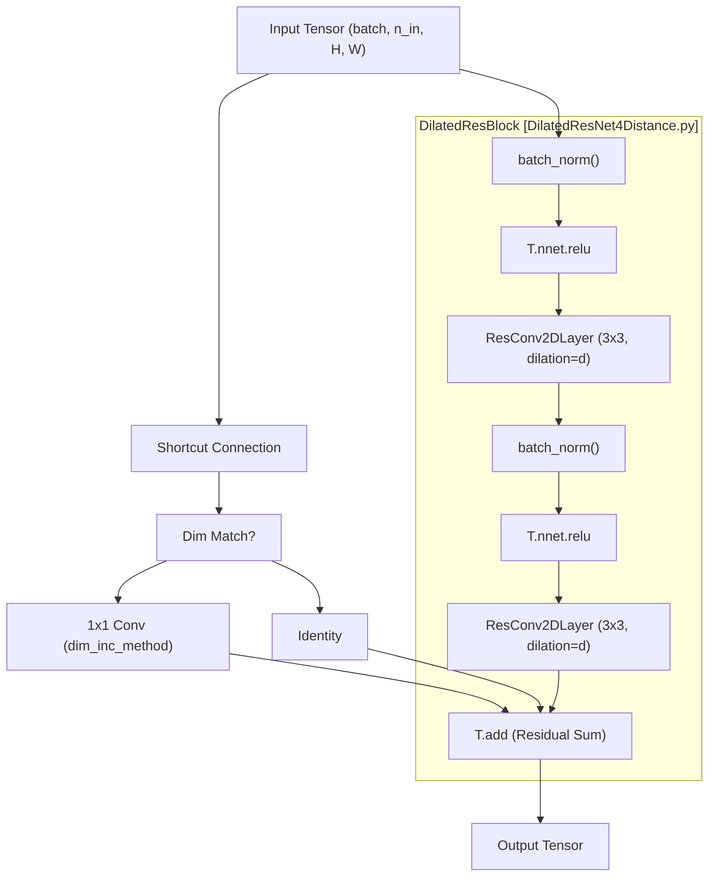
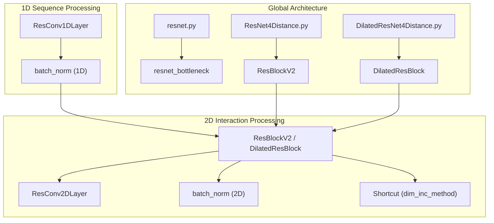

# Residual Network Blocks

> **Relevant source files**
> * [DilatedResNet4Distance.py](https://github.com/nd-hung/DL4DistancePrediction2/blob/11ce7818/DilatedResNet4Distance.py)
> * [ResNet4Distance.py](https://github.com/nd-hung/DL4DistancePrediction2/blob/11ce7818/ResNet4Distance.py)
> * [resnet.py](https://github.com/nd-hung/DL4DistancePrediction2/blob/11ce7818/resnet.py)

This page describes the core building blocks of the distance prediction models, specifically the 1D and 2D residual architectures. These blocks are responsible for extracting hierarchical features from protein sequences (1D) and evolutionary coupling maps (2D). The implementation supports standard Residual Networks (ResNet) and Dilated Residual Networks (DilatedResNet), incorporating mask-aware operations to handle variable-length protein sequences within batches.

## Core Convolutional Layers

The foundation of the architecture lies in custom 1D and 2D convolutional layers designed to handle padding masks. In protein distance prediction, proteins in a batch have different lengths; sequences are aligned to the right-bottom corner, and a mask is used to zero out the padding noise.

### ResConv1DLayer

Used for initial sequence feature extraction. It transforms a 1D sequence tensor of shape `(batchSize, n_in, seqLen)` into `(batchSize, n_out, seqLen)` [DilatedResNet4Distance.py L10-L11](https://github.com/nd-hung/DL4DistancePrediction2/blob/11ce7818/DilatedResNet4Distance.py#L10-L11)

* **Implementation**: It reshapes the 1D input into a 4D tensor `(batchSize, n_in, 1, seqLen)` to utilize Theano's `conv2d` [DilatedResNet4Distance.py L24](https://github.com/nd-hung/DL4DistancePrediction2/blob/11ce7818/DilatedResNet4Distance.py#L24-L24)
* **Dilation**: Supports a `dilation` parameter to increase the receptive field without increasing parameters [DilatedResNet4Distance.py L46-L47](https://github.com/nd-hung/DL4DistancePrediction2/blob/11ce7818/DilatedResNet4Distance.py#L46-L47)
* **Masking**: If a `mask` is provided, it explicitly resets padded positions to zero after the convolution to prevent signal leakage from padding [DilatedResNet4Distance.py L58-L65](https://github.com/nd-hung/DL4DistancePrediction2/blob/11ce7818/DilatedResNet4Distance.py#L58-L65)

### ResConv2DLayer

Used for processing interaction maps. It operates on tensors of shape `(batchSize, n_in, nRows, nCols)` [DilatedResNet4Distance.py L82](https://github.com/nd-hung/DL4DistancePrediction2/blob/11ce7818/DilatedResNet4Distance.py#L82-L82)

* **Spatial Consistency**: Uses `border_mode='half'` to ensure the output spatial dimensions match the input [DilatedResNet4Distance.py L128](https://github.com/nd-hung/DL4DistancePrediction2/blob/11ce7818/DilatedResNet4Distance.py#L128-L128)
* **2D Masking**: The masking logic is applied twice—once horizontally and once vertically—to ensure the square interaction matrix is cleaned of padding artifacts [DilatedResNet4Distance.py L134-L147](https://github.com/nd-hung/DL4DistancePrediction2/blob/11ce7818/DilatedResNet4Distance.py#L134-L147)

**Sources:** [DilatedResNet4Distance.py L6-L77](https://github.com/nd-hung/DL4DistancePrediction2/blob/11ce7818/DilatedResNet4Distance.py#L6-L77)

 [DilatedResNet4Distance.py L79-L156](https://github.com/nd-hung/DL4DistancePrediction2/blob/11ce7818/DilatedResNet4Distance.py#L79-L156)

 [ResNet4Distance.py L6-L67](https://github.com/nd-hung/DL4DistancePrediction2/blob/11ce7818/ResNet4Distance.py#L6-L67)

 [ResNet4Distance.py L70-L142](https://github.com/nd-hung/DL4DistancePrediction2/blob/11ce7818/ResNet4Distance.py#L70-L142)

---

## Mask-Aware Batch Normalization

Standard Batch Normalization can be biased by zero-padded regions in a batch. The `batch_norm` function in this codebase is specialized to exclude masked positions from the mean and variance calculations.

| Feature | Implementation Detail |
| --- | --- |
| **Effective Count** | Calculates `x_num` by summing the mask rather than using the total tensor size [DilatedResNet4Distance.py L170-L174](https://github.com/nd-hung/DL4DistancePrediction2/blob/11ce7818/DilatedResNet4Distance.py#L170-L174) |
| **Statistics** | Computes `x_mean` and `x_std` using only the "effective" elements identified by the mask [DilatedResNet4Distance.py L175-L179](https://github.com/nd-hung/DL4DistancePrediction2/blob/11ce7818/DilatedResNet4Distance.py#L175-L179) |
| **Post-Correction** | After applying `T.nnet.bn.batch_normalization`, it re-masks the output to ensure padding remains zero [DilatedResNet4Distance.py L183-L195](https://github.com/nd-hung/DL4DistancePrediction2/blob/11ce7818/DilatedResNet4Distance.py#L183-L195) |

**Sources:** [DilatedResNet4Distance.py L158-L202](https://github.com/nd-hung/DL4DistancePrediction2/blob/11ce7818/DilatedResNet4Distance.py#L158-L202)

 [ResNet4Distance.py L144-L188](https://github.com/nd-hung/DL4DistancePrediction2/blob/11ce7818/ResNet4Distance.py#L144-L188)

---

## Residual Block Variants

The codebase implements several versions of the Residual Block, allowing for different connectivity patterns and bottleneck strategies.

### ResBlock Architecture Comparison

| Class Name | Logic Version | Description |
| --- | --- | --- |
| `ResBlockV1` | Standard | `Activation(Conv(Activation(Conv(x))) + x)` [ResNet4Distance.py L192-L259](https://github.com/nd-hung/DL4DistancePrediction2/blob/11ce7818/ResNet4Distance.py#L192-L259) |
| `ResBlockV2` | Pre-activation | `Conv(Activation(BN(Conv(Activation(BN(x)))))) + x` [ResNet4Distance.py L263-L334](https://github.com/nd-hung/DL4DistancePrediction2/blob/11ce7818/ResNet4Distance.py#L263-L334) |
| `ResBlockV22` | Variant | A modification of V2 typically used for specific dimensionality matching [ResNet4Distance.py L338-L410](https://github.com/nd-hung/DL4DistancePrediction2/blob/11ce7818/ResNet4Distance.py#L338-L410) |
| `BottleneckBlock` | Bottleneck | Uses 1x1 convolutions to reduce and then restore dimensionality, minimizing computation [resnet.py L37-L59](https://github.com/nd-hung/DL4DistancePrediction2/blob/11ce7818/resnet.py#L37-L59) |
| `DilatedResBlock` | Dilated | Incorporates `dilation` in the 2D convolutions to capture long-range dependencies [DilatedResNet4Distance.py L206-L281](https://github.com/nd-hung/DL4DistancePrediction2/blob/11ce7818/DilatedResNet4Distance.py#L206-L281) |

### Dimensionality Increment Methods (dim_inc_method)

When the number of output filters exceeds input filters, the shortcut connection must be adjusted. The models support:

1. **`identity`**: Zero-padding the feature maps (if dimensions match) [ResNet4Distance.py L246](https://github.com/nd-hung/DL4DistancePrediction2/blob/11ce7818/ResNet4Distance.py#L246-L246)
2. **`projection`**: Using a 1x1 convolution to project the shortcut to the new dimension [ResNet4Distance.py L252](https://github.com/nd-hung/DL4DistancePrediction2/blob/11ce7818/ResNet4Distance.py#L252-L252)

**Sources:** [ResNet4Distance.py L192-L410](https://github.com/nd-hung/DL4DistancePrediction2/blob/11ce7818/ResNet4Distance.py#L192-L410)

 [DilatedResNet4Distance.py L206-L281](https://github.com/nd-hung/DL4DistancePrediction2/blob/11ce7818/DilatedResNet4Distance.py#L206-L281)

 [resnet.py L37-L59](https://github.com/nd-hung/DL4DistancePrediction2/blob/11ce7818/resnet.py#L37-L59)

---

## Data Flow: 2D Residual Block

The following diagram illustrates the data flow within a `DilatedResBlock` using pre-activation (V2 style).

### Entity Mapping: Reblock Logic to Code

Title: Dilated Residual Block Data Flow

**Sources:** [DilatedResNet4Distance.py L206-L281](https://github.com/nd-hung/DL4DistancePrediction2/blob/11ce7818/DilatedResNet4Distance.py#L206-L281)

 [DilatedResNet4Distance.py L79-L156](https://github.com/nd-hung/DL4DistancePrediction2/blob/11ce7818/DilatedResNet4Distance.py#L79-L156)

---

## Model Construction Logic

The blocks are aggregated into deep stacks within the `ResNet4DistMatrix` class. The choice between standard and dilated blocks significantly impacts the receptive field.

### System Components Association

Title: Residual Architecture Components

### Key Parameters

* **`halfWinSize`**: Determines the kernel size ($2 \times \text{halfWinSize} + 1$). Usually set to 1 for a 3x3 filter [ResNet4Distance.py L17-L18](https://github.com/nd-hung/DL4DistancePrediction2/blob/11ce7818/ResNet4Distance.py#L17-L18)
* **`dilation`**: In `DilatedResBlock`, this determines the spacing between kernel weights. Often cycled (e.g., 1, 2, 4) to expand the receptive field without downsampling [DilatedResNet4Distance.py L100](https://github.com/nd-hung/DL4DistancePrediction2/blob/11ce7818/DilatedResNet4Distance.py#L100-L100)
* **`n_in` / `n_out`**: Number of feature channels. The `dim_inc_method` handles transitions where `n_in != n_out` [ResNet4Distance.py L237-L255](https://github.com/nd-hung/DL4DistancePrediction2/blob/11ce7818/ResNet4Distance.py#L237-L255)

**Sources:** [ResNet4Distance.py L16-L18](https://github.com/nd-hung/DL4DistancePrediction2/blob/11ce7818/ResNet4Distance.py#L16-L18)

 [DilatedResNet4Distance.py L21-L22](https://github.com/nd-hung/DL4DistancePrediction2/blob/11ce7818/DilatedResNet4Distance.py#L21-L22)

 [DilatedResNet4Distance.py L100](https://github.com/nd-hung/DL4DistancePrediction2/blob/11ce7818/DilatedResNet4Distance.py#L100-L100)

 [resnet.py L39-L59](https://github.com/nd-hung/DL4DistancePrediction2/blob/11ce7818/resnet.py#L39-L59)