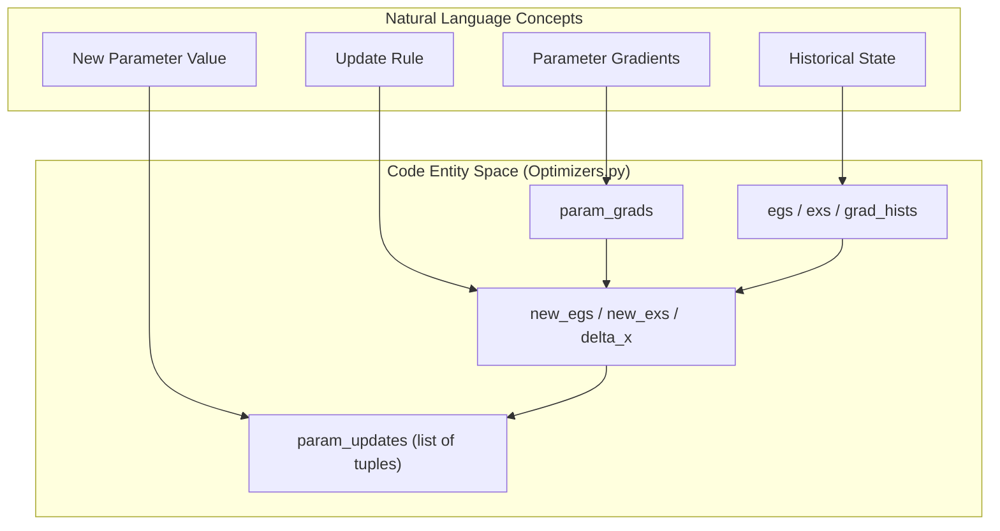
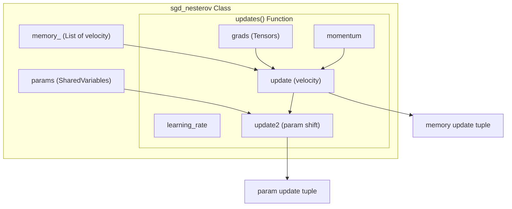

# SGD & Adaptive Optimizers

> **Relevant source files**
> * [Optimizers.py](https://github.com/nd-hung/DL4DistancePrediction2/blob/11ce7818/Optimizers.py)
> * [SGD_Nestrov.py](https://github.com/nd-hung/DL4DistancePrediction2/blob/11ce7818/SGD_Nestrov.py)

This page details the implementation of Stochastic Gradient Descent (SGD) variants and adaptive optimization algorithms within the DL4DistancePrediction2 framework. The codebase provides several optimization strategies, primarily implemented using Theano shared-variable update patterns, to manage model convergence and handle the complex loss surfaces associated with protein distance prediction.

## Overview of Optimizers

The system implements a variety of optimizers in `Optimizers.py` and a specialized Nesterov implementation in `SGD_Nestrov.py`. These optimizers are responsible for generating the symbolic update rules that Theano applies to the model parameters during training.

### Implementation Pattern

All optimizers follow a consistent Theano update pattern:

1. **Shared Variables**: State variables (like velocity in SGD or historical gradients in AdaGrad) are stored as `theano.shared` variables to persist across training iterations [Optimizers.py L41-L98](https://github.com/nd-hung/DL4DistancePrediction2/blob/11ce7818/Optimizers.py#L41-L98)
2. **Symbolic Updates**: The functions return a list of tuples `(shared_variable, new_expression)`, which defines how the state and parameters should change [Optimizers.py L73-L114](https://github.com/nd-hung/DL4DistancePrediction2/blob/11ce7818/Optimizers.py#L73-L114)

**Sources:** [Optimizers.py L1-L213](https://github.com/nd-hung/DL4DistancePrediction2/blob/11ce7818/Optimizers.py#L1-L213)

 [SGD_Nestrov.py L1-L15](https://github.com/nd-hung/DL4DistancePrediction2/blob/11ce7818/SGD_Nestrov.py#L1-L15)

---

## Adaptive Optimizers

Adaptive optimizers adjust the learning rate for each parameter individually based on historical gradient information.

### AdaDelta

The `AdaDelta` implementation seeks to reduce the sensitivity to the initial learning rate hyperparameter by using a moving average of squared gradients and squared parameter updates.

* **State Variables**: `egs` (Expectation of squared gradients) [Optimizers.py L41-L46](https://github.com/nd-hung/DL4DistancePrediction2/blob/11ce7818/Optimizers.py#L41-L46)  and `exs` (Expectation of squared updates) [Optimizers.py L48-L57](https://github.com/nd-hung/DL4DistancePrediction2/blob/11ce7818/Optimizers.py#L48-L57)
* **Hyperparameters**: `rho` (decay rate, default 0.95) and `epsilon` (numerical stability, default 1e-5) [Optimizers.py L40](https://github.com/nd-hung/DL4DistancePrediction2/blob/11ce7818/Optimizers.py#L40-L40)
* **Update Logic**: * $E[g^2]*t = \rho E[g^2]*{t-1} + (1-\rho)g_t^2$ [Optimizers.py L59-L62](https://github.com/nd-hung/DL4DistancePrediction2/blob/11ce7818/Optimizers.py#L59-L62) * $\Delta x_t = -\frac{\sqrt{E[\Delta x^2]_{t-1} + \epsilon}}{\sqrt{E[g^2]_t + \epsilon}} g_t$ [Optimizers.py L64-L67](https://github.com/nd-hung/DL4DistancePrediction2/blob/11ce7818/Optimizers.py#L64-L67) * $E[\Delta x^2]*t = \rho E[\Delta x^2]*{t-1} + (1-\rho)\Delta x_t^2$ [Optimizers.py L68-L71](https://github.com/nd-hung/DL4DistancePrediction2/blob/11ce7818/Optimizers.py#L68-L71)

### AdaGrad

`AdaGrad` scales the learning rate by the square root of the sum of all historical squared gradients.

* **State Variable**: `grad_hists` (Accumulated squared gradients) [Optimizers.py L90-L98](https://github.com/nd-hung/DL4DistancePrediction2/blob/11ce7818/Optimizers.py#L90-L98)
* **Hyperparameters**: `gamma` (learning rate, default 0.1) and `epsilon` (default 1e-4) [Optimizers.py L88](https://github.com/nd-hung/DL4DistancePrediction2/blob/11ce7818/Optimizers.py#L88-L88)
* **Update Logic**: The parameter update is calculated as $p = p - \frac{\gamma}{\sqrt{G_{hist} + \epsilon}} \cdot \nabla p$ [Optimizers.py L105-L109](https://github.com/nd-hung/DL4DistancePrediction2/blob/11ce7818/Optimizers.py#L105-L109)

**Sources:** [Optimizers.py L40-L81](https://github.com/nd-hung/DL4DistancePrediction2/blob/11ce7818/Optimizers.py#L40-L81)

 [Optimizers.py L88-L117](https://github.com/nd-hung/DL4DistancePrediction2/blob/11ce7818/Optimizers.py#L88-L117)

---

## SGD & Momentum Variants

The codebase provides standard Gradient Descent and multiple variations of Momentum-based SGD.

| Function | Type | Update Mechanism |
| --- | --- | --- |
| `GD` | Basic SGD | Simple subtraction of gradient scaled by `const_lr` [Optimizers.py L123-L128](https://github.com/nd-hung/DL4DistancePrediction2/blob/11ce7818/Optimizers.py#L123-L128) |
| `SGDM` | Momentum V1 | Uses a `param_update` variable to track velocity [Optimizers.py L130-L161](https://github.com/nd-hung/DL4DistancePrediction2/blob/11ce7818/Optimizers.py#L130-L161) |
| `SGDM2` | Momentum V2 | A more common implementation where velocity is subtracted from parameters [Optimizers.py L164-L195](https://github.com/nd-hung/DL4DistancePrediction2/blob/11ce7818/Optimizers.py#L164-L195) |
| `Nesterov` | NAG | Nesterov Accelerated Gradient implemented as a symbolic update list [Optimizers.py L198-L213](https://github.com/nd-hung/DL4DistancePrediction2/blob/11ce7818/Optimizers.py#L198-L213) |

### Nesterov Accelerated Gradient (NAG)

The codebase includes two implementations of NAG. The `Nesterov` function in `Optimizers.py` and the `sgd_nesterov` class in `SGD_Nestrov.py`.

#### sgd_nesterov Class

The `sgd_nesterov` class maintains an internal `memory_` list of shared variables to store the velocity for each parameter [SGD_Nestrov.py L2-L4](https://github.com/nd-hung/DL4DistancePrediction2/blob/11ce7818/SGD_Nestrov.py#L2-L4)

* **Update Rule**: * `update` (velocity): $v_t = \mu v_{t-1} - \eta \nabla p$ [SGD_Nestrov.py L10](https://github.com/nd-hung/DL4DistancePrediction2/blob/11ce7818/SGD_Nestrov.py#L10-L10) * `update2` (parameter shift): $p_{new} = p + \mu^2 v_{t-1} - (1+\mu)\eta \nabla p$ [SGD_Nestrov.py L11-L12](https://github.com/nd-hung/DL4DistancePrediction2/blob/11ce7818/SGD_Nestrov.py#L11-L12)

**Sources:** [Optimizers.py L123-L213](https://github.com/nd-hung/DL4DistancePrediction2/blob/11ce7818/Optimizers.py#L123-L213)

 [SGD_Nestrov.py L1-L15](https://github.com/nd-hung/DL4DistancePrediction2/blob/11ce7818/SGD_Nestrov.py#L1-L15)

---

## Technical Architecture Diagrams

### Optimizer Data Flow: Natural Language to Code Entity

This diagram maps the conceptual optimization steps to the specific code entities in `Optimizers.py`.

**Sources:** [Optimizers.py L40-L81](https://github.com/nd-hung/DL4DistancePrediction2/blob/11ce7818/Optimizers.py#L40-L81)

 [Optimizers.py L88-L117](https://github.com/nd-hung/DL4DistancePrediction2/blob/11ce7818/Optimizers.py#L88-L117)

### Nesterov State Management

This diagram illustrates how the `sgd_nesterov` class manages parameter velocity across training steps.

**Sources:** [SGD_Nestrov.py L1-L15](https://github.com/nd-hung/DL4DistancePrediction2/blob/11ce7818/SGD_Nestrov.py#L1-L15)

---

## Saddle Point Test Harness

`Optimizers.py` includes a simulation utility used to test optimizer performance on a "saddle point" function ($y^2 - x^2$) [Optimizers.py L2-L5](https://github.com/nd-hung/DL4DistancePrediction2/blob/11ce7818/Optimizers.py#L2-L5)

* **make_func**: Creates a Theano function that resets the variable `x` to `init_x` and returns the current value and cost after applying the optimizer `updates` [Optimizers.py L11-L18](https://github.com/nd-hung/DL4DistancePrediction2/blob/11ce7818/Optimizers.py#L11-L18)
* **simulate**: Iteratively calls the Theano function for a maximum number of epochs, recording the trajectory of the parameter `x` [Optimizers.py L20-L33](https://github.com/nd-hung/DL4DistancePrediction2/blob/11ce7818/Optimizers.py#L20-L33)
* **Visualization**: The file contains a `myplot` utility using `matplotlib` to visualize the convergence paths of different optimizers [Optimizers.py L218-L221](https://github.com/nd-hung/DL4DistancePrediction2/blob/11ce7818/Optimizers.py#L218-L221)

**Sources:** [Optimizers.py L11-L33](https://github.com/nd-hung/DL4DistancePrediction2/blob/11ce7818/Optimizers.py#L11-L33)

 [Optimizers.py L216-L221](https://github.com/nd-hung/DL4DistancePrediction2/blob/11ce7818/Optimizers.py#L216-L221)