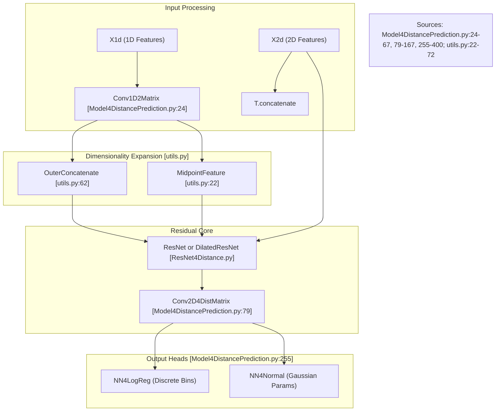

# Top\-Level Model: ResNet4DistMatrix

> **Relevant source files**
> - [Model4DistancePrediction\.py](https://github.com/nd-hung/DL4DistancePrediction2/blob/11ce7818/Model4DistancePrediction.py)
> - [utils\.py](https://github.com/nd-hung/DL4DistancePrediction2/blob/11ce7818/utils.py)

 The `ResNet4DistMatrix` architecture represents the primary neural network framework for predicting protein inter\-residue distance matrices\. It integrates 1D sequence\-based features and 2D evolutionary coupling data, processing them through deep residual layers to produce multi\-response outputs, including discrete distance bins and continuous distribution parameters\.

## Architectural Overview

 The model follows a hierarchical transformation pipeline:

 1. **1D Feature Extraction**: Processing sequence\-level features \(PSSM, Secondary Structure, etc\.\) using 1D convolutions\.
2. **Dimensionality Expansion**: Transforming 1D sequence tensors into 2D spatial interaction maps using `OuterConcatenate` or `MidpointFeature`\.
3. **2D Residual Learning**: Deep feature extraction on the 2D interaction maps using `ResNet` or `DilatedResNet` blocks\.
4. **Multi\-Response Heads**: Final layers that predict different distance representations \(e\.g\., Logistic Regression for bins, Normal distribution for continuous values\)\.

### Data Flow Diagram

 The following diagram illustrates the flow from input features to the final prediction heads within the `ResNet4DistMatrix` class\.

 **Model Data Flow and Code Entities**

---

## Dimensionality Expansion: 1D to 2D

 A critical component of the model is the transformation of residue\-level information into pair\-level information\. This is handled by two primary utility functions in `utils.py`\.

### OuterConcatenate

 The `OuterConcatenate` function performs a pairwise concatenation of features\. For a sequence of length $L$ and feature dimension $d$, it creates an $L \\times L$ matrix where each cell $\(i, j\)$ contains the concatenated features of residue $i$ and residue $j$ [utils\.py L62-L72](https://github.com/nd-hung/DL4DistancePrediction2/blob/11ce7818/utils.py#L62-L72)

### MidpointFeature

 The `MidpointFeature` function provides spatial context by concatenating features from residue $i$, residue $j$, and the residue located at the midpoint $\(i\+j\)/2$ [utils\.py L22-L40](https://github.com/nd-hung/DL4DistancePrediction2/blob/11ce7818/utils.py#L22-L40) This helps the model capture local structural context between two distant residues\.

| Function | Logic | Output Dimension |
| --- | --- | --- |
| OuterConcatenate | $input\[i\] \\oplus input\[j\]$ | \(batch, L, L, 2\*d\) |
| MidpointFeature | $input\[i\] \\oplus input\[\(i\+j\)/2\] \\oplus input\[j\]$ | \(batch, L, L, 3\*d\) |

 **Sources:** [utils\.py L22-L40](https://github.com/nd-hung/DL4DistancePrediction2/blob/11ce7818/utils.py#L22-L40) [utils\.py L62-L72](https://github.com/nd-hung/DL4DistancePrediction2/blob/11ce7818/utils.py#L62-L72)

---

## Core Components

### ResNet4DistMatrix Class

 The `ResNet4DistMatrix` class is the central orchestrator defined in `Model4DistancePrediction.py` [Model4DistancePrediction\.py L255](https://github.com/nd-hung/DL4DistancePrediction2/blob/11ce7818/Model4DistancePrediction.py#L255-L255) It initializes the network based on configurations provided by `config.py`\.

 - **BuildModel Factory**: The `BuildModel()` function serves as a factory to instantiate `ResNet4DistMatrix` with the correct hyperparameters, such as number of layers, hidden units, and activation functions [Model4DistancePrediction\.py L759](https://github.com/nd-hung/DL4DistancePrediction2/blob/11ce7818/Model4DistancePrediction.py#L759-L759)
- **Conv2D4DistMatrix**: A specialized 2D convolution wrapper that handles padding masks to ensure that the padding at the edges of protein sequences does not interfere with the signal during training [Model4DistancePrediction\.py L79-L167](https://github.com/nd-hung/DL4DistancePrediction2/blob/11ce7818/Model4DistancePrediction.py#L79-L167)

### Multi\-Response Prediction

 The model supports multiple output types simultaneously through the `responses` parameter [Model4DistancePrediction\.py L258](https://github.com/nd-hung/DL4DistancePrediction2/blob/11ce7818/Model4DistancePrediction.py#L258-L258):

 1. **Discrete Bins \(`NN4LogReg`\)**: Predicts the probability of a residue pair falling into specific distance intervals \(e\.g\., 0\-4Å, 4\-8Å, etc\.\) [Model4DistancePrediction\.py L378](https://github.com/nd-hung/DL4DistancePrediction2/blob/11ce7818/Model4DistancePrediction.py#L378-L378)
2. **Continuous Distribution \(`NN4Normal`\)**: Predicts parameters \(mean and variance\) for a Gaussian or bivariate distribution representing the distance [Model4DistancePrediction\.py L389](https://github.com/nd-hung/DL4DistancePrediction2/blob/11ce7818/Model4DistancePrediction.py#L389-L389)

 **Sources:** [Model4DistancePrediction\.py L255-L400](https://github.com/nd-hung/DL4DistancePrediction2/blob/11ce7818/Model4DistancePrediction.py#L255-L400) [Model4DistancePrediction\.py L759](https://github.com/nd-hung/DL4DistancePrediction2/blob/11ce7818/Model4DistancePrediction.py#L759-L759)

---

## Training and Metrics

 The class implements several methods for evaluating performance during training and validation:

 - **Loss Calculation**: The `errors` method calculates the negative log\-likelihood \(NLL\) for discrete predictions and the mean squared error \(MSE\) or Gaussian loss for continuous predictions [Model4DistancePrediction\.py L465-L515](https://github.com/nd-hung/DL4DistancePrediction2/blob/11ce7818/Model4DistancePrediction.py#L465-L515)
- **TopAccuracyByRange**: This method evaluates contact prediction accuracy by filtering residue pairs based on their sequence separation \(Short: 6\-11, Medium: 12\-23, Long: $\\ge$ 24 residues\) [Model4DistancePrediction\.py L537-L600](https://github.com/nd-hung/DL4DistancePrediction2/blob/11ce7818/Model4DistancePrediction.py#L537-L600)

### Class Interaction Diagram

 This diagram maps the high\-level class structure to the implementation files\.

 **Class Structure and Implementation Mapping**

  **Sources:** [Model4DistancePrediction\.py L465-L515](https://github.com/nd-hung/DL4DistancePrediction2/blob/11ce7818/Model4DistancePrediction.py#L465-L515) [Model4DistancePrediction\.py L537-L600](https://github.com/nd-hung/DL4DistancePrediction2/blob/11ce7818/Model4DistancePrediction.py#L537-L600)

