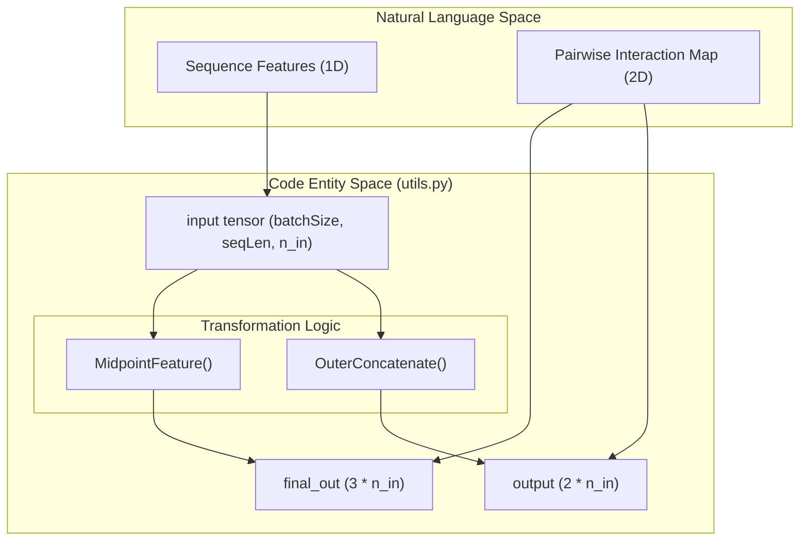
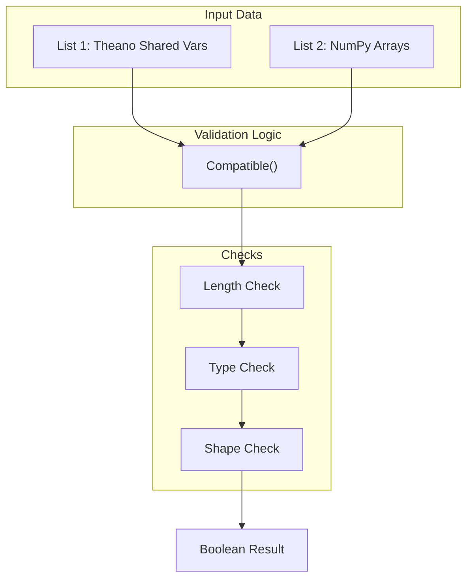

# Utility Tensor Operations

> **Relevant source files**
> * [utils.py](https://github.com/nd-hung/DL4DistancePrediction2/blob/11ce7818/utils.py)

The `utils.py` module provides the fundamental tensor manipulation logic required to bridge 1D sequence-based features and 2D spatial interaction maps. It implements custom Theano-based operations for dimensionality expansion, pattern-based upsampling, and data validation, which are critical for the distance prediction pipeline.

## 1D-to-2D Dimensionality Expansion

A core requirement of protein distance prediction is transforming sequence-level features (e.g., PSSM, Secondary Structure) into pairwise features. `utils.py` provides two primary methods for this transformation.

### MidpointFeature

The `MidpointFeature` function expands a 1D tensor into a 2D tensor by capturing features at three specific points for every pair $(i, j)$: the start point $i$, the end point $j$, and the midpoint $(i+j)/2$ [utils.py L22-L40](https://github.com/nd-hung/DL4DistancePrediction2/blob/11ce7818/utils.py#L22-L40)

* **Input**: `(batchSize, seqLen, n_in)`
* **Output**: `(batchSize, seqLen, seqLen, 3 * n_in)`
* **Logic**: For each cell $(i, j)$ in the 2D map, it concatenates the feature vectors from the 1D input at indices $i$, $j$, and the floor-divided midpoint [utils.py L24-L36](https://github.com/nd-hung/DL4DistancePrediction2/blob/11ce7818/utils.py#L24-L36)

### OuterConcatenate

The `OuterConcatenate` function performs an operation analogous to an outer product, but uses concatenation instead of multiplication [utils.py L62-L72](https://github.com/nd-hung/DL4DistancePrediction2/blob/11ce7818/utils.py#L62-L72)

* **Input**: `(batchSize, seqLen, n_in)`
* **Output**: `(batchSize, seqLen, seqLen, 2 * n_in)`
* **Logic**: For every pair $(i, j)$, it concatenates the feature vector of residue $i$ with the feature vector of residue $j$ [utils.py L68-L70](https://github.com/nd-hung/DL4DistancePrediction2/blob/11ce7818/utils.py#L68-L70)

### Dimensionality Transformation Flow

**Sources:** [utils.py L22-L40](https://github.com/nd-hung/DL4DistancePrediction2/blob/11ce7818/utils.py#L22-L40)

 [utils.py L62-L72](https://github.com/nd-hung/DL4DistancePrediction2/blob/11ce7818/utils.py#L62-L72)

---

## Pattern-Based Tensor Operations

The codebase utilizes specific patterns to expand or convolve tensors, often used in specialized network variants to handle reduced contact maps or specific spatial motifs.

### ExpandByPattern

`ExpandByPattern` (and its 3D variant `ExpandBy3dPattern`) replaces vectors in a tensor with linear combinations of predefined binary patterns [utils.py L193-L206](https://github.com/nd-hung/DL4DistancePrediction2/blob/11ce7818/utils.py#L193-L206)

 This is typically used to upsample a reduced interaction map into a higher-resolution representation.

* **Mechanism**: It repeats the input tensor elements across spatial axes using `MyRepeat` and performs a element-wise multiplication with tiled patterns [utils.py L198-L204](https://github.com/nd-hung/DL4DistancePrediction2/blob/11ce7818/utils.py#L198-L204)
* **MyTile**: A utility that copies a small tensor $x$ into a larger grid of $y \times y$ copies [utils.py L150-L156](https://github.com/nd-hung/DL4DistancePrediction2/blob/11ce7818/utils.py#L150-L156)

### ConvByPattern

`ConvByPattern` applies a pattern-based convolution where the weights are determined by a set of predefined binary spatial patterns [utils.py L220-L244](https://github.com/nd-hung/DL4DistancePrediction2/blob/11ce7818/utils.py#L220-L244)

* **Process**: It tiles the patterns to match the input spatial dimensions and performs a sum-product (convolution) across the pattern-defined indices [utils.py L237-L241](https://github.com/nd-hung/DL4DistancePrediction2/blob/11ce7818/utils.py#L237-L241)

**Sources:** [utils.py L150-L156](https://github.com/nd-hung/DL4DistancePrediction2/blob/11ce7818/utils.py#L150-L156)

 [utils.py L181-L186](https://github.com/nd-hung/DL4DistancePrediction2/blob/11ce7818/utils.py#L181-L186)

 [utils.py L193-L206](https://github.com/nd-hung/DL4DistancePrediction2/blob/11ce7818/utils.py#L193-L206)

 [utils.py L220-L244](https://github.com/nd-hung/DL4DistancePrediction2/blob/11ce7818/utils.py#L220-L244)

---

## Data Loading and Validation

### LoadFASTAFile

A simple utility to parse FASTA files. It strips header lines (starting with `>` or `#`) and concatenates the sequence lines into a single string [utils.py L8-L16](https://github.com/nd-hung/DL4DistancePrediction2/blob/11ce7818/utils.py#L8-L16)

### Compatible

This helper validates that two lists of tensors (typically one list of Theano shared variables and one list of NumPy arrays) are compatible in terms of shape and type [utils.py L129-L143](https://github.com/nd-hung/DL4DistancePrediction2/blob/11ce7818/utils.py#L129-L143)

 This is used extensively during model weight loading to ensure the saved parameters match the architecture definition.

### SampleBoundingBox

Used during training to crop sub-sections of large distance matrices. It ensures the sampled box is square and, in the current implementation, shares the same diagonal as the original matrix to maintain symmetry [utils.py L99-L123](https://github.com/nd-hung/DL4DistancePrediction2/blob/11ce7818/utils.py#L99-L123)

**Sources:** [utils.py L8-L16](https://github.com/nd-hung/DL4DistancePrediction2/blob/11ce7818/utils.py#L8-L16)

 [utils.py L99-L123](https://github.com/nd-hung/DL4DistancePrediction2/blob/11ce7818/utils.py#L99-L123)

 [utils.py L129-L143](https://github.com/nd-hung/DL4DistancePrediction2/blob/11ce7818/utils.py#L129-L143)

---

## Summary of Key Functions

| Function | Purpose | Key Tensor Shape Change |
| --- | --- | --- |
| `MidpointFeature` | 1D to 2D expansion via start, mid, end points | `(L, N) -> (L, L, 3N)` |
| `OuterConcatenate` | 1D to 2D expansion via pairwise concatenation | `(L, N) -> (L, L, 2N)` |
| `RowWiseOuterProduct` | Row-wise product of two matrices | `(N, M), (N, L) -> (N, M*L)` |
| `MyTile` | Expands a tensor by repeating it in a grid | `(X, Y) -> (X*y1, Y*y2)` |
| `SampleBoundingBox` | Crops a square sub-matrix for training | `(L, L) -> (S, S)` |

**Sources:** [utils.py L22-L23](https://github.com/nd-hung/DL4DistancePrediction2/blob/11ce7818/utils.py#L22-L23)

 [utils.py L62-L64](https://github.com/nd-hung/DL4DistancePrediction2/blob/11ce7818/utils.py#L62-L64)

 [utils.py L92-L96](https://github.com/nd-hung/DL4DistancePrediction2/blob/11ce7818/utils.py#L92-L96)

 [utils.py L100-L104](https://github.com/nd-hung/DL4DistancePrediction2/blob/11ce7818/utils.py#L100-L104)

 [utils.py L150-L155](https://github.com/nd-hung/DL4DistancePrediction2/blob/11ce7818/utils.py#L150-L155)