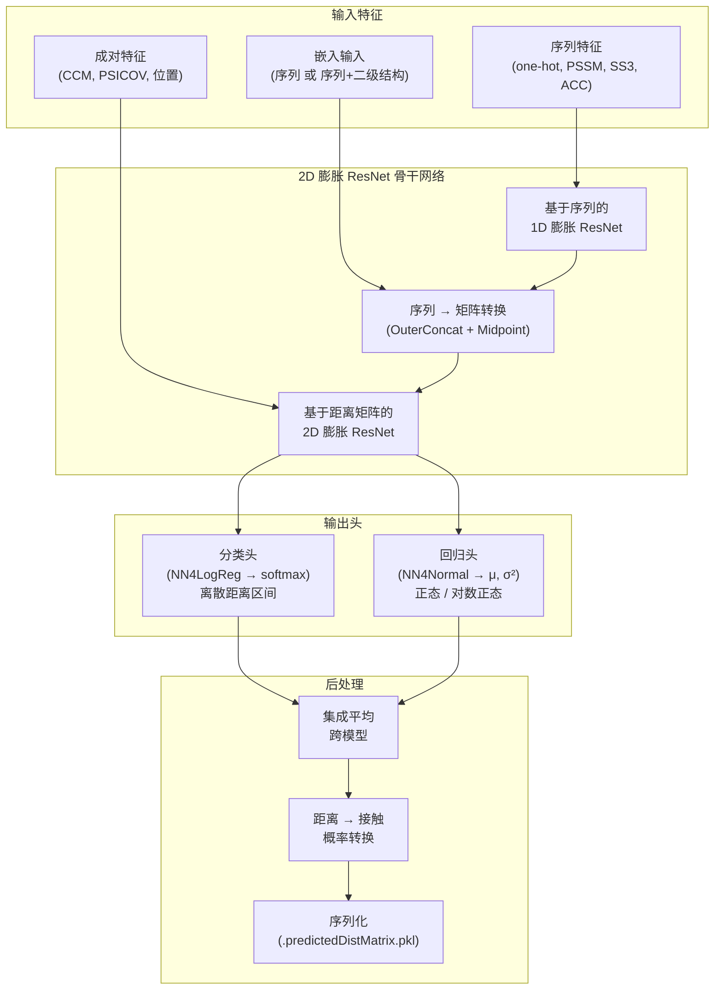

---
slug:1-overview
blog_type:normal
---

**DL4DistancePrediction2** 是论文 *"Distance-based protein folding powered by deep learning"* (PNAS, 2019年8月) 中深度学习方法的 Python 3 实现版本。该项目使用 2D 膨胀残差网络，根据蛋白质序列特征预测残基间的**距离矩阵**，并随之将**接触图**作为副产品导出。它基于 **Theano** 符号计算框架构建，并附带可用于推理的预训练模型。

来源: [Readme.md](/Readme.md#L1-L53), [config.py](/config.py#L1-L20)

## 项目功能

蛋白质结构预测的关键在于了解残基在 3D 空间中的接近程度。传统方法预测的是**二值接触**（近与远），但本项目预测的是**完整距离分布**——即两个 Cβ 原子间的距离落入若干距离区间（例如，从 4.5Å 到 16.0Å 的 25 个区间）中每个区间的概率。这种更丰富的表示为下游折叠算法提供了显著更多的几何约束。

系统将**预处理后的蛋白质特征**（序列谱、协同进化信号、二级结构预测等）作为输入，将其送入深度卷积架构，并输出**离散距离概率分布**（分类）或**连续距离估计**（通过正态/对数正态分布进行回归）。随后，将预测的距离概率在定义接触的区间上求和，从而得到接触概率图。

来源: [config.py](/config.py#L62-L100), [DistanceUtils.py](/DistanceUtils.py#L1-L50), [ContactUtils.py](/ContactUtils.py#L145-L165)

## 架构概览

下图展示了从原始蛋白质特征经由神经网络到最终距离和接触预测的端到端数据流：

来源: [Model4DistancePrediction.py](/Model4DistancePrediction.py#L206-L310), [DilatedResNet4Distance.py](/DilatedResNet4Distance.py#L1-L30)

## 项目结构

该仓库按照明确的关注点进行组织——模型定义、数据处理、推理编排、评估和配置：

| 目录 / 文件 | 作用 |
|---|---|
| `run_distance_predictor.py` | **入口点** — 用于推理的 CLI 脚本 |
| `Model4DistancePrediction.py` | 顶层模型组装 (`ResNet4DistMatrix`, `BuildModel`) |
| `DilatedResNet4Distance.py` | 2D 膨胀 ResNet + 1D 膨胀卷积层 + 掩码批归一化 |
| `ResNet4Distance.py` | 标准（非膨胀）2D ResNet 变体 |
| `NN4LogReg.py` | 分类输出头（距离区间上的 softmax） |
| `NN4Normal.py` | 回归输出头（正态 / 对数正态分布） |
| `DataProcessor.py` | 特征加载、组装、批处理 |
| `EmbeddingLayer.py` | 可学习的残基对嵌入 (MetaEmbeddingLayer) |
| `Conv1d.py` | 基础 1D 卷积层 |
| `utils.py` | `OuterConcatenate`, `MidpointFeature`, 边界框采样 |
| `DistanceUtils.py` | 距离评估、区间离散化、概率修正 |
| `ContactUtils.py` | 接触图转换、CASP 格式 I/O |
| `Metrics.py` | MCC 和 F1 分数计算 |
| `config.py` | 全局常量、距离截断值、权重方案、模型规格 |
| `Optimizers.py` | SGD-Momentum, AdaGrad, AdaDelta 实现 |
| `Adams.py` | Adam 及其变体 (AdamW, AMSGrad) |
| `result/` | 预测距离矩阵的默认输出目录 |

来源: [run_distance_predictor.py](/run_distance_predictor.py#L1-L30), [Model4DistancePrediction.py](/Model4DistancePrediction.py#L1-L30), [config.py](/config.py#L1-L30)

## 核心概念

### 距离离散化

连续的原子间距离被离散化为由 `config.py` 中截断数组定义的区间。该项目支持 **16 种分箱方案**，范围从粗粒度（`2C` — 仅 2 个区间）到细粒度（`52C` — 52 个区间）。当方案名称以 **`Plus`** 结尾时，无效距离标记（−1）会被分离到独立的区间中；否则，它将与最大距离区间合并。预训练模型使用的默认方案是 **`Discrete25C`**，它将 4.5Å–16.0Å 范围划分为 25 个等宽区间。

来源: [config.py](/config.py#L62-L100)

### 掩码感知卷积

蛋白质序列长度不一，但 Theano 进行批量计算时需要固定大小的张量。较短的序列会被**零填充**，以匹配批次中最长的序列。为防止填充的零污染卷积输出和批归一化统计量，每个卷积层都会应用一个**二值掩码**，在每次操作后将填充位置重置为零——对于 2D 卷积，水平和垂直方向均会执行此操作。这是一个贯穿整个代码库的独特实现细节。

来源: [DilatedResNet4Distance.py](/DilatedResNet4Distance.py#L95-L155), [ResNet4Distance.py](/ResNet4Distance.py#L80-L130)

### 针对长程相互作用的膨胀

**膨胀 ResNet** 变体为其 2D 卷积核引入了可配置的膨胀因子。膨胀在不增加参数量的情况下扩大了有效感受野，这对于捕获决定蛋白质拓扑结构的**长程残基相互作用**（序列间隔 ≥ 24）至关重要。标准 ResNet 始终使用 dilation=1，而 DilatedResNet 则接受在模型配置中指定的逐层膨胀策略。

来源: [DilatedResNet4Distance.py](/DilatedResNet4Distance.py#L95-L130)

### 双输出头

网络支持按响应变量应用两种类型的输出头：

- **分类** (`NN4LogReg`)：多层感知机后接 softmax，输出离散距离区间上的概率分布。用于 `Discrete*` 标签类型。
- **回归** (`NN4Normal`)：多层感知机，预测正态或对数正态分布的均值 (μ) 和方差 (σ²)。对于双变量情况，还可选择预测相关系数 (ρ)。

单个模型可以**同时预测多个响应**（例如，CbCb 距离 + 氢键 + β-配对），每个响应都有自己的输出头。

来源: [NN4LogReg.py](/NN4LogReg.py#L90-L175), [NN4Normal.py](/NN4Normal.py#L70-L170), [Model4DistancePrediction.py](/Model4DistancePrediction.py#L310-L360)

### 集成推理

推理管道原生支持**模型集成**。可以通过 `-m` 标志指定多个预训练模型文件（以分号分隔）。来自所有模型的预测概率矩阵会被**增量求和**（以减少内存消耗），然后取平均。对于对称原子对类型 (CbCb, CaCa, CgCg, Beta)，最终矩阵通过与自身转置取平均来实现对称化。

来源: [run_distance_predictor.py](/run_distance_predictor.py#L35-L170)

## 技术栈

| 组件 | 技术 |
|---|---|
| 深度学习框架 | **Theano** (符号张量操作) |
| 编程语言 | Python 3 |
| 序列化 | **Pickle** (用于模型、特征、结果的 `.pkl` 格式) |
| 数值计算 | NumPy, SciPy |
| CLI 参数解析 | `argparse` |

<CgxTip>Theano 是一个早期框架——该项目早于 PyTorch/TensorFlow 占据主导地位的时期。所有模型参数和计算图均序列化为 Python pickle 文件，这意味着模型文件与训练时使用的 Theano 版本和 Python 环境紧密耦合。</CgxTip>

来源: [run_distance_predictor.py](/run_distance_predictor.py#L1-L18), [Readme.md](/Readme.md#L1-L10)

## 后续阅读

现在你已对该项目的功能及结构有了宏观的认知，可以按照以下推荐阅读路径继续深入：

1. **[快速开始](2-quick-start)** — 使用预训练模型对样本数据进行推理
2. **[数据准备](3-data-preparation)** — 了解输入特征格式及如何准备你自己的数据
3. **[架构概览](4-architecture-overview)** — 完整模型构建流程的详细解析
4. **[膨胀 ResNet 设计](5-dilated-resnet-design)** — 深入探究带有膨胀和掩码的核心卷积架构
5. **[输出头：分类与回归](7-output-heads-classification-and-regression)** — 距离预测如何从网络输出中解码
6. **[配置参考](16-configuration-reference)** — 所有可配置参数的完整参考