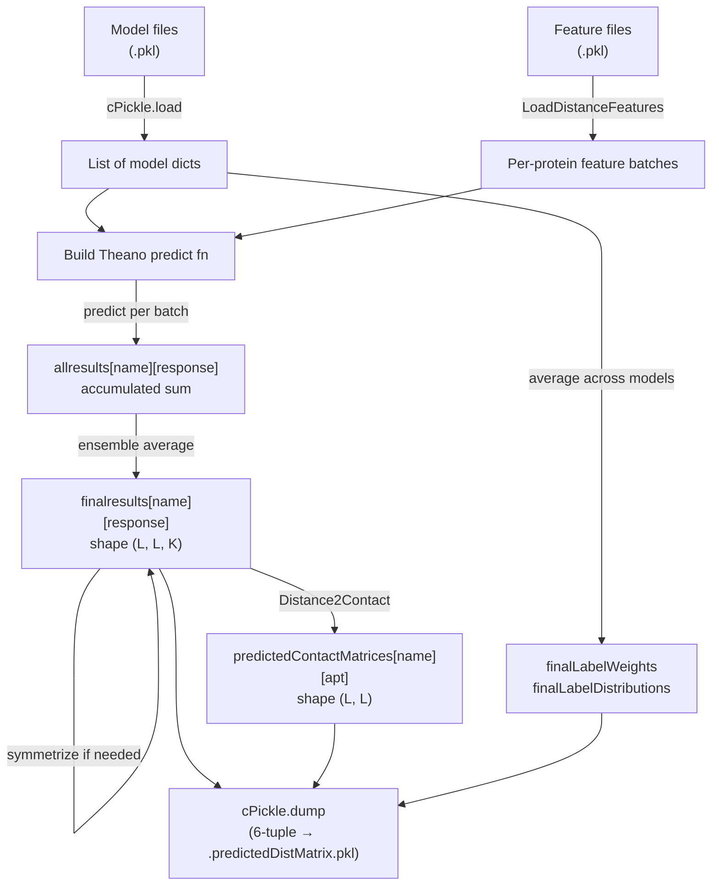

---
slug:10-result-serialization-format
blog_type:normal
---


推理流水线将所有逐蛋白质预测结果以最高可用协议持久化为 **Python pickle** 文件。每个输出文件编码了一个 **6 元组**，用于捕获完整的预测状态——蛋白质标识、原始距离概率分布、衍生接触概率矩阵，以及下游后处理和评估所需的集成平均标签元数据。理解该元组的内部布局，对于任何在提供的评估脚本之外读取预测结果的自定义消费者而言至关重要。

## 文件命名约定

每个预测文件均遵循 `{proteinName}.predictedDistMatrix.pkl` 的命名模式，并被写入由 `--saveFolder` 命令行参数指定的文件夹（默认：`./result`）。蛋白质名称直接取自输入特征数据的 `'name'` 字段，因此它继承了特征文件使用的任何命名约定（例如 `2myhA`、`2mz0A`）。现有文件会被静默覆盖——不存在追加或版本控制机制。

```python
savefilename = name + '.predictedDistMatrix.pkl'
if saveFolder is not None:
    savefilename = os.path.join(saveFolder, savefilename)
```

来源：[run_distance_predictor.py](/run_distance_predictor.py#L231-L236)

## 序列化数据结构

pickle 负载是一个 **6 元组**，通过单次 `cPickle.dump` 调用构造并写入：

```python
cPickle.dump(
    (name, allsequences[name], results, predictedContactMatrices[name],
     finalLabelWeights, finalLabelDistributions),
    fh,
    protocol=cPickle.HIGHEST_PROTOCOL
)
```

下表定义了每个位置的字段、运行时类型和语义内容：

| 索引 | 字段 | 类型 | 描述 |
|:-----:|-------|------|-------------|
| 0 | `proteinName` | `str` | 与输入特征文件名匹配的蛋白质标识符 |
| 1 | `proteinSequence` | `str` | 氨基酸一级序列（例如 `"MKTIIALSYIF..."`） |
| 2 | `predictedDistMatrixProb` | `dict[str → np.ndarray]` | 逐响应的距离概率张量，形状为 `(L, L, K)` |
| 3 | `predictedContactMatrix` | `dict[str → np.ndarray]` | 逐原子对类型的接触概率矩阵，形状为 `(L, L)` |
| 4 | `finalLabelWeights` | `dict[str → np.ndarray]` | 按原子对类型的集成平均标签权重矩阵 |
| 5 | `finalLabelDistributions` | `dict[str → np.ndarray]` | 按原子对类型的集成平均参考标签概率分布 |

来源：[run_distance_predictor.py](/run_distance_predictor.py#L237-L239)

### 字段 2 — 预测距离概率矩阵

这是**主要预测输出**。该字典由格式为 `{atomPairType}_{labelType}` 的**响应字符串**作为键（例如 `"CbCb_Discrete25C"`、`"CaCa_Normal1d2"`）。每个值是一个形状为 `(L, L, K)` 的 3D NumPy 数组，其中：

- **L** = 序列长度
- **K** = 每个残基对的概率参数数量，由 `config.responseProbDims[labelType]` 决定

对于**离散**标签类型（例如 `Discrete25C`），K 等于距离区间的数量，`[:,:,k]` 保存了原子间距离落入区间 *k* 的预测概率。对于 **Normal** / **LogNormal** 标签类型，K = 2，这两个通道分别编码了距离分布的预测**均值**（`[:,:,0]`）和**标准差**（`[:,:,1]`）。

在集成平均之后，对称原子对类型（`CbCb`、`CaCa`、`CgCg`、`Beta`）会通过与它们的转置取平均来显式对称化：

```python
if config.IsSymmetricAPT(apt):
    finalresults[name][response] = (
        finalresults[name][response]
        + np.transpose(finalresults[name][response], (1, 0, 2))
    ) / 2.
```

来源：[run_distance_predictor.py](/run_distance_predictor.py#L128-L167), [config.py](/config.py#L22-L24)

### 字段 3 — 预测接触概率矩阵

该字典由**原子对类型**字符串作为键（例如 `"CbCb"`、`"CaCa"`、`"HB"`、`"Beta"`）。每个值是一个形状为 `(L, L)` 的 2D NumPy 数组，其中条目 `[i, j]` 是残基 *i* 和 *j* 形成接触的预测概率（对于标准原子对，距离 < 8 Å）。从距离概率到接触概率的转换取决于标签类型：

| 标签类型 | 转换方法 |
|------------|-------------------|
| `Discrete*` | 对接触定义截止值以下的所有区间的概率求和：`np.sum(prob[:, :, :labelOf8], axis=2)` |
| `Normal1d2` | 计算预测正态分布在接触阈值处的累积分布函数值：`norm(loc=μ, scale=σ).cdf(8.001)` |
| `LogNormal1d2` | 计算在 `log(8.001)` 处的累积分布函数值：`norm(loc=μ, scale=σ).cdf(np.log(8.001))` |

对于 `HB` 和 `Beta` 响应（非距离分类头），接触矩阵即为第一个概率通道：`prob[:, :, 0]`。

来源：[run_distance_predictor.py](/run_distance_predictor.py#L200-L224), [ContactUtils.py](/ContactUtils.py#L188-L199)

### 字段 4 & 5 — 标签元数据

这些字典承载了**集成平均**的标签权重和参考概率分布，两者均以原子对类型字符串为键。它们通过对所有已加载模型文件的相应字段（`model['weight4labels'][response]` 和 `model['labelRefProbs'][response]`）取平均来计算。下游消费者（例如 `DistanceUtils.FixDistProb`）使用它们来校正预测分布中的训练集偏差。

来源：[run_distance_predictor.py](/run_distance_predictor.py#L168-L188)

## 反序列化协议

### 规范加载器

代码库提供了 `DistanceUtils.LoadRawDistProbFile()` 作为读取预测文件的标准入口点：

```python
def LoadRawDistProbFile(file=None):
    if file is None:
        print('please provide a raw distance probability distribution file '
              'with suffix .predictedDistMatrix.pkl')
        exit(1)
    if not os.path.isfile(file):
        print('The specified file does not exist: ', file)
        exit(1)
    fh = open(file, 'rb')
    content = cPickle.load(fh)
    fh.close()
    return content
```

此函数返回未经任何后处理的原始 6 元组。请注意，它**未**传递 `encoding='latin1'`——需要兼容 Python 2/3 的消费者应添加此参数。

来源：[DistanceUtils.py](/DistanceUtils.py#L10-L23)

### 消费者访问模式

不同的评估脚本根据其分析目标访问不同的元组位置：

| 脚本 | 访问模式 | 目的 |
|--------|---------------|---------|
| `BatchEvaluateContactAccuracy.py` | `pred[3]` | 读取接触概率矩阵以进行 top-L 精度评估 |
| `EvaluateDistanceAccuracy.py` | `pred[0]`（边界格式） | 读取距离边界以计算绝对/相对误差指标 |

接触评估脚本区分了 `.predictedDistMatrix.pkl` 格式（通过整数索引访问元组）和另一种 `.predictedContactMatrix.pkl` 格式（通过键 `'predContactMatrix'` 访问字典）：

```python
if fileSuffix == '.predictedDistMatrix.pkl':
    predContactMatrix = pred[3]       # 6 元组格式
elif fileSuffix == '.predictedContactMatrix.pkl':
    predContactMatrix = pred['predContactMatrix']  # 字典格式
```

来源：[BatchEvaluateContactAccuracy.py](/BatchEvaluateContactAccuracy.py#L76-L82), [EvaluateDistanceAccuracy.py](/EvaluateDistanceAccuracy.py#L44-L55)

## 数据流：从推理到序列化结果

下图追踪了从集成预测到聚合再到磁盘序列化的完整生命周期：



<CgxTip>集成平均策略在模型迭代期间于 `allresults` 中累积**求和**，并仅在最后除以 `numModels`。这是一种刻意的内存优化——仅存储运行总和避免了同时在内存中保存 N 个完整的概率张量，这在使用多个深度模型预测多个蛋白质时尤为重要。</CgxTip>

来源：[run_distance_predictor.py](/run_distance_predictor.py#L50-L242)

## 相关序列化格式

代码库使用了其他几种基于 pickle 的格式，它们与主要结果格式交互或并行存在：

| 格式 | 后缀 | 结构 | 生产者 |
|--------|--------|-----------|----------|
| **训练模型** | `.pkl` | 包含键 `responses`、`network`、`paramValues`、`labelRefProbs`、`weight4labels`、`n_in_seq`、`n_in_matrix` 的 `dict` | 训练流水线 |
| **原生距离矩阵** | `.atomDistMatrix.pkl` | 以原子对类型为键的 `dict`，每个值是 2D `(L, L)` 距离矩阵 | 外部预处理 |
| **距离边界** | `.bound.pkl` | 3 元组：`(bound_dict, name, sequence)`，其中 `bound[apt]` 为 `(L, L, 10)` | 后处理脚本 |
| **接触矩阵（替代）** | `.predictedContactMatrix.pkl` | 包含键 `'predContactMatrix'` 的 `dict` | 替代导出路径 |

模型反序列化路径使用 `encoding='latin1'` 来处理 Python 2 序列化的参数数组，而 `DistanceUtils.LoadRawDistProbFile` 中的结果反序列化则未使用——这种不对称性反映了两种文件类型的不同来源（模型可能源自早期的 Python 2 训练运行，而结果始终由当前的 Python 3 推理代码生成）。

来源：[run_distance_predictor.py](/run_distance_predictor.py#L28-L31), [DataProcessor.py](/DataProcessor.py#L87-L107), [BatchEvaluateDistanceAccuracy.py](/BatchEvaluateDistanceAccuracy.py#L14-L22)

## 编程访问示例

读取预测文件并提取 CbCb 接触矩阵和距离概率分布：

```python
import pickle
import numpy as np

# 加载 6 元组
with open('result/76CAMEO.2015/2myhA.predictedDistMatrix.pkl', 'rb') as fh:
    name, sequence, distProbs, contactProbs, labelWeights, labelDists = pickle.load(fh)

# 访问 CbCb 接触概率矩阵 (2D, 形状 L×L)
cbcb_contact = contactProbs['CbCb']

# 访问原始距离概率分布 (3D, 形状 L×L×K)
cbcb_dist_prob = distProbs['CbCb_Discrete25C']

# 重构 top-L/5 长程接触预测
L = len(sequence)
upper_tri = np.triu(cbcb_contact, k=24)
flat_indices = np.argsort(-1.0 * upper_tri, axis=None)[:L // 5]
top_pairs = np.unravel_index(flat_indices, cbcb_contact.shape)
```

此模式反映了 `ContactUtils.TopAccuracy` 在针对天然结构评估预测质量时内部执行的操作。

来源：[ContactUtils.py](/ContactUtils.py#L268-L308), [DistanceUtils.py](/DistanceUtils.py#L10-L23)

## 后续步骤

- **[距离到接触的转换](9-distance-to-contact-conversion)** — 从字段 2 生成字段 3 的 `Distance2Contact` 转换的详细机制。
- **[接触预测精度](13-contact-prediction-accuracy)** — `TopAccuracy` 和 `EvaluateContactPredictions` 如何使用字段 3 进行基准评估。
- **[模型加载与集成平均](8-model-loading-and-ensemble-averaging)** — 模型 `.pkl` 反序列化和多模型平均，用于输入到结果序列化。