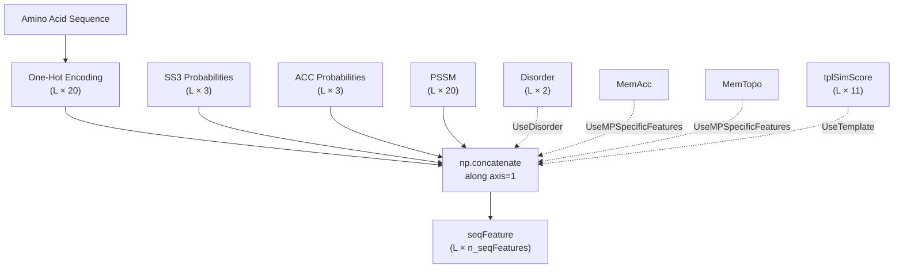
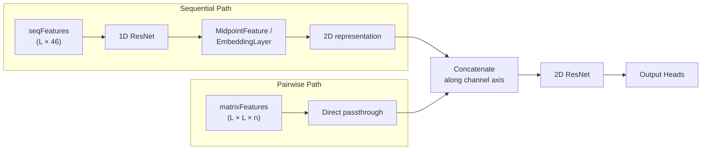

---
slug:11-sequential-and-pairwise-features
blog_type:normal
---

本项目将残基间距离预测建模为一个 2D 图像到图像的问题，其中蛋白质中的每对残基 (i, j) 都需要输入特征。特征处理流程分为两个互补的分支：**序列特征**（1D，每个残基）和**成对特征**（2D，每对残基）。序列特征捕获每个位置的局部生化上下文，而成对特征编码跨位置对的共进化信号和几何先验。这两个分支在 `DataProcessor.LoadDistanceFeatures()` 中组装，并最终分别作为 `seqFeatures` 和 `matrixFeatures` 被 `ResNet4DistMatrix` 模型使用。

来源: [DataProcessor.py](/DataProcessor.py#L109-L298), [Model4DistancePrediction.py](/Model4DistancePrediction.py#L214-L308)

## 特征数据加载

原始特征文件按蛋白质存储在数据源目录下。`ReadFeatures()` 函数读取所有文件格式，根据氨基酸序列进行验证，并返回以特征名为键的字典。每个加载器在执行任何下游处理之前，都会执行 NaN 检查和序列长度断言，以确保数据完整性。

来源: [ReadProteinFeatures.py](/ReadProteinFeatures.py#L196-L248)

### 文件格式映射

下表列出了每个原始特征文件、其格式、生成的字典键以及形状约定（其中 **L** = 序列长度，**C** = 每个条目的通道维度）。

| 文件后缀 | 加载函数 | 字典键 | 形状 | 描述 |
|---|---|---|---|---|
| `.seq` | 内联 FASTA 解析 | `sequence` | (L,) 字符串 | 主氨基酸序列 |
| `.ss3` | `LoadSS3` | `SS3` | (L, 3) | 3 态二级结构概率 (H, E, C) |
| `.acc` | `LoadACC` | `ACC` | (L, 3) | 溶剂可及性概率（ buried, medium, exposed ） |
| `.diso` | `LoadDISO` | `DISO` | (L, 2) | 无序概率（有序，无序） |
| `.tgt` | `LoadTPLTGT.load_tgt` | `PSSM`, `PSFM`, `SS8` | (L, 20), (L, 20), (L, 8) | 位置特异性得分矩阵、频率矩阵、8 态二级结构 |
| `.ccmpred_zscore` | `LoadECMatrix` | `ccmpredZ` | (L, L) | Z 分数标准化的 CCMpred 进化耦合矩阵 |
| `.psicov_zscore` | `LoadECMatrix` | `psicovZ` | (L, L) | Z 分数标准化的 PSICOV 进化耦合矩阵 |
| `.pot` | `LoadOtherPairFeatures` | `OtherPairs` | (L, L, C) | 稀疏成对特征（互信息，接触势） |

来源: [ReadProteinFeatures.py](/ReadProteinFeatures.py#L10-L12), [ReadProteinFeatures.py](/ReadProteinFeatures.py#L15-L193)

`.pot` 文件使用**稀疏坐标格式**：每行包含两个从 1 开始的残基索引，后跟浮点特征值。`LoadOtherPairFeatures` 根据这种稀疏表示构建一个密集的 3D 数组，并通过分配 `allPairs[j, i] = allPairs[i, j]` 使其**对称化**，确保结果矩阵关于对角线镜像对称。

来源: [ReadProteinFeatures.py](/ReadProteinFeatures.py#L161-L193)

## 序列特征组装

序列特征是 1D 矩阵——每个残基一行——描述局部生化性质。组装遵循沿特征轴拼接所强制执行的严格顺序：

**独热编码**始终是第一个序列特征矩阵，由 `config.SeqOneHotEncoding()` 生成。它使用以 `ord(AA) - ord('A')` 为索引的查找表 `AAVectors`，将 20 种标准氨基酸中的每一种映射到一个 20 维的二进制向量。此编码将所有后续特征锚定在相同的位置对齐方式上。

来源: [config.py](/config.py#L314-L326), [DataProcessor.py](/DataProcessor.py#L126-L178)

其余的序列特征根据 `modelSpecs` 标志有条件地附加。**SS3 矩阵始终紧接在独热编码之后**——这是源代码中明确指出的一种刻意排序选择，因为下游组件（特别是 `Seq+SS` 模式下的嵌入层）依赖于这种位置关系。完整的条件特征列表为：

| 标志 | 特征 | 每残基维度 | 默认值 |
|---|---|---|---|
| *(始终)* | 独热氨基酸 | 20 | — |
| `UseSS` | 3 态二级结构 | 3 | `True` |
| `UseACC` | 溶剂可及性 | 3 | `True` |
| `UsePSSM` | 位置特异性得分矩阵 | 20 | `True` |
| `UseDisorder` | 无序概率 | 2 | `False` |
| `UseMPSpecificFeatures` | MemAcc + MemTopo | 可变 | off |
| `UseTemplate` | 模板相似度得分 | 11 | off |

拼接后，结果被转换为 `np.float32` 类型的 `seqFeature`，其形状为 **(L, n_seqFeatures)**，其中 `n_seqFeatures` 是所有包含的特征维度之和。启用默认值（独热 + SS3 + ACC + PSSM）时，每个残基总共有 **46 个特征**。

来源: [DataProcessor.py](/DataProcessor.py#L137-L178), [config.py](/config.py#L235-L246)

## 成对特征组装

成对特征是 2D（或 3D）矩阵，编码残基对之间的关系。它们携带的信息与序列特征根本不同：序列特征描述残基*是什么*，而成对特征描述两个残基*如何*相互作用或共进化。

```mermaid
flowchart TD
    LOC["LocationFeature<br/>min(1, &#124;i−j&#124;/30)"] --> DSTACK["np.dstack"]
    CBRT["CubeRootFeature<br/>³√&#124;i−j&#124;"] --> DSTACK
    CCM["ccmpredZ<br/>(L × L)"] --> DSTACK
    PSV["psicovZ<br/>(L × L)"] -.->|UsePSICOV| DSTACK
    OP["OtherPairs<br/>(L × L × C)"] -.->|UseOtherPairs| DSTACK
    TPLF["Template Features<br/>(flag + strength)"] -.->|UseTemplate| DSTACK

    DSTACK --> MATFEATURE["matrixFeature<br/>(L × L × n_pairFeatures)"]
```

来源: [DataProcessor.py](/DataProcessor.py#L180-L244)

### 位置特征

`LocationFeature()` 函数生成一个单通道 (L × L) 矩阵，其中每个条目为 `min(1, |i−j| / 30.0)`。这种**归一化的序列分离度**对于相隔 30 个或更多位置的残基对饱和于 1.0。归一化截断值 30 是硬编码的，选择该值是因为大多数有意义的长程接触都发生在该分离度之外。对角线为 0，且矩阵在构造上是对称的。

来源: [DataProcessor.py](/DataProcessor.py#L58-L74)

### 立方根特征

`CubeRootFeature()` 函数为每对 (i, j) 计算 `³√|i−j|`。立方根变换具有物理动机：**球状蛋白的半径大致按其序列长度的立方根缩放**，因此该特征为给定序列分离度的两个残基之间的预期空间分离度提供了粗略的代理。与会饱和的位置特征不同，立方根特征随着序列分离度的增加而持续增长（尽管是次线性的）。

来源: [DataProcessor.py](/DataProcessor.py#L76-L84)

### 进化耦合矩阵

可以包含两个进化耦合（EC）矩阵：

- **ccmpredZ**：来自 CCMpred（基于伪似然的接触预测）的 Z 分数归一化输出。这是主要的共进化信号，默认启用（`UseCCM = True`）。
- **psicovZ**：来自 PSICOV（稀疏逆协方差估计）的 Z 分数归一化输出。默认禁用（`UsePSICOV = False`）。

两者都通过 `LoadECMatrix()` 作为密集 (L × L) 矩阵加载，该函数读取以空格分隔的浮点值（精度为 `np.float16`），然后验证 NaN 值。Z 分数归一化在特征生成期间（在此代码运行之前）已经应用，因此在加载时不会进行额外的归一化。

来源: [ReadProteinFeatures.py](/ReadProteinFeatures.py#L139-L158), [ReadProteinFeatures.py](/ReadProteinFeatures.py#L238-L243)

### 其他成对特征

当 `UseOtherPairs` 为 `True`（默认值）时，`.pot` 文件被加载到 `OtherPairs` 中——这是一个密集 (L × L × C) 张量，包含**互信息和统计接触势**值。这些特征以稀疏坐标格式存储，并由 `LoadOtherPairFeatures()` 进行密集化和对称化。通道数 C 取决于特征生成流程，但通常包含 MI 项和势项。

来源: [ReadProteinFeatures.py](/ReadProteinFeatures.py#L161-L193), [DataProcessor.py](/DataProcessor.py#L198-L199)

### 基于模板的成对特征

当启用 `UseTemplate` 时，从模板导出的距离信息进入成对特征分支。对于每种原子对类型（CbCb, CgCg, CaCg, CaCa, NO），都会计算一个**强度矩阵**，公式为 `3.5 / max(tplDist, 3.5)`，无效距离（gap）映射到 `3.5 / 50`。一个**标志矩阵**（来自 CaCa）指示哪些条目无效。在非内存节省模式下，强度矩阵及其逐元素平方均被包含，使模板通道数翻倍。固定顺序（CbCb → CgCg → CaCg → CaCa → NO）防止了不同 Python 版本之间字典迭代顺序的不一致。

来源: [DataProcessor.py](/DataProcessor.py#L201-L244)

### 最终成对特征堆叠

所有成对通道通过 `np.dstack()` 组合为 `matrixFeature`，形状为 **(L, L, n_pairFeatures)**。使用默认设置（Location + CubeRoot + ccmpredZ + OtherPairs）时，通道数取决于 OtherPairs 的维度，但至少为 **4 个通道**（2 个几何 + 1 个 EC + OtherPairs 通道）。除非激活模板内存节省模式，否则结果将转换为 `np.float32`。

来源: [DataProcessor.py](/DataProcessor.py#L241-L250)

## 嵌入特征（序列 → 成对桥梁）

序列特征的一个特殊子集作为**学习嵌入层**的输入，该层将每个残基的信息转换为成对表示。嵌入输入的制备独立于 `seqFeature`：

- **SeqOnly 模式**：`embedFeature = oneHotEncoding`（形状 L × 20）
- **Seq+SS 模式**：`embedFeature = RowWiseOuterProduct(oneHotEncoding, SS3)`（形状 L × 60）

`RowWiseOuterProduct` 计算每个残基的 20 维独热向量与其 3 维 SS3 概率向量的克罗内克积，产生一个 60 维表示，该表示联合编码了氨基酸身份和二级结构。然后它被 `MetaEmbeddingLayer` 消费，该层分别为长程、中程和短程残基对学习独立的嵌入权重张量，产生 (batchSize, L, L, n_out) 输出。

来源: [DataProcessor.py](/DataProcessor.py#L130-L135), [utils.py](/utils.py#L90-L96), [EmbeddingLayer.py](/EmbeddingLayer.py#L43-L87)

## 模型中的特征消费

`ResNet4DistMatrix` 模型接收三个输入张量：

| 输入 | 形状 | 来源 | 处理路径 |
|---|---|---|---|
| `seqInput` | (B, L, n_in_seq) | `seqFeatures` | 1D ResNet → MidpointFeature/OuterConcatenate → 2D |
| `matrixInput` | (B, L, L, n_in_matrix) | `matrixFeatures` | 直接 2D 输入 |
| `embedInput` | (B, L, n_in_embed) | `embedFeatures` | MetaEmbeddingLayer → 2D |

序列特征经过 1D 卷积（DilatedResNet 或 ResNet），然后通过 `MidpointFeature`（在 `OuterCat` 模式下）或 `MetaEmbeddingLayer`（在 `SeqOnly`/`Seq+SS` 模式下）投影到 2D。这些源自序列的 2D 特征与直接成对特征（`matrixInput`）**沿通道轴拼接**，形成主干 2D ResNet 的统一 2D 输入。这种设计意味着像进化耦合和几何先验这样的成对特征完全绕过了 1D 处理——它们直接进入 2D 卷积，保留了其完整的成对结构。

来源: [Model4DistancePrediction.py](/Model4DistancePrediction.py#L214-L320)

<CgxTip>序列特征的顺序很重要：SS3 必须紧接在独热编码之后，因为 `Seq+SS` 嵌入模式依赖 `RowWiseOuterProduct(oneHot, SS3)`，这假设这两个特征在组装时作为独立矩阵可用。重新排序将破坏嵌入输入的构建。</CgxTip>

<CgxTip>成对特征在没有任何 1D 预处理的情况下进入 2D ResNet——这是设计使然。进化耦合矩阵已经捕获了成对的共进化信号，这些信号如果经过 1D 卷积将被破坏或稀释。只有几何先验（LocationFeature, CubeRootFeature）共享这条直接路径，这是合理的，因为它们是在残基对上解析定义的，没有有意义的 1D 分解。</CgxTip>

## 配置参考

所有特征的包含均由 `modelSpecs` 字典控制，该字典在 `config.InitializeModelSpecs()` 中使用默认值初始化：

| 键 | 默认值 | 影响 |
|---|---|---|
| `UseSequentialFeatures` | `True` | 序列特征是否流经 1D→2D 路径 |
| `UseSS` | `True` | 包含 3 态二级结构 |
| `UseACC` | `True` | 包含溶剂可及性 |
| `UsePSSM` | `True` | 包含位置特异性得分矩阵 |
| `UseDisorder` | `False` | 包含无序概率 |
| `UseCCM` | `True` | 包含 CCMpred 进化耦合 |
| `UsePSICOV` | `False` | 包含 PSICOV 进化耦合 |
| `UseOtherPairs` | `True` | 包含互信息和接触势 |
| `UsePriorDistancePotential` | `False` | 包含先验距离势 |
| `UseMPSpecificFeatures` | off | 包含膜蛋白特征（MemAcc, MemTopo） |
| `UseTemplate` | off | 包含基于模板的特征和距离矩阵 |

来源: [config.py](/config.py#L235-L258), [DataProcessor.py](/DataProcessor.py#L109-L298)

## 接下来去哪里

这里组装的序列特征在合并成对特征之前，通过**外连接**和**中点特征**操作转换为 2D 表示。要了解 1D→2D 转换在数学上是如何工作的，以及它如何保持位置关系，请继续阅读[外连接与中点特征](12-outer-concatenate-and-midpoint-features)。