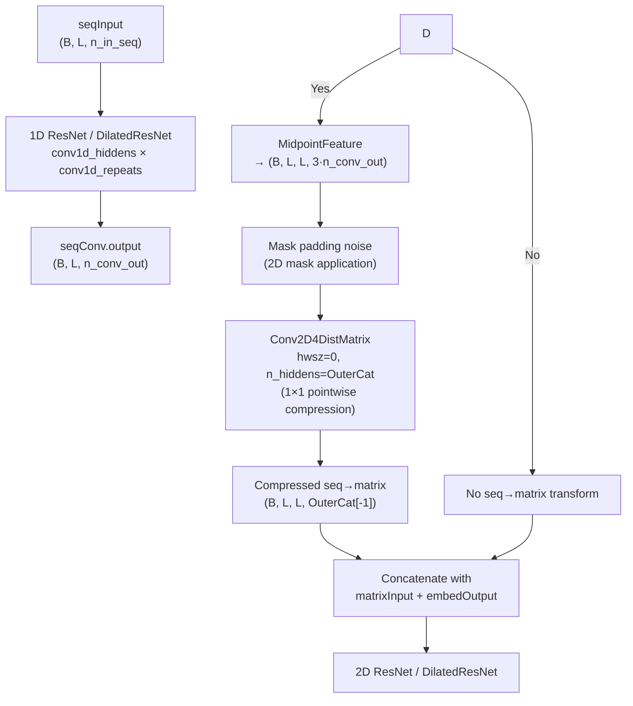

---
slug:12-outer-concatenate-and-midpoint-features
blog_type:normal
---


**外连接（Outer Concatenate）**和**中点特征（Midpoint Feature）**操作是此距离预测架构中连接一维序列表示和二维成对表示的两个核心张量变换。它们将由一维卷积输出的逐残基特征向量转换为适用于二维卷积的逐残基对特征矩阵，使网络能够直接从序列上下文中推理残基间关系。

来源：[utils.py](/utils.py#L22-L72), [Model4DistancePrediction.py](/Model4DistancePrediction.py#L18-L18)

## 一维到二维的桥接问题

在一维卷积处理序列特征张量 (batchSize, seqLen, n_in) 之后，架构必须将这些逐位置表示投影到成对域 (batchSize, seqLen, seqLen, ·) 中，以便与固有的二维成对特征（CCM、位置等）拼接，并输入到二维 ResNet 块中。这里实现了两种策略：**外连接**，通过拼接直接配对残基；以及**中点特征**，额外注入中点残基的表示以捕获两个位置之间的局部结构上下文。

来源：[Model4DistancePrediction.py](/Model4DistancePrediction.py#L262-L308), [utils.py](/utils.py#L22-L72)

## 外连接操作

`OuterConcatenate` 类似于数学上的外积，但将逐元素乘法替换为拼接。给定形状为 `(batchSize, seqLen, n_in)` 的输入张量，它会生成形状为 `(batchSize, seqLen, seqLen, 2·n_in)` 的输出，其中每个位置 `[b, i, j, :]` 包含位置 *i* 和位置 *j* 处特征向量的拼接：

```
output[b, i, j, :] = [ input[b, i, :] ‖ input[b, j, :] ]
```

这通过 Theano 的 `mgrid` 索引网格实现，在所有 (i, j) 对上进行广播收集两行数据，随后沿特征轴进行拼接，并使用 `dimshuffle` 恢复规范的 (batch, row, col, feature) 顺序。

```python
def OuterConcatenate(input):
    seqLen = input.shape[1]
    input2 = input.dimshuffle(1, 0, 2)   # (seqLen, batchSize, n_in)
    x = T.mgrid[0:seqLen, 0:seqLen]       # 2×seqLen×seqLen index grid
    out = input2[x]                        # (2, seqLen, seqLen, batchSize, n_in)
    output = T.concatenate((out[0], out[1]), axis=3)  # concat feature vectors
    return output.dimshuffle(2, 0, 1, 3)   # (batchSize, seqLen, seqLen, 2*n_in)
```

与真正的外积（通过乘法为每对生成 n_in² 个元素）的关键区别在于，拼接保留了原始特征值，没有乘法交互，从而产生更紧凑的 2·n_in 维表示，更易于训练且不易发生特征爆炸。

来源：[utils.py](/utils.py#L62-L72), [utils.py](/utils.py#L75-L81)

## 中点特征操作

`MidpointFeature` 通过引入**第三个**特征向量来扩展外连接的概念：位置 *i* 和 *j* 之间算术中点处的残基。给定输入形状 `(batchSize, seqLen, n_in)`，输出形状为 `(batchSize, seqLen, seqLen, 3·n_in)`：

```
mid = (i + j) // 2
output[b, i, j, :] = [ input[b, i, :] ‖ input[b, mid, :] ‖ input[b, j, :] ]
```

中点残基提供了隐式的结构上下文：在序列中相距较远但共享相似中点区域的两个残基，可能受相同的局部折叠影响，使得此特征对于中长距离预测特别有价值。

```python
def MidpointFeature(input, n_in):
    seqLen = input.shape[1]
    x = T.mgrid[0:seqLen, 0:seqLen]
    y1 = x[0]                # row index i
    y2 = (x[0] + x[1]) // 2  # midpoint index (i+j)//2
    y3 = x[1]                # column index j
    input2 = input.dimshuffle(1, 0, 2)
    out1 = input2[y1]        # features at position i
    out2 = input2[y2]        # features at midpoint
    out3 = input2[y3]        # features at position j
    out = T.concatenate([out1, out2, out3], axis=3)
    final_out = out.dimshuffle(2, 0, 1, 3)
    return final_out, 3 * n_in
```

整数除法 `(i + j) // 2` 意味着对于奇数间距，中点会向下取整，但这种不对称性在实际中可以忽略不计，因为模型会通过训练来补偿。

来源：[utils.py](/utils.py#L22-L40), [utils.py](/utils.py#L43-L59)

## 对比分析

| 属性 | 外连接 | 中点特征 |
|---|---|---|
| **输入** | (B, L, n_in) | (B, L, n_in) |
| **输出** | (B, L, L, 2·n_in) | (B, L, L, 3·n_in) |
| **每对特征维度** | 2·n_in | 3·n_in |
| **捕获的位置** | i, j | i, (i+j)//2, j |
| **结构上下文** | 仅成对 | 成对 + 中点区域 |
| **参数开销** | 无（索引操作） | 无（索引操作） |
| **典型下游操作** | 1×1 Conv2D 压缩 | 1×1 Conv2D 压缩 |

两种操作都是**无参数的**——它们执行纯张量索引和拼接，没有可学习的权重。参数预算被分配给随后的下游压缩层。

来源：[utils.py](/utils.py#L22-L72)

## 在 ResNet4DistMatrix 中的集成

在 `ResNet4DistMatrix` 类中，`seq2matrixMode` 配置字典控制是否以及如何应用这些操作。当 `seq2matrixMode` 中存在 `'OuterCat'` 键时，中点特征路径被激活（尽管键名为 OuterCat，但实现使用的是 `MidpointFeature`，它通过添加中点包含了 `OuterConcatenate`）：



掩码应用步骤至关重要：填充位置（来自变长序列的分批处理）会通过中点特征张量传播噪声，因此二维掩码会将行填充和列填充区域都置零。

来源：[Model4DistancePrediction.py](/Model4DistancePrediction.py#L273-L286), [Model4DistancePrediction.py](/Model4DistancePrediction.py#L307-L308)

## Conv1D2Matrix：外连接变体

一个单独的类 `Conv1D2Matrix` 提供了使用**外连接**（无中点）作为其 1D→2D 变换的替代路径。它堆叠一个或多个 `Conv1DLayer` 实例来处理序列输入，然后将 `OuterConcatenate` 应用于最终卷积输出：

```python
class Conv1D2Matrix:
    def __init__(self, rng, input, n_in, n_hiddens=[], halfWinSize=0, mask=None):
        # ... stack Conv1DLayer instances ...
        conv_out = output_at_last_layer          # (B, L, n_out_last)
        self.output = OuterConcatenate(conv_out)  # (B, L, L, 2·n_out_last)
        self.n_out = 2 * n_out_last
```

此类已被定义，但主要的 `ResNet4DistMatrix` 模型通过 `seq2matrixMode['OuterCat']` 配置使用 `MidpointFeature` 路径，这使得 `Conv1D2Matrix` 成为一个遗留或替代架构的入口点。

来源：[Model4DistancePrediction.py](/Model4DistancePrediction.py#L24-L66)

## 逐点压缩层

中点特征和外连接的输出都会被 `halfWinSize=0` 的 `Conv2D4DistMatrix` 层（即 1×1 逐点卷积）**立即压缩**。这有两个目的：(1) 将较大的特征维度（来自中点特征的 3·n_conv_out 或来自外连接的 2·n_conv_out）降低到可管理的通道数；(2) 引入可学习参数，以发现有用的跨特征交互。压缩隐藏层大小由 `seq2matrixMode['OuterCat']` 指定，在标准配置中默认为 `[70, 35]`，这意味着两个逐点卷积层首先将特征维度降至 70，然后再降至 35 个通道。

来源：[Model4DistancePrediction.py](/Model4DistancePrediction.py#L285-L286), [config.py](/config.py#L225-L228)

## 配置与激活

`modelSpecs` 中的 `seq2matrixMode` 字典控制整个 1D→2D 变换策略。默认配置结合了嵌入路径和外连接路径：

```python
modelSpecs['seq2matrixMode'] = {}
modelSpecs['seq2matrixMode']['SeqOnly'] = [4, 6, 12]   # embedding path
modelSpecs['seq2matrixMode']['OuterCat'] = [70, 35]     # midpoint + compression
```

还必须设置 `UseSequentialFeatures` 标志（默认为 `True`）才能激活 OuterCat 路径。当 `'OuterCat'` 和嵌入键（`'SeqOnly'` 或 `'Seq+SS'`）同时存在时，它们的输出将沿特征轴与原始 `matrixInput` 拼接，然后进入二维 ResNet，从而生成二维卷积主干的完整输入：

```
input_2d = concatenate(matrixInput, compressLayer.output, embedLayer.output)
```

来源：[config.py](/config.py#L225-L239), [config.py](/config.py#L303-L306), [Model4DistancePrediction.py](/Model4DistancePrediction.py#L269-L308)

## 特征维度预算

举一个使用默认设置的具体例子，其中 `conv1d_hiddens = [30, 35, 40, 45]` 且 `conv1d_repeats = [0, 0, 0, 0]`（无残差重复），最终的一维卷积输出每个位置具有 `n_conv_out = 45` 个特征。然后，中点特征为每个残基对生成 `3 × 45 = 135` 个特征，压缩链 `[70, 35]` 将其减少到 **35 个通道**——减少了 74%，在保留基本成对和中点信息的同时，保持二维卷积输入的紧凑。

来源：[config.py](/config.py#L208-L214), [utils.py](/utils.py#L22-L40)

<CgxTip>中点特征包含位置 (i+j)//2 是该架构区别于接触预测中标准外积/拼接方法的关键。这第三个位置锚点在不要求显式三维坐标的情况下编码了局部结构邻域上下文，使其成为距离预测的强大归纳偏置。</CgxTip>

<CgxTip>OuterConcatenate 和 MidpointFeature 都是具有零个可学习参数的纯索引收集操作。1D→2D 桥接中的所有表征能力均来自上游的一维 ResNet（用于学习逐位置特征）和下游的逐点 Conv2D 压缩（用于学习如何组合收集到的特征）。</CgxTip>