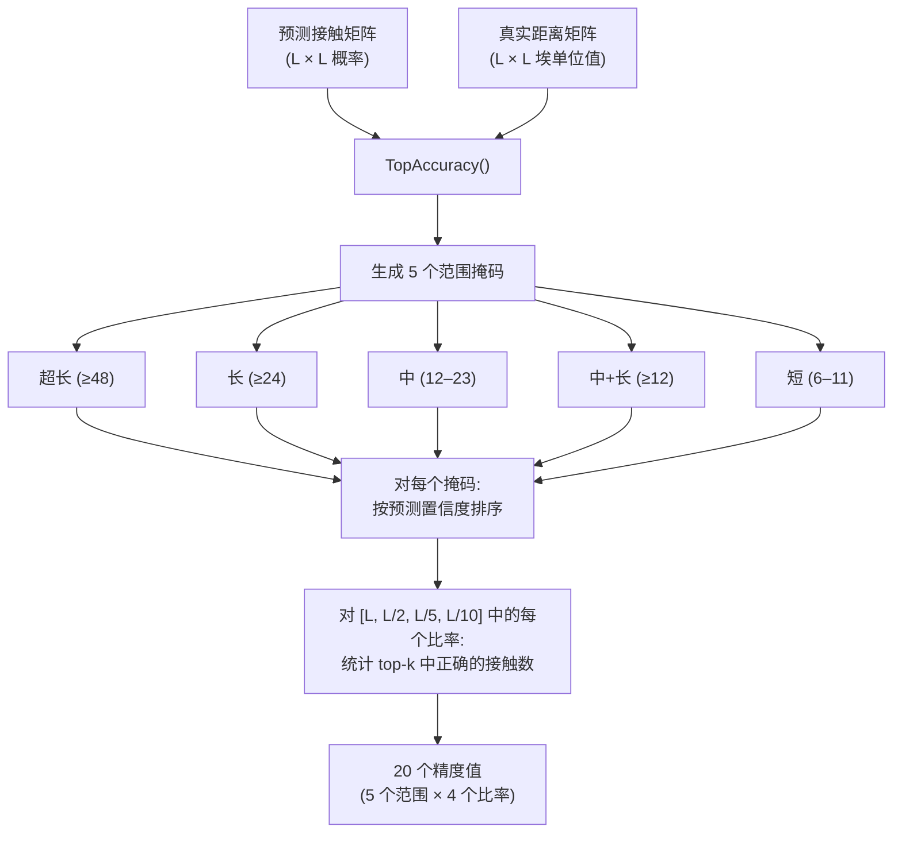

---
slug:13-contact-prediction-accuracy
blog_type:normal
---


接触预测准确率是评估模型识别空间邻近残基对能力的主要质量指标。本系统实现了 **Top-L/k 精度**范式——这是蛋白质结构预测中的标准评估协议（用于 CASP 和 CAMEO 基准测试）——其准确率定义为在多个序列分离范围内，最置信的前 *L/k* 个预测中正确接触所占的比例。

## 评估架构

接触准确率评估流程以 `ContactUtils.TopAccuracy` 为核心，它接收预测接触概率矩阵和真实距离矩阵，然后在五个范围带和四个 Top-*L* 比率阈值下计算精度。该架构将问题分解为三个阶段：**范围掩码生成** → **置信度排序** → **精度计数**。



来源: [ContactUtils.py](/ContactUtils.py#L268-L308)

## 序列分离范围

系统在 **五个互斥或累积的范围带** 上评估接触预测，这些范围带由残基 i 和 j 之间的最小序列分离 |i − j| 定义。短程接触（|i − j| < 6）被完全排除，因为它们从局部链几何结构来看是显而易见可预测的。

| 范围 | 最小分离 | 掩码构建 | 生物学依据 |
|-------|---------------|-------------------|---------------------|
| **超长 (ER)** | ≥ 48 | `triu(M1s, 48)` | 三级结构打包接触 |
| **长 (LR)** | ≥ 24 | `triu(M1s, 24)` | 非局部结构接触 |
| **中 (MR)** | 12–23 | `mask_MLR - mask_LR` | 中程接触 |
| **中+长 (MLR)** | ≥ 12 | `triu(M1s, 12)` | 累积: MR ∪ LR |
| **短 (SR)** | 6–11 | `mask_SMLR - mask_MLR` | 近局部接触 |

掩码是通过在具有适当对角线偏移量的全一矩阵上使用 `np.triu` 构建的，然后**中和短范围通过减去其外层累积掩码来计算**——例如，`mask_MR = mask_MLR - mask_LR`。这确保了分解范围之间严格不重叠，而累积范围（ER, LR, MLR）则自然重叠。

来源: [ContactUtils.py](/ContactUtils.py#L280-L288), [config.py](/config.py#L141-L142)

## Top-L/k 精度协议

`TopAccuracy` 函数在四个 Top-*L* 阈值处评估精度，其中 *L* 是蛋白质序列长度。对于给定的范围掩码和比率 *r*，该函数选择按预测置信度分数排名的前 ⌊L × r⌋ 个残基对，然后统计这些残基对中有多少在真实值中是真实接触。

**接触验证规则**：如果残基对 (i, j) 的真实距离 *d* 满足 `0 < d < contactCutoff`，则它是真实接触，其中默认 `contactCutoff = 8.0` Å。此阈值对应于蛋白质结构预测中标准的 Cβ–Cβ 接触定义。恰好为 0 或负值的距离（表示缺少坐标）将被排除。

| 比率参数 | Top 预测数 | 典型用途 |
|----------------|--------------------------|-------------|
| **L/1** | L | 最宽松；捕获全局排序质量 |
| **L/2** | L/2 | 标准 CASP 评估层级 |
| **L/5** | L/5 | 严格；测试顶部预测的精度 |
| **L/10** | L/10 | 最严格；高置信度子集 |

输出为**包含 20 个值的扁平数组**（5 个范围 × 4 个比率），排序为：ER×{L, L/2, L/5, L/10}, LR×{L, L/2, L/5, L/10}, MR×{L, L/2, L/5, L/10}, MLR×{L, L/2, L/5, L/10}, SR×{L, L/2, L/5, L/10}。当范围掩码产生零残基对时（例如，短蛋白的超长范围），所有四个比率槽位将填充 `0.0`。

来源: [ContactUtils.py](/ContactUtils.py#L268-L308)

<CgxTip>排序步骤使用 `(-res[:,0]).argsort()` 按降序置信度对预测进行排序。这种取负技巧避免了单独使用 `reverse=True` 标志，并与 NumPy 仅支持升序排序的 `argsort` 实现完美集成。</CgxTip>

## 单蛋白质评估

### 文本矩阵格式

`CalcContactPredAccuracy.py` 为单个蛋白质提供了最简单的评估入口点。它需要两个文本格式矩阵（L 行 × L 列）——一个用于预测接触概率，一个用于真实 Cβ 距离——并打印 20 值精度数组：

```bash
python CalcContactPredAccuracy.py pred_matrix.txt distcb_matrix.txt targetName
```

两个矩阵均通过 `LoadContactMatrix` 加载，该函数使用 `np.genfromtxt` 读取空格分隔的文本文件。输出格式为：`targetName L TopAcc acc1 acc2 ... acc20`。

来源: [CalcContactPredAccuracy.py](/CalcContactPredAccuracy.py#L1-L44), [ContactUtils.py](/ContactUtils.py#L12-L23)

### CASP RR 格式

`CalcCASPContactPredAccuracy.py` 评估 **CASP RR（残基-残基）** 提交格式的预测。解析器 `LoadContactMatrixInCASPFormat` 读取标准化 CASP 文件结构——`PFRMAT RR` 头部、`TARGET` 标识符、`AUTHOR`/`METHOD`/`MODEL` 元数据行、氨基酸序列和接触概率条目——然后从稀疏的上三角概率条目重建对称的 L × L 接触矩阵。每个接触行指定残基索引（从 1 开始）、距离边界 `[0, 8]` 和 [0, 1] 中的置信度分数。

```bash
python CalcCASPContactPredAccuracy.py pred_CASP.rr native.atomDistMatrix.pkl
```

CASP 格式对所有条目强制执行 `[0, 8]` 的距离边界，对应于标准的 8 Å Cβ 接触定义。[0, 1] 之外的概率或超出序列范围的残基索引将触发验证错误。

来源: [CalcCASPContactPredAccuracy.py](/CalcCASPContactPredAccuracy.py#L1-L26), [ContactUtils.py](/ContactUtils.py#L27-L102)

## 批量评估流程

`BatchEvaluateContactAccuracy.py` 可在整个蛋白质测试集上评估接触准确率。它读取蛋白质列表文件，从 PKL 文件加载预测距离或接触矩阵，提取接触概率分量，并委托给 `ContactUtils.EvaluateContactPredictions` 进行逐蛋白质和聚合准确率计算。

```bash
python BatchEvaluateContactAccuracy.py proteinList.txt predFolder/ nativeFolder/ [fileSuffix]
```

| 参数 | 描述 | 默认值 |
|-----------|-------------|---------|
| `proteinListFile` | 每行包含一个蛋白质名称的文本文件 | (必填) |
| `predFolder` | 包含预测 PKL 文件的目录 | (必填) |
| `nativefolder` | 包含原生 `.atomDistMatrix.pkl` 文件的目录 | (必填) |
| `fileSuffix` | 预测文件后缀 | `.predictedDistMatrix.pkl` |

该流程基于文件后缀支持两种 PKL 格式。对于 `.predictedDistMatrix.pkl`，接触概率矩阵从加载元组的索引 3 处提取（`pred[3]`）。对于 `.predictedContactMatrix.pkl`，它从字典键 `'predContactMatrix'` 处提取。这种双格式支持同时兼容原始距离预测输出和预转换的接触预测文件。

来源: [BatchEvaluateContactAccuracy.py](/BatchEvaluateContactAccuracy.py#L33-L99)

### EvaluateContactPredictions 中的聚合逻辑

`EvaluateContactPredictions` 是核心批量评估函数。对于每个蛋白质，它通过 `DataProcessor.LoadNativeDistMatrix` 加载原生距离矩阵，并为预测字典中的每种原子对类型（响应）计算 `TopAccuracy`。**氢键 (HB) 响应**使用 `config.MaxHBDistance = 9.5` Å 的专用接触截断值，而所有其他原子对类型使用默认的 8.0 Å 截断值。然后，逐蛋白质精度数组使用 `np.average` 沿蛋白质轴按原子对类型进行聚合，同时生成逐蛋白质和平均精度字典。

来源: [ContactUtils.py](/ContactUtils.py#L331-L373), [config.py](/config.py#L56-L57)

## 距离到接触的转换

由于主要模型输出是**距离概率分布**（而非直接的接触概率），系统提供了 `Distance2Contact`，通过在接触区间上对距离分布进行边缘化来推导接触概率。给定形状为 (L, L, numBins) 的 3D 距离概率张量，每个残基对的接触概率为：

```
contactProb[i, j] = Σ(distProb[i, j, k]) for k = 0 to labelOf8 - 1
```

参数 `labelOf8`（默认值 = 1）控制求和的距离区间数。当使用截断值为 `[0, 8]` 的 `2C` 离散化方案时，区间 0 对应于 [0, 8) Å 中的距离——即接触——因此 `labelOf8 = 1` 可正确地仅对接触区间求和。此转换是距离预测模型和接触准确率评估流程之间的桥梁。

来源: [ContactUtils.py](/ContactUtils.py#L190-L200), [距离预测准确率](14-distance-prediction-accuracy)

<CgxTip>`labelOf8` 参数必须与所使用的距离离散化方案保持一致。对于 `3CPlus` 截断值 `[0, 8, 15]`，接触区间是区间 0，因此 `labelOf8 = 1` 是正确的。对于 `12C` 截断值 `[0, 5, 6, 7, 8, ...]`，接触区间跨越索引 0–3，需要 `labelOf8 = 4`。不匹配的值将产生不正确的接触概率。</CgxTip>

## CASP 提交序列化

`SaveContactMatrixInCASPFormat` 以 CASP RR 格式写入预测接触，用于官方评估。该函数通过 `config.ProbScaleFactor` 应用可选的**概率缩放**，将每个概率 *p* 转换为 *p^ProbScaleFactor*。默认因子为 `log(0.5) / log(0.4) ≈ 0.756`，旨在将 0.4 的原始预测概率映射到 0.5——这是 MCC/F1 计算的标准二元分类阈值。此缩放**仅**在序列化时应用，不影响内部准确率评估。

序列化强制执行多项 CASP 约束：最小序列分离为 6（通过 `np.triu(contactMatrix, 6)`），最多 300,000 个残基对，以及对于前 160,000 对之后的条目，置信度阈值为 0.05。残基对按置信度降序写入，残基索引转换为从 1 开始。

来源: [ContactUtils.py](/ContactUtils.py#L106-L184), [config.py](/config.py#L4-L9)

## 原子对类型处理

评估系统支持多种原子对类型（`CbCb`, `CaCa`, `CgCg`, `CaCg`, `NO`, `HB`, `Beta`），每种类型可能具有不同的接触距离阈值。`EvaluateSingleContactPrediction` 和 `EvaluateContactPredictions` 中的调度逻辑检查响应名称是否以 `'HB'` 开头，以选择适当的截断值：

| 原子对类型 | 接触截断值 | 配置键 |
|---------------|----------------|------------|
| CbCb, CaCa, CgCg, CaCg, NO, Beta | 8.0 Å | `contactCutoff` 默认值 |
| HB (氢键) | 9.5 Å | `config.MaxHBDistance` |

HB 特定的截断值反映了氢键 Cβ 原子之间的距离最高可达约 9.5 Å 的物理现实，超过了标准的 8 Å 接触距离。

来源: [ContactUtils.py](/ContactUtils.py#L312-L322), [config.py](/config.py#L56-L57)

## 与其他指标的关系

此处计算的 Top-L/k 精度指标与通过 `ContactUtils.CalcMCCF1` 获得的 **MCC 和 F1** 指标互补。Top-L/k 精度在固定的 top-k 阈值处评估排序质量（与阈值无关，基于排序），而 MCC 和 F1 在固定的概率截断值处评估二元分类质量（依赖于阈值，基于分类）。为了进行完整评估，应同时参考这两组指标——有关基于分类的评估，请参见 [MCC 和 F1 指标](15-mcc-and-f1-metrics)；有关连续距离误差指标（绝对误差、相对误差、GDT），请参见[距离预测准确率](14-distance-prediction-accuracy)。