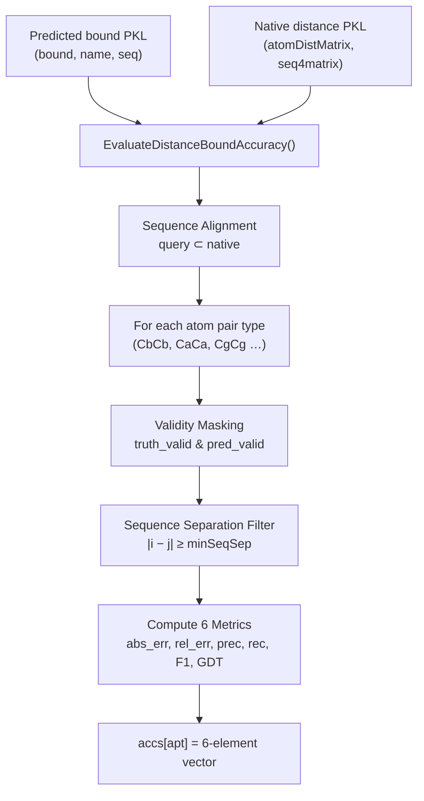
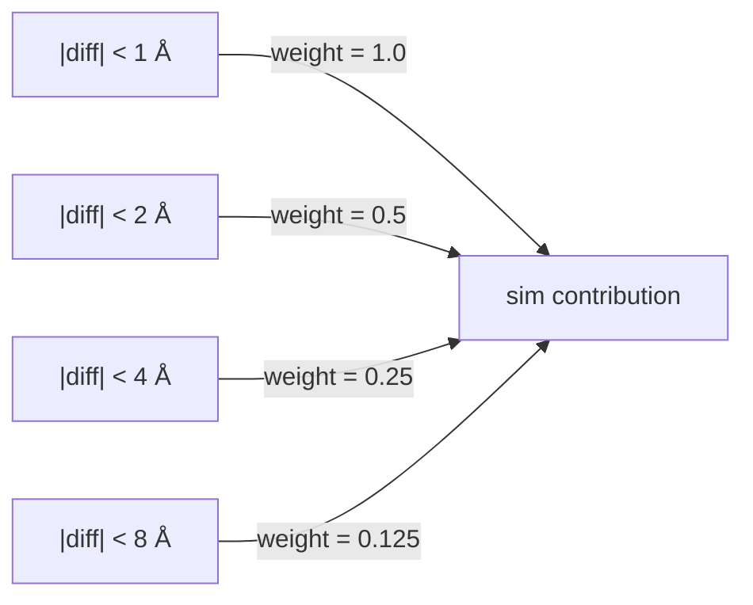

---
slug:14-distance-prediction-accuracy
blog_type:normal
---


距离预测精度评估衡量的是，在蛋白质的所有残基对中，预测的原子间距离边界与原生（真实）距离的匹配程度。与将问题简化为二分类的接触预测不同，距离精度基于**连续距离值**进行运算，从而产生更丰富且更严格的六项指标集合：绝对误差、相对误差、精确率、召回率、F1 和受 GDT 启发的相似度得分。评估引擎位于 `DistanceUtils.EvaluateDistanceBoundAccuracy()` 中，单蛋白和批处理的入口点分别由 `EvaluateDistanceAccuracy.py` 和 `BatchEvaluateDistanceAccuracy.py` 提供。

来源: [DistanceUtils.py](DistanceUtils.py#L28-L100), [EvaluateDistanceAccuracy.py](EvaluateDistanceAccuracy.py#L1-L65), [BatchEvaluateDistanceAccuracy.py](BatchEvaluateDistanceAccuracy.py#L1-L112)

## 评估数据流

端到端评估流水线接收一个**预测距离边界矩阵**（来自推理）和一个**原生距离矩阵**（真实值），然后生成按原子对类型划分的指标向量。下图展示了此流程：



预测边界文件是一个包含三个项的 pickle 元组：`(bound, name, primary_sequence)`，其中 `bound` 是以原子对类型为键的 `dict()`。每个值都是一个 **L×L×10** 矩阵——通道 0 保存预测的原子间距离，其余通道编码各种偏差。原生文件也是一个 `dict()`，以相同方式作为键，但每个值是一个简单的 **L'×L'** 二维距离矩阵（如果原生结构包含额外残基，L' 可能大于 L）。

来源: [EvaluateDistanceAccuracy.py](EvaluateDistanceAccuracy.py#L44-L55), [BatchEvaluateDistanceAccuracy.py](BatchEvaluateDistanceAccuracy.py#L78-L91), [DistanceUtils.py](DistanceUtils.py#L25-L27)

## 序列比对与矩阵切片

预测边界中嵌入的查询序列可能是原生序列的**子串**（原生结构可包含额外的末端残基）。`EvaluateDistanceBoundAccuracy` 通过子串搜索在原生序列中定位查询序列，并将原生距离矩阵切片至匹配范围：

```
pos = nativeSeq.find(querySeq)
start = pos
end = pos + len(querySeq)
truth = native[apt][start:end, start:end]
```

如果未找到查询序列，函数将报错退出——这可以防止蛋白质不匹配。此比对步骤确保了预测矩阵和真实值矩阵在进行任何比较之前具有相同的 L×L 维度。

来源: [DistanceUtils.py](DistanceUtils.py#L29-L47)

## 有效性掩码

并非距离矩阵中的每个条目都有意义。评估会构建**两个独立的有效性掩码**——一个用于真实值，一个用于预测——然后将它们相交，以确定哪些残基对参与指标计算。

| 掩码 | 规则 | 依据 |
|------|------|-----------|
| `truth_valid` | `truth ≥ 0.1` | 负的原生距离表示缺失 3D 坐标（PDB 中的无效残基） |
| `pred_valid` | `0 < pred ≤ 15` | 超出交互限制（15 Å）的预测被视为不可靠；零表示未进行预测 |

组合掩码 `diff_valid = truth_valid * pred_valid` 控制所有后续的指标计算，确保只有同时具备有效原生距离和可信预测的残基对才会参与贡献。这可以防止无效条目破坏平均值。

<CgxTip>`pred_valid` 的 15 Å 上限与 `config.InteractionLimit = 15.001` 保持一致——距离大于此阈值的残基被假定为没有有意义的相互作用，因此即使产生了预测值，其预测距离也会被排除在精度评估之外。</CgxTip>

来源: [DistanceUtils.py](DistanceUtils.py#L49-L57), [config.py](config.py#L176-L179)

## 最小序列分离过滤

短程残基对（在序列中相邻或相近）是极易预测的，因为它们的距离受主链几何的严格约束。为了将评估集中于**非平凡的预测**，最小序列分离参数 `minSeqSep`（默认值：12）排除了满足 `|i − j| < minSeqSep` 的残基对：

```python
for offset in range(0, minSeqSep):
    np.fill_diagonal(truth_valid[:-offset, offset:], 0)
    np.fill_diagonal(pred_valid[:-offset, offset:], 0)
```

这会将两个有效性掩码中宽度为 `minSeqSep` 的对角带清零，对称地覆盖上三角和下三角。批处理评估器将其作为可选的 CLI 参数公开，允许用户收紧或放宽评估范围。

来源: [DistanceUtils.py](DistanceUtils.py#L59-L66), [BatchEvaluateDistanceAccuracy.py](BatchEvaluateDistanceAccuracy.py#L47-L52)

## 六项精度指标

掩码处理之后，将按原子对类型计算六项指标。下表定义了每项指标及其实现：

| 指标 | 公式 | 解释 |
|--------|---------|----------------|
| **绝对误差** | `Σ|pred − truth| · valid / Σvalid` | 以埃为单位的平均绝对偏差；越低越好 |
| **相对误差** | `Σ(|pred − truth| / avg_dist) · valid / Σvalid` | 尺度不变误差；通过预测值和真实值的平均值进行归一化 |
| **精确率** | `TP / (TP + FP)` | 原生距离也 ≤ 15 Å 的有效预测所占比例 |
| **召回率** | `TP / (TP + FN)` | 获得有效预测且原生距离 ≤ 15 Å 的比例 |
| **F1** | `2 · prec · rec / (prec + rec)` | 精确率和召回率的调和平均值 |
| **GDT** | `Σ sim(diff) · valid / Σvalid` | 受 GDT-TS 启发的分层相似度得分 |

**精确率/召回率**的语义特定于距离评估：当预测距离落在 (0, 15] 内**且**原生距离也 ≤ 15 Å 时，即为真阳性。这实际上衡量的是模型识别“相互作用”残基对（即处于 15 Å 交互限制内的残基对）的能力，而不是精确距离值的预测准确度——后者属于绝对误差和相对误差的职责。

来源: [DistanceUtils.py](DistanceUtils.py#L68-L98)

### 受 GDT 启发的相似度得分

GDT 指标将结构预测中的 **GDT-TS** 概念适配到距离预测中。它不测量多个阈值下的 Cα 坐标偏差，而是使用四个层级测量距离偏差：



每个残基对贡献的得分与其绝对误差满足的最严阈值成反比：`diff < 1 → 1.0`，`diff < 2 → 0.5`，`diff < 4 → 0.25`，`diff < 8 → 0.125`。误差 ≥ 8 Å 的残基对不产生贡献。最终 GDT 得分是所有有效对的平均值。GDT 为 1.0 表示每个预测距离都在原生距离的 1 Å 范围内；0.5 表示平均残基对满足 2 Å 阈值。这种分层设计使 GDT **对异常值具有鲁棒性**，同时仍然奖励精确度——单一的大误差无法像在 L² 指标中那样主导最终得分。

来源: [DistanceUtils.py](DistanceUtils.py#L89-L95)

## 入口点

### 单蛋白评估

`EvaluateDistanceAccuracy.py` 一次评估一个蛋白质：

```console
python EvaluateDistanceAccuracy.py <bound_PKL> <ground_truth_PKL>
```

它加载两个 PKL 文件，将主序列附加到边界字典中（`pred[0]['seq'] = pred[2]`），调用 `DistanceUtils.EvaluateDistanceBoundAccuracy()`，并按原子对类型以 `<target> <atomPairType> <metric_vector>` 格式打印每项指标。

来源: [EvaluateDistanceAccuracy.py](EvaluateDistanceAccuracy.py#L26-L64)

### 批处理评估

`BatchEvaluateDistanceAccuracy.py` 评估蛋白质列表，并计算单蛋白和**跨蛋白平均**指标：

```console
python BatchEvaluateDistanceAccuracy.py <proteinList> <bound_folder> <native_folder> [minSeqSep]
```

| 参数 | 描述 |
|-----------|-------------|
| `proteinList` | 每行包含一个蛋白质名称的文本文件 |
| `bound_folder` | 包含 `XXX.bound.pkl` 文件的目录 |
| `native_folder` | 包含 `XXX.atomDistMatrix.pkl` 文件的目录 |
| `minSeqSep` | 最小序列分离（默认值：12，最小值：2） |

批处理脚本将单蛋白结果累积到列表中，然后使用 `np.average(v, axis=0)` 计算所有蛋白质中每项指标的平均值。输出分两部分打印：首先是跨蛋白平均值（带有 `average` 前缀），然后是单蛋白明细。所有浮点数值均通过 `str_display()` 辅助函数格式化为 4 位小数。

来源: [BatchEvaluateDistanceAccuracy.py](BatchEvaluateDistanceAccuracy.py#L35-L111)

## 指标输出格式

对于每种原子对类型（如 `CbCb`、`CaCa`、`CgCg`、`CaCg`、`NO`），评估将以固定顺序返回一个 **6 元素列表**：

| 索引 | 指标 | 范围 | 方向 |
|-------|--------|-------|-----------|
| 0 | 绝对误差 | [0, +∞) | 越低越好 |
| 1 | 相对误差 | [0, +∞) | 越低越好 |
| 2 | 精确率 | [0, 1] | 越高越好 |
| 3 | 召回率 | [0, 1] | 越高越好 |
| 4 | F1 | [0, 1] | 越高越好 |
| 5 | GDT | [0, 1] | 越高越好 |

返回值为一个字典：`accs[apt] = [abs_error, rel_error, precision, recall, F1, GDT]`。当批处理评估器跨蛋白计算平均值时，每项指标独立求平均，并保持此 6 元素结构。

来源: [DistanceUtils.py](DistanceUtils.py#L98-L100), [BatchEvaluateDistanceAccuracy.py](BatchEvaluateDistanceAccuracy.py#L100-L102)

## 与接触精度的关系

距离精度评估与[接触预测精度](13-contact-prediction-accuracy)是**正交但互补**的。接触评估将问题简化为二分类（8 Å 下的接触与非接触），并测量跨范围类别的 top-L 精确率。距离评估则保留完整的连续预测，并以埃为单位测量偏差。距离评估中的精确率/召回率/F1 专门针对 15 Å 的交互边界——这是一个不同于 8 Å 接触定义的阈值——因此能在更粗的粒度上捕获模型区分相互作用与非相互作用残基对的能力。有关 8 Å 接触边界下的二分类质量，请参见 [MCC 和 F1 指标](15-mcc-and-f1-metrics)。

来源: [DistanceUtils.py](DistanceUtils.py#L80-L87), [config.py](config.py#L176-L179)

## 数值稳定性

`EvaluateDistanceBoundAccuracy` 中的所有除法运算均使用添加到分母的 **epsilon 保护**（`epsilon = 0.000001`），以防止在给定原子对类型不存在有效残基对时发生除零错误。对于成分异常的蛋白质中的 `CaCg` 或 `NO` 等原子对类型，可能会出现这种情况。在 [Metrics.py](Metrics.py) 的独立 F1 和 MCC 计算中也使用了相同的 epsilon 约定。