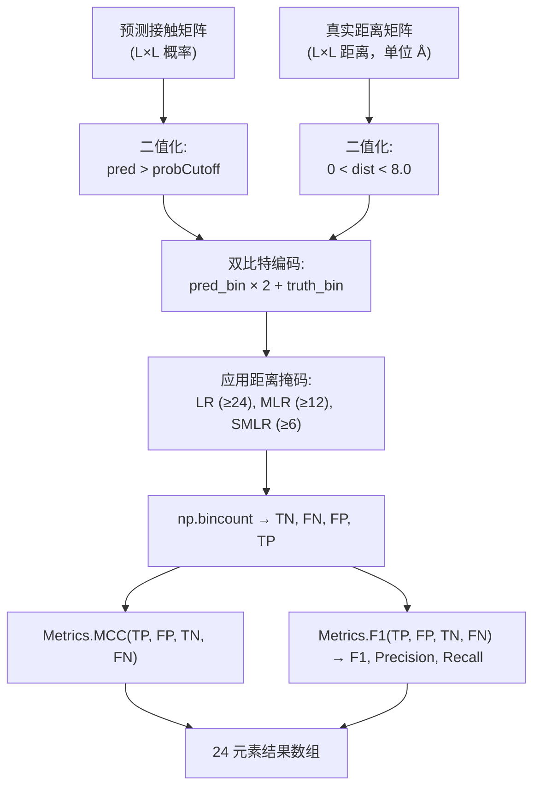

---
slug:15-mcc-and-f1-metrics
blog_type:normal
---


本页解释了该项目如何计算 **马修斯相关系数 (MCC)** 和 **F1 分数** 以评估接触预测。这两个指标基于二分类混淆矩阵 (TP, FP, TN, FN) 进行计算，并在三种残基对距离范围类别下进行计算——长距离、中+长距离和短+中+长距离——从而提供预测质量的多尺度视角。该实现跨越三个层级：核心公式模块 ([Metrics.py](Metrics.py))、[ContactUtils.py](ContactUtils.py) 中的单蛋白质计算函数，以及 CLI 入口 [CalcMCCF1.py](CalcMCCF1.py) 和 [BatchCalcMCCF1.py](BatchCalcMCCF1.py)。

来源: [Metrics.py](Metrics.py#L1-L17), [ContactUtils.py](ContactUtils.py#L202-L258), [CalcMCCF1.py](CalcMCCF1.py#L1-L38), [BatchCalcMCCF1.py](BatchCalcMCCF1.py#L1-L63)

## 数学基础

MCC 和 F1 均源自对预测接触概率和真实距离进行二值化处理后产生的四个混淆矩阵计数值。核心模块 `Metrics.py` 实现了标准公式，并在分母中添加了一个微小的 **epsilon** (ε = 0.000001) 以防止在某个类别为空时发生除零错误——这种情况在小蛋白质或使用较严格的概率截断值时很常见。

**F1 分数** 是精确率和召回率的调和平均值：

| 组件 | 公式 |
|-----------|---------|
| 精确率 | TP / (TP + FP + ε) |
| 召回率 | TP / (TP + FN + ε) |
| F1 | 2 × Precision × Recall / (Precision + Recall + ε) |

**马修斯相关系数 (MCC)** 对称地处理混淆矩阵的四个象限，这使得它对于不平衡数据集比 F1 更具信息量——在真实接触稀疏的接触预测中，这是一种典型情况：

| 指标 | 公式 |
|--------|---------|
| MCC | (TP×TN − FP×FN) / √(ε + (TP+FP)(TP+FN)(TN+FP)(TN+FN)) |

<CgxTip>epsilon 保护 (ε = 10⁻⁶) 在实践中至关重要。当在小蛋白质上评估长距离接触时，TP+FP 或 TP+FN 很容易为零，如果没有这个保护措施，将导致原始的除零崩溃。</CgxTip>

来源: [Metrics.py](Metrics.py#L1-L17)

## 二值化与双比特编码技巧

在计算指标之前，必须将连续的预测概率和距离值转换为二分类标签。`ContactUtils.py` 中的 `CalcMCCF1` 函数分两步执行此操作，然后使用一种巧妙的 **双比特整数编码**，在单次向量化遍历中将每个残基对精确分类到四个混淆矩阵类别之一：

1. **预测二值化**：`pred_binary = (pred > probCutoff)` — 任何高于截断值的预测概率均为正预测 (1)，否则为负预测 (0)。
2. **真实值二值化**：`truth_binary = (0 < truth) & (truth < contactCutoff)` — 仅当残基对的天然距离严格介于 0 和接触距离截断值（默认 8.0 Å）之间时，该残基对才是真实接触。距离为 0 或 −1 表示无效/缺失坐标。
3. **编码**：`pred_truth = pred_binary * 2 + truth_binary` — 这将每个残基对映射到 {0, 1, 2, 3} 中的一个整数：

| 编码值 | `pred_binary` | `truth_binary` | 混淆矩阵类别 |
|:---:|:---:|:---:|:---:|
| 0 | 0 | 0 | TN (真负例) |
| 1 | 0 | 1 | FN (假负例) |
| 2 | 1 | 0 | FP (假正例) |
| 3 | 1 | 1 | TP (真正例) |

然后，该函数应用 `np.bincount(res, minlength=4)` 来计算每个编码值的出现次数，直接得出 TN, FN, FP, TP，而无需任何显式循环或条件逻辑。这对于大型 L×L 矩阵既简洁又高效。

<CgxTip>编码 `pred*2 + truth` 利用了每个二进制变量贡献一个比特的事实。这是一种标准的位掩码技巧，但值得注意的是，计数索引映射到的是 [TN, FN, FP, TP]（而不是更常见的 [TN, FP, FN, TP] 顺序），因此在解释原始数组时需格外小心。</CgxTip>

来源: [ContactUtils.py](ContactUtils.py#L219-L248)

## 三种接触距离类别

结构生物学中的接触评估是距离感知的：序列中相距较远的残基之间的接触比相邻残基之间的接触更难预测，但在结构上也更具信息量。`CalcMCCF1` 函数使用最小序列间隔递增的上三角掩码，在 **三个距离级别** 评估混淆矩阵和指标：

| 距离标签 | 掩码函数 | 最小间隔 | 解释 |
|:---|:---|:---:|:---|
| **长距离 (LR)** | `np.triu_indices(L, 24)` | ≥ 24 个残基 | 最难预测；对 3D 折叠最有价值 |
| **中+长距离 (MLR)** | `np.triu_indices(L, 12)` | ≥ 12 个残基 | 标准 CASP 评估范围 |
| **短+中+长距离 (SMLR)** | `np.triu_indices(L, 6)` | ≥ 6 个残基 | 最广范围；包括局部接触 |

每个掩码选择上三角残基对的一个子集，并针对该子集独立计算混淆矩阵计数值和指标。结果是一个 **24 元素数组**，每个距离范围包含 8 个值：

| 索引范围 | 距离范围 | 值 |
|:---:|:---|:---|
| 0–7 | LR | MCC, TP, FP, TN, FN, F1, Precision, Recall |
| 8–15 | MLR | MCC, TP, FP, TN, FN, F1, Precision, Recall |
| 16–23 | SMLR | MCC, TP, FP, TN, FN, F1, Precision, Recall |

来源: [ContactUtils.py](ContactUtils.py#L226-L258)

## 计算流水线

下图展示了预测接触矩阵和真实距离矩阵如何流经计算流水线以生成 24 元素指标数组：



来源: [ContactUtils.py](ContactUtils.py#L204-L258), [Metrics.py](Metrics.py#L1-L17)

## 单蛋白质评估: CalcMCCF1.py

`CalcMCCF1.py` 脚本提供了用于评估 **单个蛋白质** 接触预测的命令行界面。它加载两个文本格式的矩阵（预测矩阵和真实矩阵），然后将概率截断值从 0.20 扫描至 0.58，步长为 0.02，在每个截断值下打印完整的 8 值指标集：

```
python CalcMCCF1.py <pred_matrix_file> <distcb_matrix_file> <target_name>
```

两个输入文件均为纯文本，包含 L 行和 L 列（L = 序列长度）。每个截断值对应输出行的格式如下：

```
<target> <L> cutoff=<prob> <MCC> <TP> <FP> <TN> <FN> <F1> <Precision> <Recall>
```

请注意，此脚本每次扫描仅打印 **一个距离范围** 的指标——`CalcMCCF1` 函数返回所有三个距离范围的结果，但 `str_display` 会格式化整个数组，因此所有 24 个值都会出现在每行输出中。

来源: [CalcMCCF1.py](CalcMCCF1.py#L18-L37), [ContactUtils.py](ContactUtils.py#L12-L23)

## 批量评估与两种平均策略

`BatchCalcMCCF1.py` 脚本将评估扩展到 **蛋白质列表**，并引入了两种平均策略之间的重要区别，这两种策略可能会产生截然不同的结果：

```
python BatchCalcMCCF1.py <proteinListFile> <pred_matrix_dir> <truth_matrix_dir>
```

### 策略 1: 按目标平均 (直接指标平均)

对于每个概率截断值，脚本计算每个蛋白质的 24 元素指标数组，然后取所有蛋白质的 **逐元素平均值**。这会产生“按目标平均的 avgMCCF1”——即平均 MCC、平均 TP、平均 FP 等。此策略将每个蛋白质视为等权重的观测值，而忽略其大小，当蛋白质序列长度差异很大时，这可能会产生误导（一个小蛋白质的 5 个真实接触会获得与一个大蛋白质的 500 个真实接触相同的权重）。

### 策略 2: 按残基对平均 (聚合混淆矩阵)

然后，脚本从策略 1 中提取 **平均的 TP, FP, TN, FN** 计数值，并将它们反馈给 `Metrics.MCC()` 和 `Metrics.F1()`，以根据聚合的混淆矩阵重新计算指标。这种“按残基对平均的 avgMCCF1”策略实际上按残基对的数量对蛋白质进行加权，产生的指标反映了整体的残基对级别分类质量。重新计算针对 LR 距离范围（索引 1–4）和 MLR 距离范围（索引 9–12）分别进行：

```python
# 长距离接触的按残基对平均 MCC/F1
lrMCC = Metrics.MCC(avgacc[1], avgacc[2], avgacc[3], avgacc[4])
lrF1, lrprecision, lrrecall = Metrics.F1(avgacc[1], avgacc[2], avgacc[3], avgacc[4])

# 中+长距离接触的按残基对平均 MCC/F1
mrMCC = Metrics.MCC(avgacc[9], avgacc[10], avgacc[11], avgacc[12])
mrF1, mrprecision, mrrecall = Metrics.F1(avgacc[9], avgacc[10], avgacc[11], avgacc[12])
```

| 策略 | 权重分配 | 适用场景 |
|:---|:---|:---|
| 按目标平均 | 每个蛋白质 = 1 票 | 在多样化蛋白质集合上进行基准测试 |
| 按残基对平均 | 每个残基对 = 1 票 | 衡量整体分类性能 |

来源: [BatchCalcMCCF1.py](BatchCalcMCCF1.py#L45-L61)

## 概率截断值扫描

两个 CLI 脚本均扫描概率截断值，而不是使用单一阈值。这是必不可少的，因为 **最大化 MCC 或 F1 的最佳截断值取决于模型的校准**——输出校准良好概率的模型峰值接近 0.5，而不自信的模型可能需要较低的截断值。[config.py](config.py) 中的 `ProbScaleFactor` (`log(0.5)/log(0.4) ≈ 1.085`) 在历史上曾用于重新缩放预测概率，使得 0.5 的截断值对应于原始的 0.4 概率，从而在标准二分类阈值下优化 MCC/F1。从 0.20 到 0.58 的扫描通过揭示完整的精确率-召回率权衡曲线，完全规避了这一校准问题。

| 脚本 | 截断值范围 | 步长 |
|:---|:---:|:---:|
| CalcMCCF1.py | 0.20 – 0.58 | 0.02 |
| BatchCalcMCCF1.py | 0.20 – 0.59 | 0.01 |

来源: [CalcMCCF1.py](CalcMCCF1.py#L32-L36), [BatchCalcMCCF1.py](BatchCalcMCCF1.py#L45-L46), [config.py](config.py#L4-L9)

## 与其他评估指标的关系

MCC/F1 指标与 [接触预测准确率](13-contact-prediction-accuracy) 中描述的 **top-L 准确率** 评估互为补充。虽然 top-L 准确率衡量的是固定数量的最高排名预测的精确率，但 MCC 和 F1 在给定的概率阈值下评估 **整个二分类结果**——涵盖所有残基对的精确率和召回率。相比之下，[距离预测准确率](14-distance-prediction-accuracy) 页面评估的是连续的距离预测，而不是二值化后的接触决策。这三种评估视角共同提供了全面的评估：top-L 准确率用于评估排序质量，MCC/F1 用于评估阈值分类质量，而距离 MAE 用于评估回归质量。