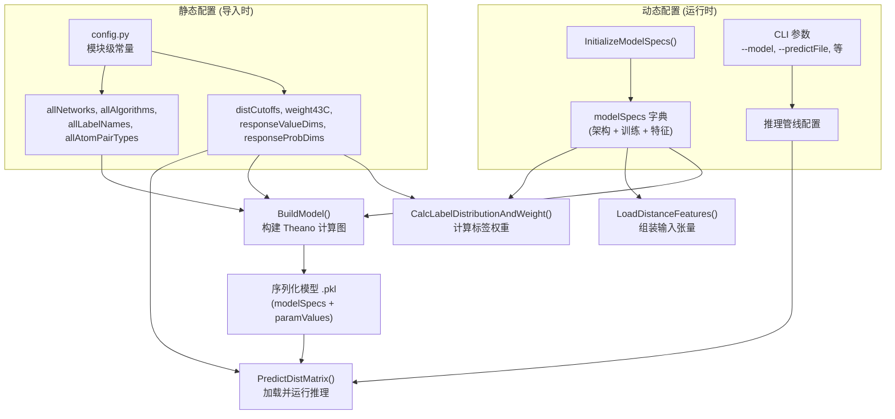

---
slug:16-configuration-reference
blog_type:normal
---

DL4DistancePrediction2 的配置层集中定义在 `config.py` 中，该模块定义了**所有全局常量、距离离散化模式、标签/权重规范以及默认模型规范字典**。此模块是贯穿模型构建（`Model4DistancePrediction.BuildModel`）、数据处理（`DataProcessor.LoadDistanceFeatures`）、训练编排和推理（`run_distance_predictor.PredictDistMatrix`）的每一个可调参数的唯一事实来源。高级用户必须理解三种不同的配置层面：**(1)** 导入时硬编码的模块级常量，**(2)** 由 `InitializeModelSpecs()` 返回并控制架构与训练的 `modelSpecs` 字典，以及 **(3)** `run_distance_predictor.py` 中在运行时控制推理管线的命令行参数。

来源: [config.py](/config.py#L1-L329), [run_distance_predictor.py](/run_distance_predictor.py#L1-L316), [Model4DistancePrediction.py](/Model4DistancePrediction.py#L606-L656)

## 模块级常量

这些常量在导入时进行一次性求值，如果不修改源码则无法覆盖。它们定义了原子对类型、标签类型、网络架构和优化算法的**有效标识符全域**。

### 概率缩放

`ProbScaleFactor` 缩放预测的接触概率，以便在将 p=0.5 用作二值接触截断值时，最大化 MCC/F1 分数。其计算公式为 `log(0.5)/log(0.4) ≈ 1.317`，仅在生成 CASP `.rr` 提交文件时应用。该因子取决于损失函数的权重；每当权重因子发生变化时，必须重新校准此常量。

| 常量 | 值 | 用途 |
|---|---|---|
| `ProbScaleFactor` | `ln(0.5)/ln(0.4) ≈ 1.317` | 为 CASP 提交缩放预测概率 |
| `ContactDefinition` | `8.001 Å` | 定义接触的 Cβ–Cβ 距离阈值 |
| `InteractionLimit` | `15.001 Å` | 超出此距离的残基无相互作用 |
| `MaxBetaDistance` | `8.0 Å` | β-配对的最大 Cβ 距离 |
| `MaxHBDistance` | `9.5 Å` | 氢键的最大 Cβ 距离 |

来源: [config.py](/config.py#L4-L9), [config.py](/config.py#L55-L56), [config.py](/config.py#L175-L179)

### 网络架构

`allNetworks` 枚举了五个已识别的深度网络标识符。网络的选择决定了 `ResNet4DistMatrix` 如何为 1D 序列卷积和 2D 矩阵卷积分支在 `ResNet` 和 `DilatedResNet` 之间进行选择。

| 标识符 | 描述 |
|---|---|
| `ResNet2D` | 原始 2D ResNet（每个块包含单个批归一化） |
| `ResNet2DV21` | 与 ResNet2D 相同（2018年3月8日添加） |
| `ResNet2DV22` | 每个残差块包含两个批归一化层；通常优于 V21 |
| `ResNet2DV23` | 移除了未使用的批归一化层和参数；**推荐使用** |
| `DilatedResNet2D` | 具有逐层膨胀率的膨胀卷积变体 |

来源: [config.py](/config.py#L11-L16), [Model4DistancePrediction.py](/Model4DistancePrediction.py#L256-L316)

### 原子对类型与标签名

`allAtomPairTypes` 定义了系统能够预测的五种原子间距离类型。`allLabelNames` 在此基础上扩展了两种结构属性类型。`symAtomPairTypes` 列出了其距离矩阵对称（D[i,j] = D[j,i]）的类型；在推理期间，这些类型的预测矩阵会通过与它们的转置矩阵取平均来进行对称化。

| 类别 | 值 | 是否对称？ |
|---|---|---|
| `allAtomPairTypes` | `CbCb`, `CaCa`, `CgCg`, `CaCg`, `NO` | `CbCb`, `CaCa`, `CgCg` 对称 |
| `allLabelNames` | 上述类型 + `HB`, `Beta` | `Beta` 对称；`HB`, `CaCg`, `NO` 不对称 |

来源: [config.py](/config.py#L22-L24), [run_distance_predictor.py](/run_distance_predictor.py#L164-L167)

### 距离离散化模式

`allDistLabelTypes` 枚举了 16 种离散标签模式，每种模式生成一组存储在 `distCutoffs` 中的距离分箱边界。命名约定为 `Discrete` + `<N>C` 或 `Discrete` + `<N>CPlus`，其中 N 为距离分箱的数量。**Plus** 后缀表示无效距离标记（−1）被分配到其独立的分箱中，而不是合并到最大距离分箱中。边界数组存储为 `np.float32` 向量，其中 `distCutoffs[schema][0] = 0`，后续条目为每个分箱的上限。

| 模式 | 分箱数 | 范围 | 分箱间距 |
|---|---|---|---|
| `52C` | 52 | 4.0 – 16.5 Å | `linspace(4.0, 16.5, 51)` |
| `36C` | 36 | 4.15 – 16.4 Å | `linspace(4.15, 16.4, 35)` |
| `34CPlus` | 34 | 4.0 – 20.0 Å | `linspace(4.0, 20.0, 33)` |
| `25CPlus` | 25 | 4.5 – 16.0 Å | `linspace(4.5, 16.0, 24)` |
| `14CPlus` | 14 | 4 – 16 Å | 整数步长: 4,5,6,…,16 |
| `13CPlus` | 13 | 5 – 16 Å | 整数步长: 5,6,…,16 |
| `12CPlus` | 12 | 5 – 15 Å | 整数步长: 5,6,…,15 |
| `3CPlus` | 3 | 0 – 8 – 15+ Å | 两个边界: 8, 15 |
| `2C` | 2 | 0 – 8+ Å | 单个边界: 8 |

对于每个非 Plus 模式（例如 `25C`），其截断值与其 Plus 对应项（例如 `25CPlus`）完全相同。两者的差异仅体现在 [DataProcessor.py](/DataProcessor.py#L267-L275) 的标签分配过程中对 −1 标记的处理方式上。单独的 `distCutoffs_HB` 字典使用 `MaxHBDistance` 提供专用于氢键的 2 分类边界。

来源: [config.py](/config.py#L19-L20), [config.py](/config.py#L62-L90)

### 响应维度映射

两个字典 —— `responseValueDims` 和 `responseProbDims` —— 编码了每种标签类型的**输出维度**。对于离散模式，`responseValueDims = 1`（单个类别索引），`responseProbDims = N`（N 个类别概率）。对于连续分布，`responseValueDims` 和 `responseProbDims` 分别编码预测值的数量和分布参数的数量。

| 标签类型 | `responseValueDims` | `responseProbDims` | 解释 |
|---|---|---|---|
| `Discrete*` | 1 | N (分箱数) | 类别索引 / N 个类别概率 |
| `Normal` | 1 | 2 | 均值, 方差 |
| `LogNormal` | 1 | 2 | 对数均值, 对数方差 |
| `Normal2d` | 2 | 5 | 2D 均值 + 协方差参数 |
| `Normal2d2` | 2 | 2 | 2D 均值 (对角协方差) |
| `Normal2d4` | 2 | 4 | 2D 均值 + 完整 2×2 协方差 |

来源: [config.py](/config.py#L105-L138)

### 范围边界与权重矩阵

残基对根据序列间隔 |i − j| 被划分为四个范围类别：**long** (≥24)、**medium** (≥12)、**short** (≥6) 和 **near** (≥2)。`RangeBoundaries = [24, 12, 6, 2]` 定义了边界，`GetRangeIndex(offset)` 将间隔映射到其范围索引。`weight4range = [3.0, 2.5, 1.0, 0.5]` 分配每个范围的基准权重，高度优先考虑长程接触。

`weight43C` 字典为 3 分类距离权重矩阵（形状 4×3，行 = 范围，列 = 距离区间 0–8, 8–15, >15）提供了五种偏置预设。这些预设通过 `modelSpecs` 中的 `LRbias` 键进行选择：

| 预设 | 长程 (0–8, 8–15, >15) | 描述 |
|---|---|---|
| `low` | [17, 4, 1] | 中度长程偏置 |
| `mid` | [20.5, 5.4, 1] | 默认/中等偏置 |
| `high` | [23, 6, 1] | 强偏置 |
| `veryhigh` | [25, 6, 1] | 极强偏置 |
| `exhigh` | [28, 6, 1] | 极端偏置，强调长程 |

`weight4Beta2C` 和 `weight4HB2C` 分别为 β-配对（2分类）和氢键（2分类）预测提供逐范围权重。

来源: [config.py](/config.py#L141-L173)

### Top 比率

`topRatios` 指定用于精度评估的 top-L 预测比例，因原子对类型而异：标准原子对使用 0.5 (top-L/2)，而 HB 和 Beta 使用 0.1 (top-L/10)。

来源: [config.py](/config.py#L37-L41)

## 模型规范字典

`InitializeModelSpecs()` 返回默认的 `modelSpecs` 字典，该字典控制**架构、训练超参数、特征选择和损失加权**。此字典是 `BuildModel()` 和 `LoadDistanceFeatures()` 消费的主要配置对象。在训练时，用户通常会在将其作为序列化模型的一部分持久化之前修改此字典；在推理时，它从模型 `.pkl` 文件中反序列化得到。

### 文件路径

| 键 | 默认值 | 描述 |
|---|---|---|
| `trainFile` | `None` | 训练数据 `.pkl` 的路径 |
| `validFile` | `None` | 验证数据 `.pkl` 的路径 |
| `predFile` | `None` | 预测数据 `.pkl` 的路径 |
| `checkpointFile` | `None` | 用于恢复训练的模型检查点路径 |

来源: [config.py](/config.py#L181-L186)

### 网络与响应配置

| 键 | 默认值 | 描述 |
|---|---|---|
| `network` | `'ResNet2D'` | 来自 `allNetworks` 的网络架构 |
| `responseStr` | `'CbCb:25C'` | 人类可读的响应规范 |
| `responses` | `['CbCb_Discrete25C']` | 响应标识符列表 (`AtomPair_LabelType`) |
| `w4responses` | `[1.]` | 多响应损失中每个响应的权重 |
| `topRatios` | `[0.5]` | 每个响应用于精度评估的 top-L 比例 |

`responses` 列表使用命名约定 `ResponseName_LabelType`（例如 `CbCb_Discrete25C`）。辅助函数 `Response2LabelName()` 和 `Response2LabelType()` 通过下划线分隔符进行拆分。

来源: [config.py](/config.py#L188-L192), [config.py](/config.py#L93-L100)

### 训练超参数

| 键 | 默认值 | 描述 |
|---|---|---|
| `algorithm` | `'Adam'` | 来自 `allAlgorithms` 的优化器 |
| `numEpochs` | `[19, 2]` | 每个学习率阶段的轮数 |
| `lrs` | `[0.0002, 0.00002]` | 每个阶段的学习率 |
| `algorithm4var` | `'Adam'` | 方差参数的优化器 (Normal/LogNormal) |
| `numEpochs4var` | 同 `numEpochs` | 方差优化器的轮数 |
| `lrs4var` | 同 `lrs` | 方差优化器的学习率 |
| `algStr` | `'Adam:21+0.00022'` | 人类可读的算法摘要字符串 |
| `validation_frequency` | `100` | 验证检查之间的迷你批次间隔 |
| `patience` | `5` | 早停容忍度（验证检查次数） |
| `L2reg` | `0.0001` | L2 正则化系数 |
| `minibatchSize` | `60000` | 每批次目标残基对数据点数 |
| `maxbatchSize` | `350×350` | 边界框采样的最大矩阵面积 |

训练分**阶段**进行：第一阶段使用 `lrs[0]` 训练 `numEpochs[0]` 轮，第二阶段使用 `lrs[1]` 训练 `numEpochs[1]` 轮，依此类推。这实现了学习率退火调度。有效的算法标识符为：`SGDM`、`SGDM2`、`Adam`、`SGNA`、`AdamW`、`AdamWAMS`、`AMSGrad`。

来源: [config.py](/config.py#L194-L205), [config.py](/config.py#L229-L232), [config.py](/config.py#L43)

### 架构参数

| 键 | 默认值 | 描述 |
|---|---|---|
| `conv1d_hiddens` | `[30, 35, 40, 45]` | 每个 1D 卷积层的隐藏单元数（序列分支） |
| `conv1d_repeats` | `[0, 0, 0, 0]` | 每个 1D 卷积层的残差重复次数 |
| `conv1d_hwsz` | `7` | 1D 卷积的半窗口大小 |
| `conv2d_hiddens` | `[50, 55, 60, 65, 70, 75]` | 每个 2D 卷积层的隐藏单元数（矩阵分支） |
| `conv2d_repeats` | `[4, 4, 4, 4, 4, 4]` | 每个 2D 卷积层的残差重复次数 |
| `conv2d_hwszs` | `[1, 1, 1, 1, 1, 1]` | 每个 2D 卷积层的半窗口大小 |
| `conv2d_dilations` | `[1, 1, 2, 4, 2, 1]` | 每个 2D 卷积层的膨胀率（仅限 DilatedResNet） |
| `logreg_hiddens` | `[80]` | 逻辑回归输出头的隐藏单元数 |
| `activation` | `T.nnet.relu` | 激活函数 (Theano ReLU) |
| `batchNorm` | `True` | 在残差块中启用批归一化 |

<CgxTip>当 `network` 为 `'DilatedResNet2D'` 时，1D 分支使用在所有层中复制且膨胀率为 1 的 `conv1d_hwsz`，而 2D 分支使用逐层的 `conv2d_hwszs` 和 `conv2d_dilations`。对于非膨胀网络（`ResNet2D*`），所有层均使用单一标量 `halfWinSize_seq`/`halfWinSize_matrix`。</CgxTip>

来源: [config.py](/config.py#L207-L223), [Model4DistancePrediction.py](/Model4DistancePrediction.py#L233-L257)

### 序列到矩阵的转换

| 键 | 默认值 | 描述 |
|---|---|---|
| `seq2matrixMode` | `{'SeqOnly': [4, 6, 12], 'OuterCat': [70, 35]}` | 定义 1D 特征如何转换为 2D 成对特征 |
| `halfWinSize_seq` | `7` | 序列分支的半窗口大小（非膨胀） |
| `halfWinSize_matrix` | `2` | 矩阵分支的半窗口大小（非膨胀） |

`seq2matrixMode` 字典控制两条转换路径。**`OuterCat`** 激活 OuterConcatenate + MidpointFeature 管线，在此管线中，1D 卷积输出被转换为成对特征，然后通过具有由值列表指定隐藏单元数的 2D 卷积进行压缩。**`SeqOnly`**（或 **`Seq+SS`**）激活嵌入层路径，在此路径中，原始序列（或序列+二级结构）特征被直接嵌入到 2D 空间。当 `EmbeddingUsed(modelSpecs)` 返回 `True` 时，将创建一个额外的输入变量 `xem` 并实例化一个 `EmbeddingLayer.MetaEmbeddingLayer`。

来源: [config.py](/config.py#L225-L228), [config.py](/config.py#L303-L306), [Model4DistancePrediction.py](/Model4DistancePrediction.py#L263-L301)

### 特征选择标志

这些布尔标志控制由 `LoadDistanceFeatures()` 组装哪些输入特征。序列特征沿特征轴拼接；成对特征沿矩阵特征轴堆叠。

| 键 | 默认值 | 特征描述 |
|---|---|---|
| `UseSequentialFeatures` | `True` | 序列衍生特征的主开关 |
| `UseSS` | `True` | 3 状态预测二级结构 |
| `UseACC` | `True` | 预测溶剂可及性 |
| `UsePSSM` | `True` | 位置特异性评分矩阵（进化谱） |
| `UseDisorder` | `False` | 预测无序概率 |
| `UseCCM` | `True` | 归一化的 CCMpred Z 分数（共进化） |
| `UseOtherPairs` | `True` | 互信息 + 接触势 |
| `UsePriorDistancePotential` | `False` | 来自 PDB 统计的先验距离势 |
| `UsePSICOV` | `False` | PSICOV 精度校正共进化 |

两个附加特征 —— `LocationFeature` (min(1, |i−j|/30)) 和 `CubeRootFeature` (∛|i−j|) —— 始终作为成对特征包含在内，不受配置标志的控制。

来源: [config.py](/config.py#L235-L247), [DataProcessor.py](/DataProcessor.py#L138-L199)

### 训练行为标志

| 键 | 默认值 | 描述 |
|---|---|---|
| `LRbias` | `'mid'` | 3C 权重矩阵的长程偏置预设 |
| `rangeMode` | `'All'` | 包含所有残基对，包括近程 (|i−j| < 6) |
| `batchNorm` | `True` | 启用批归一化 |
| `UseSampleWeight` | `True` | 应用逐样本标签权重矩阵 |
| `SeparateTrainByRange` | `False` | 按范围训练独立的输出头（目前已注释掉） |

来源: [config.py](/config.py#L249-L257)

## 推理命令行参数

`run_distance_predictor.py` 中的推理管线接受三个必需参数和一个可选参数。多个模型文件和预测文件以分号分隔，从而实现**集成预测**，即对多个模型的输出取平均。

| 参数 | 缩写 | 必需 | 描述 |
|---|---|---|---|
| `--predictFile` | `-p` | 是 | 一个或多个 `.pkl` 特征文件（以分号分隔） |
| `--model` | `-m` | 是 | 一个或多个模型 `.pkl` 文件（以分号分隔） |
| `--saveFolder` | `-d` | 否 (默认 `./result`) | 输出 `.predictedDistMatrix.pkl` 文件的目录 |
| `--nativeFolder` | `-g` | 否 | 用于精度评估的真实距离矩阵目录 |

来源: [run_distance_predictor.py](/run_distance_predictor.py#L245-L272)

## 辅助函数

| 函数 | 签名 | 描述 |
|---|---|---|
| `ParseAtomPairTypes` | `(aptStr) → list` | 解析 `'All'` 或以 `'+'` 分隔的原子对类型字符串 |
| `IsSymmetricAPT` | `(apt) → bool` | 检查原子对类型是否具有对称距离矩阵 |
| `Response2LabelType` | `(response) → str` | 从 `'CbCb_Discrete25C'` 中提取标签类型 → `'Discrete25C'` |
| `Response2LabelName` | `(response) → str` | 从 `'CbCb_Discrete25C'` 中提取原子对名称 → `'CbCb'` |
| `ParseResponse` | `(response) → [name, type]` | 以 `'_'` 拆分响应 |
| `GetRangeIndex` | `(offset) → int` | 将序列间隔映射到范围索引 (0=长程, 1=中程, 2=短程, 3=近程, −1=<2) |
| `InitializeModelSpecs` | `() → dict` | 返回默认模型规范字典 |
| `EmbeddingUsed` | `(modelSpecs) → bool` | 检查是否配置了嵌入模式 |
| `InTPLMemorySaveMode` | `(modelSpecs) → bool` | 检查是否启用了模板内存节省模式 |
| `SelectAtomPair` | `(sequence, i, j, apt) → (atom1, atom2)` | 根据类型为残基对选择原子名（处理 Gly→Ca 的 CbCb 替换） |
| `SeqOneHotEncoding` | `(sequence) → ndarray` | 将蛋白质序列独热编码为 L×20 矩阵 |

来源: [config.py](/config.py#L26-L35), [config.py](/config.py#L93-L101), [config.py](/config.py#L144-L154), [config.py](/config.py#L181-L258), [config.py](/config.py#L303-L311), [config.py](/config.py#L277-L301), [config.py](/config.py#L324-L326)

## 配置流转图

下图说明了在训练和推理时，配置如何从 `config.py` 流经系统：

来源: [config.py](/config.py#L1-L329), [Model4DistancePrediction.py](/Model4DistancePrediction.py#L606-L656), [DataProcessor.py](/DataProcessor.py#L109-L298), [run_distance_predictor.py](/run_distance_predictor.py#L24-L316)

<CgxTip>`modelSpecs` 字典被序列化存储在每个模型 `.pkl` 文件中。加载模型进行推理时，保存的 `modelSpecs` 优先于 `InitializeModelSpecs()`。这意味着更改 `config.py` 中的默认值**不会**追溯改变已经训练好的模型——仅影响新初始化的模型。</CgxTip>

## 相关页面

- 关于 `conv2d_dilations` 如何塑造感受野，参见 [膨胀 ResNet 设计](5-dilated-resnet-design)
- 关于 `seq2matrixMode` 如何驱动特征转换，参见 [外拼接与中点特征](12-outer-concatenate-and-midpoint-features)
- 关于优化器特定的参数（`SGDM`、`Adam` 等），参见 [优化器实现](17-optimizer-implementations)
- 关于 `ContactDefinition` 和 `distCutoffs` 在推理时的使用方式，参见 [距离到接触的转换](9-distance-to-contact-conversion)