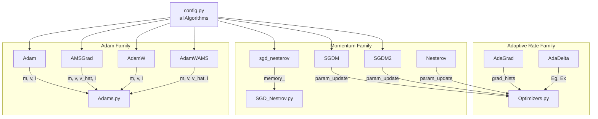

---
slug:17-optimizer-implementations
blog_type:normal
---

本项目在三个模块中实现了**七种基于梯度的优化算法**，所有算法均构建于 Theano 符号计算框架之上。每个优化器都会生成一组 `(shared_variable, new_value)` 更新对，供 `theano.function()` 消费，从而实现与距离预测 ResNet 训练循环的无缝集成。这些实现涵盖了三大算法族——**自适应学习率**（AdaGrad、AdaDelta）、**动量加速 SGD**（SGDM、SGDM2、Nesterov）和 **Adam 变体**（Adam、AMSGrad、AdamW、AdamWAMS）。[config.py](config.py#L43) 中的注册表定义了全部可选算法集合：`['SGDM', 'SGDM2', 'Adam', 'SGNA', 'AdamW', 'AdamWAMS', 'AMSGrad']`。

## 优化器架构概述

下图将每个优化器映射到其源模块、算法族及其在迭代间维护的共享状态。这些状态——累计梯度、动量缓冲区或指数移动平均——正是区分各方法在距离矩阵预测具有大量鞍点的损失空间上收敛行为的关键。

来源：[Optimizers.py](Optimizers.py#L1-L213), [Adams.py](Adams.py#L1-L176), [SGD_Nestrov.py](SGD_Nestrov.py#L1-L16), [config.py](config.py#L43)

## 自适应学习率优化器

### AdaGrad

AdaGrad 为每个参数累加平方梯度历史，从而生成与过往梯度幅度平方根成反比缩减的逐参数学习率。这使其对**稀疏特征**非常有效——罕见但信息量丰富的梯度方向会获得更大的有效步长。该实现将 `grad_hists` 存储为 Theano 共享变量列表，每个参数形状对应一个，初始化为零。

更新规则为：`param_new = param - γ / √(grad_hist + ε) · grad`，其中 `grad_hist` 在每步累加 `grad²`。其关键后果是学习率**单调递减**——分母只会不断增大——这使得 AdaGrad 在长周期训练中趋于保守，但在陡峭维度上能有效防止过冲。该函数返回 `(updates, grad_hists)`，暴露梯度历史以便进行潜在检查或断点保存。

| 参数 | 默认值 | 作用 |
|-----------|---------|------|
| `gamma` | 0.1 | 全局学习率分子 |
| `epsilon` | 0.0001 | 数值稳定性常数 |

来源：[Optimizers.py](Optimizers.py#L88-L116)

### AdaDelta

AdaDelta 通过将完整的梯度累加器替换为平方梯度（`Eg`）和平方参数更新（`Ex`）的**指数运行平均**，解决了 AdaGrad 学习率衰减过激的问题。这将逐参数学习率与总训练步数解耦，使其能够从早期的大梯度中**恢复**——这在梯度幅度在各层间差异巨大的深度 ResNet 训练中是一个显著优势。

参数更新计算公式为：`Δx = -√(Ex + ε) / √(Eg_new + ε) · grad`，其中两个运行平均均使用衰减因子 `ρ`（通常为 0.95）。`Ex` 累加器跟踪平方更新本身，从而产生**单位一致**的步长，免除了指定全局学习率的必要。该函数仅返回 `updates`，将 `egs_updates`、`exs_updates` 和 `param_updates` 合并为一个单一扁平列表。

| 参数 | 默认值 | 作用 |
|-----------|---------|------|
| `rho` | 0.95 | 运行平均的衰减因子 |
| `epsilon` | 0.00001 | 数值稳定性常数 |

来源：[Optimizers.py](Optimizers.py#L40-L81)

## 动量加速 SGD 优化器

### SGDM — 指数移动平均动量

`SGDM` 实现了经典的动量公式，其中**速度缓冲区**（`param_update`）维护了过去梯度的指数移动平均。速度更新为 `v_new = μ · v + (1 - μ) · grad`，参数更新为 `param_new = param - lr · v_new`。对传入梯度施加的 `(1 - μ)` 缩放确保了无论动量值如何，速度都具有**一致的幅度**，这不同于省略该因子的更常见公式。

这种缩放约定意味着收敛时的有效学习率近似为 `lr`，而与 `μ` 无关，从而简化了超参数调优。该函数返回 `(updates, param_updates)`，其中 `param_updates` 包含有状态断点保存所需的速度共享变量。

来源：[Optimizers.py](Optimizers.py#L130-L161)

### SGDM2 — 标准动量公式

`SGDM2` 采用了深度学习文献中的**主流约定**：`v_new = μ · v - lr · grad`，`param_new = param + v_new`。在此公式中，完整的学习率在梯度进入速度缓冲区之前对其缩放，因此有效步长同时随 `lr` 和动量累加因子 `1/(1-μ)` 缩放。该公式对 `lr` 和 `μ` 之间的交互更敏感，但与已发布的基准设置一致，使得复现论文结果更加容易。

| 优化器 | 速度更新 | 参数更新 | 稳态有效学习率 |
|-----------|----------------|--------------|------------------------------|
| SGDM | `μ·v + (1-μ)·g` | `p - lr·v` | ≈ `lr` |
| SGDM2 | `μ·v - lr·g` | `p + v` | ≈ `lr / (1-μ)` |

来源：[Optimizers.py](Optimizers.py#L164-L195)

### Nesterov — Nesterov 加速梯度 (Optimizers.py)

Optimizers.py 中的 `Nesterov` 函数实现了**前瞻梯度**原理：梯度在按动量项偏移的位置处求值，在正式提交更新前有效地“向前看”。该实现将 Nesterov 更新展开为两步——首先计算速度 `update = μ · v - lr · grad`，然后计算**校正后的参数步长** `update2 = μ² · v - (1+μ) · lr · grad`。第二项施加了动量校正，使得 Nesterov 在凸函数上理论上能达到 O(1/k²) 的收敛速度，而标准动量仅为 O(1/k)。

<CgxTip>两步展开 `update2 = μ²·v - μ·lr·grad - lr·grad` 避免了在前瞻位置显式计算梯度，因为那将需要额外的前向传播。相反，它在数学上将 Nesterov 更新重新排列为仅使用当前梯度的表达式——这就是 Sutskever 等人 (2013) 的重构公式。</CgxTip>

来源：[Optimizers.py](Optimizers.py#L198-L213)

### sgd_nesterov — 基于类的 Nesterov (SGD_Nestrov.py)

第二个 Nesterov 实现以**类**的形式存在于 `SGD_Nestrov.py` 中，遵循面向对象模式：在 `__init__` 中分配动量内存，并由 `updates()` 方法计算参数更新。该类使用了相同的 Sutskever 重构公式：`update = μ · memory - lr · grad` 和 `update2 = μ² · memory - (1+μ) · lr · grad`。基于类的设计允许优化器实例在训练会话间持久化，`self.memory_` 在跨调用期间维护速度状态。

来源：[SGD_Nestrov.py](SGD_Nestrov.py#L1-L16)

## Adam 族优化器

所有 Adam 族实现均位于 [Adams.py](Adams.py#L1-L176) 中，衍生自 **Alec Radford 的 MIT 许可参考实现**。它们共享一个通用结构：时间步计数器 `i`、一阶矩缓冲区 `m` 和二阶矩缓冲区 `v`，并使用**偏差校正后**的学习率 `lr_t = lr · √(1 - β₂^t) / (1 - β₁^t)`。所有函数均返回 `(updates, other_params)`，其中 `other_params` 包含用于断点保存的优化器状态变量。

### Adam

基准 Adam 优化器维护梯度（`m`，偏差由 `β₁` 控制）和平方梯度（`v`，偏差由 `β₂` 控制）的指数移动平均。`lr_t` 中的偏差校正补偿了零初始化的影响，确保早期的训练步长不会人为偏小。参数更新公式为 `p_new = p - lr_t · m_t / (√v_t + ε)`。

| 参数 | 默认值 | 作用 |
|-----------|---------|------|
| `lr` | 0.0002 | 基础学习率 |
| `b1` | 0.1 | 一阶矩衰减率（梯度 EMA） |
| `b2` | 0.001 | 二阶矩衰减率（平方梯度 EMA） |
| `e` | 1e-8 | 数值稳定性常数 |

<CgxTip>默认的 `b1=0.1` 和 `b2=0.001` 与标准 Adam 的默认值 0.9 和 0.999 存在显著差异。这些值为**近期的梯度赋予了更大的权重**（平滑作用更弱），这是针对本项目每个学习率调度下训练周期相对较少的训练机制而刻意设置的——参见 config.py 中的 `numEpochs = [19, 2]`。</CgxTip>

来源：[Adams.py](Adams.py#L30-L58), [config.py](config.py#L195-L196)

### AMSGrad

`AMSGrad` 通过维护二阶矩的运行最大值：`v̂_t = max(v̂_{t-1}, v_t)`，解决了 Adam 的**非收敛**问题。这保证了自适应学习率非递增，恢复了 Adam 可能违背的理论收敛保证。该实现为每个参数增加了第三个共享变量 `v_hat`，与标准 Adam 相比增加了约 33% 的内存，但免除了在鞍点损失空间中为避免发散而调整 β₂ 的需要。

来源：[Adams.py](Adams.py#L60-L93)

### AdamW — 解耦权重衰减的 Adam

`AdamW` 将 **L2 正则化作为解耦权重衰减**实现，而非将其加到梯度中。关键更新为 `p_new = p - lr_t · g_t - lr · l2reg · d`，其中 `d` 是来自 `pdecay` 的逐参数衰减掩码。当 `pdecay` 为 `None` 时，权重衰减统一应用于所有参数；否则，`pdecay` 中的每个元素要么为 0（不衰减，通常用于偏置参数），要么与参数形状匹配（对权重矩阵完全衰减）。这种解耦防止了自适应学习率与正则化项相互作用——这是一个关键优势，因为 Adam 的逐参数缩放否则会导致具有大梯度的参数**正则化不足**。

来源：[Adams.py](Adams.py#L96-L131)

### AdamWAMS — AdamW + AMSGrad 混合体

`AdamWAMS` 结合了 AdamW 的解耦权重衰减与 AMSGrad 的最大二阶矩跟踪。它维护全部四个状态变量（`m`、`v`、`v_hat`、`i`）并应用 `lr · l2reg · d` 权重衰减。这是代码库中**最保守的** Adam 变体：它保证了非递增的自适应学习率*且*正确解耦的正则化，代价是每个参数占用最高的内存开销。

来源：[Adams.py](Adams.py#L134-L174)

## 优化器选择与默认配置

[config.py](config.py#L43) 中的优化器注册表枚举了全部七种可选算法：`['SGDM', 'SGDM2', 'Adam', 'SGNA', 'AdamW', 'AdamWAMS', 'AMSGrad']`。默认模型规范设置 `algorithm = 'Adam'`，并采用两阶段学习率调度：跨 `numEpochs = [19, 2]` 应用 `lrs = [0.0002, 0.00002]`。算法字符串还会以紧凑格式（如 `'Adam:21+0.00022'`）编码至 `algStr` 中用于断点文件命名，其中编码了总周期数和基础学习率。

| 算法 | 模块 | 每参数状态 | 默认适用场景 |
|-----------|--------|-----------------|------------------|
| `SGDM` | Optimizers.py | 1 (velocity) | 基准动量 SGD |
| `SGDM2` | Optimizers.py | 1 (velocity) | 复现文献的动量 SGD |
| `SGNA` | SGD_Nestrov.py | 1 (memory) | Nesterov 加速 SGD |
| `Adam` | Adams.py | 2 (m, v) + counter | **默认** — 主训练 |
| `AdamW` | Adams.py | 2 (m, v) + counter | 带 L2 正则化的训练 |
| `AMSGrad` | Adams.py | 3 (m, v, v̂) + counter | 防止非收敛的训练 |
| `AdamWAMS` | Adams.py | 3 (m, v, v̂) + counter | 保守正则化训练 |
| AdaGrad | Optimizers.py | 1 (grad_hist) | 遗留 — 稀疏特征场景 |
| AdaDelta | Optimizers.py | 2 (Eg, Ex) | 遗留 — 单位一致的自适应学习率 |

来源：[config.py](config.py#L43-L46), [config.py](config.py#L194-L202)

## 仿真与测试框架

Optimizers.py 中的 `testGDVariants()` 函数提供了 AdaDelta、AdaGrad 和恒定学习率 GD 在鞍点函数 `f(x, y) = x² - y²` 上的**视觉对比**。选择此函数的原因在于，其原点处的鞍点创造了一个梯度沿某一坐标轴*背离*最优解的区域，使其成为自适应方法的典型测试用例。仿真将每个优化器运行 100 个周期（或在容差为 0.001 时收敛），并在 ±10 的方形域上绘制轨迹，从而可视化检视每种方法如何穿越鞍点几何结构。

来源：[Optimizers.py](Optimizers.py#L225-L290)

## 后续步骤

在优化器机制确立之后，[配置参考](16-configuration-reference)页面详细说明了 `algorithm`、`lrs` 和 `numEpochs` 如何与完整的模型规范字典交互。关于这些优化器所训练的网络架构，请参阅[膨胀 ResNet 设计](5-dilated-resnet-design)和[带掩码的 2D 卷积](6-2d-convolution-with-masking)。