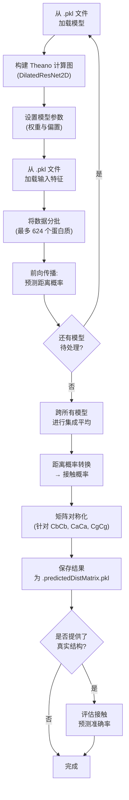

---
slug:2-quick-start
blog_type:normal
---


在 10 分钟内跑通蛋白质距离预测流程。本指南将带你安装依赖项、获取所需的数据和模型，并执行你的首次推理——从预处理过的蛋白质特征中生成预测的距离矩阵和接触图。

## 前提条件

本项目是基于符号深度学习框架 **Theano** 的 **Python 3** 实现。在运行推理之前，请确保你的环境满足以下依赖项：

| 依赖项 | 用途 | 安装命令 |
|---|---|---|
| Python 3.x | 运行时 | 系统包管理器 |
| Theano | 符号张量编译与 GPU 后端 | `pip install theano` |
| NumPy | 数值数组操作 | `pip install numpy` |
| SciPy | 统计分布（接触图转换） | `pip install scipy` |

<CgxTip>Theano 需要 C 编译器（例如 `gcc`）来生成优化代码。若无此编译器，推理将回退至纯 Python 模式运行，速度会**显著**变慢。在 Ubuntu/Debian 上，可通过 `sudo apt-get install build-essential` 进行安装。</CgxTip>

核心推理入口 [`run_distance_predictor.py`](run_distance_predictor.py) 导入了 Theano、NumPy、SciPy 以及若干项目模块。若仅用于推理，除上表所列外无需安装其他额外包。

来源: [run_distance_predictor.py](run_distance_predictor.py#L1-L21), [config.py](config.py#L1-L3)

## 获取数据与模型

本仓库**不**捆绑训练数据或预训练模型权重。两者均须在使用**学术邮箱**注册后，从 RaptorX 服务器单独下载。

| 资源 | 描述 | 下载位置 |
|---|---|---|
| **接触特征** (`.pkl`) | 每个蛋白质的预处理序列特征与两两特征 | [RaptorX Download](http://raptorx.uchicago.edu/download) |
| **训练模型** (`.pkl`) | 序列化的 Dilated ResNet 参数权重 | [RaptorX Download](http://raptorx.uchicago.edu/download) |

下载完成后，请按如下结构组织你的工作目录：

```
DL4DistancePrediction2/           ← 仓库根目录（工作目录）
├── data/
│   └── 76CAMEO.2015.contactFeatures.pkl    ← 输入特征文件
├── models/
│   ├── RXContact-DeepMode11410.pkl          ← 预训练模型 1
│   └── RXContact-DeepModel10820.pkl         ← 预训练模型 2
├── result/
│   └── 76CAMEO.2015/                        ← 输出保存文件夹
├── run_distance_predictor.py
├── config.py
└── ...                                      ← 其他项目模块
```

本项目提供了两个预训练的 2D Dilated ResNet 模型：**RXContact-DeepMode11410** 和 **RXContact-DeepModel10820**。将两者组合作为集成模型使用，通常比单独使用任一模型能获得更好的准确率，因为最终预测结果是通过对所有模型的输出概率矩阵求**平均**计算得出的。

来源: [Readme.md](Readme.md#L15-L28), [run_distance_predictor.py](run_distance_predictor.py#L149-L161)

## 运行推理

在数据与模型就绪后，于仓库根目录执行预测脚本：

```console
python run_distance_predictor.py -p data/76CAMEO.2015.contactFeatures.pkl -m models/RXContact-DeepMode11410.pkl -d result/76CAMEO.2015
```

完整的命令行接口支持四个参数：

| 参数 | 标志 | 是否必选 | 描述 |
|---|---|---|---|
| `--predictFile` | `-p` | **是** | 一个或多个输入特征文件 (`.pkl`)，以分号分隔 |
| `--model` | `-m` | **是** | 一个或多个模型文件 (`.pkl`)，以分号分隔 |
| `--saveFolder` | `-d` | 否 | 输出文件目录（默认：`./result`） |
| `--nativeFolder` | `-g` | 否 | 真实结构文件夹；若提供，则评估接触预测准确率 |

使用双模型的**集成推理**——推荐以获取最佳结果：

```console
python run_distance_predictor.py \
  -p data/76CAMEO.2015.contactFeatures.pkl \
  -m models/RXContact-DeepMode11410.pkl;models/RXContact-DeepModel10820.pkl \
  -d result/76CAMEO.2015
```

对照真实结构**评估准确率**：

```console
python run_distance_predictor.py \
  -p data/76CAMEO.2015.contactFeatures.pkl \
  -m models/RXContact-DeepMode11410.pkl \
  -d result/76CAMEO.2015 \
  -g pdb25-7952-atomDistMatrix/
```

<CgxTip>向 `-p` 或 `-m` 传入多个文件时，请使用**分号** (`;`) 作为分隔符——而非逗号或空格。该参数在内部将通过 `str.split(';')` 进行解析。</CgxTip>

来源: [run_distance_predictor.py](run_distance_predictor.py#L245-L315), [Readme.md](Readme.md#L33-L52)

## 推理过程中发生了什么

推理流程遵循从模型加载到结果序列化的确定性顺序。以下是端到端的流程：



概括而言，各步骤执行的操作如下：

1. **模型加载** — 每个 `.pkl` 模型文件被反序列化为一个字典，其中包含网络架构规范（`model['network']`）、响应配置（`model['responses']`）、学习到的参数值（`model['paramValues']`）、标签参考概率以及标签权重。
2. **计算图构建** — `Model4DistancePrediction.BuildModel()` 根据模型的网络类型（`ResNet2D`、`ResNet2DV21`、`ResNet2DV22`、`ResNet2DV23` 或 `DilatedResNet2D` 之一）构建符号化的 Theano 计算图。随后，训练所得的参数值将被绑定到共享变量上。
3. **特征加载** — `DataProcessor.LoadDistanceFeatures()` 读取输入的 `.pkl` 文件，将序列特征（独热编码、PSSM、二级结构、溶剂可及性）和两两特征（共进化、位置、立方根分离）组装为张量。
4. **预测** — 数据被分批处理（每批最多 624 个蛋白质），由 Theano 编译的函数执行前向传播，生成形状为 4D 的预测距离概率参数输出张量。
5. **集成平均** — 若指定了多个模型，其预测概率矩阵将在迭代过程中被**求和**，随后**除以模型数量**，从而生成最终的平均预测结果。
6. **距离到接触的转换** — 对于离散标签类型，接触概率通过对低于 8Å 接触阈值的概率区间求和来计算。对于 Normal/LogNormal 标签，拟合分布在 8Å 处的累积分布函数（CDF）即为接触概率。
7. **对称化** — 对称原子对类型（CbCb、CaCa、CgCg、Beta）的预测矩阵与其转置矩阵求平均，以强制满足物理对称性。
8. **序列化** — 结果以元组形式通过 pickle 保存（参见下文输出格式）。

来源: [run_distance_predictor.py](run_distance_predictor.py#L24-L242), [Model4DistancePrediction.py](Model4DistancePrediction.py#L1-L22), [DataProcessor.py](DataProcessor.py#L109-L298), [config.py](config.py#L16-L16)

## 输出格式

对于每个输入蛋白质，保存文件夹中将生成一个名为 `{proteinName}.predictedDistMatrix.pkl` 的文件。该文件包含一个**含有 6 个元素的 pickle 元组**：

| 索引 | 元素 | 类型 | 描述 |
|---|---|---|---|
| 0 | `name` | `str` | 蛋白质标识符（如 `2myhA`） |
| 1 | `sequence` | `str` | 氨基酸一级序列 |
| 2 | `predictedDistMatrixProb` | `dict[str, ndarray]` | 按响应分类的预测距离概率矩阵（形状：L×L×numBins） |
| 3 | `predictedContactMatrix` | `dict[str, ndarray]` | 按原子对类型分类的预测接触概率矩阵（形状：L×L） |
| 4 | `labelWeightMatrix` | `dict[str, ndarray]` | 来自所有模型的平均标签权重矩阵 |
| 5 | `labelDistributionMatrix` | `dict[str, ndarray]` | 来自所有模型的平均标签参考概率分布 |

你可以通过编程方式加载并检查结果文件：

```python
import pickle

with open('result/76CAMEO.2015/2myhA.predictedDistMatrix.pkl', 'rb') as fh:
    name, sequence, distProbs, contactProbs, labelWeights, labelDists = pickle.load(fh, encoding='latin1')

print(f"Protein: {name}, Length: {len(sequence)}")
print(f"Contact probability matrix shape: {contactProbs['CbCb'].shape}")
```

`result/76CAMEO.2015/` 中现有的样本输出（`2myhA.predictedDistMatrix.pkl` 和 `2mz0A.predictedDistMatrix.pkl`）是由 76CAMEO.2015 基准测试集生成的。

来源: [run_distance_predictor.py](run_distance_predictor.py#L226-L242), [Readme.md](Readme.md#L54-L58)

## 故障排除

| 症状 | 原因 | 解决方案 |
|---|---|---|
| `ImportError: No module named 'theano'` | 未安装 Theano | `pip install theano` |
| `FATAL ERROR: the model type...is not compatible` | 模型文件与代码中的网络架构不匹配 | 确保使用与此代码版本配套的正确模型文件 |
| `Input feature file does not exist` | `-p` 路径错误 | 使用绝对路径，或验证相对于工作目录的相对路径 |
| `Unsupported network architecture` | 模型指定了未知的网络类型 | 检查 `config.allNetworks` 获取支持的值：`ResNet2D`、`ResNet2DV21`、`ResNet2DV22`、`ResNet2DV23`、`DilatedResNet2D` |
| `WARNING: at least two models have different label types` | 集成模型的目标标签类型不兼容 | 使用以相同响应配置训练的模型 |
| 推理速度极慢 | Theano 回退至 Python 模式 | 安装 C 编译器并确保 Theano 能够使用它 (`python -c "import theano; print(theano.config.cxx)"`) |

来源: [run_distance_predictor.py](run_distance_predictor.py#L57-L75), [run_distance_predictor.py](run_distance_predictor.py#L274-L293), [config.py](config.py#L16-L16)

## 后续步骤

既然你已能端到端地运行推理，接下来可以深入探索其内部机制：

1. **[数据准备](3-data-preparation)** — 了解输入特征 `.pkl` 文件的结构及必需的键
2. **[架构概览](4-architecture-overview)** — 深入了解 Dilated ResNet 设计，以及一维序列特征如何转化为二维距离预测
3. **[配置参考](16-configuration-reference)** — 学习用于自定义实验的模型规范、标签类型及权重配置