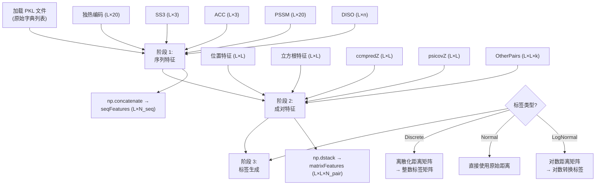

---
slug:3-data-preparation
blog_type:normal
---


数据准备是基础阶段，它将原始蛋白质特征文件转换为二维扩张残差网络（2D Dilated ResNet）在训练和推理过程中消耗的结构化张量。该流程跨越三个层次——**原始特征 I/O**（`ReadProteinFeatures.py`）、**特征组装与标签离散化**（`DataProcessor.py`）以及**带填充与掩码的批次构建**——所有层次均由 `config.py` 中的集中配置模式统一管控。在运行系统或使用新特征类型扩展系统之前，理解此数据流至关重要。

来源：[DataProcessor.py](/DataProcessor.py#L1-L18), [ReadProteinFeatures.py](/ReadProteinFeatures.py#L1-L10), [config.py](/config.py#L1-L10)

## 特征源文件与格式

每个蛋白质由一组单文件特征表示，这些特征存储在名为 `feat_<proteinName>_contact/` 的目录下。`ReadProteinFeatures.py` 中的 `ReadFeatures` 函数读取单个蛋白质的所有这些文件，并返回以特征名为键的字典。下表总结了每个输入文件、其预期后缀、其填充的字典键及其维度。

| 文件后缀 | 字典键 | 维度 | 描述 |
|---|---|---|---|
| `.seq` | `sequence` | L (字符串) | 主氨基酸序列 |
| `.ss3` | `SS3` | L × 3 | 3 态二级结构概率（螺旋、折叠、卷曲） |
| `.acc` | `ACC` | L × 3 | 溶剂可及性概率 |
| `.diso` | `DISO` | L × *n* | 无序预测概率 |
| `.tgt` | `PSSM`, `PSFM`, `SS8` | L × 20, L × 20, L × 8 | 位置特异性得分矩阵、频率矩阵、8 态 SS |
| `.ccmpred_zscore` | `ccmpredZ` | L × L | CCMpred Z 标准化进化耦合矩阵 |
| `.psicov_zscore` | `psicovZ` | L × L | PSICOV Z 标准化耦合矩阵 |
| `.pot` | `OtherPairs` | L × L × *k* | 互信息 + 接触势（稀疏格式） |

每个加载函数通过检查 NaN 值并针对主序列断言序列长度一致性来验证数据。从 `.pot` 文件加载的成对特征以稀疏 `(i, j, values)` 格式存储，并立即扩展为对称的 L × L × k 密集矩阵。

来源：[ReadProteinFeatures.py](/ReadProteinFeatures.py#L196-L248), [ReadProteinFeatures.py](/ReadProteinFeatures.py#L139-L193), [ReadProteinFeatures.py](/ReadProteinFeatures.py#L15-L84)

## 原始特征加载工作流

原始特征加载的入口点是两个具有不同作用域的脚本：

**`ReadProteinFeatures.py`**（批量模式）——从文本文件中读取蛋白质列表，遍历每个蛋白质的特征目录，并将所有结果序列化为单个 `.distanceFeatures.pkl` 文件：

```
python ReadProteinFeatures.py proteinListFile featureMetaFolder
```

输出的 PKL 文件命名为 `<listFileBasename>.<folderName>.<pid>.distanceFeatures.pkl`，包含一个由单蛋白质特征字典组成的 Python 列表。

**`ReadOneProteinFeatures.py`**（单蛋白质模式）——为单个蛋白质加载一个或多个特征目录，并将它们连接成一个列表，从而支持来自独立来源的特征集成：

```
python ReadOneProteinFeatures.py proteinName featureFolder1 featureFolder2 ...
```

两个脚本都委托给 `ReadFeatures()`，该函数返回一个包含键 `name`、`sequence`、`SS3`、`ACC`、`DISO`、`PSSM`、`PSFM`、`SS8`、`ccmpredZ`、`psicovZ` 和 `OtherPairs` 的字典。**关键的是，这些脚本不加载真实距离矩阵**——那些是在训练期间通过由实用代码添加的 `atomDistMatrix` 条目单独加载的。

来源：[ReadProteinFeatures.py](/ReadProteinFeatures.py#L259-L302), [ReadOneProteinFeatures.py](/ReadOneProteinFeatures.py#L18-L44)

## 特征组装：`LoadDistanceFeatures`

`DataProcessor.py` 中的 `LoadDistanceFeatures` 函数是核心编排器，它将原始的单蛋白质字典转换为模型可消费的格式。它接受一个 PKL 特征文件列表和一个 `modelSpecs` 配置字典，并返回一个处理后的蛋白质字典列表。该转换通过三个连续阶段进行：



### 阶段 1 —— 序列特征组装

主序列首先通过 `config.SeqOneHotEncoding` 转换为**独热编码**（L × 20）。其他序列特征根据 `modelSpecs` 标志有条件地拼接：

| 标志 | 添加的特征 | 条件 |
|---|---|---|
| `UseSS` | `SS3` (L × 3) | 必须为 `True` |
| `UseACC` | `ACC` (L × 3) | 必须为 `True` |
| `UsePSSM` | `PSSM` (L × 20) | 必须为 `True` |
| `UseDisorder` | `DISO` | 必须为 `True` |
| `UseMPSpecificFeatures` | `MemAcc`, `MemTopo` | 膜蛋白模式 |
| `UseTemplate` | `tplSimScore` (L × 11) | 同源建模模式 |

如果启用了嵌入（`modelSpecs['seq2matrixMode']` 中的 `SeqOnly` 或 `Seq+SS`），还会计算一个 `embedFeatures` 键——它可以是原始的独热编码，也可以是独热编码与 `SS3` 的逐行外积。

来源：[DataProcessor.py](/DataProcessor.py#L109-L178), [config.py](/config.py#L314-L326)

### 阶段 2 —— 成对特征组装

成对特征捕捉残基-残基相互作用，并通过 `np.dstack` 组装成 L × L × N_pair 张量。始终包含两个**几何衍生特征**：

**位置特征**——计算归一化的序列分离度：`posFeature[i,j] = min(1, |i−j| / 30)`。对于序列位置间隔 30 及以上的残基对，该值饱和为 1.0，为网络提供显式的序列内距离信号。

**立方根特征**——计算绝对序列分离度的立方根：`cbrt(|i−j|)`。立方根与蛋白质的物理半径相关（体积与距离的三次方成正比），提供了一种具有几何动机的表示。

其他成对特征有条件地附加：

| 标志 | 特征 | 每个切片的形状 |
|---|---|---|
| `UseCCM` | `ccmpredZ` | L × L |
| `UsePSICOV` | `psicovZ` | L × L |
| `UseOtherPairs` | `OtherPairs` | L × L × k |
| `UsePriorDistancePotential` | 先验距离势 | L × L × k |
| `UseTemplate` | 模板强度矩阵 | L × L (按原子对类型) |

当模板特征处于激活状态时，会为每种原子对类型计算一个**强度矩阵**：`strength = 3.5 / max(tplDist, 3.5)`，无效条目（缺口）设置为 `3.5 / 50`。同时还会附加一个指示无效位置的二元标志矩阵。模板特征遵循固定的排序顺序（CbCb → CgCg → CaCg → CaCa → NO），以确保键的迭代具有确定性。

来源：[DataProcessor.py](/DataProcessor.py#L180-L246), [DataProcessor.py](/DataProcessor.py#L58-L84)

### 阶段 3 —— 标签生成

如果原始数据包含 `atomDistMatrix`（真实值），则会为 `modelSpecs['responses']` 中指定的每个响应生成标签。每个响应的格式为 `<atomPairType>_<labelType>`（例如，`CbCb_Discrete25C`）：

- **离散标签**——使用 `DistanceUtils.DiscretizeDistMatrix` 和 `config.distCutoffs` 中定义的距离截断值，将连续距离矩阵离散化为整数分箱。例如，`25C` 使用从 4.5Å 到 16.0Å 的 24 个等距分箱。当存在 `Plus` 后缀（例如，`25CPlus`）时，无效距离（−1）被分离到自己的分箱中；否则，它们将与最大距离分箱合并。
- **正态标签**——原始距离值直接用作回归目标。
- **对数正态标签**——距离通过 `DistanceUtils.LogDistMatrix` 进行对数转换，在取对数之前，小于 1/e 的值被截断为 1/e。

对于 **HB**（氢键）和 **Beta**（β 配对）响应，距离矩阵直接用作二元标签而无需离散化，因为它们本质上是二元矩阵。

来源：[DataProcessor.py](/DataProcessor.py#L252-L289), [DistanceUtils.py](/DistanceUtils.py#L154-L174), [config.py](/config.py#L62-L86)

## 距离离散化方案

离散化方案是分类输出头的核心。下表展示了 `config.py` 中定义的所有可用分箱配置：

| 标签类型 | 分箱数 | 范围 | 间距 | Plus 变体 |
|---|---|---|---|---|
| `52C` | 52 | 4.0–16.5 Å | 均匀 | — |
| `36C` | 36 | 4.15–16.4 Å | 均匀 | — |
| `34C` | 34 | 4.0–20.0 Å | 均匀 | ✓ (无效距离被分离) |
| `25C` | 25 | 4.5–16.0 Å | 均匀 | ✓ |
| `14C` | 14 | 4–16 Å | 1 Å | ✓ |
| `13C` | 13 | 5–16 Å | 1 Å | ✓ |
| `12C` | 12 | 5–15 Å | 1 Å | ✓ |
| `3C` | 3 | [0–8, 8–15, >15] Å | — | ✓ |
| `2C` | 2 | [0–8, >8] Å | — | ✓ |

`Plus` 后缀变体为无效距离（在原生距离矩阵中表示为 −1）分配了一个额外的分箱，使输出类别的总数增加一。`config.py` 中的 `responseProbDims` 字典会自动计算每种标签类型的概率参数数量，这决定了网络分类头的输出维度。

<CgxTip>在选择离散化方案时，更细的分箱（例如 52C）能提供更高的距离分辨率，但需要更多的输出神经元和更多的训练数据来学习。25C 方案提供了实用的平衡，并且是 `InitializeModelSpecs` 中的默认选项。</CgxTip>

来源：[config.py](/config.py#L62-L86), [config.py](/config.py#L116-L138), [DistanceUtils.py](/DistanceUtils.py#L154-L168)

## 标签加权与范围感知损失

距离预测面临严重的**类别不平衡**：大多数残基对相距甚远（>15Å），而短程接触虽然罕见却至关重要。系统通过由 `CalcLabelDistributionAndWeight` 计算的两级加权方案来解决此问题。

### 基于范围的加权

残基对根据序列分离度 |i−j| 被划分为四个范围：

| 范围 | 分离度 | 默认权重 |
|---|---|---|
| 长程 | ≥ 24 | 3.0 |
| 中程 | 12–23 | 2.5 |
| 短程 | 6–11 | 1.0 |
| 近程 | 2–5 | 0.5 |

### 距离区间加权

在每个范围内，标签会根据距离区间进一步加权。对于离散标签，系统首先使用 `weight43C` 查找表为粗略的 3 分箱划分（0–8Å, 8–15Å, >15Å）建立权重，然后通过 `DistanceUtils.CalcLabelWeight` 将这些权重传播到更细的分箱。此传播使用训练数据中的参考标签分布（`refProb`）来计算逆频率权重，从而均衡每个分箱的有效贡献：

```
weight[bin] = weight3C[interval] × avgProb[interval] / refProb[bin]
```

这确保了代表性不足的短距离分箱获得成比例的更高权重，从而抵消了接触概率随距离的指数衰减。

<CgxTip>`modelSpecs` 中的 `LRbias` 参数控制长程接触强调的激进程度。可用的预设值为 `low`、`mid`、`high`、`veryhigh` 和 `exhigh`，默认值为 `mid`。较高的值会显著增加接触的权重，但这以牺牲非接触准确率为代价。</CgxTip>

来源：[DataProcessor.py](/DataProcessor.py#L307-L392), [DistanceUtils.py](/DistanceUtils.py#L244-L259), [config.py](/config.py#L140-L167)

## 批次构建：`AssembleOneBatch` 和 `SplitData2Batches`

### 填充与掩码

由于蛋白质的长度各不相同，`AssembleOneBatch` 将批次中的所有序列填充到该批次内的**最大序列长度**。较短的蛋白质在右下方用零填充。生成两个掩码矩阵：

- **M1d**（批次 × (maxL − minL)）——指示有效位置的一维序列掩码
- **M2d**（批次 × (maxL − minL) × maxL）——指示有效残基对的二维成对掩码

这些掩码被网络消费，以防止梯度流过填充位置。

### 批次组合

`SplitData2Batches` 按序列长度（最大的在前）对蛋白质进行排序，并将它们分组成批次，其中每个批次的序列数动态计算为：

```
numSeqs = min(remaining, max(1, numDataPoints / seqLen²))
```

这确保了每个批次的总数据点数（序列 × seqLen²）保持在 `numDataPoints` 附近，平衡了不同大小蛋白质的 GPU 内存利用率。推理的默认 `numDataPoints` 为 624。

返回的批次元组具有以下结构：`[X1d, X2d, M1d, M2d, (X1dem), Y..., W...]`，其中可选元素根据配置有条件地出现。

来源：[DataProcessor.py](/DataProcessor.py#L447-L551), [run_distance_predictor.py](/run_distance_predictor.py#L80-L108)

## 端到端数据流

从原始文件到模型输入的完整数据准备流程，在推理期间由 `run_distance_predictor.py` 编排，在模型拟合期间由训练循环编排：

```mermaid
flowchart LR
    subgraph Raw["原始特征文件"]
        SEQ[".seq"] 
        SS3[".ss3"]
        ACC[".acc"]
        DISO[".diso"]
        TGT[".tgt"]
        CCM[".ccmpred_zscore"]
        PSV[".psicov_zscore"]
        POT[".pot"]
    end
    
    subgraph Read["特征加载"]
        RF["ReadFeatures()"]
    end
    
    subgraph PKL["序列化"]
        P1["*.distanceFeatures.pkl"]
    end
    
    subgraph Assembly["特征组装"]
        LDF["LoadDistanceFeatures()"]
    end
    
    subgraph Batch["分批"]
        S2B["SplitData2Batches()"]
        AOB["AssembleOneBatch()"]
    end
    
    Raw --> Read --> PKL --> Assembly --> Batch
    
    subgraph Output["模型输入张量"]
        X1d["X1d: 序列特征"]
        X2d["X2d: 矩阵特征"]
        M1d["M1d: 一维掩码"]
        M2d["M2d: 二维掩码"]
        Y["Y: 标签矩阵"]
        W["W: 权重矩阵"]
    end
    
    Batch --> Output
```



**步骤 1** —— `ReadProteinFeatures.py` 或 `ReadOneProteinFeatures.py` 读取单蛋白质特征文件，并将其序列化为 PKL 格式。

**步骤 2** —— `LoadDistanceFeatures` 反序列化 PKL 文件，基于 `modelSpecs` 标志组装序列和成对特征，并（在训练期间）通过离散化或转换真实距离矩阵来生成标签矩阵。

**步骤 3** —— `SplitData2Batches` 将蛋白质分组为大小可变的批次，`AssembleOneBatch` 对每个组进行填充、掩码和堆叠，形成最终由 Theano 编译的预测函数消费的张量元组。

来源：[run_distance_predictor.py](/run_distance_predictor.py#L80-L108), [DataProcessor.py](/DataProcessor.py#L109-L298), [DataProcessor.py](/DataProcessor.py#L522-L551)

## 所需数据获取

根据项目的 README，输入特征文件和训练好的模型必须从 RaptorX 下载门户获取（需要学术注册）。下载后的典型目录布局如下：

```
DL4DistancePrediction2/
├── data/
│   └── 76CAMEO.2015.contactFeatures.pkl    # 预处理的接触特征
├── models/
│   ├── RXContact-DeepMode11410.pkl         # 训练好的模型 1
│   └── RXContact-DeepModel10820.pkl        # 训练好的模型 2
└── result/
    └── 76CAMEO.2015/                        # 输出目录
```

PKL 特征文件是 `ReadProteinFeatures` 流程的输出，包含一组蛋白质的所有序列和成对特征，可供 `LoadDistanceFeatures` 直接消费。

来源：[Readme.md](/Readme.md#L15-L31)

---

**下一步**：现在你已经了解了原始特征如何组装成模型输入，请前往[架构概览](4-architecture-overview)查看这些张量如何流经网络，或跳转至[序列与成对特征](11-sequential-and-pairwise-features)以获取有关外拼接和中点特征转换的深入解释。