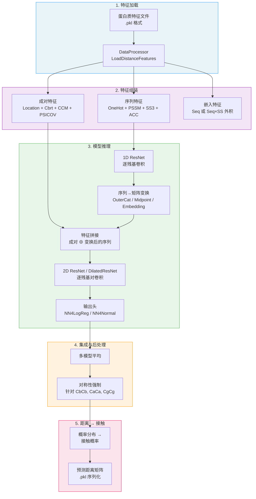
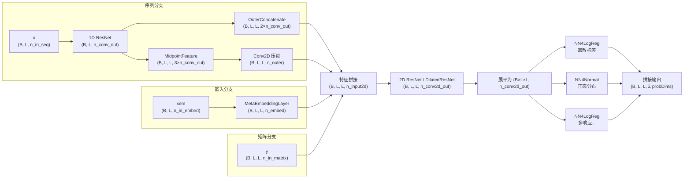

---
slug:4-architecture-overview
blog_type:normal
---


DL4DistancePrediction2 是一个用于预测蛋白质残基间距离的深度学习系统，基于 **Theano** 构建其计算后端。该架构遵循**两阶段卷积流水线**：在氨基酸序列上进行 1D 卷积，随后在残基对矩阵上进行 2D 卷积，并配备专门的输出头用于距离分类（离散区间）或距离回归（正态/对数正态分布）。整个系统的设计围绕核心洞察展开：蛋白质距离矩阵是二维对象，其中每个位置 (i, j) 表示残基 i 和 j 之间的空间距离，因此模型必须同时处理逐残基的序列特征和逐残基对的矩阵特征。

## 系统数据流

端到端流水线通过五个不同阶段将蛋白质特征文件转换为预测的距离概率矩阵。每个阶段具有明确定义的输入/输出契约，并可独立运行。



来源: [DataProcessor.py](/DataProcessor.py#L1-L200), [run_distance_predictor.py](/run_distance_predictor.py#L1-L100), [Model4DistancePrediction.py](/Model4DistancePrediction.py#L598-L680)

## 核心模型架构: ResNet4DistMatrix

**`ResNet4DistMatrix`** 类是架构的核心——一个通过统一计算图联合处理序列和成对输入的单模型。其构建完全由 `modelSpecs` 字典驱动，该字典指定了网络类型、层维度、响应变量和训练超参数。



该模型接受三个输入张量——**序列特征** `(batchSize, seqLen, n_in_seq)`、**成对特征** `(batchSize, seqLen, seqLen, n_in_matrix)`，以及可选的**嵌入特征** `(batchSize, seqLen, n_in_embed)`——加上它们各自用于可变长度蛋白质序列的掩码。所有输入均右对齐并进行零填充；掩码在每次卷积操作后将填充噪声置零。

来源: [Model4DistancePrediction.py](/Model4DistancePrediction.py#L230-L380), [Model4DistancePrediction.py](/Model4DistancePrediction.py#L620-L680)

## 双卷积阶段

该架构的显著设计在于其 **1D→2D 卷积级联**，通过可学习的变换桥接了逐残基和逐残基对的表示。

### 阶段 1: 1D 序列卷积

ResNet 或 DilatedResNet 沿蛋白质链处理序列特征。每个残差块应用具有可配置半窗口大小的 1D 卷积、可选的批归一化以及 ReLU 激活。输出是形状为 `(batchSize, seqLen, n_conv_out)` 的逐残基嵌入，用于捕获局部和长程序列上下文。

### 阶段 2: 序列到矩阵变换

1D 输出通过两种互补机制提升至二维配对空间：

| 变换 | 公式 | 输出形状 | 目的 |
|-----------|---------|-------------|---------|
| **OuterConcatenate** | `out[i,j] = concat(h[i], h[j])` | `(B, L, L, 2n)` | 捕获残基对的交互作用 |
| **MidpointFeature** | `out[i,j] = concat(h[i], h[(i+j)/2], h[j])` | `(B, L, L, 3n)` | 增加残基间的中点上下文 |

MidpointFeature 的输出通过 1×1 2D 卷积 (`halfWinSize=0`) 进行压缩以控制维度。可选的 **MetaEmbeddingLayer** 分别针对长程 (≥24)、中程 (12–24) 和短程 (6–12) 分隔学习残基对嵌入，使用特定范围的 `EmbeddingLayer` 实例通过批量张量点积计算 `W[a_i, a_j]`。

### 阶段 3: 2D 矩阵卷积

拼接后的 2D 特征图——结合了原始成对特征、变换后的序列特征和嵌入——由深度 2D ResNet 或 DilatedResNet 处理。这是模型容量的主要所在，具有 `conv2d_repeats` 个残差块和 `conv2d_hiddens` 个特征通道。扩张变体支持逐层扩张因子，以在不增加参数数量的情况下呈指数级扩展感受野。

来源: [utils.py](/utils.py#L14-L62), [EmbeddingLayer.py](/EmbeddingLayer.py#L13-L70), [Model4DistancePrediction.py](/Model4DistancePrediction.py#L275-L350)

## 残差块变体

系统实现了三种残差块设计，可通过 `network` 配置键进行选择。所有块均支持用于维度增加的**部分投影**：当 `n_out > n_in` 时，快捷路径将恒等输入与额外维度的学习 1×1 投影拼接起来。

| 块类 | 结构 | 批归一化位置 | 网络键 |
|-------------|-----------|---------------------|-------------|
| **BottleneckBlock** | 1×1 → BN → k×k → BN → 1×1 → BN | 每次卷积后 (3 个 BN 层) | `ResNet2D` |
| **ResBlockV2** | BN→ReLU → k×k → BN→ReLU → k×k | 预激活 (2 个 BN 层) | `ResNet2DV22` |
| **ResBlockV23** | ReLU → k×k → BN→ReLU → k×k | 中间激活 (1 个 BN 层) | `ResNet2DV23` |

**BottleneckBlock** 遵循经典的 ResNet 设计：压缩至 `n_bottleneck` 个通道，应用宽卷积，然后再扩展回去。**ResBlockV2** 使用完全预激活 (卷积前 BN→ReLU)。**ResBlockV23** 是推荐变体——它移除了 V2 中冗余的首个批归一化层，在保持准确度的同时减少了参数数量。扩张变体 (`DilatedResNet2D`) 使用相同的块结构，但在其 2D 卷积层上设置了 `filter_dilation=(d, d)`。

<CgxTip>推荐使用 `ResNet2DV23` 网络变体而非 `ResNet2D` 和 `ResNet2DV22`——它通过消除块入口处未使用的批归一化层，以更少的参数实现了相当的准确度。`DilatedResNet2D` 中的扩张参数通过 modelSpecs 中的 `conv2d_dilations` 逐层指定，从而实现感受野的指数级增长。</CgxTip>

来源: [ResNet4Distance.py](/ResNet4Distance.py#L356-L598), [DilatedResNet4Distance.py](/DilatedResNet4Distance.py#L356-L598)

## 可变长度蛋白质的掩码系统

由于蛋白质长度不同，但 Theano 要求固定大小的张量，因此批次中的所有序列均**右对齐并进行零填充**至最大长度。二进制掩码系统可防止填充零污染计算：

- **1D 掩码** `(batchSize, #padded_cols)`：在每次 1D 卷积后应用，将最左侧的填充位置与掩码相乘，将其重置为零
- **2D 掩码** `(batchSize, #padded_rows, seqLen)`：在每次 2D 卷积后沿水平（顶部行）和垂直（左侧列）方向独立应用，因为填充出现在右下对齐矩阵的左上角

自定义 `batch_norm` 函数同样遵循掩码——它通过**将掩码位置排除**在求和之外来计算均值和方差，防止填充零使归一化统计产生偏差。当批次中蛋白质长度差异显著时，这对于批归一化的正确性至关重要。

来源: [ResNet4Distance.py](/ResNet4Distance.py#L175-L250), [DilatedResNet4Distance.py](/DilatedResNet4Distance.py#L175-L250)

## 输出头: 多响应预测

2D 卷积输出按位置展平后送入独立的输出头，每个响应变量对应一个输出头。**响应**被指定为 `{atomPair}_{labelType}`（例如 `CbCb_Discrete25C`、`CaCa_Normal`），每个头在其标签空间上预测概率分布。

| 输出头 | 类 | 标签类型 | 输出维度 | 损失函数 |
|-------------|-------|-------------|-------------------|---------------|
| **分类** | `NN4LogReg` | `Discrete*` (2C, 3C, 12C, 13C, 14C, 25C, 34C, 52C) | 距离区间数 | 加权负对数似然 (softmax) |
| **回归** | `NN4Normal` | `Normal`, `LogNormal` | 1 (仅均值) 或 2 (均值 + 方差) | 高斯负对数似然 |

两个头均支持在展平的卷积输出与最终预测层之间设置可选的隐藏层 (`logreg_hiddens`)。对于 `NN4Normal`，方差被参数化为 `ReLU(hidden) + σ²_min` 以保证正定性，双变量变体则使用 `tanh × ρ_max` 增加一个相关性头。多个响应的所有输出沿最后维度拼接，以实现高效的批量计算。

来源: [NN4LogReg.py](/NN4LogReg.py#L90-L175), [NN4Normal.py](/NN4Normal.py#L80-L200), [Model4DistancePrediction.py](/Model4DistancePrediction.py#L350-L395)

## 配置驱动的架构选择

整个模型拓扑通过 `modelSpecs` 字典指定，无需更改代码即可进行架构搜索。主要配置字段及其架构作用：

| 配置键 | 作用 | 示例值 |
|------------|------|----------------|
| `network` | ResNet 变体选择 | `ResNet2DV23`, `DilatedResNet2D` |
| `conv1d_hiddens` | 1D ResNet 通道宽度 | `[64, 64]` |
| `conv1d_repeats` | 1D 残差块数量 | `3` |
| `conv2d_hiddens` | 2D ResNet 通道宽度 | `[64, 64, 64, 64]` |
| `conv2d_repeats` | 2D 残差块数量 | `10` |
| `conv2d_hwszs` | 每个块的 2D 半窗口大小 | `[3, 3, 3, ...]` |
| `conv2d_dilations` | 每个块的扩张因子 | `[1, 2, 4, 8, ...]` |
| `seq2matrixMode` | 序列→矩阵变换模式 | `OuterCat`, `Seq+SS`, `SeqOnly` |
| `responses` | 预测目标 | `['CbCb_Discrete25C']` |
| `logreg_hiddens` | 输出头隐藏层 | `[]` 或 `[256]` |
| `batchNorm` | 启用批归一化 | `True` / `False` |
| `activation` | 非线性激活 | `T.nnet.relu` |

`BuildModel` 函数根据这些规格构建 Theano 计算图，返回模型以及输入变量 `(x, y, xmask, ymask, xem)` 和用于训练的标签/权重变量。对于推理 (`forTrain=False`)，标签和权重列表为空。

来源: [config.py](/config.py#L200-L270), [Model4DistancePrediction.py](/Model4DistancePrediction.py#L620-L680)

## 模块职责图

代码库围绕明确的关注点分离进行组织，每个模块负责特定的架构层：

```
DL4DistancePrediction2/
├── run_distance_predictor.py    ← 推理编排器 (集成、平均、序列化)
├── Model4DistancePrediction.py  ← 模型组装 (ResNet4DistMatrix, BuildModel)
├── DilatedResNet4Distance.py    ← 扩张 ResNet 块 + 1D/2D 扩张卷积
├── ResNet4Distance.py           ← 标准 ResNet 块 + 1D/2D 卷积
├── NN4LogReg.py                 ← 分类输出头 (softmax + NLL 损失)
├── NN4Normal.py                 ← 回归输出头 (高斯 NLL 损失)
├── EmbeddingLayer.py           ← 残基对嵌入 (范围感知 MetaEmbedding)
├── DataProcessor.py            ← 特征加载、组装、批处理
├── Conv1d.py                    ← 独立 1D 卷积层
├── config.py                    ← 架构与训练配置常量
├── utils.py                     ← OuterConcatenate, MidpointFeature, 掩码工具
├── DistanceUtils.py            ← 距离分箱、标记、接触转换
├── ContactUtils.py             ← 接触预测后处理
├── Metrics.py                   ← 评估指标
├── Optimizers.py                ← 优化器实现
└── result/                      ← 序列化的预测输出 (.pkl)
```

来源: [config.py](/config.py#L1-L50), [Model4DistancePrediction.py](/Model4DistancePrediction.py#L1-L30)

## 接下来去哪

架构概述确立了系统的结构蓝图。要深入理解每个组件，请遵循以下阅读顺序：

1. **[扩张 ResNet 设计](5-dilated-resnet-design)** — 扩张卷积如何扩展感受野，以及 BottleneckBlock/V2/V23 块内部机制
2. **[带掩码的 2D 卷积](6-2d-convolution-with-masking)** — 掩码感知卷积和批归一化的实现细节
3. **[输出头: 分类与回归](7-output-heads-classification-and-regression)** — 损失函数、标签类型分类学和多响应预测机制
4. **[序列与成对特征](11-sequential-and-pairwise-features)** — 流入 `x` 和 `y` 输入的特征是什么
5. **[外拼接与中点特征](12-outer-concatenate-and-midpoint-features)** — 1D→2D 提升变换和嵌入层设计
6. **[模型加载与集成平均](8-model-loading-and-ensemble-averaging)** — 推理如何组合多个模型并强制矩阵对称性