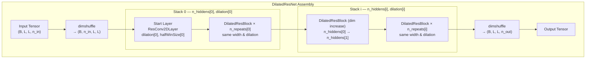
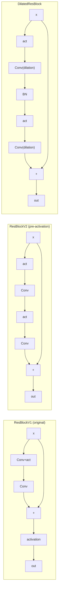

---
slug:5-dilated-resnet-design
blog_type:normal
---


膨胀 ResNet 是本仓库中用于预测残基间距离矩阵的核心神经架构。与使用固定感受野的单位步长卷积的标准 ResNet 不同，该设计引入了**膨胀（dilation）**机制——在不增加参数量或牺牲空间分辨率的前提下，呈指数级扩展感受野。其实现涵盖了四个层次结构：膨胀卷积基元、掩码感知批量归一化、膨胀残差块，以及完整的多堆叠网络组装。每一层均构建于 Theano 的符号计算图之上，并严格遵循掩码感知机制，以处理小批量中长度可变的蛋白质序列。

来源：[DilatedResNet4Distance.py](DilatedResNet4Distance.py#L1-L1122), [config.py](config.py#L16-L16)

## 架构概述

膨胀 ResNet 遵循**堆叠与重复**拓扑结构。该网络被组织为一个或多个*堆叠*，每个堆叠由一个前置块（可能会增加特征维度）以及其后跟随的若干共享相同超参数的重复块组成。每个堆叠拥有各自的 `halfWinSize` 和 `dilation` 率，从而实现一种贯穿网络深度的渐进式感受野扩展策略。



`DilatedResNet` 构造函数强制约定了几个不变量：`n_hiddens` 必须是递增序列，`len(n_hiddens) == len(n_repeats) == len(halfWinSize) == len(dilation)`，且 `n_repeats` 中的各项必须非负。起始层是一个普通卷积（而非残差块），而其后的所有块均为 `DilatedResBlock` 实例。

来源：[DilatedResNet4Distance.py](DilatedResNet4Distance.py#L935-L1021)

## 膨胀卷积基元

基础层包含两个卷积类——`ResConv1DLayer` 和 `ResConv2DLayer`——它们通过 Theano 的 `T.nnet.conv2d` 及其 `filter_dilation` 参数来实现膨胀卷积。膨胀机制的工作原理是在连续的滤波器权重之间插入 `dilation - 1` 个零，从而在保持参数量与标准卷积相同的同时，将滤波器的采样点间隔扩展至更大的区域。

### ResConv1DLayer — 膨胀一维卷积

一维卷积处理形状为 `(batchSize, n_in, seqLen)` 的张量。它将输入重塑为 `(batchSize, n_in, 1, seqLen)` 以复用 Theano 的二维卷积基元，并应用形状为 `(n_out, n_in, 1, windowSize)`、`border_mode='half'` 的滤波器以实现同_padding 输出。当 `dilation > 1` 时，传入 `filter_dilation=(1, dilation)` 元组，仅在序列维度上进行膨胀。单层的有效感受野计算公式为 `dilation × (2 × halfWinSize) + 1`。

### ResConv2DLayer — 膨胀二维卷积

二维卷积处理形状为 `(batchSize, n_in, nRows, nCols)` 的成对特征矩阵——这是距离图预测的核心表示。滤波器形状为 `(n_out, n_in, wSize, wSize)` 且 `border_mode='half'`，膨胀以 `filter_dilation=(dilation, dilation)` 的形式对称应用。这确保了在距离矩阵的两个空间维度上实现各向同性的感受野扩展。

### 权重初始化策略

卷积基元采用**激活感知初始化**方案：

| 激活函数 | 初始化方式 | 公式 |
|---|---|---|
| ReLU | He 正态分布 | `N(0, √(2 / (n_in × fan + n_out)))` |
| tanh / 其他 | Xavier 均匀分布 | `U(-√(6/(n_in × fan + n_out)), √(6/(n_in × fan + n_out)))` |
| sigmoid | Xavier 均匀分布 × 4 | 同上，随后 `W *= 4` |

其中，对于一维卷积 `fan` = `windowSize`，对于二维卷积 `fan` = `wSize × wSize`。在所有情况下，偏置均初始化为零。

<CgxTip>`border_mode='half'` 设置确保了输出的空间维度与输入维度相匹配，这对于残差连接至关重要。当使用膨胀时，Theano 的 `filter_dilation` 参数会在不改变输出尺寸的情况下对核心权重进行间隔采样——这正是使膨胀卷积能够作为标准卷积的即插即用替代品应用于残差块的原因。</CgxTip>

来源：[DilatedResNet4Distance.py](DilatedResNet4Distance.py#L6-L76), [DilatedResNet4Distance.py](DilatedResNet4Distance.py#L79-L156)

## 掩码感知批量归一化

小批量中的蛋白质序列长度各不相同。较短的序列会被零填充至与最长序列等长，并通过二值**掩码**标识填充位置。`batch_norm` 函数在计算均值和标准差时会**排除掩码项**，从而防止填充的零值破坏归一化统计量。

对于四维输入（距离矩阵），有效元素数 `x_num` 的计算方式为：掩码中的总未掩码位置数加上非掩码区域大小，再减去掩码左上角子矩阵中被重复计算的重叠部分。归一化后，掩码位置会沿水平和垂直方向重新置零，以防止噪声传播。该函数返回归一化后的输出以及可学习的 `gamma` 和 `bias` 参数。

| 输入形状 | 掩码形状 | 归一化轴 |
|---|---|---|
| `(B, C, L)` (3D) | `(B, #masked_cols)` | `[0, 2]` |
| `(B, C, H, W)` (4D) | `(B, #masked_rows, W)` | `[0, 2, 3]` |

`BatchNormLayer` 类将 `batch_norm` 封装为一个具有标准 `params`、`paramL1` 和 `paramL2` 属性的可组合层，以便无缝集成到残差块的参数集合中。

来源：[DilatedResNet4Distance.py](DilatedResNet4Distance.py#L158-L245)

## 残差块变体

代码库定义了五种残差块变体，每种都代表了关于跳跃连接路径和归一化放置位置的不同设计选择。理解它们之间的差异对于为特定任务选择合适的变体至关重要。



### 变体对比

| 块 | 风格 | BN 层数 | 膨胀 | 最终激活 | 主要用途 |
|---|---|---|---|---|---|
| `ResBlockV1` | 后激活 | 0 或 2 | ✗ | 相加后应用 | 原始设计，默认 tanh |
| `ResBlockV2` | 预激活 | 0 或 1 | ✗ | 无（原始相加） | 更清晰的梯度，默认 ReLU |
| `ResBlockV23` | 预激活 | 0 或 1（优化后） | ✗ | 无 | 移除 V2 中未使用的 BN |
| `ResBlockV22` | 预激活 | 0 或 2 | ✗ | 无 | 每块两个 BN 层 |
| `DilatedResBlock` | 预激活 | 0 或 1 | ✓ | 无 | **DilatedResNet 的主要构建块** |
| `BottleneckBlock` | 瓶颈 (1×1→3×3→1×1) | 0 或 3 | ✗ | 相加后应用 | 通过瓶颈结构降维 |

<CgxTip>`ResBlockV23` 移除了 `ResBlockV2` 创建但在其计算路径中从未使用的第一个 `BatchNormLayer`——这是一种微妙的参数节省，在多个块累积时会带来显著效果。当 `batchNorm=True` 时，V2 创建了 `bnlayer1`，但将 `activation(input)`（而非 `activation(bnlayer1.output)`）输入到第一个卷积中，使得 `bnlayer1` 成为死代码。</CgxTip>

来源：[DilatedResNet4Distance.py](DilatedResNet4Distance.py#L356-L456), [DilatedResNet4Distance.py](DilatedResNet4Distance.py#L458-L552), [DilatedResNet4Distance.py](DilatedResNet4Distance.py#L556-L649), [DilatedResNet4Distance.py](DilatedResNet4Distance.py#L652-L744), [DilatedResNet4Distance.py](DilatedResNet4Distance.py#L747-L836), [DilatedResNet4Distance.py](DilatedResNet4Distance.py#L839-L932)

## DilatedResBlock — 核心构建块

`DilatedResBlock` 是 `DilatedResNet` 的基本单元。它遵循带有膨胀的**预激活**设计：

**启用 BatchNorm 时：**
```
input → ReLU → Conv(dilation) → BatchNorm → ReLU → Conv(dilation) → (+shortcut) → output
```

**未启用 BatchNorm 时：**
```
input → ReLU → Conv(dilation) → ReLU → Conv(dilation) → (+shortcut) → output
```

`dilation` 参数被传递给块内的两个卷积层，以确保感受野扩展的一致性。该块接受 `n_in` 个输入特征并产生 `n_out` 个输出特征，其中强制要求 `n_out ≥ n_in`。当维度增加（`n_out > n_in`）时，快捷路径将通过以下三种 `dim_inc_method` 策略之一进行适配（见下文）。

来源：[DilatedResNet4Distance.py](DilatedResNet4Distance.py#L839-L932)

## 维度增加方法

当残差块增加通道维度（`n_out > n_in`）时，跳跃连接必须进行适配。系统实现了三种策略：

| 方法 | 快捷路径 | 行为 |
|---|---|---|
| `partial_projection` | `concat(input, 1×1Conv(input))` | 前 `n_in` 个通道保持恒等映射，剩余的 `n_out - n_in` 个通道通过学习的投影获得。默认方法。 |
| `full_projection` | `1×1Conv(input)` | 所有通道均通过 1×1 卷积进行学习。不保留恒等路径。 |
| `identity` | *(不支持)* | 本应将输入复制到前 `n_in` 个输出通道，但会显式报错退出。 |

当 `n_out == n_in` 时，`partial_projection` 和 `full_projection` 都会退化为简单的恒等快捷方式：`output = intermediate + input`。

**部分投影**策略是默认且首选的方法。它将原始输入（保留了用于梯度流的恒等路径）与填充剩余通道的 1×1 投影进行拼接。这种设计选择在深度网络中尤为重要，因为在深度网络中，通过恒等映射保留清晰的梯度高速公路对于训练稳定性至关重要。

来源：[DilatedResNet4Distance.py](DilatedResNet4Distance.py#L908-L919), [DilatedResNet4Distance.py](DilatedResNet4Distance.py#L424-L436)

## 掩码传播与填充管理

长度可变的蛋白质序列引入了普遍的填充挑战。系统采用**右下角对齐**约定：批次中的所有矩阵均在右下角对齐，在左侧和顶部边缘进行零填充。二值掩码用于标识包含填充的行/列。

掩码在所有操作中逐层传播：

1. **卷积层** — 卷积后，使用带有掩码的 `T.set_subtensor` 将填充位置重新置零。对于二维卷积，这分两步完成：先水平掩码（顶部行），再垂直掩码（左侧列）。

2. **批量归一化** — 统计量仅在有效（未掩码）位置上计算。归一化后，掩码项被重新置零。

3. **残差块** — 掩码被传递给所有子层，以确保在整个块中处理的一致性。

二维卷积的这种两步掩码模式（先水平后垂直）考虑了距离矩阵的对称结构，其中填充对行和列维度的影响是相同的。

来源：[DilatedResNet4Distance.py](DilatedResNet4Distance.py#L58-L67), [DilatedResNet4Distance.py](DilatedResNet4Distance.py#L134-L149)

## 膨胀策略与感受野分析

膨胀卷积的强大之处在于其能够以线性深度实现**感受野的指数级增长**。考虑一个由具有膨胀率 `[1, 2, 4, 8]` 且 `halfWinSize=1`（3×3 核）的 `DilatedResBlock` 实例组成的堆叠：

| 块索引 | 膨胀率 | 核感受野 | 累积感受野 |
|---|---|---|---|
| 0 | 1 | 3 | 3 |
| 1 | 2 | 5 (3×2-1) | 7 |
| 2 | 4 | 9 (3×4-1) | 15 |
| 3 | 8 | 17 (3×8-1) | 31 |

一个具有几何级数递增膨胀率的 4 块堆叠可达到 31 个位置的感受野——等效于标准的 31×31 核——而仅使用四个 3×3 卷积（每个滤波器 36 个权重，而密集的 31×31 核需要 961 个）。这对于蛋白质距离预测至关重要，因为长程残基相互作用（相隔 24 个以上位置）携带着最多的结构信息。

`DilatedResNet` 类按**堆叠**而非按块配置膨胀率，这意味着同一堆叠内的所有块共享相同的膨胀率。典型的配置可能使用 `dilation=[1, 2, 4]`、`n_hiddens=[64, 128, 256]` 和 `n_repeats=[5, 3, 2]`，从而创建一个能够逐步捕获局部、中程和长程相互作用的网络。

来源：[DilatedResNet4Distance.py](DilatedResNet4Distance.py#L936-L956), [config.py](config.py#L16-L16)

## 与简化版 ResNet 的关系

本仓库还包含位于 [ResNet4Distance.py](ResNet4Distance.py) 的简化版 `ResNet`，以及位于 [resnet.py](resnet.py) 的标准图像分类 `resnet`。`DilatedResNet` 与这些简化变体的关键区别如下：

| 特性 | `resnet.py` | `ResNet4Distance` | `DilatedResNet` |
|---|---|---|---|
| 框架 | Theano 函数式风格 | Theano 面向对象 | Theano 面向对象 |
| 膨胀 | ✗ | ✗ | ✓ |
| 掩码感知 | ✗ | ✓ | ✓ |
| 应用场景 | 图像分类 | 距离预测 | 距离预测 |
| 块风格 | 仅 Bottleneck | V1, V2, V22, V23 | V1, V2, V22, V23, Dilated |
| 批量归一化 | 标准 | 掩码感知 | 掩码感知 |
| 输出头 | log-softmax | 外部 | 外部 |

`DilatedResNet` 是功能最完备的变体，涵盖了 `ResNet4Distance` 的所有功能并额外增加了膨胀支持。在模型配置中可通过 `network='DilatedResNet2D'` 选用。

来源：[resnet.py](resnet.py#L1-L132), [DilatedResNet4Distance.py](DilatedResNet4Distance.py#L935-L1021), [config.py](config.py#L16-L16)

## 参数集合与正则化

每个层和块都跟踪各自的 `params`、`paramL1` 和 `paramL2` 属性。`DilatedResNet` 通过求和聚合所有组成块的这些属性，提供单一的 `self.params` 列表用于优化器更新，以及复合的 `self.paramL1` / `self.paramL2` 标量用于 L1/L2 权重衰减。这种层次化聚合模式意味着添加或移除块永远不会破坏正则化计算——它会自动适应当前架构。

来源：[DilatedResNet4Distance.py](DilatedResNet4Distance.py#L1012-L1021)

## 后续步骤

现在你已理解了膨胀 ResNet 架构，接下来可以探索其二维卷积基元如何在 [带掩码的二维卷积](6-2d-convolution-with-masking) 中处理距离矩阵的对称性与填充，或者查看网络输出如何在 [输出头：分类与回归](7-output-heads-classification-and-regression) 中馈入分类和回归头。