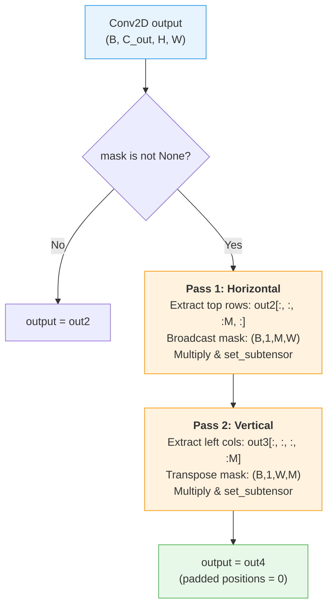

---
slug:6-2d-convolution-with-masking
blog_type:normal
---


带掩码的2D卷积是使本项目能够处理**固定大小小批次中的变长蛋白质距离矩阵**的基础操作。由于训练批次中的蛋白质具有不同的序列长度，其两两距离矩阵 (L×L) 的空间范围也有所不同。系统将较短的矩阵用零填充至统一维度，然后在每次卷积后使用**两轮掩码协议**来抑制在填充位置引入的噪声伪影。该机制在 `ResConv2DLayer` 中实现，并贯穿网络中的每个残差块和批归一化层。

## 填充-掩码问题

当不同大小的距离矩阵被组合成批次时，所有矩阵均采用**右下对齐**——即真实数据占据填充张量的右下子区域，而零填充填满上方的行和左侧的列。使用 `border_mode='half'`（same 填充）的标准2D卷积通过在整个张量（包括填充区域）上滑动来计算其感受野。在靠近填充边界的区域，卷积核与零填充项部分重叠，从而在**本应保持为零的位置产生非零输出**。这种渗透现象会破坏特征图并降低训练信号的质量。

掩码是一个形状为 `(batchSize, #rows_to_be_masked, nCols)` 的二进制张量，其中 `1` 表示真实数据位置，`0` 表示填充位置。值 `#rows_to_be_masked` 等于包含至少部分填充的顶部行数，由于距离矩阵是方形且右下对齐的，左侧列也适用相同的计数。

来源：[DilatedResNet4Distance.py](DilatedResNet4Distance.py#L79-L95), [ResNet4Distance.py](ResNet4Distance.py#L69-L81)

## ResConv2DLayer：架构与掩码协议

`ResConv2DLayer` 实现了带有可选扩张、激活和掩码的单次2D卷积。它存在两个变体：`ResNet4Distance.py` 中的基础版本（不支持扩张）和 `DilatedResNet4Distance.py` 中的扩展版本（支持逐层扩张）。

### 构造函数签名与张量形状

| 参数 | 类型 | 描述 |
|-----------|------|-------------|
| `rng` | numpy RNG | 用于权重初始化的随机数生成器 |
| `input` | Tensor4 | 形状 `(B, C_in, H, W)` — 批次、通道、行、列 |
| `n_in` | int | 输入特征通道数 |
| `n_out` | int | 输出特征通道数 |
| `halfWinSize` | int | 滤波器尺寸的一半；完整尺寸 = `2 * halfWinSize + 1` |
| `dilation` | int | 扩张因子（仅在 `DilatedResNet4Distance.py` 中存在） |
| `activation` | callable | 非线性激活函数（如 `T.nnet.relu`, `T.tanh`） |
| `mask` | Tensor3 | 形状 `(B, #rows_masked, W)` — 二进制掩码 |

输出形状为 `(B, C_out, H, W)` — 空间维度由 `border_mode='half'` 保持不变。

来源：[DilatedResNet4Distance.py](DilatedResNet4Distance.py#L79-L155), [ResNet4Distance.py](ResNet4Distance.py#L70-L141)

### 两轮掩码算法

掩码操作按**两个连续的轮次**执行：首先沿水平（行）方向，然后沿垂直（列）方向。这种两轮设计是必要的，因为填充区域在右下对齐矩阵的左上角形成了一个 L 形区域。



**第1轮 —— 水平方向（顶部行）：** 子张量 `out2[:, :, :mask.shape[1], :]` 选取顶部的 `M` 行（其中 `M = #rows_to_be_masked`）。掩码沿通道维度从 `(B, M, W)` 广播为 `(B, 1, M, W)`，然后与该子张量逐元素相乘。结果通过 `T.set_subtensor` 写回，将掩码为 `0` 的任何位置置零。

**第2轮 —— 垂直方向（左侧列）：** 子张量 `out3[:, :, :, :mask.shape[1]]` 选取左侧的 `M` 列。关键是，掩码通过 `mask.dimshuffle(0, 'x', 2, 1)` 进行**转置**，生成形状 `(B, 1, W, M)`，从而互换行/列角色。这确保了列方向的填充位置能被独立抑制，即使是对于已通过水平方向检查的行也同样有效。

以下代码摘录展示了核心实现：

```python
if mask is not None:
    # Pass 1: horizontal direction (top rows)
    out2_sub_horiz = out2[:, :, :mask.shape[1], :]
    mask_horiz = mask.dimshuffle(0, 'x', 1, 2)
    out3 = T.set_subtensor(out2_sub_horiz, T.mul(out2_sub_horiz, mask_horiz))

    # Pass 2: vertical direction (left columns)
    out3_sub_vertical = out3[:, :, :, :mask.shape[1]]
    mask_vertical = mask.dimshuffle(0, 'x', 2, 1)
    out4 = T.set_subtensor(out3_sub_vertical, T.mul(out3_sub_vertical, mask_vertical))

    self.output = out4
```

<CgxTip>两轮掩码是**依赖顺序的**：水平轮次先执行，其结果作为垂直轮次的输入。这意味着左上角的任何位置（行和列均为填充区域）都会被两轮**同时**掩码——首先其所在行被置零，然后其所在列被置零。这种双重应用是无害的（0 × 0 = 0），但确保了对 L 形填充区域的完全覆盖。</CgxTip>

来源：[DilatedResNet4Distance.py](DilatedResNet4Distance.py#L134-L149), [ResNet4Distance.py](ResNet4Distance.py#L121-L135)

## 掩码在网络中的传播

掩码并非应用一次后便丢弃——它**贯穿于残差网络的每一层**。这一点至关重要，因为即使对一层的输出进行了掩码处理，后续卷积仍会在填充位置再次产生噪声。因此，必须在每个卷积阶段重新应用掩码。

### 在残差块中的传播

每个残差块变体（`BottleneckBlock`, `ResBlockV1`, `ResBlockV2`, `ResBlockV22`, `ResBlockV23`, `DilatedResBlock`）都接受 `mask` 参数，并将其传递给所包含的每个 `ResConv2DLayer` 和 `BatchNormLayer`：

| 块变体 | 每块的卷积层 | 每块的 BN 层 | 掩码传递至 |
|---------------|----------------------|---------------------|----------------|
| `BottleneckBlock` | 3 (1×1 → K×K → 1×1) | 0 或 3 | 所有卷积 + BN 层 |
| `ResBlockV1` | 2 (K×K → K×K) | 0 或 2 | 所有卷积 + BN 层 |
| `ResBlockV2` / `V22` / `V23` | 2 (K×K → K×K) | 0 或 1–2 | 所有卷积 + BN 层 |
| `DilatedResBlock` | 2 (扩张 K×K → 扩张 K×K) | 0 或 1 | 所有卷积 + BN 层 |

顶层类 `DilatedResNet` 构建了这些块的堆叠，并将相同的 `mask` 对象传递给每个堆叠中的每个块：

```python
class DilatedResNet:
    def __init__(self, ..., mask=None, ...):
        startLayer = ConvLayer(rng, input=input2, n_in=n_in, n_out=n_hiddens[0],
                               halfWinSize=halfWinSize[0], dilation=dilation[0],
                               mask=mask, activation=activation)
        # ... 每个后续 ResBlock 也接收 mask=mask
```

来源：[DilatedResNet4Distance.py](DilatedResNet4Distance.py#L935-L998), [DilatedResNet4Distance.py](DilatedResNet4Distance.py#L839-L932)

### 在批归一化中的传播

`batch_norm` 函数为4D张量实现了**掩码感知归一化**。当存在掩码时，均值和方差**仅在非填充位置**上计算，防止零填充项偏倚归一化统计量：

```python
# 仅计算有效（未掩码）元素
x_num = mask.sum(dtype=theano.config.floatX) * 2 \
      + T.cast(x.shape[0] * (x.shape[2] - mask.shape[1]) * (x.shape[3] - mask.shape[1]), theano.config.floatX)
# 减去左上角重叠部分的重复计数
x_num = x_num - mask[:, :mask.shape[1], :mask.shape[1]].sum(dtype=theano.config.floatX)
```

重叠校正减去了 `mask[:, :M, :M]` 子区域中重复计算的位置——这些位置的行和列都处于掩码区域，因此在水平和垂直方向的掩码贡献中都被计算了一次。归一化后，应用**相同的两轮掩码**将归一化输出中的填充位置置零。

<CgxTip>批归一化的重叠校正 `mask[:, :mask.shape[1], :mask.shape[1]].sum()` 解释了这样一个事实：在公式 `mask.sum() * 2` 中，L 形填充区域的拐角被计算了两次。这是右下对齐约定和双轴掩码几何特性的直接推论。</CgxTip>

来源：[DilatedResNet4Distance.py](DilatedResNet4Distance.py#L158-L232), [ResNet4Distance.py](ResNet4Distance.py#L144-L218)

## Conv2D4DistMatrix：一种替代实现

第二个2D卷积类 `Conv2D4DistMatrix`（位于 `Model4DistancePrediction.py` 中）实现了相同的两轮掩码协议，但它在**多层顺序卷积**而非单层中执行。它将输入从 `(B, H, W, C)` 重塑为 `(B, C, H, W)`（NHWC → NCHW），应用一堆2D卷积，并在每一层执行相同的先水平后垂直的掩码操作：

```python
# 水平轮次
out2_sub_horiz = out2[:, :, :mask.shape[1], :]
mask_horiz = mask.dimshuffle(0, 'x', 1, 2)
out3 = T.set_subtensor(out2[:, :, :mask.shape[1], :], T.mul(out2_sub_horiz, mask_horiz))

# 垂直轮次
out3_sub_vertical = out3[:, :, :, :mask.shape[1]]
mask_vertical = mask.dimshuffle(0, 'x', 2, 1)
out4 = T.set_subtensor(out3[:, :, :, :mask.shape[1]], T.mul(out3_sub_vertical, mask_vertical))
```

当模型配置指定普通卷积堆叠而非残差架构时，将使用此类。

来源：[Model4DistancePrediction.py](Model4DistancePrediction.py#L79-L166)

## 权重初始化策略

`ResConv2DLayer` 根据激活函数选择权重初始化方式：

| 激活函数 | 初始化方法 | 公式 |
|------------|---------------|---------|
| ReLU | He 正态分布 | `N(0, √(2 / (C_in · K² + C_out)))` |
| Sigmoid | Xavier 均匀分布 × 4 | `U(−√(6/(C_in·K²+C_out)), √(6/(C_in·K²+C_out))) × 4` |
| 其他 | Xavier 均匀分布 | `U(−√(6/(C_in·K²+C_out)), √(6/(C_in·K²+C_out)))` |

其中 `K = 2 × halfWinSize + 1` 为滤波器尺寸。在所有情况下，偏置均初始化为零。

来源：[DilatedResNet4Distance.py](DilatedResNet4Distance.py#L107-L122), [ResNet4Distance.py](ResNet4Distance.py#L98-L112)

## 扩张支持

`DilatedResNet4Distance.py` 变体为 `ResConv2DLayer` 添加了 `dilation` 参数。当 `dilation > 1` 时，卷积调用将传入 `filter_dilation=(dilation, dilation)`，在不增加参数量的情况下扩大感受野。掩码协议**与扩张率无关，始终相同**——因为在使用 `border_mode='half'` 时扩张保持了空间维度，所以相同的掩码形状和两轮流程能够正确抑制填充伪影。

```python
if dilation > 1:
    conv2d_out = T.nnet.conv2d(input, W, filter_shape=W_shape,
                                border_mode='half', filter_dilation=(dilation, dilation))
else:
    conv2d_out = T.nnet.conv2d(input, W, filter_shape=W_shape, border_mode='half')
```

来源：[DilatedResNet4Distance.py](DilatedResNet4Distance.py#L125-L128)

## 对比：ResConv2DLayer vs Conv2D4DistMatrix

| 方面 | ResConv2DLayer | Conv2D4DistMatrix |
|--------|----------------|-------------------|
| 位置 | `DilatedResNet4Distance.py`, `ResNet4Distance.py` | `Model4DistancePrediction.py` |
| 范围 | 单卷积层 | 多层顺序堆叠 |
| 扩张 | 支持（仅限 Dilated 变体） | 不支持 |
| 使用上下文 | 位于 `BottleneckBlock`, `DilatedResBlock` 等内部 | 独立的特征提取器 |
| 输入约定 | NCHW `(B, C, H, W)` | NHWC `(B, H, W, C)` — 内部重塑 |
| 残差支持 | 通过 `DilatedResNet` 组合进残差块 | 无跳跃连接 |
| 掩码 | 相同的两轮协议 | 相同的两轮协议 |

来源：[DilatedResNet4Distance.py](DilatedResNet4Distance.py#L79-L155), [Model4DistancePrediction.py](Model4DistancePrediction.py#L79-L166)

## 架构意义

两轮掩码协议使得变长蛋白质距离预测在**标准批次训练中变得可行**。若没有它，每次卷积都会在网络中传播并放大来自填充区域的噪声，形成一种随深度加深而恶化的结构化数据破坏。通过在每次卷积和批归一化后持续将填充位置重新置零，掩码确保了：(1) 梯度流仅限于有效位置；(2) 批归一化统计量仅反映真实数据；(3) 最终输出特征图在所有填充位置具有干净的零值，使得在有效位置上的损失计算变得简单直接。

这种设计模式——后置掩码而非掩码卷积——是在 Theano 计算图模型中的务实之选，因为 `T.set_subtensor` 操作可以简洁组合并编译为高效的 GPU 核函数。掩码对象一旦构建，便成为一个静态符号变量，通过引用传递整个网络，不会在每层产生额外的内存分配。

要了解掩码卷积输出如何馈入最终预测层的下一步内容，请参阅 [Output Heads: Classification & Regression](7-output-heads-classification-and-regression)。要了解编排这些掩码卷积的更广泛网络拓扑，请参阅 [Dilated ResNet Design](5-dilated-resnet-design)。