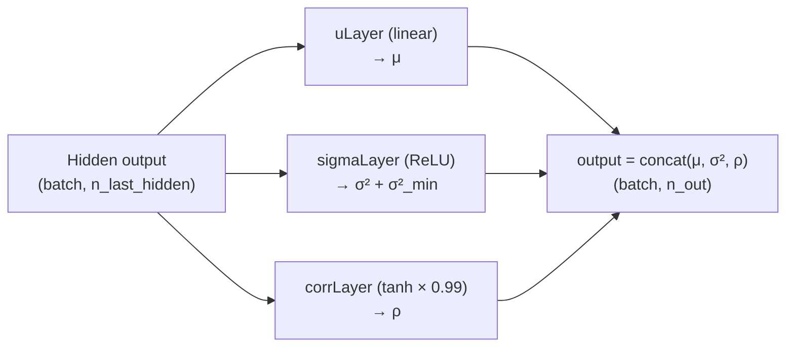

---
slug:7-output-heads-classification-and-regression
blog_type:normal
---


模型的最终架构阶段将抽象的卷积特征转化为具体且可解释的预测。在 Dilated ResNet 骨干网络从成对特征图中提取出空间模式之后，**输出头** 在学习到的表征与目标变量之间架起了桥梁。该系统支持两种截然不同的预测范式——通过 `NN4LogReg` 实现的**离散分类** 和通过 `NN4Normal` 实现的**连续回归** ——它们根据响应类型被自动选择，并实例化为共享同一卷积骨干网络但保持独立参数的并行输出头。

## 架构位置：输出头所在之处

输出头位于计算图的末端。2D卷积骨干网络生成形状为 `(batchSize, nRows, nCols, n_out)` 的特征图，该特征图在送入每个输出头之前，会**按残基对展平** 为形状为 `(N_pairs, n_out)` 的2D矩阵。这意味着每个残基对 都通过相同的共享头网络获得独立的预测——这一设计将输出头视为均匀应用于整个距离矩阵的逐对函数。

```mermaid
flowchart TB
    subgraph Backbone["2D Conv Backbone"]
        MC["matrixConv.output<br/>(B, L, L, C)"]
    end

    subgraph Flatten["Reshape & Flatten"]
        SEL["selected = reshape to<br/>(B×L×L, C)"]
    end

    subgraph Dispatch{"Response Label Type?"}
        D["Discrete*"]
        N["Normal / LogNormal"]
    end

    subgraph Heads["Output Heads (parallel)"]
        CLR["NN4LogReg<br/>Classification Head"]
        CREG["NN4Normal<br/>Regression Head"]
    end

    subgraph Outputs["Prediction Outputs"]
        O1["y_pred (class index)<br/>p_y_given_x (prob vector)"]
        O2["μ (mean)<br/>σ² (variance)<br/>ρ (correlation)"]
    end

    MC --> SEL
    SEL --> Dispatch
    Dispatch -->|"startswith('Discrete')"| D
    Dispatch -->|"startswith('Normal')<br/>or 'LogNormal'"| N
    D --> CLR --> O1
    N --> CREG --> O2
```

调度逻辑位于 `ResNet4DistMatrix.__init__` 中，它会遍历 `modelSpecs['responses']` 中的每一个响应，并根据从响应字符串中解析出的标签类型来实例化相应的输出头。

来源: [Model4DistancePrediction.py](/Model4DistancePrediction.py#L320-L358), [config.py](/config.py#L93-L97)

## 分类头：NN4LogReg

**分类头** 实现了一个以 softmax 层结尾的多层前馈网络。当响应的标签类型以 `Discrete` 开头时（例如 `Discrete25C`、`Discrete12C`、`Discrete2C`），便会选择此输出头。其目的是将每个残基对分配到 N 个距离分箱之一，从而生成硬类预测和跨越所有分箱的完整概率分布。

### 层组合

`NN4LogReg` 堆叠了 `len(n_hiddens)` 个隐藏层，其后跟随一个终端 `LogRegLayer`。每个 `HiddenLayer` 计算 `activation(input · W + b)`，具有可配置的非线性（默认：ReLU），而最终的 `LogRegLayer` 应用 softmax 函数：

$$P(Y=k \mid x) = \frac{e^{W_k x + b_k}}{\sum_j e^{W_j x + b_j}}$$

类预测通过对概率向量取 `argmax` 获得。

| 组件 | 形状 | 激活函数 | 作用 |
|-----------|-------|------------|------|
| HiddenLayer(s) | `(batch, n_hiddens[i])` | ReLU (可配置) | 非线性特征转换 |
| LogRegLayer | `(batch, n_out)` | Softmax | 类别上的概率分布 |

默认的隐藏层配置由 `modelSpecs['logreg_hiddens']` 指定，在默认模型规格中被设置为 `[80]`——即包含80个单元的单个隐藏层。此共享的 `n_hiddens` 配置适用于分类头和回归头**两者**。

来源: [NN4LogReg.py](/NN4LogReg.py#L115-L168), [config.py](/config.py#L219)

### 损失函数：负对数似然

分类头通过在预测分布下最小化真实类别的**负对数似然 (NLL)** 来训练：

```python
# Simplified: -mean( log( p_y_given_x[true_class] ) )
return -T.mean(T.log(self.p_y_given_x)[T.arange(y.shape[0]), y])
```

当提供样本权重时（由 `modelSpecs['UseSampleWeight'] = True` 启用），损失将变为**加权 NLL**，其会增加长程接触和近距离分箱的权重，反映出它们更大的生物学重要性。`errors()` 方法返回0-1误分类率，同样支持权重感知。

来源: [NN4LogReg.py](/NN4LogReg.py#L86-L111), [NN4LogReg.py](/NN4LogReg.py#L170-L196)

### 距离分箱系统

离散头的输出类数量 (`n_out`) 由 `config.responseProbDims[labelType]` 决定，后者从响应字符串的分箱后缀中推导得出。该项目支持丰富的分箱方案分类体系：

| 标签类型 | 分箱数 | 范围 (Å) | 用途示例 |
|------------|------|-----------|-------------|
| `Discrete2C` | 2 | [0,8), [8,∞) | 二元接触 |
| `Discrete3C` | 3 | [0,8), [8,15), [15,∞) | 粗粒度距离 |
| `Discrete12C` | 12 | 5–15 Å, 1Å 步长 | 中等分辨率 |
| `Discrete25C` | 25 | 4.5–16 Å, ~0.5Å 步长 | 细粒度 |
| `Discrete52C` | 52 | 4.0–16.5 Å, ~0.25Å 步长 | 高分辨率 |

`CPlus` 后缀变体（例如 `25CPlus`）增加了一个额外的分箱，用于将无效距离（标记为 -1）与最大距离分箱区分开来，从而改善对缺失结构数据的处理。

来源: [config.py](/config.py#L62-L86), [config.py](/config.py#L130-L138)

## 回归头：NN4Normal

**回归头** 将连续距离值建模为正态（或对数正态）分布的样本。当标签类型以 `Normal` 或 `LogNormal` 开头时，便会选择此输出头。与输出概率向量的分类不同，此输出头输出**概率分布的参数**——均值、方差以及可选的相关性——从而能够在点预测的同时进行不确定性量化。

### 参数输出架构

`NN4Normal` 从共享的隐藏层堆栈中构建最多三个独立的输出分支，每个分支产生不同的分布参数：

| 参数 | 层 | 激活函数 | 约束 | 输出条件 |
|-----------|-------|------------|------------|-------------|
| **μ** (均值) | `uLayer` | 无 (线性) | 无约束 | 始终 (除非提供 `mymean`) |
| **σ²** (方差) | `sigmaLayer` | ReLU + 偏移 | σ² ≥ σ²_min | `n_out ≥ 2 × n_variables` |
| **ρ** (相关性) | `corrLayer` | tanh × ρ_max | \|ρ\| ≤ ρ_max | `n_out == 5` |

**方差分支** 使用带有最小偏移的 ReLU 激活（`sigma_sqr_min`，默认 0.0001）以保证正值性：`σ² = ReLU(hidden) + σ²_min`。**相关性分支** 使用由 `rho_abs_max`（默认 0.99）缩放的 tanh，将相关系数约束在 `[-0.99, 0.99]` 之间，防止当 ρ 接近 ±1 时在 NLL 计算中出现数值不稳定。



来源: [NN4Normal.py](/NN4Normal.py#L77-L186)

### 单变量与双变量模式

`NN4Normal` 支持同时建模一个或两个相关的距离变量，由 `n_variables` 控制：

**单变量模式** (`n_variables=1`)：建模单个距离值。输出维度 `n_out` 可以为 1（仅均值）或 2（均值 + 方差）。NLL 简化为：

$$\text{NLL} = \frac{1}{2}\log(2\pi) + \frac{1}{2}\log(\sigma^2) + \frac{(y - \mu)^2}{2\sigma^2}$$

**双变量模式** (`n_variables=2`)：建模一对距离（例如同一残基对的 CbCb 和 CaCa 距离）。输出维度 `n_out` 可以为 2（仅均值）、4（均值 + 方差）或 5（均值 + 方差 + 相关性）。完整的双变量 NLL 包含相关性项：

$$\text{NLL} = \frac{1}{2}\sum\log(\sigma_k^2) + \frac{1}{2}\log(2\pi) + \frac{g - 2\rho f}{2(1-\rho^2)} + \frac{1}{2}\log(1-\rho^2)$$

其中 `g = Σ(err_k² / σ_k²)` 且 `f = Π(err_k / σ_k)`。当 `useMeanOnly=True` 或缺失方差/相关性组件时，损失将退化为简单的类 MSE 形式，从而实现两阶段训练策略。

来源: [NN4Normal.py](/NN4Normal.py#L188-L237)

### 独立方差参数

一个关键的架构细节：`NN4Normal` 为方差和相关层维护了**独立的参数列表** (`params4var`)。这使得**两阶段训练** 成为可能：首先使用 `useMeanOnly=True`（实际上是 MSE 损失）优化均值参数，然后对完整的分布参数进行微调。父类 `ResNet4DistMatrix` 将这些参数收集到 `self.params4var`、`self.paramL14var` 和 `self.paramL24var` 中，用于独立的正则化和优化器配置。

来源: [NN4Normal.py](/NN4Normal.py#L140-L170), [Model4DistancePrediction.py](/Model4DistancePrediction.py#L329-L345)

## 输出头调度与多响应架构

`ResNet4DistMatrix` 类在遍历 `modelSpecs['responses']` 的循环中实例化输出头，每个响应字符串（例如 `CbCb_Discrete25C`）同时编码了原子对类型和标签类型。调度逻辑简洁但影响深远：

```python
for res in modelSpecs['responses']:
    labelType = Response2LabelType(res)    # e.g., 'Discrete25C'

    if labelType.startswith('Discrete'):
        predictor = NN4LogReg(rng=rng, input=selected, n_in=n_in4logreg,
                              n_out=config.responseProbDims[labelType],
                              n_hiddens=n_hiddens_logreg)
    elif labelType.startswith('LogNormal') or labelType.startswith('Normal'):
        predictor = NN4Normal(rng=rng, input=selected, n_in=n_in4logreg,
                              n_variables=config.responseValueDims[labelType],
                              n_out=config.responseProbDims[labelType],
                              n_hiddens=n_hiddens_logreg)
```

所有输出头共享源自 2D 卷积输出的**相同展平输入** (`selected`)，但各自维护独立的参数。预测结果被重塑回 2D 矩阵形式，并沿特征轴拼接：

| 输出张量 | 形状 | 内容 |
|---------------|-------|---------|
| `self.output` | `(B, L, L, Σ valueDims)` | 点预测 (类标签或均值) |
| `self.output_prob` | `(B, L, L, Σ probDims)` | 完整分布 (概率向量或分布参数) |

来源: [Model4DistancePrediction.py](/Model4DistancePrediction.py#L333-L361)

## 跨输出头的损失聚合

`ResNet4DistMatrix.loss()` 方法独立计算每个输出头的损失，将每个响应的真实标签展平以匹配逐对格式，然后将标量损失堆叠成向量。该向量随后在训练循环中与 L1/L2 正则化结合。每个输出头自身的 `loss()` 方法会被调用，并委托给 `NLL()`——确保分类头使用交叉熵而回归头使用高斯 NLL，而无需在聚合层面进行任何特例处理。

启用样本权重后，权重同样会被展平并传入，从而允许范围感知和距离分箱感知的加权独立影响每个输出头。单个输出头的加权损失为：

```python
# Weighted NLL: sum(weight_i * nll_i) / sum(weight_i)
return T.sum(T.mul(nll, sampleWeight)) / T.sum(sampleWeight)
```

来源: [Model4DistancePrediction.py](/Model4DistancePrediction.py#L374-L404)

## 分类 vs. 回归：设计权衡

双头架构反映了距离预测中的根本权衡：

| 方面 | 分类 (`NN4LogReg`) | 回归 (`NN4Normal`) |
|--------|------------------------------|--------------------------|
| **输出** | 每个分箱的概率 | 分布参数 (μ, σ², ρ) |
| **分辨率** | 受限于分箱粒度 | 理论上无限 |
| **不确定性** | 隐式 (softmax 的熵) | 显式 (σ² 和 ρ) |
| **损失** | 交叉熵 | 高斯 NLL |
| **训练** | 单阶段 | 两阶段 (均值 → 完整分布) |
| **最适用于** | 粗粒度预测，接触图 | 细粒度实值距离 |
| **默认配置** | `CbCb_Discrete25C` (25 个分箱) | 非默认，按需启用 |

<CgxTip>配置响应时，字符串格式为 `AtomPair_LabelType`（例如 `CbCb_Discrete25C`）。标签类型决定了实例化哪种输出头——没有显式的输出头选择参数。从分类切换到回归仅需更改 `modelSpecs['responseStr']` 中的标签类型后缀即可。</CgxTip>

<CgxTip>回归头的两阶段训练能力（先仅均值，后完整分布）由传递给 `NN4Normal.loss()` 的 `useMeanOnly` 标志控制。该过程由训练循环使用独立的优化器和轮次配置（`modelSpecs['algorithm4var']`、`modelSpecs['numEpochs4var']`、`modelSpecs['lrs4var']`）在外部协调，从而允许方差参数使用不同的学习率和调度。</CgxTip>

来源: [Model4DistancePrediction.py](/Model4DistancePrediction.py#L333-L348), [config.py](/config.py#L19-L20), [config.py](/config.py#L105-L138), [NN4LogReg.py](/NN4LogReg.py#L115-L168), [NN4Normal.py](/NN4Normal.py#L77-L186)

## 后续步骤

输出头生成的预测张量将流入推理管线。若要了解这些预测在预测阶段是如何被使用的，请参阅 [模型加载与集成平均](8-model-loading-and-ensemble-averaging) 了解检查点反序列化，以及 [距离到接触的转换](9-distance-to-contact-conversion) 了解回归输出如何映射回二元接触预测。至于馈送这些输出头的卷积特征，可以回顾 [Dilated ResNet 设计](5-dilated-resnet-design) 和 [带掩码的2D卷积](6-2d-convolution-with-masking)。